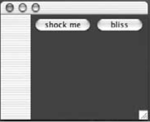

### 1 Swing components
***Component*** is the more correct term for what we've been calling a *widiget*. Text fields, buttons, scrollable lists, etc. are all components. They all extend <C>javax.swing.JComponent</C>.

### 2 Layout Managers

A layout manager is a Java object associated with a particular component, almost always a *background* component. Different layout managers have different policies for arranging components.

The Big Three layout managers: **border**, **flow**, and **box**.

#### Border layout

A BorderLayout manager divides a background component into five regions. You can add only one component per region to a background controlled by a BorderLayout manager. Components laid out by this manager usually don’t get to have their preferred size. BorderLayout is the default layout manager for a frame!

BorderLayout cares about five regions: east, west, north, south, and center

```Java
frame.getContentPane().add(BorderLayout.EAST, button);
```

#### Flow layout

A FlowLayout manager acts kind of like a word processor, except with components instead of words. Each component is the size it wants to be, and they’re laid out left to right in the order that they’re added, with “word-wrap” turned on. So when a component won’t fit horizontally, it drops to the next “line” in the layout. FlowLayout is the default layout manager for a panel!

FlowLayout cares about the flow of the components: left to right, top to bottom, in the order they were added.


A <C>JPanel</C>’s layout manager is FlowLayout, by default. Anything inside the panel (in other words, components added to the panel by calling <C>panel.add(aComponent)</C>) are under the panel’s FlowLayout manager’s control.

```Java
public void go() {
    JFrame frame = new JFrame(); 
    JPanel panel = new JPanel(); 
    panel.setBackground(Color.darkGray);
    
    JButton button = new JButton(“shock me”); 
    JButton buttonTwo = new JButton(“bliss”);
    
    panel.add(button); panel.add(buttonTwo);
    
    frame.getContentPane().add(BorderLayout.EAST, panel);   
    frame.setSize(250,200); frame.setVisible(true);
}
```




#### Box layout

Unlike <C>FlowLayout</C>, <C>BoxLayout</C> can force a ‘new line’ to make the components wrap to the next line(<C>BoxLayout.Y_AXIS</C>), even if there’s room for them to fit horizontally.

```Java
public void go() {
    JFrame frame = new JFrame(); 
    JPanel panel = new JPanel();
    panel.setBackground(Color.darkGray);
    //Change the layout manager to be a new instance of BoxLayout
    panel.setLayout(new BoxLayout(panel, BoxLayout.Y_AXIS));

    JButton button = new JButton(“shock me”); 
    JButton buttonTwo = new JButton(“bliss”); 
    panel.add(button);
    panel.add(buttonTwo); 
    frame.getContentPane().add(BorderLayout.EAST, panel);   
    frame.setSize(250,200); 
    frame.setVisible(true);
}
```


### 3 Playing with Swing Components

The Java Tutorials by Oracle, describes every Swing component with excellent demos, see [here](https://docs.oracle.com/javase/tutorial/uiswing/components/index.html).

#### JTextField


Constructors

* `:::Java JTextField field = new JTextField(20);`
* `:::Java JTextField field = new JTextField(“Your name”);`

How to use it?

* Get text out of it
    * `:::Java System.out.println(field.getText());`
* Put text in it
    * `:::Java field.setText("whatever");`
    * `:::Java :::Java field.setText("");`
* Get an ActionEvent when the user presses return or enter
    * `field.addActionListener(myActionListener);`
* Select/Highlight the text in the field
    * `:::Java field.selectAll();`
* Put the cursor back in the field (so the user can just start typing)
    * `:::Java field.requestFocus();`

#### JTextArea


Unlike <C>JTextField</C>, <C>JTextArea</C> can have more than one line of text. To make a <C>JTextArea</C> scroll, you have to stick it in a <C>ScrollPane</C>.


* Constructor
    * `:::Java JTextArea textArea = new JTextArea(10,20);`
* Make it have a vertical scrollbar only

```Java
JScrollPane scroller = new JScrollPane();
scroll.add(text) 
textArea.setColumns(20);
textArea.setLineWrap(true);
textArea.setRows(5);
textArea.setWrapStyleWord(true);
textArea.setEditable(false);panel.add(scroller);
```

* Replace the text that’s in it
    * `text.setText(“Not all who are lost are wandering”);`
* Append to the text that’s in it
    * `text.append(“button clicked”);`
* Select/Highlight the text in the field
    * `text.selectAll();`
* Put the cursor back in the field (so the user can just start typing)
    * `text.requestFocus();`