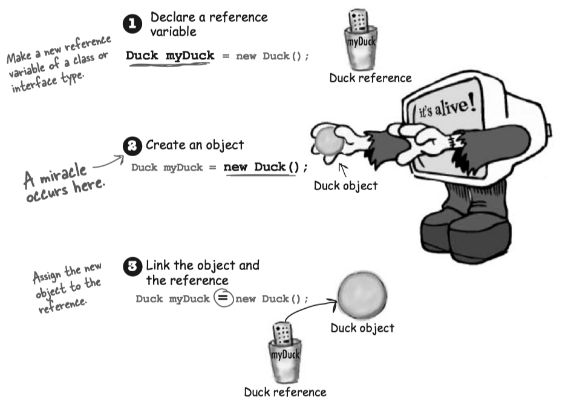
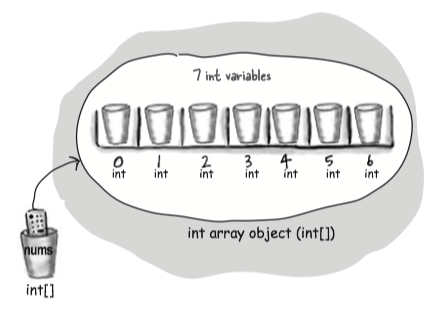

Variables must always be declared with a *name* and a *type*. Variables come in two flavors: **primitive** and **reference**.

Variables can be used in many places:

* as object state: **instance variables**
* variables declared within a method: **local variables**
* values sent to a method by the calling code: **arguments**
* values sent back to the caller of the method: **return types**

#### Naming

You can name a class, method, or variable according the following rules (the real rules are sightly more flexible, but these will keep you safe:

*  It must start with a letter, underscore (_), or dollar sign ($). You can’t start a name with a number.
* After the first character, you can use numbers as well. Just don’t start it with a number.
* It can be anything you like, subject to those two rules, just so long as it isn’t one of Java’s reserved words.

#### Primitive Variable

A ***primitive variable*** value is the bits representing the value.

* Primitives hold fundamental values.
* Each primitive variable has a **fixed** number of bits.


#### Reference variable

* A ***reference variable*** value is the bits representing a way to **access** an object on the heap.
* The only way you can access an object is through a reference variable.
* It doesn’t hold the object itself, but it holds something like a pointer. Or an address.
* A reference variable is like a remote control. Using the dot operator(`.`) on a reference variable is like pressing a button on the remote control to access a method or instance variables.
* A reference variable has a value of `null` when it is not referencing any object.

_The three steps of **object declaration, creation and assignment**._

(e.g. `Dog myDog = new Dog()`);

* **declare** a reference variable: tell the JVM to allocate space for a reference variable, and names that variable myDog
* **create** an object: tells the JCM to allocate space for a new Dog object on the heap.
* **Assigns** the object to the reference variable.




The size of reference variables: All references for a given JVM will be the same size regardless of the objects they reference, but each JVM might have a different way of representing reference, so references on one JVM may be smaller or larger than references on another JVM.

#### Array

An array is like a tray of cups:

* Declare an int array variable. An array variable is a remote control to an array object. `:::Java int[] nums;`
* Create a new int array with a length of 7, and assign it to the previously-declared int[] variable nums. `:::Java nums = new int[7];`
* Give each element in the array an int value. `:::Java nums[0] = 6;`




* An array is always an object, even if the array is declared to hold primitives. 
* Every element in an array is just a variable.


If you want to initialize an array, try using Array Initializer:


```Java
int[] data = {10,20,30,40,50,60,71,80,90,91};

// or

int[] data;
data = new int[] {10,20,30,40,50,60,71,80,90,91};
```