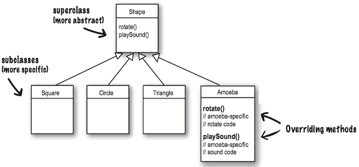
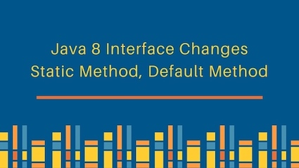

### 1 Overriding

**Overriding**(重写) means that a subclass *redefines* one of its inherited methods when it needs to change or extend the behavior of that method.

In the example as follows, the Amoeba class overrides the methods of the Shape class. Then at runtime, the JVM knows exactly which `rotate()` method to run when someone tells the Amoeba to rotate.



If you want to protect a specific method from being overridden, mark the method with the `final` modifier. 如果你想要防止特定的方法被覆盖，可以将该方法标识成final表示没有任何的方法可以被覆盖。

**Rules for overriding**:

* Arguments must be the **same**, and return types must be **compatible**. 参数必须要一样，且返回类型必须要兼容.
* The method can't be less accessible(e.g change from public to private). 不能降低方法的访问权限


### 2 Inheritance

When one class inherits from another, the subclass inherits from the superclass. In Java, we say that the ***subclass*** <b><i>{==extends==} </b></i> the ***superclass***(子类继承自父类)。

* A class that inherits from another is called a **subclass**(子类).
* A class that provides attributes and methods for inheritance by subclasses is called a **superclass**(父类). 


* The subclass inherits the instance variables and methods of the superclass.
* The subclass can add new methods and instance variables of its own, and it can override the methods it inherits from the superclass.
* Instance variables are not overridden because they don't need to be. They don't define any special behavior.

***Advantage***:

* Inheritance avoids duplicating code in subclasses.
* Inheritances lets you guarantee that all classes grouped under a certain supertype have all the methods that the supertype has. In other words, you define a ***common protocol*** for a set of classes related through inheritance.
 
 
An inheritance example:

```Java
public class Doctor {
    boolean worksAtHospital;
    void treatPatient() { // perform a checkup }
}
    
public class FamilyDoctor extends Doctor {
    boolean makesHouseCalls; 
    void giveAdvice() { // give homespun advice }
}
    
public class Surgeon extends Doctor{
    void treatPatient() { // perform surgery }
    void makeIncision() { // make incision (yikes!) }
}
```
    


#### Using IS-A

When you want to know if one thing should extend another, apply the **IS-A test**.

* **If class B extends class A, class B IS-A class A.** 


#### super

In a subclass, what if I want to use BOTH the superclass version and my overriding subclass version of a method? In other words, I don't want to completely *replace* the superclass version, I just want to add more stuff to it.

SOLUTION: In your subclass overriding method, you can call the superclass version using the keyword **super**.

```Java
// this calls the inherited version on roam(),
// then comes back to do your own subclass-specific code
public void roam(){
    super.roam();
    //my own roam stuff
}
```

[Using the super keyword to invoke a superclass's constructor](ch9/l#invoke-a-superclass-constructor)

#### Access Level

**Access levels**(访问权限) control *who sees what*, and are crucial to having well-designed, robust Java code.

There are four access levels, moving from most restrictive to least, the four access levels are: 

**prive, default, protected, public**:

* public members *_are_* inherited. 
* private members *_are_* not inherited.


#### Java 8 Interface Change




Java 8 interface changes include static methods and default methods in interfaces. Prior to Java 8, we could have only method declarations in the interfaces. **But from Java 8, we can have default methods and static methods in the interfaces**.


### 3 Polymorphism

**With polymorphism, the reference type can be a superclass of the actual object type**. 运用多态时，引用类型可以是实际对象类型的父类。

```Java
Animal[] animals = new Animal[3];
// You can put ANY subclass of Animal in the Animal array!
animals [0] = new Dog(); // the reference and the object are different
animals [1] = new Cat();
animals [2] = new Lion();
// You get to loop through the array and call one of the Animal-class methods, and every object does the right thing!
for (int i=0; i< animals.length; i++) {
    animals[i].eat();
    animals[i].roam();
}
```

You can have polymorphic _arguments_ and _return_ types. 参数和返回类型也可以多态。

```Java
class Vet {
    // The Animal parameter can take ANY Animal type as the argument.
    public void giveShot(Animal a) { 
        a.makeNoise(); 
    }
}

class PetOwner {
    public void start() { 
        Vet v = new Vet(); 
        Dog d = new Dog(); 
        Hippo h = new Hippo(); 
        // The vet's giveShot() method can take any Animal you give it.
        // As long as the object you pass in as the argument is a subclass of Animal, 
        // it'll work.
        v.giveShot(d); 
        v.giveShot(h);
}
```

SO....

If I write my code using polymorphic arguments, where I declare the method parameter as a superclass type, I can pass in any subclass object at runtime.

With polymorphism, you can write code that doesn't have to change when you introduce new subclass types into the program. 通过多态，你就可以编写出引进新型子类时也不必修改的程序。 

#### CAN'T INHERIT

There are three things that can prevent a class from being subclassed.

* A non-public class can be subclassed only by classes in the same package as the class.
* Using keyword modifier `final` to stop a class from being subclassed. 使用`final`修饰符阻止类被继承。
* If a class has only `private` constructors, it can't be subclassed. 如果类只拥有`private`的构造程序，它不能被继承。


### 4 Overloading

**Method overloading**(方法重载) is nothing more than having two methods with the _same name_ but _different argument lists_ . 方法重载就是方法名称相同，但参数列表不同。
 
* Purpose: overloading lets you make multiple versions of a method, with different argument lists, for convenience to the callers. 
* The return types can be different.
* You can't change only the return type.
* You can vary the access levels in any direction.
