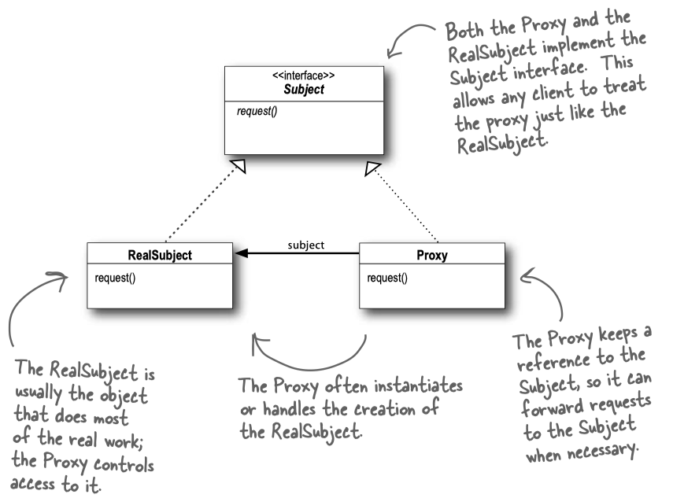
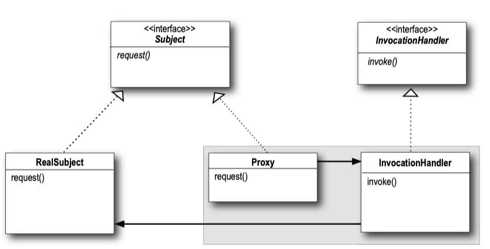

> 代理模式(Proxy Pattern)为对象提供了替身以控制对这个对象的访问。


使用代理模式创建代理对象，让代理对象控制原对象的访问。被代理的对象可以是

* 远程的对象：远程代理，例如[RMI](../Head First Java/18 Remote deploy with RMI.md)：远程代理作为另一个JVM上对象的本地代表，调用代理的方法会被代理利用网络转发到远程执行，并且结果会通过网络返回给代理，再由代理将结果转给客户；
* 创建开销大的对象：虚拟代理，直到真正需要对象的时候才创建它，当对象在创建前和创建中时，由虚拟对象来扮演对象的替身，对象创建后，代理就会将请求直接委托给对象；
* 需要安全控制的对象：保护代理




### 动态代理


**动态代理**（dynamic proxy)之所以被称为动态，是因为运行时才将它的类创建出来。代码开始执行时，还没有代理类，它是根据需要从传入的接口集创建的。


#### Java动态代理

Java在`java.lang.reflect`包中实现了动态代理。代理类`Proxy`是由Java产生的，而且实现了Subject接口。而你需要提供类`InvocationHandler`，Proxy上的任何方法调用都会被传入此类。可以把`InvocationHandler`想成是代理收到方法调用后，请求做实际工作的对象。



`InvocationHandler`的接口中，只有一个`invoke()`方法。当代理`Proxy`被调用时，代理会接着调用`InvocationHandler`的`invoke()`方法，而`invoke()`方法则会视情况调用原对象`RealSubject`。


!!! example "保护代理：对象村的配对"
    
    这个例子讲实现对象村的约会服务系统，约会后可以给对象评分：Hot表示喜欢，Not表示不喜欢。同时每个人可以设置自己的兴趣。很显然，自己不能给自己评分，而且别人不能给自己设置兴趣。也就是说，对象需要安全控制，使用保护代理。
    
    可以创建两个代理：当自己看自己的资料时，可以使用`OwnerInvocationHandler`，当别人看自己的资料时，可与你使用`NonOwnerInvocationHandler`。
    
    
    ```java tab="Person"
    public interface PersonBean {
        	String getName();
        	String getGender();
        	String getInterests();
        	int getHotOrNotRating();
         
        void setName(String name);
        void setGender(String gender);
        void setInterests(String interests);
        void setHotOrNotRating(int rating); 
    }
    
    public class PersonBeanImpl implements PersonBean {
    	String name;
    	String gender;
    	String interests;
    	int rating;
    	int ratingCount = 0;
      
    	public String getName() {
    		return name;	
    	} 
      
    	public String getGender() {
    		return gender;
    	}
      
    	public String getInterests() {
    		return interests;
    	}
       
    	public int getHotOrNotRating() {
    		if (ratingCount == 0) return 0;
    		return (rating/ratingCount);
    	}
      
     
    	public void setName(String name) {
    		this.name = name;
    	}
     
    	public void setGender(String gender) {
    		this.gender = gender;
    	} 
      
    	public void setInterests(String interests) {
    		this.interests = interests;
    	} 
      
    	public void setHotOrNotRating(int rating) {
    		this.rating += rating;	
    		ratingCount++;
    	}
    }
    ```


    ```java tab="Invocationhandler"
    public class OwnerInvocationHandler implements InvocationHandler { 
        	PersonBean person;
         
        	public OwnerInvocationHandler(PersonBean person) {
        		this.person = person;
        	}
         
        	public Object invoke(Object proxy, Method method, Object[] args) 
        			throws IllegalAccessException {
          
        		try {
        			if (method.getName().startsWith("get")) {
        				return method.invoke(person, args);
           			} else if (method.getName().equals("setHotOrNotRating")) {
        				throw new IllegalAccessException();
        			} else if (method.getName().startsWith("set")) {
        				return method.invoke(person, args);
        			} 
                } catch (InvocationTargetException e) {
                    e.printStackTrace();
                } 
        		return null;
        	}
      }
      
      public class NonOwnerInvocationHandler implements InvocationHandler { 
        	PersonBean person;
         
        	public NonOwnerInvocationHandler(PersonBean person) {
        		this.person = person;
        	}
         
        	public Object invoke(Object proxy, Method method, Object[] args) 
        			throws IllegalAccessException {
          
        		try {
        			if (method.getName().startsWith("get")) {
        				return method.invoke(person, args);
           			} else if (method.getName().equals("setHotOrNotRating")) {
        				return method.invoke(person, args);
        			} else if (method.getName().startsWith("set")) {
        				throw new IllegalAccessException();
        			} 
                } catch (InvocationTargetException e) {
                    e.printStackTrace();
                } 
        		return null;
        	}
     }
    ```
    
    ```java tab="Test"
    public class MatchMakingTestDrive {
    	Hashtable datingDB = new Hashtable();
     	
    	public static void main(String[] args) {
    		MatchMakingTestDrive test = new MatchMakingTestDrive();
    		test.drive();
    	}
     
    	public MatchMakingTestDrive() {
    		initializeDatabase();
    	}
    
    	public void drive() {
    		PersonBean joe = getPersonFromDatabase("Joe Javabean"); 
    		PersonBean ownerProxy = getOwnerProxy(joe);
    		System.out.println("Name is " + ownerProxy.getName());
    		ownerProxy.setInterests("bowling, Go");
    		System.out.println("Interests set from owner proxy");
    		try {
    			ownerProxy.setHotOrNotRating(10);
    		} catch (Exception e) {
    			System.out.println("Can't set rating from owner proxy");
    		}
    		System.out.println("Rating is " + ownerProxy.getHotOrNotRating());
    
    		PersonBean nonOwnerProxy = getNonOwnerProxy(joe);
    		System.out.println("Name is " + nonOwnerProxy.getName());
    		try {
    			nonOwnerProxy.setInterests("bowling, Go");
    		} catch (Exception e) {
    			System.out.println("Can't set interests from non owner proxy");
    		}
    		nonOwnerProxy.setHotOrNotRating(3);
    		System.out.println("Rating set from non owner proxy");
    		System.out.println("Rating is " + nonOwnerProxy.getHotOrNotRating());
    	}
    
    	PersonBean getOwnerProxy(PersonBean person) {
     		
            return (PersonBean) Proxy.newProxyInstance( 
                	person.getClass().getClassLoader(), // 1. 类加载器
                	person.getClass().getInterfaces(),  // 2. 代理需要实现的接口，可以有多个
                    new OwnerInvocationHandler(person)); //3. 方法调用的实际处理者
    	}
    
    	PersonBean getNonOwnerProxy(PersonBean person) {
    		
            return (PersonBean) Proxy.newProxyInstance(
                	person.getClass().getClassLoader(),
                	person.getClass().getInterfaces(),
                    new NonOwnerInvocationHandler(person));
    	}
    
    	PersonBean getPersonFromDatabase(String name) {
    		return (PersonBean)datingDB.get(name);
    	}
    }
    ```
    
利用`Proxy.newProxyinstance()`来创建代理对象：

```java
public static Object newProxyInstance(ClassLoader loader, 
        Class<?>[] interfaces, InvocationHandler h) {...}
        
    //节选自JDK8，部分删减
    // 得到接口
    final Class<?>[] intfs = interfaces.clone();
    // 获取代理类
    Class<?> cl = getProxyClass0(loader, intfs);
    // 获取代理的构造器
    final Constructor<?> cons = cl.getConstructor(constructorParams);
    final InvocationHandler ih = h;
    // 获取代理
    return cons.newInstance(new Object[]{h});
}
```

`newProxyInstance()`会返回一个实现了指定接口的代理对象，对该对象的所有方法调用都会转发给`InvocationHandler.invoke()`方法。在`invoke()`方法里我们可以加入任何逻辑，比如修改方法参数，加入日志功能、安全检查功能等。


为了进一步了解JDK的动态代理机制，将生成的代理类保存下来。

!!! example "获取代理类"

    ```java tab="产生代理类"
	public void generateProxyFiles() throws  Exception {
		PersonBean joe = getPersonFromDatabase("Joe Javabean");
		PersonBean ownerProxy = getOwnerProxy(joe);
		byte[] bts = ProxyGenerator.generateProxyClass("$PersonBean", joe.getClass().getInterfaces());
		FileOutputStream fos = new FileOutputStream(new File("$PersonBean.class"));
		fos.write(bts);
		fos.flush();
		fos.close();
	}
    ```
    	
    ```java tab="代理类"
    //
    // Source code recreated from a .class file by IntelliJ IDEA
    // (powered by Fernflower decompiler)
    //
    
    import headfirst.proxy.javaproxy.PersonBean;
    import java.lang.reflect.InvocationHandler;
    import java.lang.reflect.Method;
    import java.lang.reflect.Proxy;
    import java.lang.reflect.UndeclaredThrowableException;
    
    public final class $PersonBean extends Proxy implements PersonBean {
        private static Method m1;
        private static Method m4;
        private static Method m6;
        private static Method m3;
        private static Method m2;
        private static Method m5;
        private static Method m9;
        private static Method m7;
        private static Method m8;
        private static Method m10;
        private static Method m0;
    
        public $PersonBean(InvocationHandler var1) throws  {
            super(var1);
        }
    
        public final boolean equals(Object var1) throws  {
            try {
                return (Boolean)super.h.invoke(this, m1, new Object[]{var1});
            } catch (RuntimeException | Error var3) {
                throw var3;
            } catch (Throwable var4) {
                throw new UndeclaredThrowableException(var4);
            }
        }
    
        public final void setName(String var1) throws  {
            try {
                super.h.invoke(this, m4, new Object[]{var1});
            } catch (RuntimeException | Error var3) {
                throw var3;
            } catch (Throwable var4) {
                throw new UndeclaredThrowableException(var4);
            }
        }
    
        public final String getInterests() throws  {
            try {
                return (String)super.h.invoke(this, m6, (Object[])null);
            } catch (RuntimeException | Error var2) {
                throw var2;
            } catch (Throwable var3) {
                throw new UndeclaredThrowableException(var3);
            }
        }
    
        public final String getName() throws  {
            try {
                return (String)super.h.invoke(this, m3, (Object[])null);
            } catch (RuntimeException | Error var2) {
                throw var2;
            } catch (Throwable var3) {
                throw new UndeclaredThrowableException(var3);
            }
        }
    
        public final String toString() throws  {
            try {
                return (String)super.h.invoke(this, m2, (Object[])null);
            } catch (RuntimeException | Error var2) {
                throw var2;
            } catch (Throwable var3) {
                throw new UndeclaredThrowableException(var3);
            }
        }
    
        public final String getGender() throws  {
            try {
                return (String)super.h.invoke(this, m5, (Object[])null);
            } catch (RuntimeException | Error var2) {
                throw var2;
            } catch (Throwable var3) {
                throw new UndeclaredThrowableException(var3);
            }
        }
    
        public final void setHotOrNotRating(int var1) throws  {
            try {
                super.h.invoke(this, m9, new Object[]{var1});
            } catch (RuntimeException | Error var3) {
                throw var3;
            } catch (Throwable var4) {
                throw new UndeclaredThrowableException(var4);
            }
        }
    
        public final void setGender(String var1) throws  {
            try {
                super.h.invoke(this, m7, new Object[]{var1});
            } catch (RuntimeException | Error var3) {
                throw var3;
            } catch (Throwable var4) {
                throw new UndeclaredThrowableException(var4);
            }
        }
    
        public final void setInterests(String var1) throws  {
            try {
                super.h.invoke(this, m8, new Object[]{var1});
            } catch (RuntimeException | Error var3) {
                throw var3;
            } catch (Throwable var4) {
                throw new UndeclaredThrowableException(var4);
            }
        }
    
        public final int getHotOrNotRating() throws  {
            try {
                return (Integer)super.h.invoke(this, m10, (Object[])null);
            } catch (RuntimeException | Error var2) {
                throw var2;
            } catch (Throwable var3) {
                throw new UndeclaredThrowableException(var3);
            }
        }
    
        public final int hashCode() throws  {
            try {
                return (Integer)super.h.invoke(this, m0, (Object[])null);
            } catch (RuntimeException | Error var2) {
                throw var2;
            } catch (Throwable var3) {
                throw new UndeclaredThrowableException(var3);
            }
        }
    
        static {
            try {
                m1 = Class.forName("java.lang.Object").getMethod("equals", Class.forName("java.lang.Object"));
                m4 = Class.forName("headfirst.proxy.javaproxy.PersonBean").getMethod("setName", Class.forName("java.lang.String"));
                m6 = Class.forName("headfirst.proxy.javaproxy.PersonBean").getMethod("getInterests");
                m3 = Class.forName("headfirst.proxy.javaproxy.PersonBean").getMethod("getName");
                m2 = Class.forName("java.lang.Object").getMethod("toString");
                m5 = Class.forName("headfirst.proxy.javaproxy.PersonBean").getMethod("getGender");
                m9 = Class.forName("headfirst.proxy.javaproxy.PersonBean").getMethod("setHotOrNotRating", Integer.TYPE);
                m7 = Class.forName("headfirst.proxy.javaproxy.PersonBean").getMethod("setGender", Class.forName("java.lang.String"));
                m8 = Class.forName("headfirst.proxy.javaproxy.PersonBean").getMethod("setInterests", Class.forName("java.lang.String"));
                m10 = Class.forName("headfirst.proxy.javaproxy.PersonBean").getMethod("getHotOrNotRating");
                m0 = Class.forName("java.lang.Object").getMethod("hashCode");
            } catch (NoSuchMethodException var2) {
                throw new NoSuchMethodError(var2.getMessage());
            } catch (ClassNotFoundException var3) {
                throw new NoClassDefFoundError(var3.getMessage());
            }
        }
    }
    ```

    可以看到代理类是`Proxy`的子类，实现了`PersonBean`接口，它的构造器中传入了`InvocationHandler`并保存为实例变量`h`，`h`定义在父类中。在实际的函数调用中，利用`InvocationHandler.invoke()`(即`super.h.invoke()`)方法调用`PersonBeanImpl`中对应的方法。


#### CGLIB动态代理

Java动态代理的局限在于，它只能为接口创建代理。如果一个类没有接口，或者希望代理非接口中定义的方法，那就素手无策了。使用[CGLIB](https://github.com/cglib/cglib)可以实现，通过继承被代理的类，代理类重写了父类的所有public非findal方法(继承不能对final修饰的类进行重写)，改为调用Callback中的相关方法。

!!! example ""
    ```java tab="Test"
    public class MatchMakingTestDrive {
    
        Hashtable datingDB = new Hashtable();
    
        @Test
        public void testCGLib() {
            PersonBean joe = getPersonFromDatabase("Joe Javabean");
            PersonBean ownerProxy = getOwnerProxy();
            //System.out.println("Name is " + ownerProxy.getName());
            ownerProxy.setInterests("bowling, Go");
            System.out.println("Interests set from owner proxy");
    
            try {
                ownerProxy.setHotOrNotRating(10);
            } catch (Exception var6) {
                System.out.println("Can't set rating from owner proxy");
            }
    
        }
    
    
        public PersonBean getOwnerProxy() {
            Enhancer enhancer = new Enhancer();
            enhancer.setSuperclass(PersonBean.class);
            enhancer.setCallback(new OwnerMethodInterceptor());
            return (PersonBean) enhancer.create();
        }
    }
    ```
        
    ```java tab="Interceptor"
    public class OwnerMethodInterceptor implements MethodInterceptor {
        public Object intercept(Object object, Method method, Object[] args, MethodProxy methodProxy) throws Throwable {
            String methodName = method.getName();
            if (methodName.equals("setHotOrNot"))
                throw new IllegalAccessException();
            else if (methodName.startsWith("set"))
                methodProxy.invokeSuper(object, args);
            else if (methodName.startsWith("get"))
                methodProxy.invokeSuper(object, args);
            return methodProxy;
        }
    }
    ```


