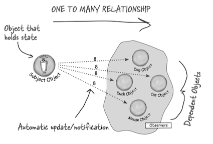
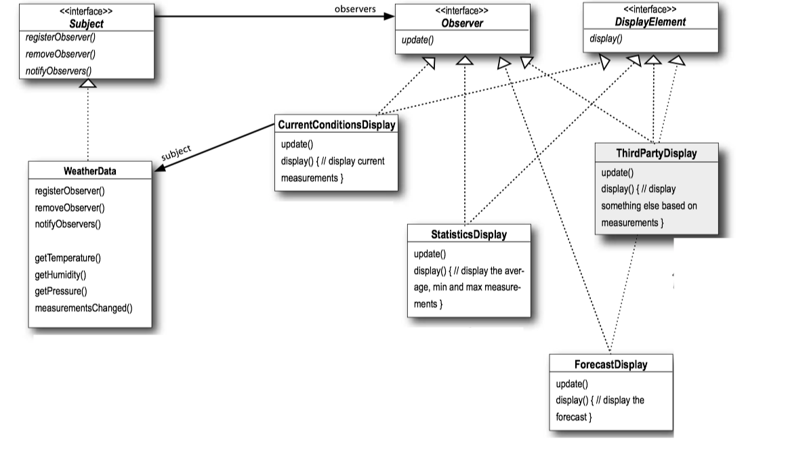

### 1 Problem Statement

The task is to build an Internet-based weather monitoring station. The weather station will be based on <C>WeatherData</C> object, which tracks current weather conditions.


### 2 Observer PTTERN

#### Meet the Observer Pattern

You know how newspaper or magazine subscriptions work:

* A newspaper publisher goes into business and begins publishing newspapers.
* You subscribe to a particular publisher, and every time there’s a new edition it gets delivered to you. As long as you remain a subscriber, you get new newspapers.
* You unsubscribe when you don’t want papers anymore, and they stop being delivered.
* While the publisher remains in business, people, hotels, airlines and other businesses constantly subscribe and unsubscribe to the newspaper.

Publishers + Subscribers = Observer Pattern

#### The Observer Pattern defined

> The Observer Pattern defines a one-to-many dependency between objects so that when one object changes state, all of its dependents are notified and updated automatically.

> 观察者模式定义了对象之间的一对多依赖，这样一来，当一个对象改变状态时，它的所有依赖者都会收到通知并自动更新。




#### Class Diagram


* Objects use <C>Subject</C> interface to register as observers and also to remove themselves from being observers.
* A concrete <C>Subject</C> always implements the <C>Subject</C> interface. In addition to the register and remove methods, the concrete <C>Subject</C> implements a <C>notifyObserver</C> method that is used to update all the current observers whenever state changes. The concrete <C>Subject</C> may also have methods for setting and getting its state.
* All potential observers need to implement the <C>Observer</C> interface. This interface just has one method, <C>update()</C>, that gets called when the <C>Subject</C>'s state changes.

#### Loose Coupling

**When two objects are loosely coupled, they can interact, but have very little knowledge of each other.**

Loosely coupled designs allow us to build flexible OO systems that can handle change because they minimize the interdependency between objects.

The Observer Pattern provides an object design where subjects and observers are loosely coupled.

* The only thing the <C>Subject</C> knows about an <C>Observer</C> is that it implements a certain interface (the <C>Observer</C> interface).
* We can add new observers at any time.
* We never need to modify the <C>Subject</C> to add new types of observers.
* We can reuse subjects or observers independently of each other.
* Changes to either the <C>Subject</C> or an <C>Observer</C> will not affect the other.

> **Design Principle**: Strive for loosely coupled designs between objects that interact.

#### An Example: A Weather Station





```Java tab="Subject"
public interface Subject {
	public void registerObserver(Observer o);
	public void removeObserver(Observer o);
	public void notifyObservers();
}


public class WeatherData implements Subject {
	private ArrayList<Observer> observers;
	private float temperature;
	private float humidity;
	private float pressure;
	
	public WeatherData() {
		observers = new ArrayList<Observer>();
	}
	
	public void registerObserver(Observer o) {
		observers.add(o);
	}
	
	public void removeObserver(Observer o) {
		int i = observers.indexOf(o);
		if (i >= 0) {
			observers.remove(i);
		}
	}
	
	public void notifyObservers() {
		for (Observer observer : observers) {
			observer.update(temperature, humidity, pressure);
		}
	}
	
	public void measurementsChanged() {
		notifyObservers();
	}
	
	public void setMeasurements(float temperature, 
	               float humidity, float pressure) {
		this.temperature = temperature;
		this.humidity = humidity;
		this.pressure = pressure;
		measurementsChanged();
	}

	public float getTemperature() {
		return temperature;
	}
	
	public float getHumidity() {
		return humidity;
	}
	
	public float getPressure() {
		return pressure;
	}

}
```


```Java tab="Observer"
public interface Observer {
	public void update(float temp, float humidity, float pressure);
}

public interface DisplayElement {
	public void display();
}

public class StatisticsDisplay implements Observer, DisplayElement {
	private float maxTemp = 0.0f;
	private float minTemp = 200;
	private float tempSum= 0.0f;
	private int numReadings;
	private WeatherData weatherData;

	public StatisticsDisplay(WeatherData weatherData) {
		this.weatherData = weatherData;
		weatherData.registerObserver(this);
	}

	public void update(float temp, float humidity, float pressure) {
		tempSum += temp;
		numReadings++;

		if (temp > maxTemp) {
			maxTemp = temp;
		}
 
		if (temp < minTemp) {
			minTemp = temp;
		}

		display();
	}

	public void display() {
		System.out.println("Avg/Max/Min temperature = " + (tempSum / numReadings)
			+ "/" + maxTemp + "/" + minTemp);
	}
}
```


```Java tab="WeatherStation"
public class WeatherStation {

	public static void main(String[] args) {
		WeatherData weatherData = new WeatherData();
	
		CurrentConditionsDisplay currentDisplay = 
			new CurrentConditionsDisplay(weatherData);
		StatisticsDisplay statisticsDisplay = new StatisticsDisplay(weatherData);
		ForecastDisplay forecastDisplay = new ForecastDisplay(weatherData);

		weatherData.setMeasurements(80, 65, 30.4f);
		weatherData.setMeasurements(82, 70, 29.2f);
		weatherData.setMeasurements(78, 90, 29.2f);
	}
}
```

#### Java's Buit-in Observer Pattern

With Java's built-in support, all you have to do is extend <C>Observable</C> and tell it when to notify the Observers. The API does the rest for you.

HOWEVER, it is limited, and DEPRECATED!
