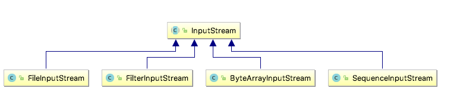

### 1 Template Method Pattern
#### Template Method Pattern defined

> The Template Method Pattern(模版方法模式) *defines the skeleton* of an algorithm in a method, deferring some steps to subclasses. Template Method lets subclasses *redefine certain steps* of an algorithm without changing the algorithm’s structure.

This pattern is all about creating a template for an algorithm. A template is  a method that defines an algorithm as a set of steps. One or more of these steps is defined to be abstract and implemented by a subclass. This ensures the algorithm’s structure stays unchanged, while subclasses provide some part of the implementation.

#### Template Method Pattern Class Diagram


* The <C>AbstractClass</C> contains the template method.
* The template method makes use of the <C>primitiveOperation</C>s to implement an algorithm. It is decoupled from the actual implementation of these operations.
* There may be many <C>ConcreteClasses</C>, each implementing the full set of operations required by the template method. 

```Java
abstract class AbstractClass {
    // Here's the template method
    // It's declared final to prevent subclasses 
    // from reworking the sequence of steps in the algorithm.
    final void templateMethod() { 
        // The templateMethod defines the sequence of steps,
        // each represented by a method.
        primitiveOperation1(); 
        primitiveOperation2(); 
        concreteOperation(); 
    } 
    // In this example, two of the primitive operations 
    // must be implemented by concrete subclasses.
    abstract void primitiveOperation1(); 
    abstract void primitiveOperation2(); 
    // We also have a concrete operation defined in the abstract class.
    void concreteOperation() {
        // implementation here 
    }
    // A concrete method, but it does nothing!
    // We can also have concrete method, which do nothing by default;
    // We call these "hooks". Subclasses are free to override these, 
    // but don't have to.
    void hook() {}
}
```


!!! question
    When to use abstract methods and when to use hooks?
        
    * Use abstract methods when your subclass MUST provide an implementation of the method or step in the algorithm. 
    * Use hooks when that part of the algorithm is optional. With hooks, a subclass may choose to implement that hook, but it doesn’t have to.


#### Example - CaffeineBeverage

Tea and coffee are made in very similar ways. Notice that both recipes follow the same algorithm:

* Boil some water.
* Use the hot water to extract the coffee or tea.
* Pour the resulting beverage into a cup. 
* Add the appropriate condiments to the beverage.


```Java tab="CaffeineBeverage"
public abstract class CaffeineBeverage {
	final void prepareRecipe() {
		boilWater();
		brew();
		pourInCup();
		addCondiments();
	}
 
	abstract void brew();
	abstract void addCondiments();
	void boilWater() {
		System.out.println("Boiling water");
	}
	void pourInCup() {
		System.out.println("Pouring into cup");
	}
}
```

```Java tab="Caffee/Tea"
public class Coffee extends CaffeineBeverage {
	public void brew() {
		System.out.println("Dripping Coffee through filter");
	}
	public void addCondiments() {
		System.out.println("Adding Sugar and Milk");
	}
}

public class Tea extends CaffeineBeverage {
	public void brew() {
		System.out.println("Steeping the tea");
	}
	public void addCondiments() {
		System.out.println("Adding Lemon");
	}
}
```

```Java tab="BeverageTestDrive"
public class BeverageTestDrive {
	public static void main(String[] args) {
 
		Tea tea = new Tea();
		Coffee coffee = new Coffee();
 
		System.out.println("\nMaking tea...");
		tea.prepareRecipe();
 
		System.out.println("\nMaking coffee...");
		coffee.prepareRecipe();

 
		TeaWithHook teaHook = new TeaWithHook();
		CoffeeWithHook coffeeHook = new CoffeeWithHook();
 
		System.out.println("\nMaking tea...");
		teaHook.prepareRecipe();
 
		System.out.println("\nMaking coffee...");
		coffeeHook.prepareRecipe();
	}
}
```

#### Example - Arrays.sort()

Let’s trace through how the Arrays <C>sort()</C> template method works.

* First, we need an array of Ducks: `:::Java Duck[] ducks = {new Duck(“Daffy”, 8), ... };`
* Then we call the <C>sort()</C> template method in the Array class and pass it our ducks: `Arrays.sort(ducks);`
* The <C>sort()</C> method (and its helper <C>mergesort()</C>) control the sort procedure.
* To sort an array, you need to compare two items one by one until the entire list is in sorted order.
* When it comes to comparing two ducks, the sort method relies on the Duck’s <C>compareTo()</C> method to know how to do this. The <C>compareTo()</C> method is called on the first duck and passed the duck to be compared to: `ducks[0].compareTo(ducks[1]);`
* If the Ducks are not in sorted order, they’re swapped with the concrete swap() method in Arrays.
* The sort method continues comparing and swapping Ducks until the array is in the correct order!


```Java tab="DuckSort"
import java.util.Arrays;

public class DuckSortTestDrive {
	public static void main(String[] args) {
		Duck[] ducks = { 
						new Duck("Daffy", 8), 
						new Duck("Dewey", 2),
						new Duck("Howard", 7),
						new Duck("Louie", 2),
						new Duck("Donald", 10), 
						new Duck("Huey", 2)
		 };
		System.out.println("Before sorting:");
		display(ducks);

		Arrays.sort(ducks);
 
		System.out.println("\nAfter sorting:");
		display(ducks);
	}

	public static void display(Duck[] ducks) {
		for (Duck d : ducks) {
			System.out.println(d);
		}
	}
}
```

```Java tab="Duck"
public class Duck implements Comparable<Duck> {
	String name;
	int weight;
  
	public Duck(String name, int weight) {
		this.name = name;
		this.weight = weight;
	}
 
	public String toString() {
		return name + " weighs " + weight;
	}
  
	public int compareTo(Duck object) {
 
		Duck otherDuck = object;
  
		if (this.weight < otherDuck.weight) {
			return -1;
		} else if (this.weight == otherDuck.weight) {
			return 0;
		} else { // this.weight > otherDuck.weight
			return 1;
		}
	}
}
```

#### Example - InputStream.read()

<C>java.io.InputStream</C> has a <C>read()</C> method. Its subclasses must implement and is used by the template method `:::Java read(byte b[], int off, int len)`.



```Java
public abstract class InputStream implements Closeable {
    ...
    // Reads the next byte of data from the input stream.
    public abstract int read() throws IOException;
    ...
```

#### Example: Abstract Collection classes

All non-abstract methods of <C>java.util.AbstractList</C>, <C>java.util.AbstractSet</C> and <C>java.util.AbstractMap</C>.

```Java
// This class provides a skeletal implementation of the List
// interface to minimize the effort required to implement this interface
// backed by a "random access" data store.
public abstract class AbstractList<E> extends 
        AbstractCollection<E> implements List<E> {}
}
```


### 2 The Hollywood Principle

> The Hollywood Principle: Don’t call us, we’ll call you.

With the Hollywood Principle, we allow low-level components to hook themselves into a system, but the high-level components determine when they are needed, and how. In other words, the high-level components give the low-level components a “don’t call us, we’ll call you” treatment.


