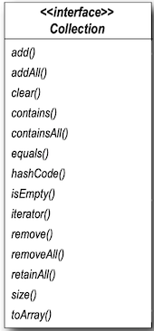
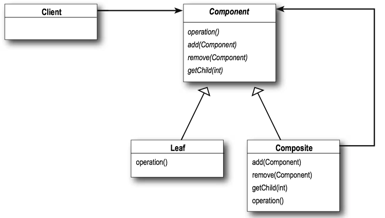
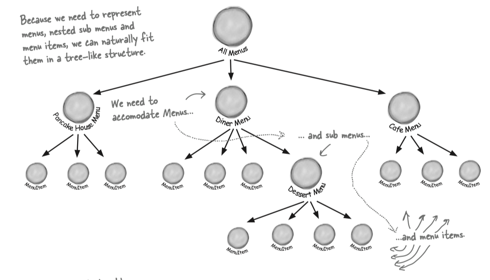
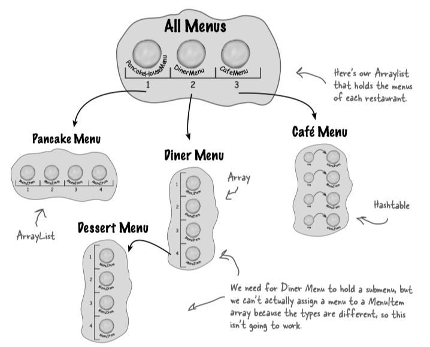
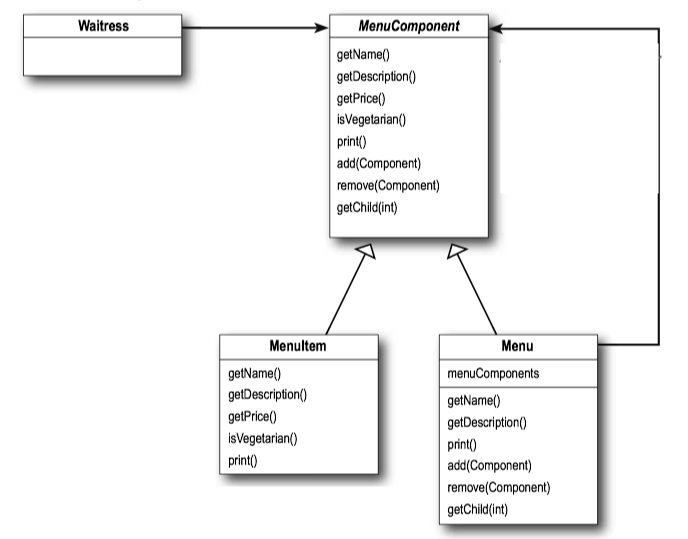
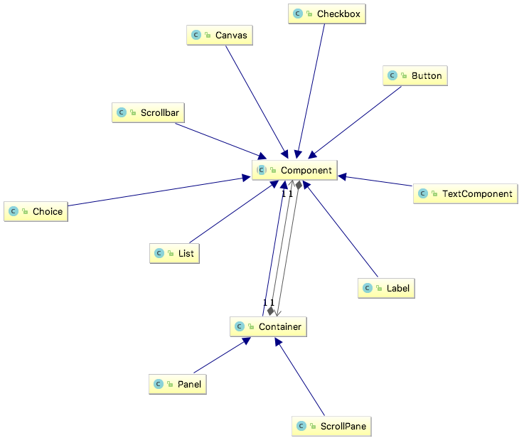

### 1 Iterator Pattern

#### Iterator Pattern Defined

> The Iterator Pattern(迭代器模式) provides a way to access the elements of an aggregate object sequentially without exposing its underlying representation.
>  迭代器模式能够顺序访问聚合对象中的各个元素，而又不暴露其内部的表示。

Iterator Pattern takes the responsibility of traversing elements and gives that responsibility to the iterator object, not the aggregate object.

迭代器模式让迭代器遍历元素，而不是聚合对象本身。


#### Iterator Pattern Class Diagram


* The <C>ConcreteAggregate</C> has a collection of objects and implements the method that returns an <C>Iterator</C> for its collection.
* The <C>Iterator</C> interface provides the interface that all iterators must implement, and a set of methods for traversing over elements of a collection.


!!! Note
    Java’s Collection Framework provides another type of iterator interface called <C>java.util.ListIterator</C>. This iterator adds <C>previous()</C> and a few other methods to the standard <C>java.util.Iterator</C> interface. It is supported by any <C>Collection</C> that implements the <C>List</C> interface.
    
    
    
#### Design Principle - Single Responsibility

> Design Principle - Single Responsibility : A class should have only one reason to change.


Every responsibility of a class is an area of potential change. More than one responsibility means more than one area of change.

#### Example - Café Menu

```Java tab="CafeMenu"
public interface Menu {
	public Iterator<MenuItem> createIterator();
}


public class CafeMenu implements Menu {
	HashMap<String, MenuItem> menuItems = new HashMap<>();
  
	public CafeMenu() {
		addItem("Veggie Burger and Air Fries",
			"Veggie burger on a whole wheat bun, lettuce, tomato, and fries",
			true, 3.99);
		addItem("Soup of the day",
			"A cup of the soup of the day, with a side salad",
			false, 3.69);
		addItem("Burrito",
			"A large burrito, with whole pinto beans, salsa, guacamole",
			true, 4.29);
	}
 
	public void addItem(String name, String description, 
	                     boolean vegetarian, double price) {
		MenuItem menuItem = new
		              MenuItem(name, description, vegetarian, price);
		menuItems.put(menuItem.getName(), menuItem);
	}
 
	public Map<String, MenuItem> getItems() {
		return menuItems;
	}
  
	public Iterator<MenuItem> createIterator() {
		return menuItems.values().iterator();
	}
}
```

```Java tab="waitress"
public class Waitress {
	Menu cafeMenu;
 
	public Waitress(Menu cafeMenu) {
		this.cafeMenu = cafeMenu;
	}
 
	public void printMenu() {
		Iterator<MenuItem> cafeIterator = cafeMenu.createIterator();
		printMenu(cafeIterator);
	}
 
	private void printMenu(Iterator<MenuItem> iterator) {
		while (iterator.hasNext()) {
			MenuItem menuItem = iterator.next();
			System.out.print(menuItem.getName() + ", ");
			System.out.print(menuItem.getPrice() + " -- ");
			System.out.println(menuItem.getDescription());
		}
	}
}
```

```Java tab="TestDrive"
public class MenuTestDrive {
	public static void main(String args[]) {
		CafeMenu cafeMenu = new CafeMenu();
		Waitress waitress = 
		          new Waitress(pancakeHouseMenu, dinerMenu, cafeMenu);
		waitress.printMenu();
		}
}
```


#### Iterators and Collections

Each <C>java.util.Collection</C> object knows how to create its own <C>Iterator</C>.





Java 5 includes a new form of the for statement, called `for/in`, that lets you iterate over a collection or an array without creating an iterator explicitly.

To use `for/in`, you use a for statement that looks like:

```Java
for (Object obj: collection) {
    ...
}
```

* Iterates over each object in the collection
* <C>obj</C> is assigned to the next element in the collection each time through the loop.

如果对象要使用`for/in`，那么必须实现<C>java.lang.iterable</C>接口，其中的<C>iterator()</C>函数返回iterator.


```Java
// Implementing this interface allows an object to be the target of
// the "for-each loop" statement. See
public interface Iterable<T> {
    // Returns an iterator over elements of type T.
    Iterator<T> iterator();
}
```

Iterator必须实现<C>hasNext()</C>和<C>next()</C>方法。

```Java
public interface Iterator<E> {
    // Returns true if the iteration has more elements.
    boolean hasNext();

    // Returns the next element in the iteration.
    E next();
}
```

### 2 Composite Pattern

#### Composite Pattern Defined

> The Composite Pattern(组合模式) allows you to compose objects into tree structures to represent part-whole hierarchies. Composite lets clients treat individual objects and compositions of objects uniformly.

> 组合模式组合多个对象形成树状结构以表示具有“部分-整体”层次结构。组合模式对单个对象和组合对象的使用具有一致性。

The Composite Pattern create a part-whole hierarchy; that is, a tree of objects that is made of parts (e.g. menus and menu items) but that can be treated as a whole. (i.e. treat "individual objects and compositions uniformly.")


**Cohesion** is a term you’ll hear used as a measure of how closely a class or a module supports a single purpose or responsibility. We say that a module or class has high cohesion when it is designed around a set of related functions, and we say it has low cohesion when it is designed around a set of unrelated functions.


#### Composite Pattern Class Diagram




#### Example - Menus

We try to design a menu that support menus with menus. For example, we want to make the dessert menu an element of the DinerMenu collection.




TRY TO USE ARRAY:



Problem: We need for <C>Dinner Menu</C> to hold a submenu, but we can't actually assign a menu to a <C>MenuItem</C> array because types are different, so this isn't going to work.

Composite pattern gives us a way to create a tree structure that can handle a nested group of menus and menu items in the same structure.




* The <C>Waitress</C> is going to use the <C>MenuComponent</C> interface to access both <C>Menus</C> and <C>MenuItems</C>.
* <C>MenuComponent</C> represents the interface for both <C>MenuItem</C> and <C>Menu</C>. We've used an abstract class here because we want to provide default implementations for these methods.

```Java tab="MenuComponent"
/** MenuComponent provides default implementation for every method.
 *
 */
public abstract class MenuComponent {

    public String getName(){
        throw new UnsupportedOperationException();
    }

    public String getDescription(){
        throw new UnsupportedOperationException();
    }

    public double getPrice() {
        throw new UnsupportedOperationException();
    }


    public boolean isVegetarian() {
        throw new UnsupportedOperationException();
    }

    public void print() {
        throw new UnsupportedOperationException();
    }

    public void add(MenuComponent menuComponent) {
        throw new UnsupportedOperationException();
    }

    public void remove(MenuComponent menuComponent) {
        throw new UnsupportedOperationException();
    }

    public MenuComponent getChild(int index) {
        throw new UnsupportedOperationException();
    }
}
```

```Java tab="MenuItem"
public class MenuItem extends MenuComponent {
    String name;
    String description;
    boolean isVegetarian;
    double price;

    public MenuItem(String name, String description, 
                    boolean vegetarian, double price) {
        this.name = name;
        this.description = description;
        this.isVegetarian = vegetarian;
        this.price = price;
    }


    @Override
    public String getName() {
        return name;
    }


    @Override
    public String getDescription() {
        return description;
    }


    @Override
    public boolean isVegetarian() {
        return isVegetarian;
    }

    @Override
    public double getPrice() {
        return price;
    }

    @Override
    public void print() {
        System.out.print(" " + getName());
        if (isVegetarian()) {
            System.out.print("(v)");
        }
        System.out.println(", " + getPrice());
        System.out.println(" -- " + getDescription());
    } // END PRINT
}
```


```Java tab="Menu"
public class Menu extends  MenuComponent {
    private String name;
    private String description;

    private ArrayList<MenuComponent> menuComponents 
                            = new ArrayList<>();

    public Menu(String name, String description) {
        this.name = name;
        this.description = description;
    }


    @Override
    public String getName() {
        return name;
    }

    @Override
    public String getDescription() {
        return description;
    }


    @Override
    public void add(MenuComponent menuComponent) {
        menuComponents.add(menuComponent);
    }

    @Override
    public void remove(MenuComponent menuComponent) {
        menuComponents.remove(menuComponent);
    }

    @Override
    public MenuComponent getChild(int index) {
        return menuComponents.get(index);
    }


    @Override
    public void print() {
        System.out.print("\n" + getName());
        System.out.println(","  + getDescription());
        System.out.println("---------------------");
        Iterator<MenuComponent> iterator = menuComponents.iterator();
        while(iterator.hasNext()) {
            MenuComponent nextMenuComponent = iterator.next();
            nextMenuComponent.print();
        }
    }
}
```

```Java tab="MenuTestDrive"
public class MenuTestDrive {
    public static void main(String args[]) {
        MenuComponent pancakeHouseMenu =
                new Menu("PANCAKE HOUSE MENU", "Breakfast");
        MenuComponent dinerMenu =
                new Menu("DINER MENU", "Lunch");
        MenuComponent cafeMenu =
                new Menu("CAFE MENU", "Dinner");
        MenuComponent dessertMenu =
                new Menu("DESSERT MENU", "Dessert of course!");
        MenuComponent coffeeMenu = new Menu("COFFEE MENU", 
                        "Stuff to go with your afternoon coffee");

        MenuComponent allMenus = new Menu("ALL MENUS", "All menus combined");

        allMenus.add(pancakeHouseMenu);
        allMenus.add(dinerMenu);
        allMenus.add(cafeMenu);

        pancakeHouseMenu.add(new MenuItem(
                "K&B's Pancake Breakfast",
                "Pancakes with scrambled eggs, and toast",
                true,
                2.99));
        pancakeHouseMenu.add(new MenuItem(
                "Regular Pancake Breakfast",
                "Pancakes with fried eggs, sausage",
                false,
                2.99));
        pancakeHouseMenu.add(new MenuItem(
                "Blueberry Pancakes",
                "Pancakes made with fresh blueberries, and blueberry syrup",
                true,
                3.49));
        pancakeHouseMenu.add(new MenuItem(
                "Waffles",
                "Waffles, with your choice of blueberries or strawberries",
                true,
                3.59));

        dinerMenu.add(new MenuItem(
                "Vegetarian BLT",
                "(Fakin') Bacon with lettuce & tomato on whole wheat",
                true,
                2.99));
        dinerMenu.add(new MenuItem(
                "BLT",
                "Bacon with lettuce & tomato on whole wheat",
                false,
                2.99));
        dinerMenu.add(new MenuItem(
                "Soup of the day",
                "A bowl of the soup of the day, with a side of potato salad",
                false,
                3.29));
        dinerMenu.add(new MenuItem(
                "Hotdog",
                "A hot dog, with saurkraut, relish, onions, topped with cheese",
                false,
                3.05));
        dinerMenu.add(new MenuItem(
                "Steamed Veggies and Brown Rice",
                "Steamed vegetables over brown rice",
                true,
                3.99));

        dinerMenu.add(new MenuItem(
                "Pasta",
                "Spaghetti with Marinara Sauce, and a slice of sourdough bread",
                true,
                3.89));

        dinerMenu.add(dessertMenu);

        dessertMenu.add(new MenuItem(
                "Apple Pie",
                "Apple pie with a flakey crust, topped with vanilla icecream",
                true,
                1.59));

        dessertMenu.add(new MenuItem(
                "Cheesecake",
                "Creamy New York cheesecake, with a chocolate graham crust",
                true,
                1.99));
        dessertMenu.add(new MenuItem(
                "Sorbet",
                "A scoop of raspberry and a scoop of lime",
                true,
                1.89));

        cafeMenu.add(new MenuItem(
                "Veggie Burger and Air Fries",
                "Veggie burger on a whole wheat bun, lettuce, tomato, and fries",
                true,
                3.99));
        cafeMenu.add(new MenuItem(
                "Soup of the day",
                "A cup of the soup of the day, with a side salad",
                false,
                3.69));
        cafeMenu.add(new MenuItem(
                "Burrito",
                "A large burrito, with whole pinto beans, salsa, guacamole",
                true,
                4.29));

        cafeMenu.add(coffeeMenu);

        coffeeMenu.add(new MenuItem(
                "Coffee Cake",
                "Crumbly cake topped with cinnamon and walnuts",
                true,
                1.59));
        coffeeMenu.add(new MenuItem(
                "Bagel",
                "Flavors include sesame, poppyseed, cinnamon raisin, pumpkin",
                false,
                0.69));
        coffeeMenu.add(new MenuItem(
                "Biscotti",
                "Three almond or hazelnut biscotti cookies",
                true,
                0.89));

        Waitress waitress = new Waitress(allMenus);

        waitress.printMenu();
    }
}
```


#### Example - java.awt.Container

* component: <C>Component</C>
* leaf: <C>Checkbox</C>, <C>Button</C>, <C>Label</C>...
* composite: <C>Container</C>




<C>java.awt.Container.add()</C> add a <C>Component</C> to a <C>Container</C>.

```Java
public class Container extends Component {
    public Component add(Component comp) {...}
    public void remove(Component comp) {...}
```