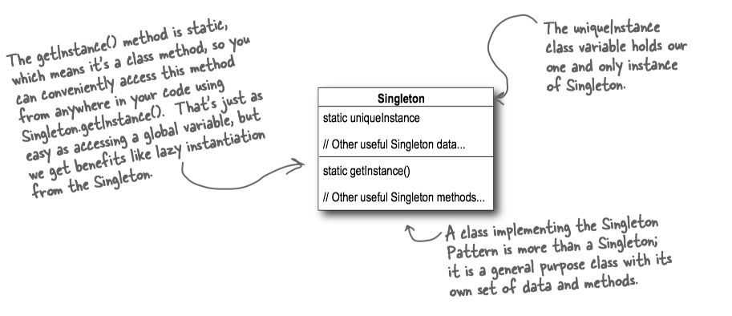
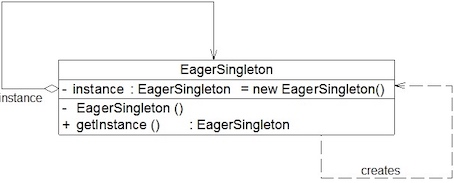

In many ways, the **Singleton Pattern**(单例模式) is a convention for ensuring one and only one object is instantiated for a given class. It often used to manage pools of resources, like connection or thread pools.


> The Singleton Pattern ensures a class has only one instance, and provides a global point of access to it.

### Lazily Created Instance

懒汉式(lazily created instance)在多线程环境下是不安全的，如果多个线程能够同时进入`:::Java if (uniqueInstance == null)`，并且此时 <C>uniqueInstance</C>为 null，那么会有多个线程执行`:::java uniqueInstance = new Singleton();` 语句，这将导致实例化多次<C>uniqueInstance</C>。


```Java
public class Singleton {
    // We have a static variable to 
    // hold our one instance of the class Singleton.
    private static Singleton uniqueInstance;
    // Our constructor is declared private; 
    // only Singleton can instantiate this class!
    private Singleton() {}
    
    // The getInstance() method gives us a way to 
    // instantiate the class and also to return an instance of it.
    public static Singleton getInstance() {
        if (uniqueInstance == null)
            uniqueInstance = new Singleton();
        return uniqueInstance;
    }
    
    // other useful methods here
    public String getDescription() {
        return "I'm a classic Singleton!";
    }
}
```



### Eagerly Created Instance

Move to an **eagerly created instance**(饿汉式) rather than a lazily created one(懒汉式). 线程不安全问题主要是由于<C>uniqueInstance</C>被实例化多次，采取直接实例化<C>uniqueInstance</C>的方式就不会产生线程不安全问题。


```Java
public class Singleton {
    private static Singleton uniqueInstance = new Singleton();
    private Singleton() {}
    public static Singleton getInstance() {
        return uniqueInstance;
    }
}
```




### Synchronized Method

懒汉式-线程安全: 只需要对<C>getUniqueInstance()</C>方法加锁，那么在一个时间点只能有一个线程能够进入该方法，从而避免了实例化多次<C>uniqueInstance</C>。

we almost trivially fix it by making <C>getInstance()</C> a synchronized method:

```Java
public class Singleton {
	private static Singleton uniqueInstance;
	// other useful instance variables here
	private Singleton() {}
 
	public static synchronized Singleton getInstance() {
		if (uniqueInstance == null)
			uniqueInstance = new Singleton();
		return uniqueInstance;
	}
 
	// other useful methods here
	public String getDescription() {
		return "I'm a thread safe Singleton!";
	}
}
```

Good point, and it’s actually a little worse than you make out: the only time synchronization is relevant is the first time through this method. Once we’ve set the uniqueInstance variable to an instance of Singleton, we have no further need to synchronize this method.


* Do nothing if the performance of <C>getInstance()</C> isn’t critical to your application.

### Double-checked locking

With double-checked locking(双重校验锁), we first check to see if an instance is created, and if not, THEN we synchronize. This way, we only synchronize the first time through, just what we want.

```Java
public class Singleton {
	private volatile static Singleton uniqueInstance;
	private Singleton() {}
	public static Singleton getInstance() {
	   // check for an instance and if there isn't one, 
	   // enter a synchronized block
	   // Note we only synchronize the first time through!
		if (uniqueInstance == null) {
			synchronized (Singleton.class) {
			   // Once in the block, check again and
			   // if still null, create an instance
				if (uniqueInstance == null)
					uniqueInstance = new Singleton();
			}
		}
		return uniqueInstance;
	}
}
```

Note: Using <C>Singleton.class</C> instead of <C>this</C> here, because <C>getInstance()</C> is a static method.

采用<C>volatile</C>关键字修饰也是很有必要的，`:::java uniqueInstance = new Singleton()`; 这段代码其实是分为三步执行：

1. 为<C>uniqueInstance</C>分配内存空间
2. 初始化<C>uniqueInstance</C>
3. 将<C>uniqueInstance</C>指向分配的内存地址

但是由于JVM会重排指令，执行顺序有可能变成 1->3->2。指令重排在单线程环境下不会出现问题，但是在多线程环境下会导致一个线程获得还没有初始化的实例。例如，线程T1执行了1和 3，此时线程T2调用<C>getUniqueInstance()</C>后发现 <C>uniqueInstance</C>不为空，因此返回<C>uniqueInstance</C>，但此时</C>uniqueInstance</C>还未被初始化。

使用<C>volatile</C>可以**禁止指令重排序优化**，保证在多线程环境下也能正常运行(volatile的讨论参见[深入了解JVM](https://techlarry.github.io/note-os/java/ujvm/ch12/#volatile))。

#### Serialization

通过对<C>Singleton</C>的序列化与反序列化得到的对象是一个全新的对象，这就破坏了<C>Singleton</C>的单例性。

```Java
public static void main(String[] agrs) throws Exception  {
    // write singleton to file
    FileOutputStream fileOutputStream = 
            new FileOutputStream("singleton.ser");
    ObjectOutputStream objectOutputStream = 
            new ObjectOutputStream(fileOutputStream);
    objectOutputStream.writeObject(Singleton.getInstance());
    objectOutputStream.close();

    // read singleton from file
    FileInputStream fileInputStream = 
            new FileInputStream("singleton.ser");
    ObjectInputStream objectInputStream = 
            new ObjectInputStream(fileInputStream);
    Singleton anotherSingleton = 
            (Singleton) objectInputStream.readObject();
    objectInputStream.close();
    
    // result: false
    System.out.println(anotherSingleton 
                    == Singleton.getInstance());
}
```

一个解决方法是添加<C>readResolve()</C>方法。

> <C>readResolve()</C> is used for replacing the object read from the stream. A common usage  is enforcing singletons; when an object is read, replace it with the singleton instance. This ensures that nobody can create another instance by serializing and deserializing the singleton. [ref](https://stackoverflow.com/questions/1168348/java-serialization-readobject-vs-readresolve)

```Java
public class Singleton {
    ....
    private Object readResolve() {
       // instead of the object we're on,
       // return the class variable INSTANCE
      return unique;
}
```

其具体原因是：

> The <C>readResolve</C> method is called when <C>ObjectInputStream</C> has read an object from the stream and is preparing to return it to the caller. <C>ObjectInputStream</C>  checks whether the class of the object defines the <C>readResolve</C> method. If the method is defined, the <C>readResolve</C> method is called to allow the object in the stream to designate the object to be returned. The object returned should be of a type that is compatible with all uses. If it is not compatible, a <C>ClassCastException</C> will be thrown when the type mismatch is discovered.


### Static Inner Class

```Java
public class Singleton {  
    private static class SingletonHolder {  
        private static final Singleton uniqueInstance 
                                = new Singleton();  
    }  
    private Singleton (){}  
    public static final Singleton getInstance() {  
        return SingletonHolder.uniqueInstance;  
    }  
}
```

静态内部类利用了<C>classloader</C>机制保证初始化`uniqueInstance`时只有一个线程。注意只有当调用<C>getInstance</C>方法时，才会装载<C>SingletonHolder</C>，初始化`uniqueInstance`。


### Enum

枚举不仅能避免多线程同步问题，而且还能防止反序列化重新创建新的对象。

> This approach is functionally equivalent to the public field approach, except that it is more concise, provides the serialization machinery for free, and provides an ironclad guarantee against multiple instantiation, even in the face of sophisticated serialization or reflection attacks. While this approach has yet to be widely adopted, *a single-element enum type is the best way to implement a singleton*. <small>[Effective Java]</small>


```Java
public enum Singleton {  
    INSTANCE;  
    public void whateverMethod() {  
    }  
}  
```

1. 线程安全：<C>Enum</C>中的枚举项实际上static类变量，static类型的属性会在类被加载之后被初始化。当一个Java类第一次被真正使用到的时候静态资源被初始化，Java类的加载和初始化过程都是线程安全的。所以，创建一个enum类型是线程安全的。
2. 反序列化: 普通的Java类的反序列化过程中，会通过反射调用类的默认构造函数来初始化对象。所以，即使单例中构造函数是私有的，也会被反射给破坏掉。由于反序列化后的对象是重新new出来的，所以这就破坏了单例。但是，枚举的反序列化并不是通过反射实现的。所以，也就不会发生由于反序列化导致的单例破坏问题。

> Enum constants are serialized differently than ordinary serializable or externalizable objects. The serialized form of an enum constant consists solely of its name; field values of the constant are not present in the form. To serialize an enum constant, <C>ObjectOutputStream</C> writes the value returned by the enum constant's name method. To deserialize an enum constant, <C>ObjectInputStream</C> reads the constant name from the stream; the deserialized constant is then obtained by calling the <C>java.lang.Enum.valueOf</C> method, passing the constant's enum type along with the received constant name as arguments. Like other serializable or externalizable objects, enum constants can function as the targets of back references appearing subsequently in the serialization stream.

> The process by which enum constants are serialized cannot be customized: any class-specific <C>writeObject</C>, <C>readObject</C>, <C>readObjectNoData</C>, <C>writeReplace</C>, and <C>readResolve</C> methods defined by enum types are *ignored* during serialization and deserialization. Similarly, any <C>serialPersistentFields</C> or <C>serialVersionUID</C> field declarations are also ignored--all enum types have a fixed <C>serialVersionUID</C>  of 0L. Documenting serializable fields and data for enum types is unnecessary, since there is no variation in the type of data sent. [Java Object Serialization Specification](https://docs.oracle.com/javase/7/docs/platform/serialization/spec/serial-arch.html#6469)

