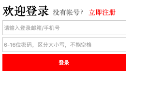

[Ajax](http://api.jquery.com/category/ajax/)，即Asynchronous JavaScript and XML(异步的JavaScript和XML)。Ajax不是新的编程语言，而是一种使用现有标准的新方法。Ajax通过在后台与服务器进行少量数据交换，从而实现异步更新，这意味着可以在不重新加载整个网页的情况下，对网页的某部分进行更新。


<!--
- Ajax 是一种用于创建快速动态网页的技术。

• Ajax特点：

通过在后台与服务器进行少量数据交换，Ajax 可以

- 传统的网页（不使用 Ajax）如果需要更新内容，必须重载整个网页页面


-->

#### Ajax方法

`jQuery.ajax(url, [settings])`方法实现了异步的HTTP请求，常见的setting参数如下：

* `url`: 请求的地址
* `type`: 请求时数据的传递方式(常用的有get/post)
* `data`: 用来传递的数据(建议使用json来传递)
* `success`：请求成功时调用该函数
* `dataType`: ajax接收后台数据的类型(建议使用json)

[[官方文档详细参数](http://api.jquery.com/jQuery.ajax/)]

### 应用：登陆页面

使用Servlet, JSP，Ajax等技术实现一个简单的登陆页面：当密码错误时，提示密码错误；当密码正确时，跳转到成功登陆页面。



使用`input`实现表单，在按钮(`id="login"`)上绑定click事件为`$.ajax()`。

```html
<input type="text" name="username" 
        placeholder="请输入登录邮箱/手机号" id="username">
<span class="tip"></span>
<input type="password" name="password" 
        placeholder="6-16位密码，区分大小写，不能空格" id="password">
<input type="button" value="登录"  id="login">
```

下面是按钮上的点击事件，当HTTP请求成功时执行success函数，result为后端返回的数据，格式为json。sucess函数首先从结果中取出flag，如果账号密码符合，即登陆成功(flag=true)，则跳转到成功登陆页面，否则修改tip的内容：您输入的用户名或者密码不正确。

```js
$("#login").click(
    //单击登录按钮的时候触发ajax事件
    $.ajax({
        url: "/LoginServlet",
        type: "post",
        data: {
            username: $("input[name=username]").val(),
            password: $("input[name=password]").val()
        },
        dataType: "json",  // 返回的数据格式
        success: function (result) {
            var flag = result.flag;
            if (flag) {
                //如果登录成功则跳转到成功页面
                window.location.href = "pages/front/success.jsp";
            } else {
                //跳回到Index.jsp登录页面，同时在登录页面给用户一个友好的提示
                $(".tip").text("您输入的用户名或者密码不正确");
            }
        } // end success
    }) // end Ajax
);
```

在后端，`LoginServet`类接收HTTP请求，将用户输入的账号和密码和数据库中的账号和密码进行匹配。

```java
public class LoginServlet extends HttpServlet {
    protected void doGet(HttpServletRequest request, 
        HttpServletResponse response) throws ServletException, IOException {
        //1、首先获取jsp页面传递过来的参数信息
        String username = request.getParameter("username");
        String password = request.getParameter("password");
        //2、如果用户名和密码匹配则登录成功，否则登录失败
        JSONObject jsonObject;
        RedisUtils redis = RedisUtils.INSTANCE;
        if(redis.hexists("login", username) 
                && redis.hget("login", username).equals(password))
            jsonObject = new JSONObject("{flag:true}");
        else jsonObject = new JSONObject("{flag:false}");
        response.getOutputStream().write(
                jsonObject.toString().getBytes("utf-8"));
    }
    protected void doPost(HttpServletRequest request, 
        HttpServletResponse response) throws ServletException, IOException {
        doGet(request,response);
    }
}
```
    
    