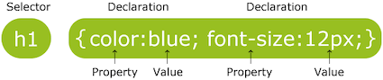

学习资料：[CSS教程](https://www.w3cschool.cn/css/1fi5zf21.html)

### 简介

CSS指**层叠样式表**(**C**ascading **S**tyle **S**heets)。


CSS规则有两个主要的部分构成：**选择器**(selector)，以及一条或多条声明(declaration)。选择器通常是需要改变样式的HTML元素。每条声明由一个属性和一个值组成。



在描述颜色的时候，可以使用英文颜色名称(e.g.`red`)、十六进制编码(e.g.`#fffffff`)、RGB值(e.g.`grb(255,0,0)`)方法来设置颜色。十六进制编码(hex code)使用6个十六进制数字来表示颜色，每2个数字分别表示红(R)、绿(G)和蓝(B)成分;也可以是使用3个十六进制数字来表示颜色，每1个数字表示红(R)、绿(G)和蓝(B)成分，#RGB相当于##RRGGBB。

以下段落的字体颜色都是红色：

```css
p {color: red;}
p {color: #ff0000;}
p {color: #f00;}
p {color: grb(255,0,0);}
```

#### 创建

插入样式表有三种方法：

* 外部样式表
* 内部样式表
* 内联样式

外部样式表适合于应用多个页面。在文档的头部加入`:::html <link rel="stylesheet" type="text/css" href="style.css">`。浏览器会从文件`style.css`中读到样式声明，并根据它来格式文档。

当单个文档需要特殊的样式时，就应该使用内部样式表。可以使用`:::css <style>`标签在文档头部定义内部样式表：

```html
<head>
    <style>
        <!-- css放这里 -->
    </sytle>
```

当某个元素需要特殊的样式时，应该使用内联样式。需要在相应的标签内使用样式(sytle)属性。

```html
<p style="color:sienna; margin-left:20px">这是一个段落。</p>
```

#### 层叠次序

当同一个HTML元素被不止一个样式定义时，会使用哪个样式呢？所有的样式会依照以下层叠次序(优先权依次递增)：

1. 浏览器缺省设置
2. 外部样式表
3. 内部样式表
4. 内联样式


### CSS选择器

[CSS选择器列表](http://www.w3school.com.cn/cssref/css_selectors.asp)

下面是CSS的基本选择器：

| 选择器 | 代码 | 描述 |
| --- | --- | --- |
| ID选择器  | `:::css #id`   | 选择所有`:::css id=id`的元素 |
| 元素选择器 | `:::css element` | 选择所有`:::css <element>`元素。 |
| 类选择器 | `:::css .class` |  选择所有`:::css class="class"`的元素 |
| 属性选择器 |  `:::css [attribute]` | 选择带有target属性的元素 |
| 属性选择器 |  `:::css [attribute=value]` | 选择属性target的值为value的元素 |	
	

#### 基于关系的选择器 

| 选择器名称 | 选择器 | 描述 |
| --- | --- | --- |
| 后代选择器 | `:::css ancestor descendant` | 选择给定的祖先元素的所有后代元素，一个元素的后代可能是该元素的一个孩子、孙子等。|
| 子元素选择器 | `:::css parent > child` | 选择父元素parent的所有子元素child。 |
| 相邻兄弟选择器 | `:::css prev+next`| 选择紧接在prev元素之后的next元素。 |
| 一般兄弟选择器 | `:::css prev ~ siblings` | 匹配prev元素之后的所有兄弟元素siblings |


#### 伪类

由于状态的变化是非静态的，所以元素达到一个特定状态时，它可能得到一个伪类的样式；当状态改变时，它又会失去这个样式。由此可以看出，它的功能和class有些类似，但它是基于文档之外的抽象，所以叫**伪类**(pseudo class)。 

伪类的语法： `:::css selector:pseudo-class {property:value;}`

以下是anchor伪类，链接的不同状态可以以不同的方式显示：

| 伪类 | 描述 |
| --- | --- |
| `:::css :link` | 选择所有未被访问的链接 |
| `:::css :hover` | 选择鼠标指针位于其上的链接 |
| `:::css :active` | 选择活动链接 |
| `:::css :visited` | 选择所有已被访问的链接 |

```css
a:link    {color:blue;}
a:visited {color:blue;}
a:hover   {color:red;}
a:active  {color:yellow;}
```


#### 伪元素

CSS伪元素是用来添加一些选择器的特殊效果，其控制内容和元素是没有差别的，但是它本身指示基于元素的抽象，并不存在于文档中，所以称为**伪元素**(pseudo element)。

伪元素的语法为 `:::css selector:pseudo-element {property:value;}`

| 伪元素 | 描述 |
| --- | --- |
| `:before` | 在被选元素的内容前面插入内容 |
| `:after` | 在被选元素的内容后面插入内容 |

```css
p:before { 
    content:"台词：-";
    background-color:yellow;
    color:red;
    font-weight:bold;
}
```

#### 选择器优先级顺序

下面是一份优先级逐级增加的选择器列表：

1. 通用选择器(`*`)
2. 元素选择器
3. 类选择器
4. 属性选择器
5. 伪类
6. ID选择器

但当`:::html !important`被应用在一个样式声明时，该样式声明会覆盖CSS中任何其他的声明，无论它处在声明列表的哪里。使用`:::html !important`不是一个好习惯，因为它改变了样式表本来的优先级规则，使得难以调试。


#### 分组和嵌套

分组选择器由多个选择器组成，每个选择器之间用逗号分隔：

```css
h1,h2,p { 
color:green; 
}
```

嵌套选择器适用于选择器内部的选择器的样式：

```css
.marked p { 
    color:white; 
}
```


### CSS样式

#### 背景

| 属性 | 描述 |
| --- | --- |
| background | 简写属性，作用是将背景属性设置在一个声明中 |
| background-color | 设置元素的背景颜色 |
| background-image | 设置元素的背景图像 |
| background-position | 设置背景图像的起始位置 |
| background-repeat | 设置背景图像进行水平(`repeat-x`)或垂直平铺(`repeat-y`)或不平铺(`no-repeat`) |
| background-size | 设置图片背景大小(百分比%) |


```css
#xy {
	background-image: url('logo.png');
	background-repeat: no-repeat;
	background-position: right bottom;
	background-size: 120%;
	margin-right: 200px;
}
```

#### 文本 

通过CSS的Text属性，可以改变页面中文本的颜色、字符间距、对齐文本、装饰文本、对文本进行缩进等。


| 属性 | 描述 | 选项 | 
| --- | --- | --- | 
| color | 设置文本颜色 |   |
| text-align | 设置文本的对齐方式 | 左右外边距对齐`justify`, 左中右`left/center/right` |
| text-decoration | 设置文本的装饰 | 上/中/下划线`overline`/`line-through`/`underline` |
| text-indent | 设置文本首行锁紧 | |
| vertical-align |  设置元素的垂直对齐 |

#### 字体 

| 属性 | 描述 | 常用选项 |
| --- | --- | --- |
| font | 在一个声明中设置所有的字体属性 | |
| font-family | 指定文本的字体系列 | |
| font-size | 指定文本的字体大小 | 单位常为px, em, (1em=16px) | 
| font-style | 指定文本的字体样式 |  默认 `normal`, 斜体 `italic` |
| font-weight | 指定字体的粗细 | 默认`normal`, 粗体`bold`, 更粗`bolder`, 更细`lighter` |

font-family可以指定多个字体系列。如果浏览器不支持第一个字体系列，则会尝试下一个。在指定具体字体以后，一般要加上一个通用字体系列，例如"serif", "sans-serif", 以防止具体字体不可用。


```css
p {
    font-family: arial, sans-serif;
    font-size: 12px;
    font-weight: bold;
    font-style: italic;
    text-decoration: underline;
    color: #992828;
}
```

#### 链接

链接的样式，可以用任何CSS属性(如颜色，字体，背景等)。特别的链接，可以有不同的样式，这取决于他们是什么状态。
这四个链接状态是：

* `a:link` - 正常，未访问过的链接
* `a:visited` - 用户已访问过的链接
* `a:hover` - 当用户鼠标放在链接上时
* `a:active` - 链接被点击的那一刻

#### 列表 

| 属性 | 描述 | 常用选项 |
| --- | --- | --- |
| list-style | 用于把所有用于列表的属性设置于一个声明中 | |
| list-style-image | 将图象设置为列表项标志 | |
| list-style-type | 设置列表项标志的类型 | circle, square, upper-roman, lower-alpha | 

```css
li {
	list-style-image: url("sqpurple.gif");
	padding: 0px;
	margin: 0px;
}
```

#### 表格

| 属性 | 描述 | 常用选项 |
| --- | --- | --- |
| border | 设置表格边框 | 常用`border: 1px solid black;` |
| border-collapse | 设置表格的边框是单边框还是双边框 | `collapse`(折叠成单一边框), `separate`(双边框)  |
| width | 定义表格的宽度 | |
| text-align | 表格中的文本对齐 | |
| padding | 设置表格中的填充 | |

!!! note
    内联样式不能应用选择器。参见[StackOverflow](https://stackoverflow.com/questions/5293280/css-pseudo-classes-with-inline-styles)。

#### 盒子模型

所有HTML元素可以看作盒子，在CSS中，盒子模型(box model)这一术语是用来设计和布局时使用，它包括：边距(margin)，边框(border)，填充(padding)和实际内容(content)。


* Margin(外边距) - 清除边框区域。Margin没有背景颜色，它是完全透明
* Border(边框) - 边框周围的填充和内容。会受到盒子的背景颜色影响
* Padding(内边距) - 清除内容周围的区域。会受到框中填充的背景颜色影响
* Content(内容) - 盒子的内容，显示文本和图像

设置Padding和Margin时可以统一设置，可以分开设置：使用padding/margin-bottom/left/right/top设置。

总元素的宽度=宽度(width)+左右填充(padding)+左右边框(border)+左右边距(margin)。

例如下面的例子中的元素的总宽度为300px：  
     
```css
width:250px;        
padding:10px;        
border:5px solid gray;        
margin:10px;
```

#### 边框 

CSS边框(border)可以是围绕元素内容和内边距的一条或多条线，对于这些线条，可以自定义它们的样式、宽度以及颜色。

| 属性 | 描述 |
| --- | --- |
| border-style | 用于设置元素所有边框的样式 |
| border-width | 设置边框宽度 |
| border-color | 设置边框中可见部分的颜色 |


<b>border-style</b>属性用来定义边框的样式:
<ul>
<li style="border: 1px none #000000;padding:3px">none: 默认无边框</li>
<li style="border: 1px dotted #000000;padding:3px">dotted: 定义一个点线框</li>
<li style="border: 1px dashed #000000;padding:3px">dashed: 定义一个虚线框</li>
<li style="border: 1px solid #000000;padding:3px">solid: 定义实线边界</li>
<li style="border: 3px double #000000;padding:3px">double: 定义两个边界。 两个边界的宽度和border-width的值相同</li>
<li style="border: 5px groove #98bf21;padding:3px">groove: 定义3D沟槽边界。效果取决于边界的颜色值</li>
<li style="border: 5px ridge #98bf21;padding:3px">ridge: 定义3D脊边界。效果取决于边界的颜色值</li>
<li style="border: 5px inset #98bf21;padding:3px">inset:定义一个3D的嵌入边框。效果取决于边界的颜色值</li>
<li style="border: 5px outset #98bf21;padding:3px">outset: 定义一个3D突出边框。 效果取决于边界的颜色值</li>
</ul>

### CSS布局

#### Display与Visibility

CSS display属性和visibility属性都可以用来隐藏某个元素：

* `display`属性设置一个元素应如何显示
* `visibility`属性指定一个元素应可见还是隐藏

!!! note "隐藏元素"
    虽然`display:none`和`visibility:hidden`都可以隐藏一个元素，但是，`visibility:hidden`隐藏的元素仍需占用空间，但`display:none`不占用任何空间。

`display: inline`和`display: block`可以更改块元素为内联元素，或者反之。

* 内联元素(内容显示为一块)：`span`, `a`, `td`
* 块级元素(内容显示在行中)：`p`, `div`, `h1`

#### 浮动Float

CSS float属性定义元素在哪个方向浮动，浮动元素会生成一个块级框，直到该块级框的外边缘碰到包含框或者其他的浮动框为止。`float`属性的可能值为:

* `left` - 使左边缘接触包含块的左边缘或另一浮动块的右边缘。
* `right` - 使右边缘接触包含块的右边缘或另一浮动块的左边缘。
* `none` - 元素不浮动。

几个特性：

* 浮动元素之后的文本将围绕它。浮动元素之前的元素将不会受到影响。
* 如果把几个浮动的元素放到一起，如果有空间的话，它们将彼此相邻。
* 元素浮动之后，周围的元素会重新排列，为了避免这种情况，可以将不想重新排列的元素使用clear属性。


#### Position定位

!!! note  "CSS定位机制"
    CSS中的定位机制有三种：普通流(又叫文档流、正常流)，浮动和绝对定位。普通流是默认定位，块级框从上到下一个接一个地排列，行内框在一行中水平布局。


position属性值有`static`、`relative`、`absolute`、`fixed`等。

**static**：静态定位

静态定位是默认的。元素框正常生成。


**relative**: 相对定位

相对定位的元素会按照元素的<span style="color:red">原始位置</span>对该元素进行移动。
    
```css
<!--相对于原来位置向左、向上移动了10px-->
position: relative;
top: 10px;
left 10px;
```

**absolute**：绝对定位

绝对定位使元素的位置与文档流无关，也不占据文档流空间，普通流中的元素布局就像绝对定位元素不存在一样。绝对定位的元素的位置是相对距离最近的非static祖先元素位置决定的。


**fixed**: 规定定位

脱离标准文档流，固定在浏览器窗口的某一位置，例如网站右下角的小广告。


#### overflow

`overflow`属性指定如果内容溢出一个元素的框，会发生什么。

| 属性值 | 描述 |
| --- | --- |
| visible | 默认值。内容不会被修剪，会呈现在元素框之外。 |
| hidden |	内容会被修剪，并且其余内容是不可见的。 |
| scroll |	内容会被修剪，但是浏览器会显示滚动条以便查看其余的内容。 |
| auto | 如果内容被修剪，则浏览器会显示滚动条以便查看其余的内容。 |
| inherit | 规定应该从父元素继承 overflow 属性的值。 |

!!! Example "演示"
    <p>overflow:visible</p>
    <div class="hidden" style="overflow:visible; width:100px; height:100px; background-color:#00FFFF;">You can use the overflow property when you want to have better control of the </div>
    
    <br/>
    <p>overflow:scroll</p>
    <div class="scroll" style="overflow:scroll; width:100px; height:100px;background-color:#FFFF00;">You can use the overflow property when you want to have better control of the layout. The default value is visible.</div>
    
    <p>overflow:hidden</p>
    <div class="hidden" style="overflow:hidden; width:100px; height:100px; background-color:#FF00FF;">You can use the overflow property when you want to have better control of the layout. The default value is visible.</div>

