### 1 前言

#### 单靠Web服务器

如果需要动态页面，而且希望能够把数据保存到服务器上，只依靠Web服务器是不够的。Web服务器应用只提供静态页面。需要CGI或者Servlet这样的辅助应用生成非静态的即时页面，而且能够与Web服务器通信。

也就是说即时页面在请求到来之前并不存在，请求到来后，辅助应用写出HTML，Web服务器再把这个HTML交回给客户。

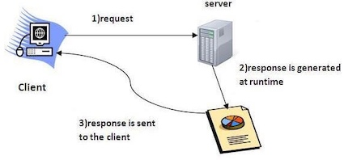


### 2 Web应用体系结构

Servlet没有`main()`方法。它们受控于另一个Java应用，这个Java应用称为**容器**(如[Tomcat](http://tomcat.apache.org) )。如果Web服务器应用(如Apache)得到一个指向某servlet的请求，此时服务器不是把请求交给servlet本身，而是交给部署该servlet的容器。要由容器向servlet提供HTTP请求和响应，而且要由容器调用servlet的方法(如`doPost`/`doGet`)。

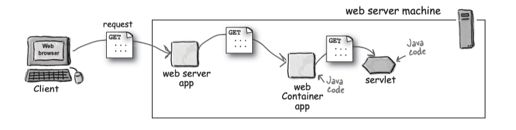

容器能提供什么？

* 通信支持：无需建立`ServerSocket`、监听端口、创建流，就能轻松让servlet与Web服务器对话。
* 生命周期管理：容器控制servlet的生与死，负责加载类、实例化和初始化servlet、调用servlet方法。
* 多线程支持：自动为每个servlet请求创建一个新线程。
* 声明方式实现安全：可以使用XML部署描述文件来配置安全性，而不必将其硬编码写到servlet或其他类代码中。也就是说不用修改Java源文件、不用重新编译就能管理和修改配置。
* JSP支持：负责把JSP代码翻译成Java代码。


#### 部署描述文件

部署描述文件(Deployment Descriptor, 简称DD，一般为`web.xml`)有以下优点：

* 尽量少改动已经测试过的源代码
* 即使你手上并没有源代码，也可以对应用的工程进行调整
* 不用重新编译和测试任何代码，也可以让应用适用不同的资源(如数据库)
* 可以更容易地维护动态安全信息，如访问控制列表和安全角色


**映射**

部署描述文件可以将URL映射到servlet。每个servlet映射都有两部分———— `<servlet>`元素和`<servlet-mapping>`元素。

```xml
<servlet>  // 将内部名映射到完全限定类名
    <servlet-name>HelloWorldServlet</servlet-name>
    <servlet-class>mypkg.HelloServlet</servlet-class>
</servlet>

<servlet-mapping> // 将内部名映射到公共URL名
    <servlet-name>HelloWorldServlet</servlet-name>
    <url-pattern>/sayHello</url-pattern>  // 公共URL名，客户看到的
</servlet-mapping>
```

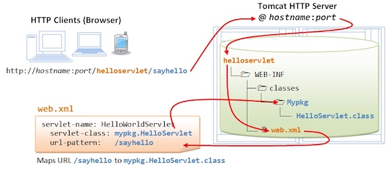

有三种`<url-pattern>`元素：

* 完全匹配: `/Beer/SelectBeer.do`
* 目录匹配: `/Beer/*`总是以一个斜线加星号结束
* 扩展名匹配: `*.do` 必须以一个星号开头，后面必须有一个点号加扩展名

容器首先查找完全匹配，如果找不到完全匹配，再查找目录匹配，最后查找扩展名匹配。


**欢迎页面**

容器在部署描述文件中寻找servlet映射，如果没有找到匹配，会在该目录下按照`<welcome-file-list>`中按顺序查找一个欢迎页面。如果还没找到可能会显示该目录列表，或者404 Not Found错误。

常见的`<welcome-file-list>`：

```xml
<welcome-file-list>
    <welcome-file>index.html</welcome-file>
    <welcome-file>default.jsp</welcome-file>
</welcome-file-list>
```

**错误页面**

如果没有找到文件，可以指定错误页面

```xml
<error-page>
    <exception-type>java.lang.Throwable</exception-type>
    <location>/errorPage.jsp</location>
<error-page>
```

**servlet初始化**

如果希望在部署时加载servlet，而不是等到第一个请求到来时才加载，可以使用`<load-on-startup>`元素，元素值为加载的顺序(即值越小越先加载)。例如


```
<servlet>
    <servlet-name>KathyOne</servlaet-name>
    <servlet-class>foo.DeployTestOne</servlet-class>
    <load-on-startup>1</load-on-startup>
</servlet>
```


### 3 MVC模式

MVC即**模型-视图-控制器**(model-view-controller)模式。MVC就是把业务逻辑从servlet中抽出来，把它放在一个模型中。所谓模型就是一个可重用的普通Java类，是业务数据和处理该数据的方法的组合。

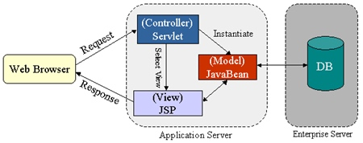


* 控制器(Controller) - 负责转发请求，对请求进行处理。
* 视图(View) - 界面设计人员进行图形界面设计。
* 模型(Model) - 程序员编写程序应有的功能(实现算法等等)、数据库专家进行数据管理和数据库设计(可以实现具体的功能)。


### 4 Servlet请求和响应

#### 生命周期

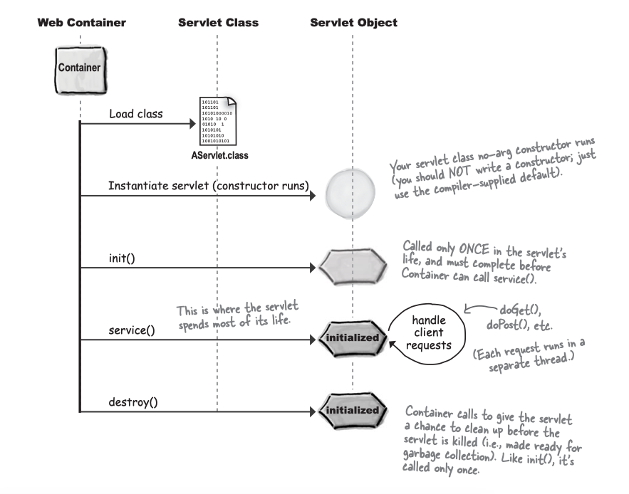

1. Servlet接口：

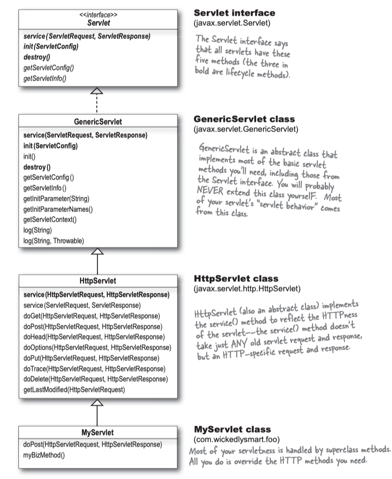


Servlet生命周期中重要时刻

| 时刻 | 何时调用  | 作用 | 是否覆盖 |
| --- | --- | --- | --- |
| `init()` | servlet实例创建后，并在servlet能为客户请求提供服务之前，容器要对servlet调用`init()` | 使你在servlet处理客户请求之前有机会对其初始化 | 有可能。如果有初始化代码(如得到一个数据库连接，或向其他对象注册)，就要覆盖servlet类中的`init()方法`。|
| `service()` | 第一个客户请求到来时，容器会开始一个新线程，并调用servlet的`service()`方法 | 查看请求，确定HTTP方法(GET, POST等), 并在servlet上调用对应的方法。 | 不应该覆盖`service()`方法 |
| `doGet()`/`doPost()` | `service()`方法根据请求的HTTP方法来调用`doGet()`或`doPost()` | 你的Web应用想要做什么，就要由这个方法负责 | 至少要覆盖其中之一 |
| `destroy()` | 需要释放内存或者容器关闭时 | 关闭数据库连接、停止后台线程等 | 一般不覆盖  |

第一个客户请求到来时，容器会开始一个线程，并调用servlet的`service()`方法。后续客户请求到来时，容器再创建或找到另一个线程，并调用servlet的`service()`方法。也就是**容器运行多个线程来处理对一个servlet的多个请求**(一个servlet, 多个线程)。

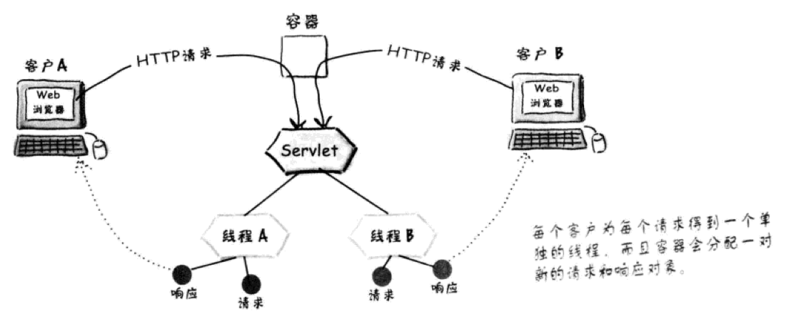

#### 加载和初始化

容器找到servlet类文件时，servlet的生命周期开始。这基本上都是在容器启动时发生(例如，运行Tomcat时)。容器启动时，它会寻找已经部署的Web应用，然后开始搜索servlet类文件。加载类可能在容器启动时发生，也可能在第一个客户使用时进行。

**`init()`总是在第一个`service()`调用之前完成**。

servlet初始化后产生`ServletConfig`对象和`ServletContext`对象：

* `ServletConfig`对象
    * 每个servlet都有一个`ServletConfig`对象
    * 用于向servlet传递部署时信息，当你不想把这个信息硬编码到servlet中(servlet初始化参数），如数据库名
    * 用于访问`ServletContext`
    * 参数在部署描述文件中配置
* `ServletContext`对象
    * 每个Web应用有一个`ServletContext`
    * 用于访问Web应用参数 
    
#### 请求
    
GET请求本质上讲是幂等的。它们应当能多次运行而不会对服务器产生任何副作用。GET请求不应该修改服务器上的任何东西。

POST本质上讲不是幂等的，所以要适当地设计和编写代码，如果客户错误地把一个请求发送了两次，应该能正确地加以处理。

简单的超链接往往意味着GET请求：

```html
<a href="http://baidu.com"> click here </a>
```

如果在表单中明确说`method="POST"`，那么毫无疑问这就是一个POST请求。如果在表单`<form>`中没有说`method="POST"`，就会默认为GET请求。

```html
<form method="POST" action=SelectBeer.do">
```

`request.getParameter(parameterName)`返回单个参数，返回值总是个String。如果对应一个给定的参数名有多个参数值，要使用`request.getParameterValues(parameterName)`方法来返回一个String数组。

从请求对象还可以得到其他东西，包括首部、cookie、会话、查询串和输入流：

| 方法 | 详细信息 |
| --- | --- |
| `request.getHeader("User-Agent")` | 客户的平台和浏览器信息 |
| `request.getCookies()` | 与请求相关的cookie |
| `request.getSession()` | 与客户相关的会话session |
| `request.getContextPath()` | 获取当前项目的系统路径 |


    
#### 响应

`javax.servlet.ServletResponse`接口示意：

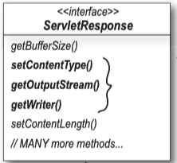

大多数情况下，使用响应只是为了向客户发送数据，会对响应response调用两个方法：`setContentType()`和`getWriter()`。在此之后，只需要完成I/O即可。

`setContentType()`设置了HTTP首部中的内容类型：告诉了浏览器返回类型，浏览器会采取相应的操作：例如，打开PDF阅读器或者视频播放器，或者呈现HTML，又或者把响应的字节保存为一个下载文件。

`ServletResponse`接口提供了两个流用于输出：`ServletOutputStream`用于输出字节流, `PrintWriter`用于输出字符流。

```Java
// 把文本数据打印到一个字符流
PrintWriter writer = response.getWriter();
writer.println("some text and HTML");

// 输出字节流
ServletOutputStream out = response.getOutputStream();
out.write(aByteArray);
```
<small>字节流和字符流的区别参见[Java IO](../Head First Java/14 Serialization and File IO.md/#1_)</small>

**重定向**：当确定无法完成工作以后，servlet可以调用重定向方法`sendRedirect()`:

```Java
if (worksForMe) {
    // handle the request
} else {
    response.sendRedirect("http://www.oreilly.com");
}
```

**请求分派**：当servlet将请求交给Web应用的另一部分(例如，JSP)。

```Java
RequestDispatcher view = 
    request.getRequestDispatcher("result.jsp")
view.forward(request, response);
```

请求分派(详见下一章)在服务器端发生，而重定向在客户端进行。请求分派把请求传递给服务器上的另一个组件(通常在同一个Web应用中)。请求重定向只是告诉浏览器去访问另一个URL。


### 5 Servlet属性和监听者

#### 初始化参数

servlet不仅可以把请求参数传递给`doGet()`或者`doPost()`，而且还可以有初始化参数。


在部署描述文件(web.xml)中给定一个参数名(param-name)和一个参数值(param-value)。

```xml
<init-param>
    <param-name>adminEmail</param-name>
    <param-value>likewecare@wickedljdsf.com</param-value>
</init-param>
```
在servlet中，使用getServletConfig返回ServletConfig，通过getInitParameter获取参数。

```java
out.println(getServletConfig().getInitParameter("adminEmail"));
```

容器初始化一个servlet时，会为这个servlet建一个唯一的`ServletConfig`，容器从部署配置文件读出servlet初始化参数，并把这些参数交给`ServletConfig`,然后把`ServletConfig`传递给servlet的`init()`方法。

容器建立一个servlet时，它会读取部署配置文件，并为`ServletConfig`创建名/值对。此后容器不会再读初始化参数。一旦参数置于`ServletConfig`中，就不会再读了，除非你重新部署servlet。

!!! question
    如果修改XML来改变一个初始化参数的值，servlet或Web应用的其余部分什么时候能看到这个改变呢？
    
    只有当Web应用重新部署时才会看到。servlet只会初始化一次，就是在它生命刚开始时初始化，也正是在这个时候会为它提供`ServletConfig`和`ServletContext`。

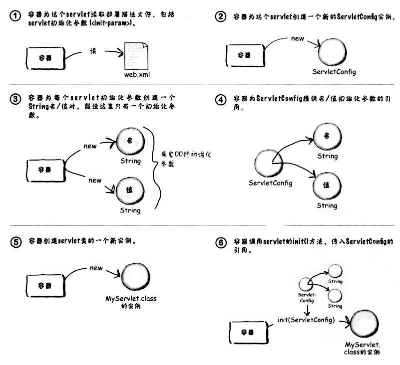

上下文初始化参数context-param与servlet初始化参数init-param很类似，只不过上下文参数对整个Web应用可用，而不只针对一个servlet。所有servlet都可以访问上下文初始化参数，而且如果值有变化，只需在一个地方修改就行了。


```xml tab="配置文件"
<context-param>
    <param-name>adminEmail</param-name>
    <param-value>likewecare@wickedljdsf.com</param-value>
</context-param>
```

```Java tab="Servlet代码"
out.println(getServletContext().getInitParameter("adminEmail");
```

**每个servlet有一个ServletConfig，每个Web应用有一个ServletContext**。

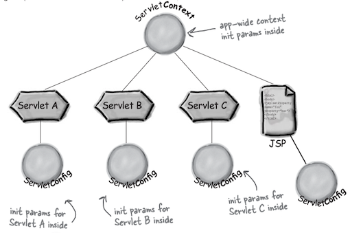

servlet初始化参数和上下文初始化参数之间的区别：

| 类别  | 上下文初始化参数 | Servlet初始化参数 |
| --- | --- | --- | 
| 部署描述文件 | 在`<web-app>`元素中，但是不在具体的<servlet>元素内: `<context-param>` | 在每个特定servlet的`<servlet>`元素中: `<init-param>` |
| Servlet代码 | getServlet<span style="color:red">Context</span>().getInitParameter("foo"); | getServlet<span style="color:red">Config()</span>.getInitParameter("foo") |
| 可用性 | 对Web应用中的所有servlet和JSP都可用 | 只对配置了`<init-param>`的相应servlet可用  | 

#### ServletContext

ServletContext是JSP或servlet与容器及其Web应用其他部分的一个连接。


!!! note "两种方式得到ServletContext"
    
    servlet的`ServletConfig`对象拥有该servlet的`ServletContext`的一个引用。所以可以用以下方式获取: `getServletConfig().getServletContext()`

#### 监听器

如果希望应用初始化参数是一个数据库DataSource呢？

我们需要监听一个上下文初始化事件，这样就能得到上下文初始化参数，并在应用为客户提供服务之前运行一些代码。所以需要一个单独的对象，它能做到：

* 上下文初始化(应用正在得到部署)时得到通知
    * 从ServletContext得到上下文初始化参数
    * 使用初始化参数查找名建立一个数据库连接
    * 把数据库连接存储为一个属性，使得Web应用的各个部分都能访问
* 上下文撤销(应用取消部署或结束)时得到通知
    * 关闭数据库连接  


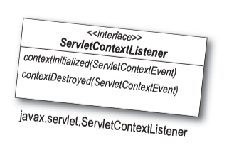

如何告诉容器已经为应用建立了一个监听器? 也就是说如何注册监听器？在部署描述文件中使用`<listener>`元素：

```xml
<listener>
    <listener-class> </listener-class>
</listener>
```

当有多个监听器时，监听器启动顺序和声明顺序相同，监听器销毁顺序和声明顺序相反。

    
    
常见的监听器


| 场景 | 监听器接口 | 时间类型 |
| --- | --- | --- |
| 你想知道一个Web应用上下文中是否增加、删除或替换了一个属性 | `ServletContextAttributeListener` | `ServletContextAttributeEvent` |
| 你想知道有多少个并发用户。也就是说，你想跟踪活动的会话 | `HttpSessionListener` | `HttpSessionEvent` |
| 每次请求到来时你都想知道，以便建立日志记录 | `ServletRequestListener` | `ServletRequestEvent` |
| 增加、删除或替换一个请求属性时你希望能够知道 | `ServletRequestAttributeListener` | `ServletRequestAttributeEvent` |
| 你有一个属性类(这个类表示的对象放在一个属性中)，而且你希望这个类型的对象在绑定到一个会话或从会话删除时得到通知 | `HttpSessionBindingListener` | `HttpSessionBindingEvent` |
| 增加、删除或替换一个会话属性时你希望能够知道 | `HttpSessionAttributeListener` | `HttpSessionBindingEvent` |
| 你想知道是否创建或撤销了一个上下文 | `ServletContextListener` | `ServletContextEvent` |
| 你哟一个属性类，而且希望这个类型的对象在其绑定的会话迁移到另一个JMV时得到通知 | `HttpSessionActivationListener` | `HttpSessionEvent` |

#### 属性

属性就是一个对象(例如上面例子中的dog对象)，可以设置到`ServletContext`, `HttpServletRequest`, `HttpSession`中，可以把它简单地认为是一个映射实例对象中的名/值对(name/value pair)。在实际中，我们并不知道也不关心它具体如何实现，我们关心的是属性所在的作用域：谁能看到这个属性，以及属性能存活多久。

!!! note "属性v.s.参数"
    属性和参数的区别
    
    |     | 属性 | 参数 |
    | --- | --- | --- |
    | 类型 | 上下文(Context)、请求(Request)、会话(Sesssion) | 应用/上下文初始化参数、请求参数、Servlet初始化参数 |
    | 设置方法 | `setAttribute(String name, Object value)` | 不能设置应用和Servlet初始化参数，只能在部署配置文件中设置 |
    | 返回类型 | `Object` | `String` |
    | 获取方法 | `getAttribute(String name)` | `getInitParameter(String name)` |


属性的三个作用域: 上下文、请求和会话，分别由`ServletContext`、`ServletRequest`和`HttpSession`接口处理。每个接口中对应属性的API完全相同：`getAttribute()`, `setAttribute()`, `removeAttribute()`, `getAttributeNames()`。

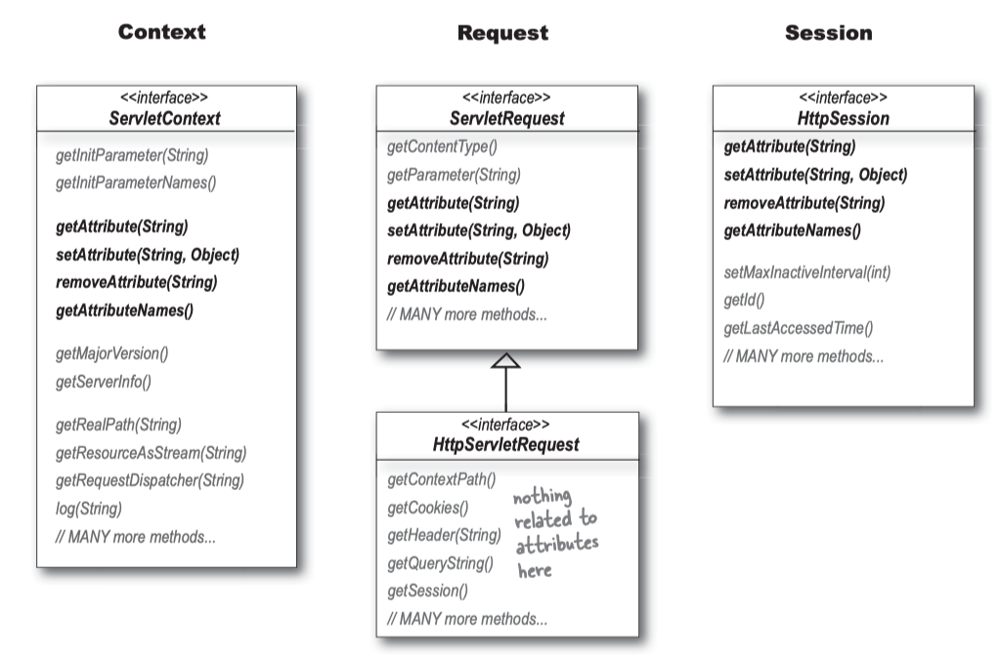

属性作用域的可访问性、作用域、适用环境：

| | 可访问性 | 作用域 | 适用于 |
| --- | --- | --- | --- |
| Context上下文 | Web应用的所有部分 | 部署应用的生命周期 | 希望整个应用共享的资源，包括数据库连接 |
| HttpSession会话  | 访问这个特定会话的所有servlet或JSP | 会话的生命周期 | 与客户会话有关的资源和数据，而不只是与单个请求相关的资源。只要与客户完成一个持续的会话。购物车就是一个典型的例子 |
| Request请求 | 应用中能直接访问请求对象的所有部分，主要是指使用RequestDispatcher将请求转发到的JSP和Servlet，另外还有与请求相关的监听者 | 请求的生命周期 | 将模型信息从控制器传递到试图 |


!!! example "一个简单的ServletContextListener"
    
    下面这个例子中，把String初始化参数转化为一个真正的对象——一个`Dog`。监听者的任务是得到有关狗的品种的上下文初始化参数，然后使用这个String来构造一个`Dog`对象。监听者再把这个`Dog`对象放到一个`ServletContext`属性中，以便servlet获取。
        
    `Dog` 例子：
        
    * 监听者对象向`ServletContextEvent`对象请求`ServletContext`对象的一个引用。
    * 监听者使用这个`ServletContext`引用得到“breed”的上下文初始化参数，这是一个String，表示狗的品种。
    * 监听者使用这个狗品种String构造一个`Dog`对象。
    * 监听者使用`ServletContext`引用在`ServletContext`中设置Dog属性。
    * 这个Web应用的测试servlet从`ServletContext`得到`Dog`对象，并调用这个`Dog`的`getBreed()`方法。
    
    一个需要三个类和一个部署描述文件：
        
    * `MyServletContextListener`实现了`ServletContextListener`，它得到上下文初始化参数，创建`Dog`，并把`Dog`设置为上下文属性；
    * `Dog`类由`MyServletContextListener`实例化，并设置在`ServletContext`中，以便servlet获取；
    * `ListenerTester`扩展了`HttpServlet`，它验证监听者，从上下文得到`Dog`属性，然后调用`Dog`的`getBreed()`，并把结果打印到响应。
    
    ```Java tab="Dog"
    public class Dog implements Serializable {
        private String breed;
        public Dog(String breed) {
            this.breed = breed;
        }
        
        public String getBreed() {
            return breed;
        }
        
        public String toString() {
            return String.format("A %s Dog.", breed);
        }
    }
    ```
    
    ```Java tab="ListenerTester"
    public class ListenerTester extends HttpServlet {
        protected void doGet(HttpServletRequest request, 
                HttpServletResponse response)
                throws ServletException, IOException {
            response.setContentType("text/html");
            ServletContext sc = getServletContext();
            Dog dog = (Dog) sc.getAttribute("dog");
            System.out.println(dog);
            PrintWriter out = response.getWriter();
            out.println(dog.getBreed());
        }
    }
    ```
        
    ```Java tab="MyServletContextListener"
    public class MyServletContextListener implements ServletContextListener {
        public void contextInitialized(ServletContextEvent sce) {
           ServletContext sc  = sce.getServletContext();
           String breedOfDog = sc.getInitParameter("breed");
           Dog dog = new Dog(breedOfDog);
           sc.setAttribute("dog", dog);
        }
        public void contextDestroyed(ServletContextEvent sce) {
            //do nothing here
        }
    }
    ```
    
    ```xml tab="web.xml"
    <?xml version="1.0" encoding="UTF-8"?>
    <web-app 省略>
        
        <servlet>
            <servlet-name>testListener</servlet-name>
            <servlet-class>com.headfirstservletsjsp.servlet.ListenerTester</servlet-class>
        </servlet>
        
        <servlet-mapping>
            <servlet-name>testListener</servlet-name>
            <url-pattern>/testListener</url-pattern>
        </servlet-mapping>
        
        <listener>
            <listener-class>com.headfirstservletsjsp.servlet.MyServletContextListener</listener-class>
        </listener>
        
        <context-param>
            <param-name>breed</param-name>
            <param-value>incredibleDog</param-value>
        </context-param>
    </web-app>
    ```

下面一个例子是经常遇见的网站功能，当用户在其他设备上登陆时，需要将前一个设备上登陆的页面注销，防止一个用户同时登陆多个设备，例如微信、QQ等软件都具备此功能。


```java tab="LoginSessionListener"
public class LoginSessionListener implements HttpSessionAttributeListener {
	
	private static final String LOGIN_USER="loginUser";

	@Override
	public void attributeAdded(HttpSessionBindingEvent hsbe) {
		String attrName = hsbe.getName();//监听到session属性值发生添加操作，获取对应操作的属性名
		
		if(LOGIN_USER.equals(attrName)){//若属性名为登录属性名，判定为用户登录操作
			String attrVal = (String)hsbe.getValue();//获取添加的属性值，即用户登录名
			HttpSession session = hsbe.getSession();//该次操作的session对象
			String sessionId = session.getId();//该次操作的session对象ID
			//从缓存对象里面，获得该用户登录名对应的sessionID值
			String sessionId2 = LoginCache.getInstance()
			         .getSessionIdByUsername(attrVal);
			if(null != sessionId2){//需要清理前次登录用户会话信息
				//获取前次该用户登录对应的session对象
				HttpSession session2 = LoginCache.getInstance()
				        .getSessionBySessionId(sessionId2);
				session2.invalidate();//清理前次登录用户会话存储信息，使得前次登录失效
			}
			//完成该次登录用户登录名、sessionID，session对象的缓存对象存储
			LoginCache.getInstance().setSessionIdByUserName(attrVal, sessionId);
			LoginCache.getInstance().setSessionBySessionId(sessionId, session);
		}
	}

	@Override
	public void attributeRemoved(HttpSessionBindingEvent arg0) {
	}

	@Override
	public void attributeReplaced(HttpSessionBindingEvent arg0) {
	}
}
```

```java tab="LoginCache"
public class LoginCache {
	private static LoginCache instance = new LoginCache();
	// key值：登录用户登录名，value值：登录用户sessionId
	private Map<String,String> loginUserSession = new HashMap<String,String>();
	//key值:登录用户sessionId,value值：登录用户session对象
	private Map<String,HttpSession> loginSession = new HashMap<String,HttpSession>();	
	private LoginCache(){	
	}
	public static LoginCache getInstance(){
		return instance;
	}
	
	// 通过登录名获取对应登录用户的sessionId
	public String getSessionIdByUsername(String username){
		return loginUserSession.get(username);
	}
	
	// 通过sessionId获取对应的session对象
	public HttpSession getSessionBySessionId(String sessionId){
		return loginSession.get(sessionId);
	}
	
	// 存储登录名与对应的登录sessionID至缓存对象
	public void setSessionIdByUserName(String username,String sessionId){
		loginUserSession.put(username, sessionId);
	}
	
	// 存储sessionId与对应的session对象至缓存对象
	public void setSessionBySessionId(String sessionId,HttpSession session){
		loginSession.put(sessionId, session);
	}

}
```

#### 属性和线程安全

**上下文作用域不是线程安全的**：应用中的每一部分都能访问上下文属性，所以可能有多个servlet，也就是说有多个线程

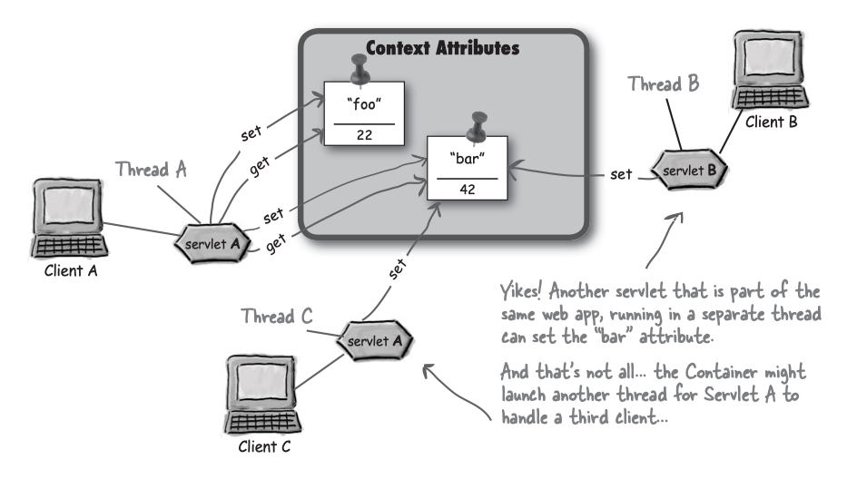

那么怎么解决呢？

同步`doGet()`等服务方法：同步服务方法可以防止同一个servlet中的其他线程访问上下文属性，但是不能阻止另外一个不同servlet的访问。例如上图中，如果线程A正在访问上下文属性，而且同步了服务方法，那么线程C不可以访问，但是线程B可以访问。

所以正确的方法不是对servlet加锁，而是需要对上下文加锁。

```java
public void doGet(HttpServletRequest request, HttpServletResponse response)
                        throws IOException, ServletException {
    response.setContextType("text/html");
    PrintWriter out = response.getWriter();
    synchronized(getServletContext()) { // 同步块：得到上下文锁
        getServletContext().setAttribute("foo", "42");
        out.println(getServletContext.getAttribute("foo"));
    }
}
```

那么会话属性是线程安全的吗？也不是，因为客户可能打开一个浏览器窗口。所以和上面的方法类似，要将`HttpSession`对象进行同步。

只有请求属性和局部变量是线程安全的。

实例变量也不是线程安全的。因为可以有多个客户对一个servlet作出请求，这意味着有多个线程在运行该servlet代码，而且所有线程都能访问servlet的实例变量。

!!! Summary "线程不安全的划上对勾"

    * [x] 上下文作用域属性
    * [x] 会话作用域属性
    * [ ] 请求作用域属性
    * [x] servlet中的实例变量
    * [ ] 服务方法中的局部变量
    * [x] servlet中的静态变量


### 6 会话管理

#### cookie

如何能跨多个请求保留客户特定的状态？使用`HttpSession`: `HttpSession`对象可以保存跨同一个客户<red>多个</red>请求的会话状态。换句话说，与一个特定客户的整个会话期间，`HttpSession`会持久存储。

容器怎么知道客户是谁？通过cookie作为唯一的会话ID（cookie具体请参见[计算机网络：自顶向下](../../OS/计算机网络 自顶向下/2 应用层.md#cookies)）。

容器几乎做了关于cookie的所有工作：

* 对于一个新会话，容器会生成会话ID、创建新的cookie对象、把会话ID放到cookie中、把cookie设置为响应的一部分等；
* 对于后续的请求，容器会从请求的cookie得到会话ID，将这个会话ID与现有的会话匹配，并把会话与当前请求关联。

无论在响应中<red>发送</red>一个会话cookie，还是从请求中得到会话ID，都只需要一个简单语句，余下的所有事情容器都帮你做好了：

```java
HttpSession session = request.getSession();
```

如果想知道会话是已经存在，还是刚刚创建的，可以访问`:::java session.isNew()`方法：

```Java
public void doGet(HttpServletRequest request, HttpServletResponse response)
                        throws IOException, ServletException {
    response.setContentType("text/html");
    PrintWriter out = response.getWriter();
    HttpSession session = response.getSession();
    if (session.isNew) out.println("This is a new session");
    else out.println("Welcome back!");
}
```

如果不能用cookie，即有的浏览器禁用了cookie怎么办呢？可以使用URL重写(url rewriting)：把会话ID附加到访问应用的各个URL的最后。


只有告诉响应要对URL编码(`encodeURL`)，URL重写才能奏效：

```Java
public void doGet(HttpServletRequest request, HttpServletResponse response)
                        throws IOException, ServletException {
    response.setContentType("text/html");
    PrintWriter out = response.getWriter();
    HttpSession session = response.getSession();
    out.println("<html><body>");
    out.println("<a href=\"" + response.encodeURL("/BeerTest.do") 
                    + "\"> click me </a>");
    out.println("</body></html>");
}
```

容器看到一个`getSession()`调用，而且没有从客户的请求得到会话ID，容器就知道它必须尝试与客户建立一个新的会话。此时，容器并不知道cookie是否工作，所以向客户返回第一个响应时，它同时尝试cookie和URL重写这两种做法。

静态页面不可能完成URL重写，使用URL重写只有一种可能，这就是作为会话的一部分的所有页面都是动态生成的。

#### 会话管理

如果一个会话太长时间都不活动，怎样识别并撤销这个会话？

会话有3种死法：超时、在会话对象上调用`:::Java invalidate()`，应用结束(崩溃或取消部署)。可以在部署配置文件中配置会话超时时间，例如设置为15分钟：

```xml
<session-config> 
    <sessioin-timeout>15</session-timeout>
</session-config>
```

可以调用会话对象的`setMaxInactiveInterval()`设置某个特定会话实例的超时: `:::java session.setMaxInactiveInterval(15*60);`(注意单位为秒)

#### 定制cookie

默认地，cookie与会话的寿命一样长：一旦客户离开浏览器，cookie就会消失。但也可以告诉cookie在客户端上待得更久一些，甚至在浏览器关闭之后还持久保存：

```java
// 创建一个新的Cookie
Cookie cookie = new Cookie("username", name);
// 设置cookie的存活时间：单位为秒
cookie.setMaxAge(30*60);
// 把cookie发送到客户
response.addCookie(cookie);
// 从客户得到cookie
Cookie[] cookies = request.getCookies();
```

!!! example
    下面的示例代码演示了如何利用Cookie登陆。`CookieUitls`类实现了Cookie的查找。`LoginServlet`类实现了登陆成功时，将当前用户的用户名保存到cookie中，在`login.jsp`页面中，获取客户端提供的cookie，再利用`CookieUitls`查找cookie，获取用户名。[完整代码](https://github.com/techlarry/Login)
    
    ```java tab="CookieUtils"
    // 从系列Cookie中查找特定的Cookie
    public class CookieUtils {
        public static Cookie findCookie(Cookie[] cookies ,String name){
            if (cookies != null)
                // 说明客户端携带Cookie:
                for (Cookie cookie : cookies) 
                    if(name.equals(cookie.getName()))
                        return cookie;
            return null;
        }
    }
    ```
    
    ```java tab="LoginServlet"
    public class LoginServlet extends HttpServlet {
        @Override
        protected void doGet(HttpServletRequest request, HttpServletResponse response)
                throws ServletException, IOException {
            // 接收数据
            String username = request.getParameter("username");
            String password = request.getParameter("password");
            // 从ServletContext域中获得保存用户信息集合
            List<User> list = (List<User>) (this.getServletContext().getAttribute("list"));
            for (User user : list) {
                // 判断用户名是否正确
                if (username.equals((user.getUsername()))) {
                    // 用户名是正确的
                    if (password.equals(user.getPassword())) {
                        // 密码正确，登陆成功
                        String remember = request.getParameter("remember"); // 判断复选框是否勾选
                        if ("true".equals(remember)) { // “记住”复选框勾选
                            // 记录用户名
                            Cookie cookie = new Cookie("username", user.getUsername());
                            cookie.setPath("/");
                            cookie.setMaxAge(60 * 60 * 24);  // cookie保存24小时
                            response.addCookie(cookie);
                        }
    
                        // 将用户的信息保存到session中
                        request.getSession().setAttribute("user", user);
                        response.sendRedirect("/success.jsp");
                        return;
                    }
                }
            }
            // 登陆失败
            System.out.println("login failure");
            request.setAttribute("msg", "用户名或密码错误！");
            request.getRequestDispatcher("/login.jsp").forward(request, response);
        }
    
    
        @Override
        protected void doPost(HttpServletRequest req, HttpServletResponse resp)
                throws ServletException, IOException {
            doGet(req, resp);
        }
    }
    ```
    
    ```java tab="login.jsp"
    	<%
    		String username = "";
    		// 获得从客户端携带过来的所有的Cookie
    		Cookie[] cookies = request.getCookies();
    		// 从Cookie的数组中查找指定名称的Cookie
    		Cookie cookie = CookieUtils.findCookie(cookies, "username");
    		if (cookie != null)
    		    username = cookie.getValue();
    		if (session.getAttribute("username") != null)
    			username = (String) session.getAttribute("username");
    
    		String msg = "";
    		if(request.getAttribute("msg") != null){
    			msg = (String)request.getAttribute("msg");
    		}
    	%>
    ```


#### 会话迁移


对于分布式Web应用，即应用的各个部分可以复制在网络中的多个节点上。在一个集群环境中，容器可能会完成负载均衡，客户的请求会发送到多个JVM上。这说明，每次客户请求时，最后有可能到达同一个servlet的不同实例。那么，ServletContext、ServletConfig、HttpSession对象会有什么变化呢？

* **只有HttpSession对象会从一个VM迁移到另一个VM**。
* 每个VM中有一个ServletContext。
* 每个VM上的每个Servlet有一个ServletConfig。
* 对于每个Web应用的一个给定的会话ID，只有一个HttpSession对象，而不论应用分布在多少个VM上。

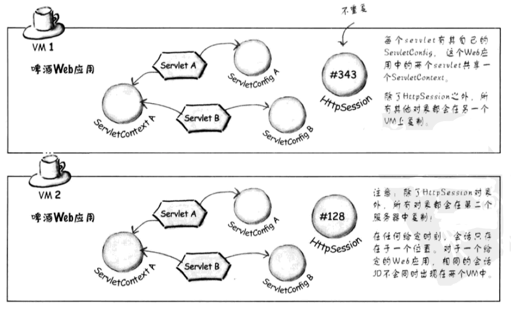

如果确保属性随着HttpSession迁移，那么属性需要实现`Serializable`接口，或者使用`HttpSessionActivationListener`。

```java
public interface Serializable {
    private void writeObject(java.io.ObjectOutputStream out)
        throws IOException
    private void readObject(java.io.ObjectInputStream in)
        throws IOException, ClassNotFoundException;
...
```

Serializable类实现了`ReadObject`和方法`WriteObject`，而`HttpSessionActivationListener`中的 `sessionDidActivate`和`sessionWillPassivate`方法与前者类似。

```java
public interface HttpSessionActivationListener {
    // Notification that the session has just been activated.
    void	 sessionDidActivate(HttpSessionEvent se) 
    // Notification that the session is about to be passivated.
    void	 sessionWillPassivate(HttpSessionEvent se) 
}
```

### 7 部署Web应用

一般使用Intellij IDEA开发工具开发并部署Web应用，详见[Intellij IDEA](../../Miscellaneous/Intellij IDEA.md)。


下面是给定资源放在Web应用中的位置：


| 资源类型 | 部署位置 |
| --- | --- |
| 部署描述文件(web.xml) | 直接放在WEB-INF文件夹下 |
| 可以直接访问的HTML和JSP | 放在Web的根目录下或者它的任何子目录下，但是不能放在WEB-INF目录及其子目录下 |
| 隐藏的HTML和JSP | 放在WEB-INF目录下 |
| Servlet类 | 必须放在与包结构匹配的一个目录结构里，置于WEB-INF/classes下的一个目录中 |
| JAR文件 | 必须放在WEB-INF/lib目录中 |

!!! note

    需要注意的是部署静态HTML和JSP时，在WEB-INF下的文件，不允许从Web应用外部访问，也就是不能在浏览器中输入资源的路径使服务器返回资源。


### 8 过滤器和包装器

过滤器也是Java组件，请求发送到servlet之前，可以用过滤器截获并处理请求；也可以在servlet结束工作之后，但在响应发回给客户之前，使用过滤器处理响应。

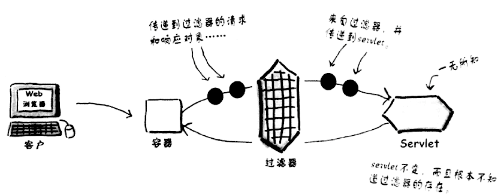

过滤器可以链接到一起，一个接一个地运行。过滤器并不关心在它前面运行了哪些过滤器，也不关心后面还会运行哪个过滤器。

#### 过滤器的生命周期

每个过滤器都必须实现`Filter`接口中的三个方法：

* `init()`: 完成调用过滤器之前的初始化任务
* `doFilter()`: 过滤器的真正功能在这里实现，例如记录用户名，压缩响应输出
* `destroy()`: 删除过滤器实例时调用，完成清理工作

!!! example
    为了提升啤酒应用，需要跟踪作出请求的用户。[代码](https://github.com/techlarry/HeadFirstJava/blob/master/src/com/headfirstservletsjsp/filter/BeerRequestFilter.java)
    ```java
    // 每个过滤器都必须实现Filter接口
    public class BeerRequestFilter implements Filter {
        private FilterConfig fc;
    
        public void init(FilterConfig config) throws ServletException {
            this.fc = config;
        }
    
        // doFilter中才做具体的工作，注意参数并不是HTTP请求和响应对象
        // 而只是常规的ServletRequest和ServletResponse对象
        public void doFilter(ServletRequest request, ServletResponse response,
                             FilterChain chain)  throws ServletException, IOException {
    
            // 强制转换为响应的HTTP请求和响应对象
            HttpServletRequest httpServletRequest = (HttpServletRequest) request;
            String name = httpServletRequest.getRemoteUser();
            if (name != null)
                fc.getServletContext().log("User " + name + " is updating");
            // 接下来要调用的过滤器
            chain.doFilter(request, response);
        }
    
        public void destroy() {
            // 通常这个方法都为空
        }
    }
    ```

过滤器生命周期：

* 当Web应用程序启动时，立即创建这个Web应用中的所有的过滤器，过滤器创建出来后立即调用`init()`方法执行初始化的操作。
* 创建出来后一直驻留在内存中为后续的拦截进行服务。每次拦截到请求后都会导致`doFilter()`方法执行。
* 在服务器关闭或web应用被移除出容器时，随着web应用的销毁，过滤器对象也销毁。销毁之前调用`destory()`方法执行善后工作.
    
#### FilterChain
    
过滤器链`FilterChain`知道过滤器执行的顺序，它的`doFilter()`方法负责明确接下来调用谁的`doFilter()`方法或者在链尾调用哪个servlet的`Service()`方法。过滤器的调用顺序取决于*过滤器在部署描述文件中的声明顺序*。

过滤器相互调用的过程，可以想象成栈上的方法调用。

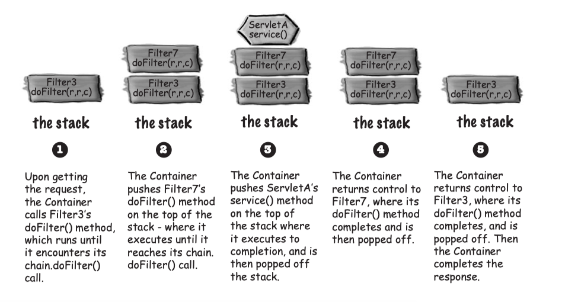


#### 配置过滤器

在部署描述配置文件中配置过滤器：

* 声明过滤器
* 将过滤器映射到想过滤的Web资源
* 创建过滤器调用序列

!!! example "BeerRequestFilter"

    在部署描述文件中配置`BeerRequestFilter`过滤器。
    
    ```java
    <filter>
        <filter-name>BeerRequest</filter-name>
        <filter-class>com.headfirstservletsjsp.filter.BeerRequestFilter</filter-class>
    </filter>
    
    <filter-mapping>
        <filter-name>BeerRequest</filter-name>
        <url-pattern>*.do</url-pattern>
    </filter-mapping>
    ```
    
当多个过滤器映射到一个给定资源时，容器会先找到与URL模式匹配的所有过滤器，按照部署描述文件中声明的顺序组成一个过滤器链。

#### 响应过滤器

响应过滤器，是指在servlet完成工作之后，在响应发送到客户之前，对象应做些处理。

一种简单的想法是，首先，完成与请求相关的工作，然后调用`chain.doFilter()`，最后当servlet工作结束之后，再对响应再做点工作，于是有以下伪代码：

```java
// 压缩过滤器伪代码
public void doFilter(request, response, chain) {
    // 处理请求
    chain.doFilter(request, response); // serlvet完成工作
    // 完成压缩
}
```

但是以上伪代码是错误的。因为容器并没有为过滤器把输出缓存起来，而是直接发回给客户，等到过滤器自己的`doFilter()`方调用时，已经为时已晚。

一种解决方案是，创建自己的实现`HttpServletResponse`的对象，并通过调用`chain.doFilter()`传递到servlet。

但是又遇到新的问题，那就是`HttpServletResponse`接口太复杂了，一共有十几个方法需要实现，那么怎么办呢？还好，有`HttpServletResponseWrapper`，它实现了`HttpServletResponse`，使用了[装饰器模式](../Head First设计模式/3 Decorator Pattern.md)(`HttpServletResponse`属于component, `HttpServletResponseWrapper`属于decorator)。

!!! example "响应压缩"

    实现压缩响应的过滤器，用一个压缩I/O流包装输出流; 当且仅当客户包含一个Accept-Encoding首部为gzip时，才会完成输出流的压缩。
    ```java
    public class ComporessionFilter implements Filter {
        private ServletContext servletContext;
        private FilterConfig filterConfig;
    
        // 保存配置对象，并保存servlet上下文对象的一个直接引用
        @Override
        public void init(FilterConfig filterConfig) throws ServletException {
            this.filterConfig = filterConfig;
            servletContext = filterConfig.getServletContext();
            servletContext.log(filterConfig.getFilterName() + " initialized.");
    
        }
    
        @Override
        public void doFilter(ServletRequest req, ServletResponse resp,
                             FilterChain chain) throws IOException, ServletException {
            HttpServletRequest request = (HttpServletRequest) req;
            HttpServletResponse response = (HttpServletResponse) resp;
            // 客户接收gzip压缩吗?
            String validEncodings = request.getHeader("Accept-Encoding");
            if (validEncodings.indexOf("gzip") > -1) { // 用一个压缩包装器包装响应对象
                // 使用定制包装器类包装响应
                CompressionResponseWrapper compressionResponse = new CompressionResponseWrapper(response);
                // 沿着过滤器链发送对象，链上的所有组件都不知道它们得到的响应对象是一个定制对象
                chain.doFilter(request, compressionResponse);
                // 声明响应内容用gzip格式编码
                compressionResponse.setHeader("Content-Encoding", "gzip");
                // 链接到下一个组件
                chain.doFilter(request, compressionResponse);
                // 结束压缩流，并刷新缓冲区
                GZIPOutputStream gzipOutputStream = 
                        compressionResponse.getGzipOutputStream();
                gzipOutputStream.finish();
                servletContext.log(filterConfig.getFilterName() + " finished the request.");
            } else {
                servletContext.log(filterConfig.getFilterName() + " no encoding performed.");
                chain.doFilter(request, response);
            }
        }
    
        @Override
        public void destroy() {
            // 实例变量设置为null
            servletContext = null;
            filterConfig = null;
        }
    }
    ```

#### 案例

!!! example "过滤器指定中文编码字符集"

    ```java tab="过滤器"
    /**
     * 字符集编码过滤器
     */
    public class CharacterEncodingFilter implements Filter {
    
        // 过滤器配置
    	private FilterConfig config;
        @Override
        public void init(FilterConfig config) throws ServletException {
            this.config = config;
        }
    
    	@Override
    	public void doFilter(ServletRequest request, ServletResponse response,
    	           FilterChain chain) throws IOException, ServletException {
          // 根据过滤器配置字符集，设置请求字符集编码
    		request.setCharacterEncoding(config.getInitParameter("charset"));
            chain.doFilter(request, response);
    	}
    
        @Override
        public void destroy() {
        }
    }
    ```
    
    ```xml tab="web.xml"
    <!-- 字符集编码过滤器配置 -->
    <filter>
    	<filter-name>characterEncodingFilter</filter-name>
    	<filter-class>filter.CharacterEncodingFilter</filter-class>
    	<init-param>
    		<param-name>charset</param-name>
    		<param-value>UTF-8</param-value>
    	</init-param>
    </filter>
    
    <filter-mapping>
    	<filter-name>characterEncodingFilter</filter-name>
    	<url-pattern>/*</url-pattern>
    </filter-mapping>
    ```

!!! example "实现系统用户登陆安全控制"

    ```java tab="过滤器"
    public class SessionFilter implements Filter {
    	@Override
    	public void init(FilterConfig config) throws ServletException {
    	}
    
    	@Override
    	public void doFilter(ServletRequest request, ServletResponse response, FilterChain chain)
    			throws IOException, ServletException {
    		HttpServletRequest hrequest = (HttpServletRequest) request;
    		HttpServletResponse hresponse = (HttpServletResponse) response;
    		String loginUser = (String) hrequest.getSession().getAttribute("loginUser");
    		if (loginUser == null)
    			hresponse.sendRedirect(hrequest.getContextPath() + "/index.jsp?flag=1");
    		else
    			chain.doFilter(hrequest, hresponse);
    	}
    
    	@Override
    	public void destroy() {
    	}
    }
    ```
    
    ```xml tab="web.xml"
    <!-- 用户登录安全控制过滤器配置 -->
    <filter>
    	<filter-name>sessionFilter</filter-name>
    	<filter-class>filter.SessionFilter</filter-class>
    </filter>
    
    <filter-mapping>
    	<filter-name>sessionFilter</filter-name>
    	<url-pattern>/message.jsp</url-pattern>
    </filter-mapping>
    ```


### 9 常见项目

本节讲述了主要利用JSP和Servlet技术实现常见的Web开发项目和技术。

#### 单点登录

**单点登录**(Single Sign On，简称SSO)，是目前比较流行的企业业务整合的解决方案之一。SSO是指在多个应用系统中，用户只需要登录一次就可以访问所有相互信任的应用系统。举例来说，豆瓣网站上有豆瓣FM、豆瓣读书、豆瓣电影、豆瓣日记等多种应用，如果我们访问豆瓣读书、豆瓣电影、豆瓣日记都需要进行一次登录认证，那么用户体验是非常不好的，而实现了单点登录的话，只需要一次登录就可以访问所有相互信任的应用系统。

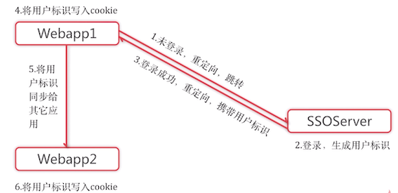


首先，新建三个Web Application，名为WebApp1, WebApp2, SSO_server

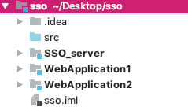


#### 购物车