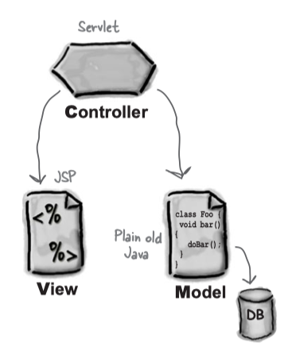

### 1 前言


#### HTML速成指南

详见[HTML5参考手册](http://www.w3school.com.cn/html5/html5_reference.asp)

| 标记 |  描述 |
| --- | --- |
| `<!-- -->` | 在这里加注释 |
| `<a>` | 通常用来放一个超链接 |
| `<align>` | 对内容左对齐、右对齐、居中，或调整行距 |
| `<body>` | 定义文本体的边界 |
| `<br>` | 行分隔 |
| `<center>` | 将内容居中 |
| `<form>` | 定义一个表单 |
| `<h1>` | 一级标题 |
| `<head>` | 定义文档首部的边界 | 
| `<html>` | 定义HTML文档的边界 |
| `<input type>` | 在表单中定义一个输入组件 |
| `<p>` | 一个新段落 |
| `<title>` | HTML文档的标题 | 


#### 单靠Web服务器


如果需要动态页面，而且希望能够把数据保存到服务器上，只依靠Web服务器是不够的。Web服务器应用只提供静态页面。需要CGI或者Servlet这样的辅助应用生成非静态的即时页面，而且能够与Web服务器通信。

也就是说即时页面在请求到来之前并不存在，请求到来后，辅助应用写出HTML，Web服务器再把这个HTML交回给客户。

### 2 Web应用体系结构

Servlet没有`main()`方法。它们受控于另一个Java应用，这个Java应用称为容器(如[Tomcat](http://tomcat.apache.org) )。如果Web服务器应用(如Apache)得到一个指向某servlet的请求，此时服务器不是把请求交给servlet本身，而是交给部署该servlet的容器。要由容器向servlet提供HTTP请求和响应，而且要由容器调用servlet的方法(如`doPost`/`doGet`)。


容器能提供什么？

* 通信支持：无需建立ServerSocket、监听端口、创建流，就能轻松让servlet与Web服务器对话。
* 生命周期管理：容器控制servlet的生与死，负责加载类、实例化和初始化servlet、调用servlet方法。
* 多线程支持：自动为每个servlet请求创建一个新线程。
* 声明方式实现安全：可以使用XML部署描述文件来配置安全性，而不必将其硬编码写到servlet或其他类代码中。也就是说不用修改Java源文件、不用重新编译就能管理和修改配置。
* JSP支持：负责把JSP代码翻译成Java代码。


#### 部署描述文件

部署描述文件(DD，一般为`web.xml`)可以将URL映射到servlet。

```xml
<servlet>  // 将内部名映射到完全限定类名
    <servlet-name>HelloWorld</servlet-name>
    <servlet-class>com.headfirstservletsjsp.servlet.HelloWorld</servlet-class>
</servlet>

<servlet-mapping> // 将内部名映射到公共URL名
    <servlet-name>HelloWorld</servlet-name>
    <url-pattern>/hello</url-pattern>  // 公共URL名，客户看到的
</servlet-mapping>
```

部署描述文件有以下优点：

* 尽量少改动已经测试过的源代码
* 即使你手上并没有源代码，也可以对应用的工程进行调整
* 不用重新编译和测试任何代码，也可以让应用适用不同的资源(如数据库)
* 可以更容易地维护动态安全信息，如访问控制列表和安全角色


### 3 MVC模式

MVC即**模型-视图-控制器**(model-view-controller)模式。MVC就是把业务逻辑从servlet中抽出来，把它放在一个模型中。所谓模型就是一个可重用的普通Java类。模型是业务数据和处理该数据的方法的组合。




* 控制器(Controller) - 负责转发请求，对请求进行处理。
* 视图(View) - 界面设计人员进行图形界面设计。
* 模型(Model) - 程序员编写程序应有的功能（实现算法等等）、数据库专家进行数据管理和数据库设计(可以实现具体的功能)。


### 4 Servlet请求和响应

#### 生命周期


Servlet生命周期中三大重要时刻

| 时刻 | 何时调用  | 作用 | 是否覆盖 |
| --- | --- | --- | --- |
| `init()` | servlet实例创建后，并在servlet能为客户请求提供服务之前，容器要对servlet调用`init()` | 使你在servlet处理客户请求之前有机会对其初始化 | 有可能。如果有初始化代码(如得到一个数据库连接，或向其他对象注册)，就要覆盖servlet类中的`init()方法`。|
| `service()` | 第一个客户请求到来时，容器会开始一个新线程，并调用servlet的`service()`方法 | 查看请求，确定HTTP方法(GET, POST等), 并在servlet上调用对应的方法。 | 不应该覆盖`service()`方法 |
| `doGet()`/`doPost()` | `service()`方法根据请求的HTTP方法来调用`doGet()`或`doPost()` | 你的Web应用想要做什么，就要由这个方法负责 | 至少要覆盖其中之一 |
| `destroy()` | 需要释放内存或者容器关闭时 | 关闭数据库连接、停止后台线程等 | 一般不覆盖  |

第一个客户请求到来时，容器会开始一个线程，并调用servlet的`service()`方法。后续客户请求到来时，容器再创建或找到另一个线程，并调用servlet的`service()`方法。也就是**容器运行多个线程来处理对一个servlet的多个请求**。


#### 加载和初始化

容器找到servlet类文件时，servlet的生命周期开始。这基本上都是在容器启动时发生(例如，运行Tomcat时)。容器启动时，它会寻找已经部署的Web应用，然后开始搜索servlet类文件。

第二步是加载类，这可能在容器启动时发生，也可能在第一个客户使用时进行。

**`init()`总是在第一个`service()`调用之前完成**。

servlet初始化后产生`ServletConfig`对象和`ServletContext`对象：

* `ServletConfig`对象
    * 每个servlet都有一个`ServletConfig`对象
    * 用于向servlet传递部署时信息，当你不想把这个信息硬编码到servlet中(servlet初始化参数），如数据库名
    * 用于访问`ServletContext`
    * 参数在部署描述文件中配置
* `ServletContext`对象
    * 每个Web应用有一个`ServletContext`
    * 用于访问Web应用参数 
    
#### 请求
    
GET请求本质上讲是幂等的。它们应当能多次运行而不会对服务器产生任何副作用。GET请求不应该修改服务器上的任何东西。

POST本质上讲不是幂等的，所以要适当地设计和编写代码，如果客户错误地把一个请求发送了两次，应该能正确地加以处理。

简单的超链接往往意味着GET请求：

```html
<a href="http://baidu.com"> click here </a>
```

如果在表单中明确说`method="POST"`，那么毫无疑问这就是一个POST请求。如果在表单`<form>`中没有说`method="POST"`，就会默认为GET请求。

```html
<form method="POST" action=SelectBeer.do">
```

`request.getParameter(parameterName)`返回单个参数，返回值总是个String。如果对应一个给定的参数名有多个参数值，要使用`request.getParameterValues(parameterName)`方法来返回一个String数组。

从请求对象还可以得到其他东西，包括首部、cookie、会话、查询串和输入流：

| 方法 | 详细信息 |
| --- | --- |
| `request.getHeader("User-Agent")` | 客户的平台和浏览器信息 |
| `request.getCookies()` | 与请求相关的cookie |
| `request.getSession()` | 与客户相关的会话session |

    
#### 响应

`javax.servlet.ServletResponse`接口示意：


大多数情况下，使用响应只是为了向客户发送数据，会对响应response调用两个方法：`setContentType()`和`getWriter()`。在此之后，只需要完成I/O即可。

`setContentType()`设置了HTTP首部中的内容类型：告诉了浏览器返回类型，浏览器会采取相应的操作：例如，打开PDF阅读器或者视频播放器，或者呈现HTML，又或者把响应的字节保存为一个下载文件。

`ServletResponse`接口提供了两个流用于输出：`ServletOutputStream`用于输出字节, `PrintWriter`用于输出字符数据。

```Java
// 把文本数据打印到一个字符流
PrintWriter writer = response.getWriter();
writer.println("some text and HTML");

// 写其他的任何内容
ServletOutputStream out = response.getOutputStream();
out.write(aByteArray);
```

重定向：当确定无法完成工作以后，servlet可以调用重定向方法`sendRedirect()`:

```Java
if (worksForMe) {
    // handle the request
} else {
    response.sendRedirect("http://www.oreilly.com");
}
```

请求分派：当servlet讲请求该给Web应用的另一部分(例如，JSP)。

```Java
RequestDispatcher view = 
    request.getRequestDispatcher("result.jsp")
view.forward(request, response);
```

请求分派(详见下一章)在服务器端发生，而重定向在客户端进行。请求分派把请求传递给服务器上的另一个组件(通常在同一个Web应用中)。请求重定向只是告诉浏览器去访问另一个URL。


### 5 Servlet属性和监听者