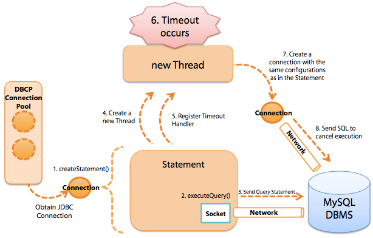

### 1 概述

[JDBC](https://www.oracle.com/technetwork/java/javase/jdbc/index.html)指Java DataBase Connectivity(Java数据库连接)，是一种标准Java应用程序接口(JAVA API)，用来连接Java应用程序和广泛的数据库。在使用JDBC前后，程序的架构如下变化：


#### API详解

JDBC API主要有以下几个：

* `Driver`：驱动接口，不同数据库提供自己的驱动实现，用户使用时注册指定的驱动实现。推荐使用`Class.forName()`的方式注册。
* `DriverManager`：驱动管理器，用来管理驱动，以及创建连接。
* `Connection`：连接对象，与数据库的连接会话，用来执行sql语句并返回结果。使用`DriverManager.getConnection()`创建新连接。
* `Statement`：sql语句执行的具体对象，用户发送简单的sql(不含参数)。子接口`PreparedStatement`，用于发送含有一个或多个参数的sql语句。
* `ResultSet`：数据库返回的数据集


下面以MySQL为例，介绍JDBC的具体用法：


**Driver**

* 注册驱动：`Class.forName("com.mysql.jdbc.Driver")` (`Class`用法详见[Java编程思想](../Java编程思想/15 类型信息.md))

**DriverManager**

* 获得连接： `DriverManager.getConnection(url, username, password)`

其中的url写法为`"jdbc:mysql://ip_address:port/database_name"`

| 参数 | 解释 |
| --- | --- |
| `jdbc` | 协议 |
| `mysql` | 子协议 |
| `ip_address` | ip 地址 |
| `port` | 端口 |
| `database_name` | 数据库名称 |

如果数据库是本地的，url可以简写为："jdbc:mysql:///database_name"

**Connection**

创建执行SQL语句的对象 

| 语句  |   解释 |
| --- | --- |
| `connection.createStatement()`   |         执行SQL语句，有SQL注入的漏洞存在 |
| `connection.prepareStatement(String sql)` |  预编译SQL语句，防止SQL注入的漏洞 |
| `connection.prepareCall(String sql)` |  执行SQL中存储过程 |

进行事务的管理

| 语句  |   解释 |
| --- | --- |
| `setAutoCommit(boolean autoCommit)` |  设置事务自动提交 |
| `commit()`                         | 事务提交 |
| `rollback()`                          |  事务回滚 |

**Statement**

执行SQL语句

| 语句  |   解释 |
| --- | --- |
| `boolean: execute(String sql)`   |           执行SQL |
| `ResultSet: executeQuery(string sql)` |     执行SQL中的select语句 |
| `int: executeUpdate(String sql)`     |      执行SQL中的insert/update/delete语句 |

执行批处理操作

| 语句  |   解释 |
| --- | --- |
| `addBatch(String sql)` |  添加到批处理中 |
| `executeBatch()` | 执行批处理 | 
| `clearBatch()` |  清空批处理 |

**ResultSet**

* 根据不同的数据类型，使用getInt/Boolean/String(columnName)获取数据
　
ResultSet还提供了对结果集进行滚动的方法：

| 语句  |   解释 |
| --- | --- |
| `next()` | 移动到下一行 | 
| `Previous()` | 移动到前一行 |
| `absolute(int row)` | 移动到指定行 |
| `beforeFirst()` | 移动resultSet的最前面 |
| `afterLast()` | 移动到resultSet的最后面 |


**资源释放**

JDBC程序运行完成后，切记要释放程序在运行过程中，创建的那些与数据库进行交互的对象，例如`ResultSet`, `Statement`和`Connection`对象。特别是`Connection`对象，它是非常稀有的资源，用完后必须马上释放，如果`Connection`不能及时、正确的关闭

#### CRUD操作

CRUD操作具体是指Create添加数据/Read读取数据/Update修改数据/Delete删除数据四种操作。

!!! example "CURD操作示例"

    1. 创建数据库/表
        
    ```mysql
    create database jdbctest;
    use jdbctest;
    create table user (
        uid int primary key auto_increment,
        usernmae varchar(20), 
        password varchar(20),
        name varchar(20)
    );
    insert into user values (null, 'aaa', '111', 'jerry');
    insert into user values (null, 'bbb', '222', 'baby');
    ```
    
    2. 在程序中加载数据库驱动
    3. 建立连接
    4. 创建用于向数据库发送SQL的Statement对象
    5. 从代表结果集的ResultSet中取出数据
    6. 断开与数据库的连接，并释放相关资源
    
        
    
    ```java
    public void crudOperation() {
        Connection connection = null;
        Statement statement = null;
        ResultSet resultSet = null;
        try {
            // 注册驱动
            Class.forName("com.mysql.jdbc.Driver");
            // 获得连接
            connection = DriverManager.getConnection(
                    "jdbc:mysql:///jdbctest", "root", "!");
            // 获得执行SQL语句的对象
            statement = connection.createStatement();
            // 编写SQL语句，包括增删改查
            String insertSQL = "insert into user values 
                (null, '123', '3243', 'peek')";
            String updateSQL = "update user set username = 'peek', 
                    password = '345', name='pick' where uid = 4";
            String deleteSQL = "delete from user where uid = 2";
            String querySQL = "select * from user";
            // 执行SQL语句
            statement.executeUpdate(insertSQL);
            statement.executeUpdate(updateSQL);
            statement.executeUpdate(deleteSQL);
            resultSet = statement.executeQuery(querySQL);
            // 得到查询结果
            while (resultSet.next()) {
                int uid = resultSet.getInt("uid");
                String username = resultSet.getString("username");
                String password = resultSet.getString("password");
                String name = resultSet.getString("name");
                System.out.println(uid + "  " + username 
                            + "  " + password + " " + name);
            }
        } catch (Exception e) {
            e.printStackTrace();
        } finally {
            // 释放资源
            if (statement != null) {
                try {
                    statement.close();
                } catch (Exception e) {
                    e.printStackTrace();
                }
            }
            if (connection != null) {
                try {
                    connection.close();
                } catch (Exception e) {
                    e.printStackTrace();
                }
            }
        
            if (resultSet != null) {
                try {
                     resultSet.close();
                } catch (Exception e) {
                    e.printStackTrace();
                }
            }
        }
    }
    ```

#### JDBC工具类

使用以上方法进行JDBC操作，代码复杂，可以将JDBC的相关操作封装起来，下面是一个JDBCUtils的实现：

1. 通过属性文件进行配置
2. 有不同的释放资源方法

!!! example "JDBCUtils"
    ```java
    // JDBC工具类
    public class JDBCUtils {
        
        public static final String driverClass;
        public static final String url;
        public static final String username;
        public static final String password;
        
        static {
            // 加载属性文件并解析：
            Properties properties = new Properties();
            // 获得属性文件的输入流: 通常不采用FileInputStream方式，因为可能文件不是本地的
            InputStream inputStream = JDBCUtils.class.getClassLoader().getResourceAsStream("jdbc.properties");
            try {
                properties.load(inputStream);
            } catch (Exception e) {
                e.printStackTrace();
            }
            driverClass = properties.getProperty("driverClass");
            url = properties.getProperty("url");
            username = properties.getProperty("username");
            password = properties.getProperty("password");
        }
        /**
         * 注册驱动的方法
         * @throws ClassNotFoundException;
         */
        public static void loadDriver() throws ClassNotFoundException {
            Class.forName(driverClass);
        
        }
        
        // 获得连接
        public static Connection getConnection() throws Exception {
            loadDriver();
            Connection conn = DriverManager.getConnection(url, username, password);
            return conn;
        }
        
        // 释放资源的方法
        public static void release(Statement statement, Connection connection) {
            if (statement != null) {
                try {
                    statement.close();
                } catch (Exception e) {
                    e.printStackTrace();
                }
            }
            if (connection != null) {
                try {
                    connection.close();
                } catch (Exception e) {
                    e.printStackTrace();
                }
            }
        }
        
        // 释放资源的方法
        public static void release(ResultSet resultSet, Statement statement, Connection connection) {
            release(statement, connection);
            if (resultSet != null) {
                try {
                    resultSet.close();
                } catch (Exception e) {
                    e.printStackTrace();
                }
            }
        }
        
        public static void main(String[] args) {
            Connection connection = null;
            Statement statement = null;
        
            try {
                // 获得连接;
                connection = JDBCUtils.getConnection();
                // 创建执行SQL语句的对象
                statement = connection.createStatement();
                // 编写SQL
                String sql = "insert into user values 
                        (null, '123', '3454', 'fsadj')";
                // 执行SQL
                statement.executeUpdate(sql);
            } catch (Exception e) {
                e.printStackTrace();
            } finally {
                // 释放资源
                JDBCUtils.release(statement, connection);
            }
        }
        
    }
    ```


!!! note 

    `Class.getResourceAsStream()`与`ClassLoader.getResourceAsStream()`的区别:
    
    1. `Class.getResourceAsStream(String path)`: path 不以'/'开头时默认是从此类所在的包下取资源，以'/'开头则是从ClassPath(Src根目录)根下获取。其只是通过path构造一个绝对路径，最终还是由ClassLoader获取资源。 
    2. `Class.getClassLoader.getResourceAsStream(String path)` ：默认则是从ClassPath根下获取，path不能以'/'开头，最终是由ClassLoader获取资源。 
    3.` ServletContext.getResourceAsStream(String path)`：默认从WebAPP根目录下取资源，Tomcat下path是否以’/'开头无所谓，当然这和具体的容器实现有关。
 
 
#### SQL注入
 
**SQL注入**(SQL Injection)是一种常见的Web安全漏洞，攻击者利用漏洞可以访问或者修改数据。

攻击者已知用户名，但不知道密码，仍旧能登陆网站：

```java
public class SQLInjection {
    // 测试SQL注入漏洞的方法
    @Test
    public void injectionDemo() {
        boolean flag = SQLInjection.login("aaa' or '1=1" , "sjjihbdf");
        if (flag) System.out.println("Login sucessful!");
    }
    
    
    // 实现登陆功能：有SQL注入漏洞
    public static boolean login(String username, String password) {
        Connection connnection = null;
        Statement statement = null;
        ResultSet resultSet = null;
        try {
            connnection = JDBCUtils.getConnection();
            statement = connnection.createStatement();
            String sql = "select * from user where username = '" 
                    + username + "' and password = '" + password + "'";
            System.out.println("Statement: " + sql);
            resultSet = statement.executeQuery(sql);
            return resultSet.next();
        } catch (Exception e) {
            e.printStackTrace();
        } finally {
            JDBCUtils.release(resultSet, statement, connnection);
        }
        return false;
    }
}
```
    
程序运行结果：
    
```text
Statement: select * from user where username = 'aaa'
         or '1=1' and password = 'sjjihbdf'
Login successful!
```

由于优先处理AND子句，其次是OR子句(详见[SQL必知必会](SQL必知必会.md/#5)）。所以上述SQL语句就能选择出aaa的用户信息出来。

解决方法: 使用`connection.preparedStatement(sql)` [相关代码](https://github.com/techlarry/JavaProject/blob/master/src/com/database/jdbc/SQLInjection.java)

* 可以避免SQL注入的问题
* 对SQL进行预编译，从而提高数据库的执行效率
* 允许使用占位符的形式进行替换，简化sql语句的编写

```java
// 获得连接
connection = JDBCUtils.getConnection();
// 编写SQL
String sql = "select * from user where username = ? and password = ?";
// 预处理SQL
preparedStatement = connection.prepareStatement(sql);
// 设置参数
preparedStatement.setString(1, username);
preparedStatement.setString(2, password);
System.out.println("PreparedStatement: " +      
    preparedStatement.toString().split(":")[1]);
// 执行SQL语句
resultSet = preparedStatement.executeQuery();
```


#### 连接池

连接池是创建和管理一个连接的缓冲池的技术，这些连接准备好被任何需要它们的线程使用。

应用程序直接获取连接的缺点：用户每次请求都需要向数据库获得连接，而数据库创建连接通常需要消耗相对较大的资源，创建时间也较长。这样极大的浪费了数据库的资源，并且极易造成数据库服务器内存溢出。



[c3p0](https://www.mchange.com/projects/c3p0/)(JDBC3 Connection and Statement Pooling)


#### 例子：留言板

实现有留言板功能的网站，具有注册、登陆、留言等具体功能，使用了JSP、Servlet和JDBC等技术。[项目代码](https://github.com/techlarry/JDBCMessageBoard)


三层设计: servlet-service-dao
session与LocalCache
Filter解决用户登录验证
Filter解决数据传输乱码

表结构设计

```sql
create database message_board default character set utf8;
use message_board;

create table message (
    id bigint(20) not null auto_increment,
    user_id bigint(20) not null,
    username varchar(32) not null,
    title varchar(32) not null,
    content varchar(4096) not null,
    create_time datetime not null,
    primary key (id)
    ) engine=innodb auto_increment=24 default charset=utf8;

create table user
    (
    id bigint(20) not null auto_increment,
    username varchar(32) not null,
    password varchar(32) not null,
    real_name varchar(32) default null,
    birthday datetime default null,
    phone varchar(16) default null,
    address varchar(128) default null,
    primary key (id),
    unique key user_username (username)
    )
```


