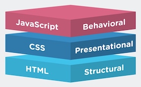
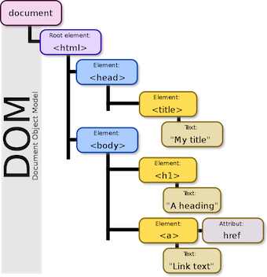

JavaScript是世界上最流行的脚本语言，用于为网页添加交互性，处理数据。

网页主要由三部分组成：**结构**(Structure), **表现**(Presentation)和**行为**(Behavior)。

* [HTML](HTML.md)---结构：网页的结构和内容;
* [CSS](CSS.md)---表现：设定网页的表现样式;
* [JavaScript](JavaScript.md)---行为：控制网页的行为。



### 1 基本用法

在HTML页面中插入JavaScript，要使用`<script>`标签。通常把需要提前加载的JavaScript放入`<head>`部分中(例如谷歌统计)，浏览器解析head部分就会执行这个代码。或者放在`<body>`底部(延迟加载js，提前加载文档)。也可以把JavaScript脚本放到外部文件中，并在`<script>`标签的`src`属性中设置该JS脚本：`<script src="demo.js"></script>`


!!! note
    
    那些老旧的实例可能会在`<script>`标签中使用`type="text/javascript"`。现在已经不必这样做了。JavaScript是所有现代浏览器以及HTML5中的默认脚本语言。
    
#### 输出

JavaScript可以通过不同的方式来输出数据：

* 使用`:::js window.alert()`弹出警告框
* 使用`:::js document.write()`方法将内容写到HTML文档中。
* 使用`:::js innerHTML`写入到HTML元素。
* 使用`:::js console.log()`写入到浏览器的控制台。

```javascript
window.alert("alert")
document.write("new info")
document.getElementById("demo").innerHTML="modified"
console.log("log info")
```

!!! note
    使用`:::js document.write()`仅仅向文档输出写内容。如果在文档已完成加载后执行`:::js document.write`，整个HTML页面将被覆盖。例如
    
    ```js
    <button onclick="myFunction()">点我</button> 
    <script> 
    function myFunction() { 
        document.write(Date()); 
    } 
    </script> 
    ```
    效果为：<button style="border:1px solid #aaa" onclick="myFunction()">点我</button>
    <script> 
    function myFunction() { 
        document.write(Date()); 
    } 
    </script> 
    
#### 数据类型

* 字符串(String): 字符组成的文本，可以使用单引号或双引号
* 数字(Number): 整数或者小数
* 布尔(Boolean): `true`或`false`
* 数组(Array): 使用`new Array()`或`[]`创建，下标从0开始
* 对象(Object): 在花括号内部，对象的属性以名值对(name: value)形式定义，用逗号分隔
* 空(Null): 通常用于清空变量
* 未定义(Undefined): 即由于目前没有定义，所以此处暂时没有任何值

可以使用`typeof`操作符来查看JavaScript变量的数据类型。


!!! Example
    ```javascript
    // var可以声明各种类型
    var x;                  // x 为undefined
    var y = 5;              // y 为数字
    var z = "John";         // z 为字符串
    var x1 = true;             // 布尔
    var y1 = false;            // 布尔
    // 数组
    var cars = new Array();
    cars[0] = "Saab";
    cars[1] = "Volvo";
    var cars = new Array("Saab","Volvo","BMW");
    var cars = ["Saab","Volvo","BMW"];
    // JavaScript 对象: 名值对
    var person={
    	firstname: "John", 
    	lastname: "Doe", 
    	id:5566
    };
    // 对象属性值的寻址方式
    name = person.lastname;
    name = person['lastname'];
    // typeof
    typeof "John" // 返回string
    ```

!!! note "变量均为对象"
    JavaScript变量均为对象。当声明一个变量时，就创建了一个新的对象。在声明新变量时，也可以使用关键字`:::js new`来声明其类型：
    
    * `:::javascript var carname = new String;`
    * `:::javascript var x = new Number;`

#### 注释

JavaScript中的注释方式有以下两种：

使用`//`注释当前行的代码，也可以使用多行注释`/*开始，通过*/`来注释代码。

```javascript
// This is an in-line comment.
/* This is a 
 multi-line comment */
```


#### 函数 

在JavaScript中，函数即对象，是由事件驱动的或者当它被调用时执行的可重复使用的代码块。其语法格式为：

```js
function functionName(var1, var2) {
    //执行代码
    return x;
}
```

#### 条件

在JavaScript中，可以使用以下条件语句：

* `if...else if....else`语句: 选择多个代码块之一来执行
* `switch`语句: 表达式的值会和每个`case`的值做比较，如果存在匹配，则与该`case`关联的代码块会被执行。使用`break`来阻止代码自动向下一个case运行。

!!! Example "条件示例"
    ```js tab="If"
    var a = 1;
    if (a < 6) {
    } else if(a > 8){
    	console.log('a > 8执行了~~');
    } 
    ```
    
    ```js tab="switch"
    var day = new Date().getDay();
    switch (day) {
        case 0:
          x = "Today it's Sunday";
          break;
        case 1:
          x = "Today it's Monday";
          break;
        default:
          x = "Other Day";
    }
    ```


#### 循环

JavaScipt的循环语句基本和C++一致，可以使用`for`循环和`while`循环。其中`for`循环的语法为:

```js
for (语句 1; 语句 2; 语句 3) {        
  被执行的代码块        
}
```

* 语句 1 (代码块)开始前执行 starts.
* 语句 2 定义运行循环(代码块)的条件
* 语句 3 在循环(代码块)已被执行之后执行

`for/in`语句用于循环遍历对象的属性。

`while`循环会在指定条件为真时循环执行代码块。其语法为

```js
while (条件) {
    需要执行的代码
}
```

!!! Example "循环示例"
    ```js tab="For"
    for (var i = 0; i < 5; i++) 
        x = x + "The number is " + i + "<br>"; 
    var person = {fname:"John", lname:"Doe", age: 25};
    for (x in person)
        txt = txt + person[x];
    ```
    
    ```js tab="While"
    var count = 1;
    while (count < 10){
        count++;
        console.log('执行while循环');
    }
    ```
  
JavaScript `break`和 `continue`语句:   

* `break`语句用于跳出循环。
* `continue`用于跳过循环中的一个迭代。

#### 运算符 

JavaScipt的运算符基本和C++/Java一致。但是有些地方需要注意：

!!! note "等于运算符"

    ` ==`代表等于，`===`代表**绝对等于**。当进行双等号比较时候： 先检查两个操作数数据类型，如果相同，则进行`===`比较，如果不同，则进行一次类型转换，转换成相同类型后再进行比较， 而`===`比较时，如果类型不同，直接就是`false`。例如：
        
    ```js
    5 == '5' // true
    5 === '5' // false
    ```
   
#### 类型转换

[JavaScript 数据类型转换](https://www.w3cschool.cn/javascript_guide/javascript_guide-2dg6268m.html#toc4)

当JavaScript尝试操作一个"错误"的数据类型时，会自动转换为"正确"的数据类型。

```js   
// 1. 不同类型的数据互相运算
123 + 'abc' // "123abc"

// 2. 对非布尔值类型的数据求布尔值
if ('abc') {
  console.log('hello')
}  // "hello"

// 3. 对非数值类型的数据使用一元运算符（即“+”和“-”）
+ {foo: 'bar'} // NaN
- [1, 2, 3] // NaN
```

#### javascript:void(0)

`void`指定要计算一个表达式的值但是不返回值。所以`javascript:void(0)`常用于没有指定网址的超链接

```html
<a href="javascript:void(0)">单击此处什么也不会发生</a>
```
   

### 2 内置对象

JavaScript中的所有事物都是对象：字符串、数值、数组、函数。JavaScript中的内置对象有`Array`, `String`, `Math`, `Date`等。

#### Array对象

创建JavaScript数组对象有多种方法：

* 空数组: `var Obj = new Array();`
* 指定长度数组： `var Obj = new Array(Size);`
* 指定元素数组: `var Obj = new Array(element1, element2,..., elementN);`
* 单维数组: `var Obj = [element1, element2,..., elementN];`
* 多维数组: `var Obj = new Array([array1], [array2],... [arrayN]);`


#### String对象
   
#### Math对象


Math对象的作用是执行常见的算数任务。常见的有`round()`, `random()`, `max()`, `min()`方法。

#### Date对象

### 3 DOM操作

#### DOM简介

当网页被加载时，浏览器会创建页面的**文档对象模型**(Document Object Model, DOM)。HTML DOM定义了用于HTML的一系列标准的对象，以及访问和处理HTML文档的标准方法。通过DOM，可以访问所有的HTML元素，连同它们所包含的文本和属性。





查找HTML元素：

* 通过id查找：`:::js document.getElementById();`(注意单复数)
* 通过标签名查找：`:::js document.getElementsByTagName();`
* 通过类名：`:::js document.getElementsByClassName();`

改变HTML内容：

* 改变元素内容：`:::js document.getElementById(id).innerHTML = newHTML`
* 改变元素属性：`:::js document.getElementById(id).attribute = newValue`
* 改变元素样式：`:::js document.getElementById(id).style.property=newStyle`   
* 改变类名： `:::js object.className = newClassName;`

!!! example
    ```js
    document.getElementById("header").innerHTML="New Header";
    document.getElementById("image").src="landscape.jpg";
    document.getElementById("p2").style.color="blue"; 
    ```
    
#### DOM节点

在文档对象模型(DOM)中，HTML文档中的所有内容都是节点：

* 整个文档是一个文档节点
* 每个元素是元素节点
* 元素内的文本是文本节点

HTML DOM将HTML文档视作树结构。这种结构被称为**节点树**。节点树中的节点彼此拥有层级关系：

* 在节点树中，顶端节点被称为根(root)
* 除了跟节点，每个节点都有父节点(parent)
* 一个节点可拥有任意数量的子节点(child)
* 同胞(sibling)是拥有相同符节点的节点


| 方法  | 描述 |
| --- | --- |
| append/remove/replaceChild() | 添加/删除替换/子节点 |
| createAttribute/Element/TextNode() | 创建属性/元素/文本节点 |
| get/set/removeAttribute() | 获取/设置/删除**属性值 |

!!! Example "增加p节点"
    ```js
    var p = document.createElement("p"); //相当于 <p></p>
    var word = document.createTextNode("我是新增的p标签");  // 文字内容：我是新增的p标签
    p.appendChild(word);  //<p>我是新增的p标签</p>： 把文字放到p标签里面
    var div1 = document.getElementById("div1");
    div1.appendChild(p);  
    ```


#### DOM事件

事件是可以被JavaScript侦测到的行为。HTML事件可以是浏览器行为，也可以是用户行为，以下是一些常见的HTML事件的列表：

| 事件 | 描述 |
| --- | --- |
| onchange | 元素改变 | 
| onclick | 点击元素 |
| onmouseover | 在元素上移动鼠标 |
| onmouseout | 从元素上移开鼠标 |
| onkeydown | 按下键盘按键 |
| onload | 完成页面加载 |
| onfocus | 当输入字段获取焦点时 |

HTML元素中可以添加事件属性：

```html
<some-element some-event="some javascript">
```        

!!! Example "按钮的onclick属性"
    ```html
    <button onclick='getElementById("demo").innerHTML=Date()'>The time is?</button>
    <p id="demo"> </p>
    ```
    实现效果： <button style="border-width:1px; border-style:solid; border-color:#aaa; border-radius: 5px; background-color:dodgerblue;" onclick='getElementById("demo").innerHTML=Date()'>The time is?</button><p id="demo"> </p>

DOM事件的不同写法：

* `:::js <div onclick="alert('helloworld')">按钮</div>`
* `:::js document.getElementById("id").onclick = function(){alert("id被触发了");}`
* 向指定元素添加事件句柄: `:::js document.getElementById("id").addEventListener("click", function(){ alert("hello world"); });`

### 4 高级特性

#### JS Window

所有浏览器都支持`window`对象。它表示浏览器窗口。

* 所有JavaScript全局对象、函数以及变量均自动成为`window`对象的成员。
* 全局变量是`window`对象的属性。
* 全局函数是`window`对象的方法。

`window`的子对象主要有`document`、`frames`、`history`(浏览器历史)、`location`(页面地址，端口，协议等)、`navigator`(访问者浏览器信息)、`screen`(用户屏幕信息)对象。


一些操作浏览器窗口的常用方法:

* `window.location.href()` - 调转到指定网址
* `window.location.reload()` - 刷新页面

#### 计时事件

JavaScript在一个设定的时间间隔之后来执行代码，称之为计时事件。使用计时事件的方法为：

* `setInterval("javascript function", milliseconds)`: 间隔指定的毫秒数不停地执行指定的代码；
* `setTimeout()`: 暂停指定的毫秒数后执行指定的代码；
* `clearInterval(intervalVariable)`用于停止`setInterval()`方法执行的函数代码。

### JS库

JavaScript攻击程序设计，通常很困难也很耗时，因此许多JavaScript库应运而生。这些JavaScript库常被称为JavaScript框架，常见的有[jQuery](jQuery.md)、Prototype、MooTools。


