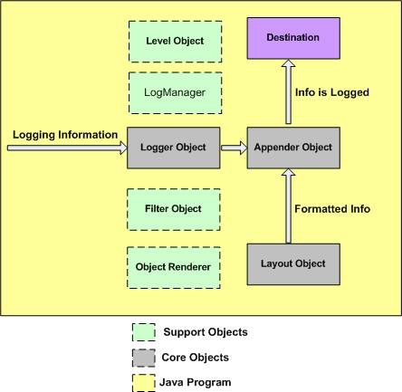

[Log4j](https://logging.apache.org/log4j/2.x/)

Log4j中有三个主要组成部分：

	
	
loggers: 负责捕获记录信息。
	
	
	
appenders : 负责发布日志信息，以不同的首选目的地。
	
	
	
layouts: 负责格式化不同风格的日志信息。




log4j.properties文件是一个键 - 值对保存 log4j 配置属性文件。默认情况下，日志管理在CLASSPATH 查找一个名为 log4j.properties 的文件。


```xml
<dependencies>  
    <dependency>  
        <groupId>org.apache.logging.log4j</groupId>  
        <artifactId>log4j-api</artifactId>  
        <version>2.7</version>  
    </dependency>  
    <dependency>  
        <groupId>org.apache.logging.log4j</groupId>  
        <artifactId>log4j-core</artifactId>  
        <version>2.7</version>  
    </dependency>  
</dependencies>
```

```java
import org.apache.logging.log4j.LogManager;
import org.apache.logging.log4j.Logger;

private static Logger logger = LogManager.getLogger(APIV1Filter.class);

logger.info(..);
logger.error(..)
```