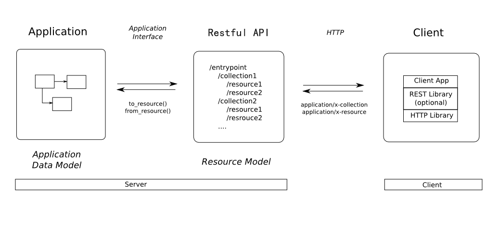

近几年来，以信息为中心的*表述性状态转移*(Representational State Transfer, REST)已成为替换传统SOAP WEB服务的流行方案。SOAP一般会关注行为和处理，而REST关注的是要处理的数据。

为了理解REST是什么，可以将它的首字母缩写拆分为不同的构成部分：

* 表述性(Representational): REST资源实际上可以用各种形式来进行表述，包括XML，JSON甚至HTML；
* 状态(State):当使用REST的时候，更关注资源的状态而不是对资源采取的行为；
* 转移(Transfer)：REST涉及到转移资源数据，它以某种表述性形式从一个应用转移到另一个应用。

更简洁的讲，REST就是将资源的状态以最适合客户端或服务端的形式从服务器端转移到客户端(或者反过来)。

在REST中，资源通过URL进行识别和定位。REST中会有行为，它们是通过HTTP方法来定义的。具体来讲，也就是GET、POST、PUT、DELETE等HTTP方法构成了REST中的动作。这些HTTP方法通常会匹配为如下的CRUD动作：

* CREATE: POST
* READ: GET
* UPDATE: PUT/PATCH
* DELTE: DELTE

下面以对记事的CRUD API的设计为例：

* 获取所有记事列表：GET /api/notes?page=1&per_page=20
* 获取某人的所有记事列表：GET /api/users/{uid}/notes
* 获取标记为星的记事：GET /api/users/{uid}notes?start=1
* 创建记事: POST /api/notes
* 删除某一个记事: DELETE /api/notes/{note_id}
* 更新某一个记事: PUT /api/notes/{note_id}

<hh>参考文献</hh>

1. [RESTful API Design: 13 Best Practices to Make Your Users Happy](https://blog.florimond.dev/restful-api-design-13-best-practices-to-make-your-users-happy)