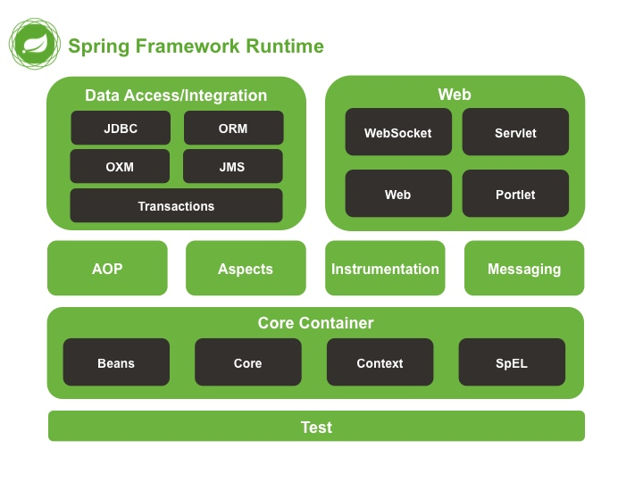
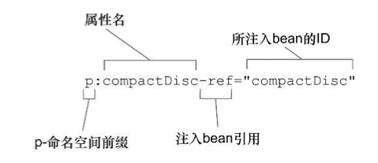
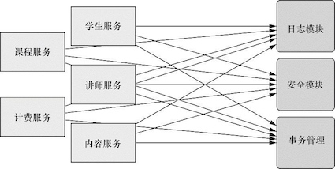
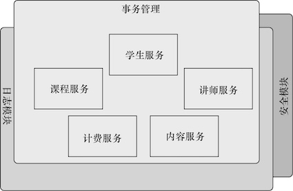
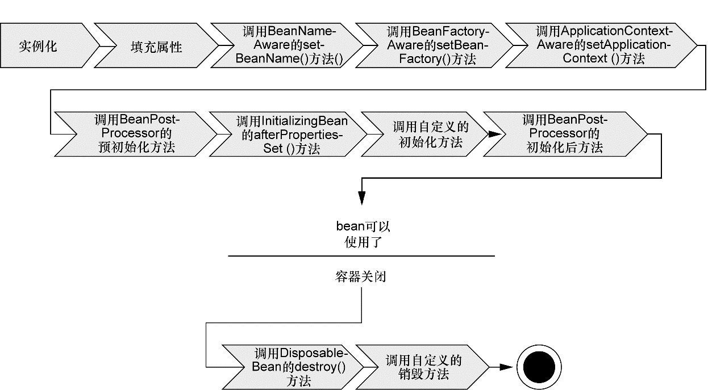
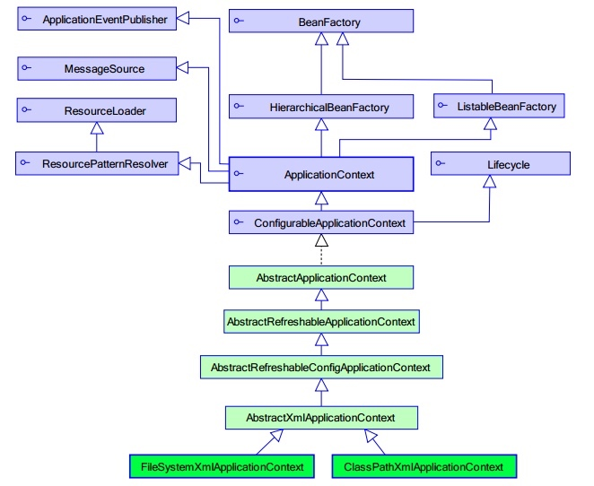

### 1 简介

[Spring](http://spring.io)是一个开源框架，为简化企业级应用开发而生，使用Spring可以让简单的JavaBean实现以前只有EJB才能实现的功能。

* 方便解耦，简化开发：可以将所有对象创建和依赖关系维护，交给Spring管理
* AOP编程的支持：可以方便地实现对程序进行权限拦截，运行监控等功能
* 声明式事务的支持：只需要通过配置就可以完成对事务的管理，而无需手动编程
* 方便程序的测试：支持Junit，也可以通过注解测试
* 方便继承各种优秀框架：提供了对各种优秀框架(structs, hibernate, mybatis)的直接支持
* 降低Java EE API的使用难度：对一些非常难用的API(JDBC, JavaMail, 远程调用等)，都提供了封装，使这些API应用难度大大降低

#### Spring模块




Spring核心容器：Spring 框架最核心的部分，它管理者Spring应用中bean的创建、配置和管理。


底层实现原理

通过配置文件+反射实现松耦合

#### 控制反转

**控制反转**(Inversion of Control, IOC)，是指将原本在程序中手动创建对象的控制权，交给Spring。

传统方式中，每个对象负责管理与自己相护协作的对象的引用，将会导致高度耦合且难以测试的代码。例如在`HelloTest`类中使用`UserService`类对象：

* 传统方式： `:::Java UserService userService = new Uservicmpl()`

* 使用控制反转的代码：

```java
public void demoIOC() {
    // 使用Spring工厂
    ApplicationContext applicationContext = new 
        ClassPathXmlApplicationContext("applicationContext.xml");
    // 通过工厂获得类
    UserService userService = 
        (UserService) applicationContext.getBean("userService");
    // 执行
    userService.sayHello();
}
```
    
#### 依赖注入
    

**依赖注入**(Dependency Injection, DI)：在Spring创建对象的过程中，将这个对象所依赖的属性注入进去。


对于类成员变量，注入方式有三种

* 构造函数注入：保证Bean实例在实例化后就可以使用，注入在<constructor-arg>元素里声明的属性
* 属性setter方法注入: 在<property>元素设置注入的属性
* 接口注入


p-命名空间属性是如何组成的。⾸先，属性的名字使⽤了“p: ”前缀，表明我们所设置的是⼀个属性。接下来就是要注⼊的属性名。最后，属性的名称以“-ref”结尾，这会提⽰Spring要进⾏装配的是引⽤，⽽不是字⾯量。


```xml
<!--Bean的构造方法的属性注入=============================-->
<bean id="user" class="com.spring.ioc.User">
    <constructor-arg name="name" value="张三" />
    <constructor-arg name="age" value="23"/>
</bean>

<!--Bean的set方法的属性注入==============================-->
<bean id="person2" class="com.spring.ioc.Person">
    <property name="name" value="小王"/>
    <property name="age" value="38"/>
    <property name="cat" ref="cat2"/>
</bean>

<bean id="cat2" class="com.spring.ioc.Cat">
    <property name="name" value="ketty"/>
</bean>

<!--Bean的p名称空间的属性注入==============================-->
<bean id="person3" class="com.spring.ioc.Person" 
    p:name="大黄" p:age="34" p:cat-ref="cat2"/>
```


复杂类型的注入

```xml tab="数组类型"
<property name="arrs">
    <list>
        <value>aaa</value>
        <value>bbb</value>
        <value>ccc</value>
    </list>
</property>
```

```xml tab="List集合的属性注入"
<property name="list">
    <list>
        <value>111</value>
        <value>222</value>
        <value>333</value>
    </list>
</property>
```

```xml tab="Set集合的属性注入"
<!--Set集合的属性注入-->
<property name="set">
    <set>
        <value>ddd</value>
        <value>eee</value>
        <value>fff</value>
    </set>
</property>
```

```xml tab="Map集合的属性注入"
<!--Map集合的属性注入-->
<property name="map">
    <map>
        <entry key="aaa" value="111"/>
        <entry key="bbb" value="222"/>
        <entry key="ccc" value="333"/>
    </map>
</property>
```

```xml tab="Properties集合的属性注入"
<!--Properties的属性注入-->
<property name="properties">
    <props>
        <prop key="username">root</prop>
        <prop key="password">1234</prop>
    </props>
</property>
```

Spring支持前两种


依赖注入会将所依赖的关系自动交给目标对象，而不是让对象自己去获取依赖。

创建应用组件之间的协作的行为通常称为装配(wiring)。Spring有多种装配bean的方式，采用XML是很常见的一种装配方式。

Spring通过应用上下文(Application Context)装载bean的定义并把它们组装起来。Spring应用上下文全权负责对象的创建和组装。


#### 面向切面编程

**面向切面编程**(aspect-oriented programming, AOP)允许你把遍布应用各处的功能分离出来形成可重用的组件。

系统由许多不同的组件组成，每一个组件各负责一块特定功能，除此之外还经常承担着额外的职责。诸如日志、事务管理、安全这样的系统服务(通常被称为*横切关注点*)经常会跨越多个组件。如果将这些关注点分散到多个组件中去，实现系统关注点功能的代码将会重复出现在多个组件中，还会因为那些与自身核心业务无关的代码而变得混乱。

例如下图左边的业务对象与系统级服务结合得过于紧密。每个对象不但要知道它需要记⽇志、进⾏安全控制和参与事务，还要亲⾃执⾏这些服务。



AOP能够使横切关注点模块化，并以声明的方式将它们应用到它们需要影响的组件中去。



#### 样板代码

样本代码(boilerplate code)指重复编写的代码。Spring旨在通过模板封装来消除样板式代码。Spring的JdbcTemplate使得执⾏数据库操作时，避免传统的JDBC样板代码成为了可能。


#### Spring容器

Spring的应用对象生存于Spring容器(Container)中，由Spring容器负责创建、装配、配置和管理对象的整个生命周期。Spring自带多个容器：

* bean工厂(BeanFactory)是最简单的容器，提供基本的DI支持;
* 应用上下文(ApplicationContext)基于BeanFactory构建，并提供应用框架级别的服务。

Spring自带了多种类型的应用上下文，最常用的有

* AnnotationConfigApplicationContext: 从一个或多个基于Java的配置类中加载Spring应用上下文
* AnnotationConfigWebApplicationContext: 从一个或多个基于Java的配置类中加载Spring Web应用上下文
* ClassPathXmlApplicationContext: 从类路径下的一个或多个XML配置文件中加载上下文定义，把应用上下文的定义文件作为类资源
* FileSystemXmlApplicationContext: 从文件系统下的一个或多个XML配置文件中加载上下文定义
* XmlWebApplicationContext: 从Web应用下的一个或多个XML配置文件中加载上下文定义。

下图展示了bean装载到Spring应用上下文中的一个典型的生命周期过程：



1. Spring对bean进⾏实例化；
2. Spring将值和bean的引⽤注⼊到bean对应的属性中； 
3. 如果bean实现了BeanNameAware接口，Spring将bean的ID传递给setBeanName()⽅法； 
4. 如果bean实现了BeanFactoryAware接口，Spring将调⽤setBeanFactory⽅法，将BeanFactory容器实例传⼊；
5. 如果bean实现了ApplicationContextAware接口，Spring将调⽤setApplicationContext()⽅法，将bean所在的应⽤上下⽂的引⽤传⼊进来；
6. 如果bean实现了BeanPostProcessor接口，Spring将调⽤它们的postProcesssBeforeInitialization()⽅法。
7. 如果bean实现了InitializingBean接口，Spring将调⽤它们的afterPropertiesSet()⽅法;类似地，如果bean使⽤init-method声明了初始化⽅法，该⽅法也会被调⽤；
8. 如果bean实现了BeanPostProcessor接口，Spring将调⽤它们的postProcessAfterInitalization()⽅法；
9. 此时，bean已经准备就绪，可以被应⽤程序使⽤了，它们将⼀直驻留在应⽤上下⽂中，直到该应⽤上下⽂被销毁；
10. 如果bean实现了DisposableBean接口，Spring将调⽤它的destroy()接口⽅法。同样，如果bean使⽤destroy-method声明了销毁⽅法，该⽅法也会被调⽤。

```java
public class Man implements BeanNameAware, ApplicationContextAware,
                InitializingBean, DisposableBean {
    private String name;
    public void setName(String name) {
        System.out.println("第二步：设置属性");
        this.name = name;
    }
    
    public Man(){
        System.out.println("第一步：初始化...");
    }
    public void setup(){
        System.out.println("第七步：MAN被初始化了...");
    }

    public void teardown(){
        System.out.println("第十一步：MAN被销毁了...");
    }

    @Override
    public void setBeanName(String name) {
        System.out.println("第三步：设置Bean的名称"+name);
    }

    @Override
    public void setApplicationContext(ApplicationContext applicationContext) throws BeansException {
        System.out.println("第四步：了解工厂信息");
    }

    @Override
    public void afterPropertiesSet() throws Exception {
        System.out.println("第六步：属性设置后");
    }

    public void run(){
        System.out.println("第九步：执行业务方法");
    }

    @Override
    public void destroy() throws Exception {
        System.out.println("第十步：执行Spring的销毁方法");
    }
}
```


### 2 装配Bean

在Spring中，对象无需自己查找或创建与其所关联的其他对象，容器负责把需要相护协作的对象引用赋予各个对象，创建应用对象之间的协作关系的行为通常被称为**装配**(wiring)。

Spring提供了三种主要的装配机制：

* 在XML中进行显式配置
* 在Java中进行显式配置
* 隐式的bean发现机制和自动装配


建议尽可能地使用自动配置的机制

#### XML装备bean


```java tab="bean"
public class Bean1 {
    public Bean1(){
        System.out.println("Bean1被实例化了...");
    }
}

public class Bean2 {

}

public class Bean2Factory {
    public static Bean2 createBean2(){
        System.out.println("Bean2Factory的方法已经执行了...");
        return new Bean2();
    }
}

public class Bean3 {

}

public class Bean3Factory {
    public Bean3 createBean3(){
        System.out.println("Bean3Factory执行了...");
        return new Bean3();
    }
}

```

```java tab="demo"
public class SpringDemo2 {
    @Test
    public void demo1(){
        // 创建工厂
        ApplicationContext applicationContext = new 
            ClassPathXmlApplicationContext("applicationContext.xml");
        // 通过工厂获得类的实例:
        Bean1 bean1 = (Bean1)applicationContext.getBean("bean1");
    }

    @Test
    public void demo2(){
        // 创建工厂
        ApplicationContext applicationContext = new 
            ClassPathXmlApplicationContext("applicationContext.xml");
        // 通过工厂获得类的实例:
        Bean2 bean2 = (Bean2)applicationContext.getBean("bean2");
    }

    @Test
    public void demo3(){
        // 创建工厂
        ApplicationContext applicationContext = new 
            ClassPathXmlApplicationContext("applicationContext.xml");
        // 通过工厂获得类的实例:
        Bean3 bean3 = (Bean3)applicationContext.getBean("bean3");
    }
}
```

```xml tab="配置"
<!--第一种：无参构造器的方式-->
<bean id="bean1" class="com.spring.ioc.xmlbean.Bean1"/>
<!--第二种：静态工厂的方式-->
<bean id="bean2" class="com.spring.ioc.xmlbean.Bean2Factory" factory-method="createBean2"/>
<!--第三种：实例工厂的方式-->
<bean id="bean3Factory" class="com.spring.ioc.xmlbean.Bean3Factory"/>
<bean id="bean3" factory-bean="bean3Factory" factory-method="createBean3"/>
```


bean的配置：

id和name

* 一般情况下，装配一个Bean时，通过指定一个id属性作为Bean的名称
* id属性在IOC容器中必须时唯一的
* 如果Bean的名称中含有特殊字符，就需要使用name属性，例如"/bean1"

class用于设置一个类的完全路径名称，主要作用是IOC容器生成类的实例


<hh>作用域</hh>

Bean的作用域，使用scope属性配置

| 类别 | 说明 |
| --- | --- |
| singleton  | 默认的作用域，在整个应用中，只创建bena的一个实例 |
| prototype | 每次注入或者通过Spring应用上下文获取的时候，都会创建一个新的bean实例 |
| request  | 为每个请求创建一个bean实例 |
| session | 为每个绘画创建一个bean实例 |


#### 自动化装配bean

Spring从两个角度来实现自动化装配：

* 组件扫描(component scanning): Spring会自动发现应用上下文中所创建的bean
* 自动装配(Autowiring): Spring自动满足bean之间的依赖

@Component注解表明该类会作为组件类，并告知Spring要为这个类创建bean。@ComponentScan注解会启动组件扫描。也通过XML来启动组件扫描，使用SpringContext命名空间的`<context:component-scan>`元素。





除了@Component外，Spring提供了3个功能基本和@Component等效的注解

* @Repository用于对DAO实现类进行标注
* @Service用于对Service实现类进行标注
* @Controller用于对Controller实现类进行标注

自动装配会在Spring应用上下文中寻找匹配的某个bean需求的其他bean。Spring的@Autowired注解，可以用在构造器上进行实例化，也可以用在属性的Setter方法上。


```java
@Component
public class CDPlayer implements MediaPlayer {
    private CompactDisc cd;
    
    @Autowired
    public CDPlayer(CompactDisc cd) {
        this.cd = cd;
    }
    
    public void play() {
        cd.play();
    }
    
    @Autowired
    public void setCompactDisc(CompactDisc cd) {
        this.cd = cd;
    }
}
```

并在ApplicationContext.xml文件中配置开启注解扫描

```xml
<!--开启注解扫描=======================-->
<context:component-scan base-package="..."/>
```

Spring初始化bean或销毁bean时，有时需要作一些处理工作，因此Spring可以在创建和拆卸bean的时候调用bean的两个生命周期方法。可以使用@PostConstruct做一些初始化，使用@PreDestory做一些销毁前的工作。

```java
@Component("bean1")
public class Bean1 {
    @PostConstruct
    public void init(){
        System.out.println("initBean...");
    }
    public void say(){
        System.out.println("say...");
    }
    @PreDestroy
    public void destroy(){
        System.out.println("destroyBean...");
    }
}
```


#### 使用Spring表达式语言进行装配

Spring 3引⼊了Spring表达式语⾔（Spring Expression Language，SpEL）， 它能够以⼀种强⼤和简洁的⽅式将值装配到bean属性和构造器参数中，在 这个过程中所使⽤的表达式会在运⾏时计算得到值。


```xml
<!--Bean的SpEL的属性注入==============================-->
<bean id="category" class="com.spring.ioc.Category">
    <property name="name" value="#{'服装'}"/>
</bean>

<bean id="productInfo" class="com.spring.ioc.ProductInfo"/>

<bean id="product" class="com.spring.ioc.Product">
    <property name="name" value="#{'男装'}"/>
    <property name="price" value="#{productInfo.calculatePrice()}"/>
    <property name="category" value="#{category}"/>
</bean>
```


