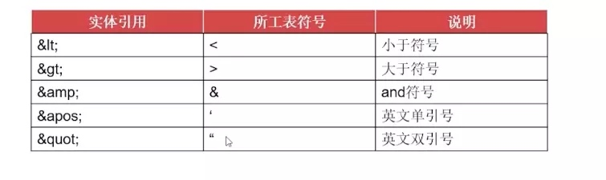
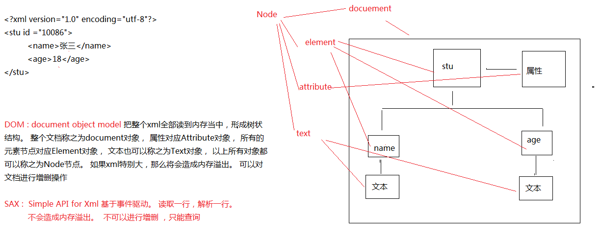

**XML**(Extensible Markup Language, 可扩展标记语言), 它允许开发者自由定义标签，可以将标签和内容有效分离。XML不侧重于数据如何展示，而是更多地关注数据如何存储和传输。

XML的应用场景

* XML把数据从HTML分离出来
* 简化数据共享
* 简化数据的传输
* 简化平台的变更

XML的优势

* 简单易用的标记语言
* 严格的格式
* 数据逻辑和显示逻辑分离


### XML文档规则


#### 定义XML

其实就是一个文件，文件的后缀为`.xml`

#### 文档声明

* 简单声明，version: 解析这个xml的时候，使用什么版本的解析器解析
    * <?xml version="1.0" ?>
* encoding: 解析xml中的文字的时候，使用什么编码来翻译
    * <?xml version="1.0" encoding="gbk" ?>
* standalone : no - 该文档会依赖关联其他文档, yes - 这是一个独立的文档
    * <?xml version="1.0" encoding="gbk" standalone="no" ?>
	       
#### 元素定义(标签)

1.  其实就是里面的标签，<>括起来的都叫元素, 成对出现。如`<stu> </stu>`
2.  文档声明下来的第一个元素叫做**根元素**(根标签)
3.  标签里面可以嵌套标签
4.  空标签
 	
```xml
<!-- 既是开始也是结束。 一般配合属性来用。-->
	<age/>


	<stu>
		<name>张三</name>
		<age/>
	</stu>
```

XML标签可以自定义(与HTML不同)， 但XML元素必须遵守以下命名规则：

* 名称可以含字母、数字以及其他的字符 
* 名称不能以数字或者标点符号开始 
* 名称不能以字符 “xml”（或者 XML、Xml）开始 
* 名称不能包含空格 

命名尽量简单，做到见名知义。

#### 属性的定义

定义在元素里面， `<元素名称  属性名称="属性的值"></元素名称>`

```xml
<stus>
	<stu id="10086">
		<name>张三</name>
		<age>18</age>
	</stu>
	<stu id="10087">
		<name>李四</name>
		<age>28</age>
	</stu>
</stus>
```

#### XML注释

XML注释格式与HTML的注释一样，具体为`<!-- --> `。 

```xml	
<?xml version="1.0" encoding="UTF-8"?>
<!-- 
	//这里有两个学生
	//一个学生，名字叫张三， 年龄18岁， 学号：10086
	//另外一个学生叫李四  。。。
-->
```

注意：				

1. 不要把注释放在标签之内，否则，该文档不是一个格式良好的XML文档
2. 不要把注释放在XML声明之前，XML声明应该永远处于XML文档的第一行。
3. 不要在注释中使用双中划线(--)


#### 特殊字符	

字符数据：开始标签和结束标签之间的文本可以是任何Unicode字符，并且其间的任何字符都将忠实地传递XML处理程序。

特殊字符可以使用实体引用和CDATA两种方法。

**使用实体引用**

为了正确处理XML文档中的特殊字符，XML允许使用实体来表示这些特殊字符。 XML预置了5个实体引用，如表：



严格地讲，在 XML 中仅有字符 "<"和"&" 是非法的。省略号、引号和大于号是合法的，但是把它们替换为实体引用是个好的习惯。 

**使用CDATA标记**

CDATA指字符数据，CDATA区段中的文本会被解析器忽略。

在特殊标记CDATA下，所有的特殊字符，甚至是有效的元素都将被当成简单字符处理。即使是实体引用也会失去作用，变成纯文本。

语法：`<![CDATA[文本]]>	`	

例如: `:::xml <des><![CDATA[<a href="https://www.baidu.com">lala</a>]]></des>`

#### 换行符

3种换行符：			

1. Windows平台：回车符（CR）和换行符（LF）的组合存储换行
2. UNIX和Linux平台：以换行符（LF）存储换行
3. Macintosh平台：以回车符（CR）存储换行

XML统一换行符:(LF, `\n`)存储换行

有效的XML文档: 遵守了XML文档基本规则，并使用DTD或Schema定义了语义约束，而且也完全遵守了DTD或Schema所定义的语义约束的XML文档.

#### XML约束(了解)

如下的文档，属性的ID值是一样的。 这在生活中是不可能出现的。并且第二个学生的姓名有好几个。一般也很少。那么怎么规定ID的值唯一， 或者是元素只能出现一次，不能出现多次？ 甚至是规定里面只能出现具体的元素名字。 

```xml
<stus>
	<stu id="10086">
		<name>张三</name>
		<age>18</age>
		<address>深圳</address>
	</stu>
	<stu id="10086">
		<name>李四</name>
		<name>李五</name>
		<name>李六</name>
		<age>28</age>
		<address>北京</address>
	</stu>
</stus>
```

**DTD**

语法自成一派，早期出现，可读性比较差。 DTD可以引入，也可以直接嵌入。

1. 引入网络上的DTD

```xml
<!-- 引入dtd 来约束这个xml -->
<!--    文档类型  根标签名字 网络上的dtd   dtd的名称   dtd的路径
<!DOCTYPE stus PUBLIC "//UNKNOWN/" "unknown.dtd"> -->
```
2. 引入本地的DTD

```xml
<!-- 引入本地的DTD ： 根标签名字 引入本地的DTD  dtd的位置 -->
<!-- <!DOCTYPE stus SYSTEM "stus.dtd"> -->
```
2. 直接在XML里面嵌入DTD的约束规则

```xml
<!-- xml文档里面直接嵌入DTD的约束法则 -->
<!DOCTYPE stus [
	<!ELEMENT stus (stu)>
	<!ELEMENT stu (name,age)>
	<!ELEMENT name (#PCDATA)>
	<!ELEMENT age (#PCDATA)>
]>
   	
<stus>
	<stu>
		<name>张三</name>
		<age>18</age>
	</stu>
</stus>


	<!ELEMENT stus (stu)>: stus下面有一个元素 stu， 但是只有一个
	<!ELEMENT stu (name , age)> stu下面有两个元素 name， age顺序必须name-age
	<!ELEMENT name (#PCDATA)> 
	<!ELEMENT age (#PCDATA)>
	<!ATTLIST stu id CDATA #IMPLIED> stu有一个属性 文本类型， 该属性可有可无
```

元素的个数：

			＋　一个或多个
			*  零个或多个
			? 零个或一个
	
		属性的类型定义 
	
			CDATA : 属性是普通文字
			ID : 属性的值必须唯一


* `<!ELEMENT stu (name , age)>` 按照顺序来 
* `<!ELEMENT stu (name | age)>` 两个中只能包含一个子元素

**Schema**

Schema其实就是一个XML, 使用XML的语法规则, XML解析器可以方便地解析Schema，其目的是为了替代DTD。但是Schema 约束文本内容比DTD的内容还要多，所以目前也没有真正意义上的替代DTD。

#### XML命名空间

为什么使用命名空间：在同一份XML文档中可能出现多个同名的元素和属性——这多个同名的元素和属性具有不同的含义和作用，但如果我们不从语法上提供区别，则XML处理器无法区分它们。

语法：`xmlns[:prefix]="命名空间字符串"`

```xml
<计算机书籍 xmlns:muke="http://www.imooc.com">
    <muke:name>Thinking in Java</name>
    <作者 xmlns:author="http://xinhua.com">
        <author:name>小王</name>
    </作者>
    <价格>79.00</价格>
</计算机书籍>
```


### XML解析

XML解析的目的是获取元素里面的字符数据或者属性数据。

#### XML解析方式(面试常问)

在JAVA中，XML的解析方式有很多种，但是常用的有两种。

* DOM：W3C处理XML的标准API，是许多其它与XML处理相关的标准的基础
    * 应用最为广泛的XML处理方式
    * 直观、易于操作 
* SAX：使用了最少的系统资源和最快速的解析方式对XML处理提供了支持
    * 不需要将整个XML文档读入内存当中
    * 支持XPath查询呢
    * 十分复杂的API接口 

优缺点：DOM解析耗费时间，SAX解析繁琐
 


#### 针对这两种解析方式的API

一些组织或者公司， 针对以上两种解析方式， 给出的解决方案有哪些？

* jaxp： sun公司， 比较繁琐
* JDom, Dom4j， 使用比较广泛

Dom4j是dom4j.org出品的一个开源XML解析包，它的网站中这样定义：

> Dom4j is an easy to use, open source library for working with XML, XPath and XSLT on the Java platform using the Java Collections Framework and with full support for DOM, SAX and JAXP.

[Dom4J参考](https://blog.csdn.net/u011794238/article/details/42176211)

配置：添加Maven依赖为dom4j-dom4j-2.0.0(groupId-artifactId-version)

#### Dom4j基本用法

获取元素：

* `element.element("stu")` : 返回该元素下的第一个stu元素
* `element.elements()`: 返回该元素下的所有子元素。 

基本思路：

1. 创建`SaxReader`对象
2. 指定解析的xml
3. 获取根元素。
4. 根据根元素获取子元素或者下面的子孙元素

```Java
//1. 创建sax读取对象
SAXReader reader = new SAXReader(); //jdbc -- classloader
//2. 指定解析的xml源
Document document = reader.read(new File("stus.xml"));

//3. 得到元素
Element rootElement = document.getRootElement();//得到根元素
System.out.println(rootElement.getName());
rootElement.element("age"); //获取根元素下面的子元素age
rootElement.element("stu").element("age").getText();
//获取根元素下面的所有子元素-stu元素
List<Element> elements = rootElement.elements();
//遍历所有的stu元素
for (Element element : elements) {
    //获取stu元素下面的name元素
    String name = element.element("name").getText();
    String age = element.element("age").getText();
    String address = element.element("address").getText();
    System.out.println("name="+name +"==age+"+age+"==address="+address);
}
```


#### Dom4j的Xpath使用

Dom4j里面支持Xpath的写法。 Xpath其实是XML的路径语言，支持我们在解析XML的时候，能够快速的定位到具体的某一个元素。

1. 在查找指定节点的时候，根据XPath语法规则来查找
2. 后续的代码与以前的解析代码一样。

```Java
//1. 创建sax读取对象
SAXReader reader = new SAXReader(); //jdbc -- classloader
//2. 指定解析的xml源
Document document = reader.read(new File("stus.xml"));
// 3. 获取元素
Element rootElement = document.getRootElement();
// 获取的是第一个只返回一个。 
Element nameElement = 
    (Element) rootElement.selectSingleNode("//name");
System.out.println(nameElement.getText());
System.out.println("----------------");
//获取文档里面的所有name元素 
List<Element> list = rootElement.selectNodes("//name");
for (Element element : list)
	System.out.println(element.getText());
```