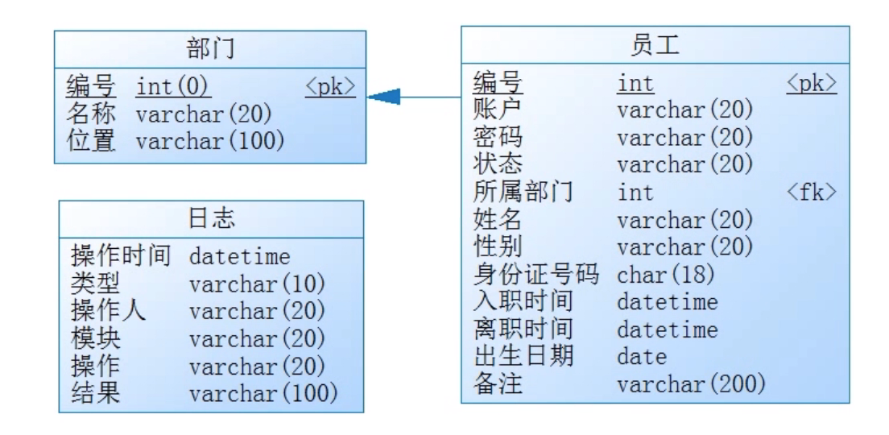

#### 数据库设计

数据库设计 


!!! note "Solution" 

    ```sql
    create database sm;
    
    use sm;
    create table department 
    (
        id int primary key auto_increment,
        name varchar(20) not null,
        location varchar(100)
    );
    
    create table log
    (
        operation_time datetime not null,
        type varchar(10) not null,
        operator varchar(20) not null,
        module varchar(20) not null,
        operation varchar(20) not null,
        result varchar(20) not null
    );
    
    
    create table staff 
    (
        id int primary key auto_increment,
        account varchar(20) not null,
        password varchar(20) not null,
        status varchar(20) not null,
        department_id int not null,
        name varchar(20) not null,
        sex char(2) not null,
        id_number char(18) not null,
        in_time datetime,
        out_time datetime,
        birthday date,
        comment varchar(200)
    );
    
    alter table staff add constraint fk_staff_dep
        foreign key (department_id) references department(id);
    ```


#### 创建项目
sm

- 父module
- 全局定义和组织


sm_service

- 持久层、业务层
- MyBatis依赖、Spring依赖

sm_web

- 表现层
- Servlet依赖   
    

 说的是 sdf