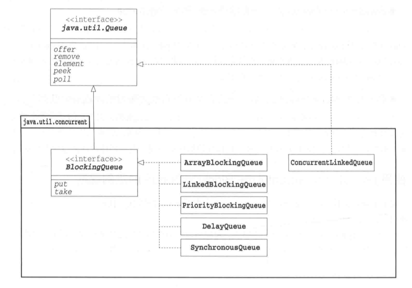

生产者消费者模式：生产者安全地将数据交给消费者。

### 示例程序

在示例程序中，有3位糕点师制作蛋糕并将其放到桌子上，然后有3位客人来吃这些蛋糕。

* 糕点师(MakerThread)制作蛋糕(String)，并将其放置到桌子(Table)上
* 桌子上最多可放置3个蛋糕
* 如果桌子上已经放满3个蛋糕时糕点师还要再放置蛋糕，必须等到桌子上空出位置
* 客人(EaterThread)取桌子上的蛋糕吃


```Java tab="MakerThread"
public class MakerThread extends Thread {
    private final Random random;
    private final Table table;
    private static int id = 0; // 蛋糕的流水号(所有糕点师共用)
    public MakerThread(String name, Table table, long seed) {
        super(name);
        this.table = table;
        this.random = new Random(seed);
    }
    public void run() {
        try {
            while (true) {
                Thread.sleep(random.nextInt(1000));
                String cake = "[ Cake No." + nextId() + 
                    " by " + getName() + " ]";
                table.put(cake);
            }
        } catch (InterruptedException e) {
        }
    }
    private static synchronized int nextId() {
        return id++;
    }
}
```

```Java tab="Table"
public class Table {
    private final String[] buffer;
    private int tail;  // 下次put的位置
    private int head;  // 下次take的位置
    private int count; // buffer中的蛋糕个数
    public Table(int count) {
        this.buffer = new String[count];
        this.head = 0;
        this.tail = 0;
        this.count = 0;
    }
    // 放置蛋糕
    public synchronized void put(String cake) 
                        throws InterruptedException {
        System.out.println(Thread.currentThread().getName() 
                        + " puts " + cake);
        while (count >= buffer.length) {
            wait();
        }
        buffer[tail] = cake;
        tail = (tail + 1) % buffer.length;
        count++;
        notifyAll();
    }
    // 取蛋糕
    public synchronized String take() 
                        throws InterruptedException {
        while (count <= 0) {
            wait();
        }
        String cake = buffer[head];
        head = (head + 1) % buffer.length;
        count--;
        notifyAll();
        System.out.println(Thread.currentThread().getName() 
                            + " takes " + cake);
        return cake;
    }
}
```

```Java tab="EaterThread"
public class EaterThread extends Thread {
    private final Random random;
    private final Table table;
    public EaterThread(String name, Table table, long seed) {
        super(name);
        this.table = table;
        this.random = new Random(seed);
    }
    public void run() {
        try {
            while (true) {
                String cake = table.take();
                Thread.sleep(random.nextInt(1000));
            }
        } catch (InterruptedException e) {
        }
    }
}
```

```Java tab="Main"
public class Main {
    public static void main(String[] args) {
        Table table = new Table(3);     // 创建一个能放置3个蛋糕的桌子
        new MakerThread("MakerThread-1", table, 31415).start();
        new MakerThread("MakerThread-2", table, 92653).start();
        new MakerThread("MakerThread-3", table, 58979).start();
        new EaterThread("EaterThread-1", table, 32384).start();
        new EaterThread("EaterThread-2", table, 62643).start();
        new EaterThread("EaterThread-3", table, 38327).start();
    }
}
```


#### ReentrantLock

生产者-消费者模式也可以用ReentrantLock实现，参见[操作系统概念](https://techlarry.github.io/wiki/OS/操作系统概念/7%20Synchronization%20Examples/#condition-variables).

#### BlockingQueue

`BlockingQueue`的实现类相当于生产者-消费者模式中的Channel角色。`BlockingQueue`接口表示的是在达到合适的状态之前线程一直阻塞(wait)的队列。



下面使用`ArrayBlockingQueue`来实现示例程序。

```Java
public class Table extends ArrayBlockingQueue<String> {
    public Table(int count) {
        super(count);
    }
    public void put(String cake) throws InterruptedException {
        System.out.println(Thread.currentThread().getName() 
                                            + " puts " + cake);
        super.put(cake);
    }
    public String take() throws InterruptedException {
        String cake = super.take();
        System.out.println(Thread.currentThread().getName() 
                                        + " takes " + cake);
        return cake;
    }
}
```

#### Exchanger

Exchanger类用于让两个线程安全地交换对象。ProducerThread向缓冲区充填字符，Consumer向缓冲区取出字符。

```Java hl_lines="18" tab="ConsumerThread" 
public class ConsumerThread extends Thread {
    private final Exchanger<char[]> exchanger;
    private char[] buffer = null;
    private final Random random;

    public ConsumerThread(Exchanger<char[]> exchanger, 
                                        char[] buffer, long seed) {
        super("ConsumerThread");
        this.exchanger = exchanger;
        this.buffer = buffer;
        this.random = new Random(seed);
    }

    public void run() {
        try {
            while (true) {
                // 交换缓冲区
                buffer = exchanger.exchange(buffer);
                // 从缓冲区中取出字符
                for (int i = 0; i < buffer.length; i++) 
                    Thread.sleep(random.nextInt(1000));
            }
        } catch (InterruptedException e) {
            e.printStackTrace();
        }
    }
}
```

```Java hl_lines="22" tab="ProducerThread"
public class ProducerThread extends Thread {
    private final Exchanger<char[]> exchanger;
    private char[] buffer = null;
    private char index = 0;
    private final Random random;

    public ProducerThread(Exchanger<char[]> exchanger, 
                                char[] buffer, long seed) {
        super("ProducerThread");
        this.exchanger = exchanger;
        this.buffer = buffer;
        this.random  = new Random(seed);
    }

    public void run() {
        try {
            while (true) {
                // 向缓冲区填充字符
                for (int i = 0; i < buffer.length; i++)
                    buffer[i] = nextChar();
                // 交换缓冲区
                buffer = exchanger.exchange(buffer);
            }
        } catch (InterruptedException e) {}
    }

    // 生成字符
    private char nextChar() throws InterruptedException {
        char c = (char)('A' + index % 26);
        index++;
        Thread.sleep(random.nextInt(1000));
        return c;
    }
}
```


