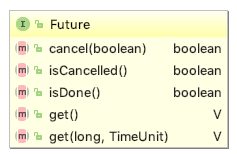

假设有一个方法需要花费很长时间才能获取运行结果。那么，与其一直等待结果，不如先拿一张“提货单”。这里的“提货单”就称为Future角色。

获取Future角色的线程会在稍后使用Future角色来获取运行结果。再Future模式中，程序一旦发出请求，就会立即获取返回值。

java.util.concurrent包提供了用于支持Future模式的类和接口。

java.util.concurrent.FutureTask类实现了Future接口，声明了用于获取值的get方法、用于中断运行的cancel方法、用于设置值的set方法，以及用于设置一场的setException方法。