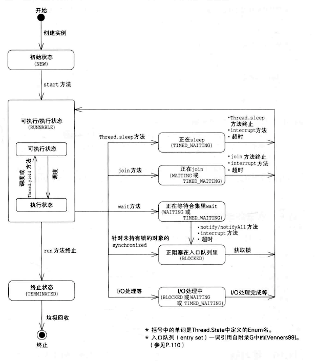

Java语言将“正在执行程序的主体”称之为线程。

* 处理流程始终如一条线的程序，称之为单线程程序(single threaded program)。
* 由多个线程组成的程序, 称之为多线程程序(multithreaded program).

#### 线程启动

`Thread.start()`用于启动新的线程。`Thead.run()`可以调用，但是并不会启动新的线程。`start()`主要执行以下操作：

* 启动新线程
* 调用`run()`方法

```Java
public synchronized void start() {
    // threadStatus = 0 表示新建线程
    if (threadStatus!=0) throw new IllegalThreadStateException();
    // 通知线程组，线程已经启动, 把线程加入线程组
    group.add(this);
    boolean started = false; // 已经启动了吗？
    try {
        start0();  // native方法，启动线程
        started = true;  // 已经启动
    } finally {
        try { // 启动失败
            if (!started) group.threadStartFailed(this);
        } catch (Throwable ignore) { // do nothing here}
    }
}
```

线程启动的方法有两种：

* 利用`Thread`类的子类的实力来启动线程
* 利用`Runnable`接口的实现类的实例启动线程
* `ThreadFactory`中的线程创建

前两种方法比较普遍，这里不再叙述。`ThreadFactory`是个接口:

```Java
public interface ThreadFactory {
    /**
     * Constructs a new {@code Thread}.  Implementations may also initialize
     * priority, name, daemon status, {@code ThreadGroup}, etc.
     *
     * @param r a runnable to be executed by new thread instance
     * @return constructed thread, or {@code null} if the request to
     *         create a thread is rejected
     */
    Thread newThread(Runnable r);
}
```

利用该接口，可以将`Runnable`作为传入参数，并通过`new`创建`Thread`实例。

```Java
public class SimpleThreadFactory implements ThreadFactory {
    public Thread newThread(Runnable r) {
        return new Thread(r);
    }
}
```

#### 线程暂停

`Thread.sleep()`方法能够暂停线程运行，会抛出`InterruptedException`异常。

```Java
public static native void sleep(long millis) 
                    throws InterruptedException;
```

#### 线程互斥处理

基本方法是使用`synchronized`关键字。如果声明一个方法时，在前面加上关键字 `synchronized`，那么这个方法每次只能由一个线程运行，这种方法称为synchronzied方法，或者*同步方法*。

当前线程是否已获取某一对象的锁可以通过`Thread.holdsLock()`方法来确认。

```Java
// Returns {@code true} if and only if the current thread 
//  holds the monitor lock on the specified object.
public static native boolean holdsLock(Object obj);
```

如果只是想让方法中的某一部分由一个线程运行，而非整个方法，可使用`synchronized`代码块：

```Java
synchronized (expression) {
    ...
}
```

其中的"expression"为获取锁的实例。


如下synchronized实例方法和synchronized代码块是等效的：

```Java
synchronized void method() {
    ...
}

void method() {
    synchronized (this) {
        ...
    }
}
```

也就是说，`synchronized`实例方法是使用`this`的锁来执行线程的。


synchronized静态方法和synchronized实例方法使用的锁是不一样的。synchronized静态方法相当于以下synchronized代码块:

```Java hl_lines="8"
class Something {
    // synchronized静态方法
    static synchronized void method() {
    ...
    }
    // synchronized代码块
    void method() {
        synchronized (Something.class) {
            ...
        }
    }
}
```

也就是说，synchronized静态方法是使用该类的*类对象*的锁来执行线程的互斥处理的。 `Something.class`是`Something`类对应的`java.long.class`类的实例。


#### 线程控制

Java提供了用于执行线程的`wait()`, `notify()`, 和`notifyAll()`方法。 `wait()`是让线程等待的方法，而`notify()`和`notifyAll()`是唤醒等待中的线程的方法。


所有实例都拥有一个等待队列，它是在实例的`wait()`方法执行后停止操作的线程的队列。在执行`wait()`后，线程便会暂停操作，进入等待队列，直到下列任意一种情况发生：

* 有其他线程的`notify()`·方法来唤醒线程
* 有其他线程的`notifyAll()`方法来唤醒线程
* 有其他线程的`interrupt()`方法来唤醒线程
* `wait()`方法超时

实例方法中的`wait()`和`this.wait()`含义相同，执行了`wait()`的线程将会进入this的等待队列中，这时可以说“线程正在this上wait".

若要执行`wait()`方法，线程必须持有锁。但如果线程进入等待队列，便会释放其实例的锁。

`notify()`方法会将等待队列中的一个线程取出。假如在执行`notify()`方法时，正在等待队列中等待的线程不止一个，对于”这时该如何来选择线程”这个问题规范中并没有做出规定，取决于Java平台运行环境。

`notifyAll()`方法会将等待队列中的所有线程都取出来。

如果未持有锁的线程调用`wait()`,`notify()`,`notifyAll()`，异常 `IllegalMonitorStateException`就会抛出。

!!! note
    
    该使用`notify()`方法还是`notifyAll()`方法呢？由于`notify()`唤醒一个线程，所以比较快，但如果处理不好，程序便可能会停止。一般来说使用`notifyAll()`的代码比使用`notify()`时更为健壮。


#### 线程的状态迁移

线程状态由`Thread.State`定义：

```Java
public enum State {
     //Thread state for a thread which has not yet started.
    NEW,
    // Thread state for a runnable thread. 
    RUNNABLE,
    // Thread state for a thread blocked waiting for a monitor lock.
    BLOCKED,
    // Thread state for a waiting thread.
    WAITING,
    // Thread state for a waiting thread with a specified waiting time.
    TIMED_WAITING,
    // Thread state for a terminated thread.
    TERMINATED;
}
```




