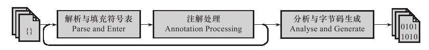

#早期（编译器）优化

### 1 概述

java的编译器可能指的以下三种：

1. **前端编译器**：将`*.java`文件变成`*.class`文件，例如Sun的Javac、Eclipse JDT中的增量式编译器（ECJ）。随后`.class`文件由Java虚拟机解释执行。
2. **JIT编译器**（Just In Time Compiler，即时编译器）：将**字节码**变成**机器码**，例如HotSpot VM的C1、C2编译器
3. **AOT编译器**（Ahead Of Time Compiler）：直接把`*.java`文件编译成**本地机器码**，例如GNU Compiler for the Java（GCJ）、Excelsior JET， ART (Android Runtime)

本文中涉及到的编译器都仅限于第一类，第二类编译器跟java语言的关系不大。javac这类编译器对代码的运行效率**几乎没有**任何**优化措施**，但javac做了许多针对java语言代码过程的优化措施来**改善**程序员的**编码风格**和**提高编码效率**，java许多的语法特性都是靠编译器的语法糖来实现的。

### 2 javac编译器

Sun javac编译器的编译过程可以分为3个过程：

* 解析与填充符号表过程
* 插入式注解处理器的注解处理过程
* 分析与字节码生成过程




### 3 java语法糖

#### 泛型与类型擦除

泛型的本质是**参数化类型**（Parametersized Type）的应用，也就是说所操作的数据类型被指定为一个参数。

java中的泛型**只在程序源码中存在**，在编译后的字节码文件中，已经替换为原来的原生类型（Raw Type），并在相应的地方插入了强制转型代码。因此，对于运行期的java语言来说，`ArrayList<int>`与`ArrayList<String>`就是同一个类，所以泛型技术实际上时java语言的一种语法糖，java语言中的泛型实现方法称为**类型擦除**(type erase)，基于这种方法实现的泛型称为**伪泛型**。

!!! example "类型擦除"
    
    由于类型擦除，下面的代码却会报错:" Method listMethod(List<String>) has the same erasure listMethod(List<E>) as another method in type Foo"。
    
    ```java
    public class Foo {  
        public void listMethod(List<String> stringList){  
        }  
        public void listMethod(List<Integer> intList) {  
        }  
    }
    ```


#### 自动装箱、拆箱与遍历循环

自动装箱、自动拆箱与遍历循环这些语法糖是java语言里使用得最多的语法糖。

#### 条件编译

使用条件为常量的if语句，Java语言可以实现条件编译。

!!! example "条件编译"

    以下代码Java编译器会提示错误。
    
    ```java
    public class test {
        public static void main(String[] args) {
            //编译器将会提示error: unreachable statement
            while (false) {
                System.out.println("");
            }
        }
    }
    ```
