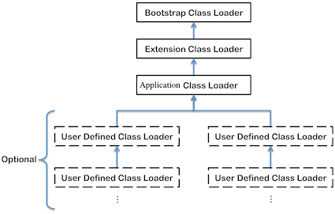

### 1 概述

虚拟机的类加载机制是指，虚拟机把描述类的数据从Class⽂件加载到内存，并对数据进⾏验证、 准备、解析、初始化等，最终形成可以被虚拟机直接使⽤的Java类型。

与那些在编译时需要进⾏链接的语⾔不同，在Java语⾔⾥⾯，类型的加载、链接和初始化过程都是在程序运⾏期间完成的，这种策略虽然会令类加载时稍微增加⼀些性能开销，但是会为Java应⽤程序提供⾼度的灵活性，Java天⽣可以动态扩展的语⾔特性就是依赖运⾏期动态加载和动态链接这个特点实现的。


### 2 类加载的时机

类从被加载到虚拟机内存中开始，到卸载出内存为⽌，它的整个⽣命周期包括：加载(Loading)、验证(Verification)、准备(Preparation)、解析(Resolution)、初始化(Initialization)、使⽤(Using)和卸载(Unloading)7个阶段。


对于初始化阶段，虚拟机规范严格规定了有且只有5种情况必须⽴即对类进⾏“初始化”：

* 遇到<C>new</C>、<C>getstatic</C>、<C>putstatic</C>或<C>invokestatic</C>这4条字节码指令时，如果类没有进⾏过初始化，则需要先触发其初始化。⽣成这4条指令的最常见的Java代码场景是：使⽤<C>new</C>关键字实例化对象的时候、读取或设置⼀个类的静态字段(被final修饰、已在编译期把结果放⼊常量池的静态字段除外)的时候，以及调⽤⼀个类的静态⽅法的时候。
* 使⽤<C>java.lang.reflect</C>包的⽅法对类进⾏反射调⽤的时候，如果类没有进⾏过初始化，则需要先触发其初始化。
* 当初始化⼀个类的时候，如果发现其⽗类还没有进⾏过初始化，则需要先触发其⽗类的初始化。
* 当虚拟机启动时，⽤户需要指定⼀个要执⾏的主类(包含<C>main()</C>⽅法的那个类)，虚拟机会先初始化这个主类。
* 当使⽤JDK 1.7的动态语⾔⽀持时，如果⼀个<C>java.lang.invoke.MethodHandle</C>实例最后的解析结果REF_getStatic、 REF_putStatic、REF_invokeStatic的⽅法句柄，并且这个⽅法句柄所对应的类没有进⾏过初始化，则需要先触发其初始化。

"有且只有"这5种场景中的⾏为称为对⼀个类进⾏**主动引⽤**。除此之外，所有引⽤类的⽅式都不会触发初始化，称为**被动引⽤**。


下面代码运⾏之后，只会输出"SuperClass init!"，⽽不会输出"SubClass init!"。可通过<C>-Xlog:class+load=info</C>打印类加载信息。

```Java
//被动使用类字段演示一：通过子类引用父类的静态字段，不会导致子类初始化
public class NotInitialization1 {
    public static void main(String[] args) {
        System.out.println(SubClass.value);
    }
}

class SuperClass {
    static {
        System.out.println("SuperClass init!");
    }
    public static int value = 123;
}

class SubClass extends SuperClass {
    static {
        System.out.println("SubClass init!");
    }
}
```

```Java
// 被动使用类字段演示二：通过数组定义来引用类，不会触发此类的初始化
public class NotInitialization2  {
    public static void main(String[] args) {
        SuperClass[] sca = new SuperClass[10];
    }
}
```


### 3 类加载的过程
#### 加载

 **Loading** is the process of finding the class file that represents the class or interface type with a particular name and reading it into a byte array. Next the bytes are parsed to confirm they represent a Class object and have the correct major and minor versions. Any class or interface named as a direct superclass is also loaded. Once this is completed a class or interface object is created from the binary representation.


加载是类加载(Class Loading)过程的⼀个阶段，虚拟机需要完成以下3件事情：

* 通过⼀个类的全限定名来获取定义此类的⼆进制字节流。
* 将这个字节流所代表的静态存储结构转化为⽅法区的运⾏时数据结构。
* 在内存中⽣成⼀个代表这个类的<C>java.lang.Class</C>对象，作为⽅法区这个类的各种数据的访问⼊口。

第一条中的获取二进制字节流可以从多个地方获取。例如ZIP包(JAR)，网络(Applet)，运行时计算生成(<C>java.lang.refelct.Proxy</C>)等。

#### 验证

验证是为了确保Class⽂件的字节流中包含的信息符合当前虚拟机的要求，并且不会危害虚拟机⾃⾝的安全。

虽然Java语⾔本⾝是相对安全的语⾔，但是Class⽂件并不⼀定要求⽤Java编译⽽来，它可以使⽤任何途径产⽣，甚⾄包括⽤⼗六进制编辑器直接编写来产⽣Class⽂件。虚拟机如果不检查输 ⼊的字节流，对其完全信任的话，很可能会因为载⼊了有害的字节流⽽导致系统崩溃。

* ⽂件格式验证：验证字节流是否符合Class⽂件格式的规范，并且能被当前 版本的虚拟机处理。
* 元数据验证：对字节码描述的信息进⾏语义分析，以保证其描述的信息符合Java语⾔规范的要求，

#### 准备

Preparing involves allocation of memory for static storage and any data structures used by the JVM such as method tables. Static fields are created and initialized to their default values, however, no initializers or code is executed at this stage as that happens as part of initialization.


准备阶段为类变量分配内存并设置类变量(仅包括被被static修饰的变量)初始值，这些变量所使⽤的内存都将在⽅法区中进⾏分配。实例变量将会在对象实例化时随着对象一起分配在Java堆中。初始值通常情况下是数据类型的默认值.

```Java
public static int value = 123; //初始值为0
```

如果类字段的字段属性表中存在ConstantValue属性，那在准备阶段变量value就会被初始化为ConstantValue属性所指定的值：

```Java
public static final int value = 123; // 初始值为123
```


#### 解析

解析阶段将常量池内的符号引⽤替换为直接引⽤。

**符号引⽤**(Symbolic References): 符号引⽤以⼀组符号来描述所引⽤的⽬标，符号可以是任何形式的字⾯量，只要使⽤时能⽆歧义地定位到⽬标即可。符号引⽤与虚拟机实现的内存布局⽆关，引⽤的⽬标并不⼀定已经加载到内存中。各种虚拟机实现的内存布局可以各不相同，但是它们能接受的符号引⽤必须都是⼀致的，因为符号引⽤的字⾯量形式明确定义 在Java虚拟机规范的Class⽂件格式中。

**直接引⽤**(Direct References): 直接引⽤可以是直接指向⽬标的指针、相对偏移量或是⼀个能间接定位到⽬标的句柄。直接引⽤是和虚拟机实现的内存布局相关的，同⼀个符号引⽤在不同虚拟机实例上翻译出来的直接引⽤⼀般不会相同。如果有了直接引⽤，那引⽤的⽬标必定已经在内 存中存在。


#### 初始化

Initialization of a class or interface consists of executing the class or interface initialization method <<C>clinit</C>>.


What is the difference between <<C>init</C>> and <<C>clinit</C>>? [StackOverflow](https://stackoverflow.com/questions/8517121/java-what-is-the-difference-between-init-and-clinit)

* <<C>init</C>> is the (or one of the) constructor(s) for the instance, and non-static field initialization.
* <<C>clinit</C>> are the static initialization blocks for the class, and static field initialization.

```Java
class X {

   static Log log = LogFactory.getLog(); // <clinit>

   private int x = 1;   // <init>

   X(){
      // <init>
   }

   static {
      // <clinit>
   }
}
```

### 4 类加载器


#### 类与类加载器

对于任意⼀个类，都需要由加载它的类加载器和这个类本⾝⼀同确⽴其在Java虚拟机中的唯⼀性，每⼀个类加载器， 都拥有⼀个独⽴的类名称空间。

⽐较两个类是否“相等”，只有在这两个类是由同⼀个类加载器加载的前提下才有意义，否则，即使这两个类来源于同⼀个Class⽂件，被同⼀个虚拟机加载，只要加载它们的类加载器不同，那这两个类就必定不相等。

不同的类加载器对<C>instanceof</C>关键字运算的结果的影响：

```Java
//类加载器与instanceof关键字演示
public class ClassLoaderTest {
    static class MyClassLoader extends ClassLoader {
        @Override
        public Class<?> loadClass(String name) throws ClassNotFoundException {
            try {
                String fileName = name.substring(name.lastIndexOf(".") + 1) 
                            + ".class";
                InputStream is = getClass()
                    .getResourceAsStream(fileName); // 找到class文件
                if (is == null)  return super.loadClass(name);
                byte[] b = new byte[is.available()];
                is.read(b);  // 读取class
                return defineClass(name, b, 0, b.length); // 转化为class实例
            } catch (IOException e) {
                throw new ClassNotFoundException(name);
            }
        }
    }

    public static void main(String[] args) throws Exception {
        MyClassLoader myClassLoader = new MyClassLoader();
        Object obj = myClassLoader
            .loadClass("com.unstandingJVM.ClassLoaderTest").newInstance();
        // 输出：class com.unstandingJVM.ClassLoaderTest
        System.out.println(obj.getClass());        
        //输出： false
        System.out.println(obj instanceof com.unstandingJVM.ClassLoaderTest);
    }
}
```

#### 双亲委派模型

从Java虚拟机的角度来讲，只存在两种不同的类加载器：⼀种是**启动类加载器**(Bootstrap ClassLoader)，这个类加载器使⽤C++语⾔实现 ，是虚拟机⾃⾝的⼀部分；另⼀种就是所有其他的类加载器，这些类加载器都由Java语⾔实现，独⽴于虚拟机外部，并且全都继承⾃抽象类 <C>java.lang.ClassLoader</C>。




* **Bootstrap Classloader**(启动类加载器): It is usually implemented as native code because it is instantiated very early as the JVM is loaded. It loads JDK internal classes, typically loads `rt.jar` and other core classes for example `java.lang.*` package classes.
* **Extension Classloader**(扩展类加载器): It loads classes from the JDK extensions directory, usually `$JAVA_HOME/lib/ext` directory.
* **System/Application Classloader**(应⽤程序类加载器): It loads classes from the current classpath that can be set while invoking a program using `-cp` or `-classpath` command line options.
* **User Defined Classloaders**(⾃定义类加载器): It can alternatively be used to load application classes. A user defined classloader is used for a number of special reasons including run time reloading of classes or separation between different groups of loaded classes typically required by web servers such as Tomcat.

```Java
public class ViewClassLoader {
    public static void main(String[] args) {
        // 启动类加载器，HashMap位于$JAVA_HOME
        System.out.println(java.util.HashMap.class.getClassLoader());
        // 扩展类加载器，位于$JAVA_HOME/lib/ext
        System.out.println(javafx.collections.FXCollections
                    .class.getClassLoader()); 
        // 应用程序类加载器，位于当前目录
        System.out.println(ViewClassLoader.class.getClassLoader());
        // 自定义类加载器
        ClassLoaderTest.MyClassLoader myClassLoader = 
                new ClassLoaderTest.MyClassLoader();
        Object obj = myClassLoader
                .loadClass("com.unstandingJVM.ClassLoaderTest").newInstance();
        System.out.println("class loader for testClassLoader class:"
                + obj.getClass().getClassLoader());
    }
}
// 输出结果
// null  #启动类加载器
// sun.misc.Launcher$ExtClassLoader@123a439b # 扩展类加载器 
// sun.misc.Launcher$AppClassLoader@18b4aac2 # 应用程序类加载器
// com.unstandingJVM.ClassLoaderTest$MyClassLoader@76ccd017 # 自定义类加载器
```


类加载器的⼯作过程是：如果⼀个类加载器收到了类加载的请求，它⾸先不会⾃⼰去尝试加载这个类，⽽是把这个请求委派给⽗类加载器去完成，每⼀个层次的类加载器都是如此，因此所有的加载请求最终都应该传送到顶层的启动类加载器中，只有当⽗加载器反馈⾃⼰⽆法完成这个加载请求（它的搜索范围中没有找到所需的类）时，⼦加载器才会尝试⾃⼰去加载。类加载器之间的这种关系被称为类加载器的**双亲委派模型**(Parents Delegation Model)。

到了Java SE9，classloader越来越复杂，详细见[The Class Loader Hierarchy](https://docs.oracle.com/cd/E19501-01/819-3659/beadf/index.html)
