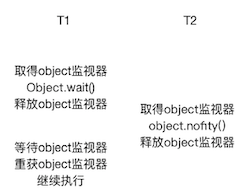
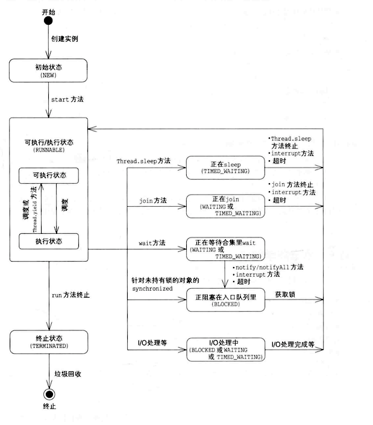

### 1 线程的基本操作

Java语言将"正在执行程序的主体"称之为线程。

#### 线程启动(start)

`Thread.start()`用于启动新的线程。`Thead.run()`可以调用，但是并不会启动新的线程，它只会在当前线程中，串行执行`run()`方法。

`Thread.start()`主要执行以下操作：

* 启动新线程
* 调用`run()`方法

!!! note "`Thread.start()`JDK源码"

    ```Java
    public synchronized void start() {
        // threadStatus = 0 表示新建线程
        if (threadStatus!=0) throw new IllegalThreadStateException();
        // 通知线程组，线程已经启动, 把线程加入线程组
        group.add(this);
        boolean started = false; // 已经启动了吗？
        try {
            start0();  // native方法，启动线程
            started = true;  // 已经启动
        } finally {
            try { // 启动失败
                if (!started) group.threadStartFailed(this);
            } catch (Throwable ignore) { // do nothing here}
        }
    }
    ```

线程启动有以下三种方法：

* 利用`Thread`类的子类的实例来启动线程
* 利用`Runnable`接口的实现类的实例启动线程
* `ThreadFactory`中的线程创建

前两种方法比较普遍，这里不再叙述。`ThreadFactory`是个接口:

```Java
public interface ThreadFactory {
    /**
     * Constructs a new {@code Thread}.  Implementations may also initialize
     * priority, name, daemon status, {@code ThreadGroup}, etc.
     *
     * @param r a runnable to be executed by new thread instance
     * @return constructed thread, or {@code null} if the request to
     *         create a thread is rejected
     */
    Thread newThread(Runnable r);
}
```

利用该接口，可以将`Runnable`作为传入参数，并通过`new`创建`Thread`实例。

```Java
public class SimpleThreadFactory implements ThreadFactory {
    public Thread newThread(Runnable r) {
        return new Thread(r);
    }
}
```

#### 线程中断(Interrupt)

线程中断并不会使线程⽴即退出，⽽是给线程发送⼀个通知，告知⽬标线程，希望线程退出。⾄于⽬标线程接到通知后如何处理，则完全由⽬标线程⾃⾏决定。

```java
public void Thread.interrupt() // 中断线程
public boolean Thread.isInterrupted()  // 判断是否被中断
public static boolean Thread.interrupted()   // 判断是否被中断，并清除当前中断状态
```


`Thread.sleep()`方法会让当前线程休眠若⼲时间，会抛出`InterruptedException`异常。当线程在`sleep()`休眠时，如果被中断，这个异常就会产⽣。

```Java
public static native void sleep(long millis) 
                    throws InterruptedException;
```


#### 等待(wait)和通知(notify)

为了⽀持多线程之间的协作，JDK提供了等待`wait()`⽅法和通知`notify()/nofifyAll()`⽅法。这些⽅法并不属于`Thread`类，⽽是属于`Object`类。这也意味着任何对象都可以调⽤这两个⽅法。

```java
public final void wait() throws InterruptedException
public final native void notify()
public final native void notifyAll();
```


当在⼀个对象实例上调⽤`wait()`⽅法后，当前线程就会在这个对象上等待。线程会⼀直等到其他线程调⽤了`notify()/notifyAll()`⽅法为⽌。这⾥还需要强调⼀点，`Object.wait()`⽅法并不是可以随便调⽤的 --- 它必须包含在对应的synchronzied语句中，⽆论是`wait()`或者`notify()`都需要⾸先获得⽬标对象的⼀个监视器。

!!! example "wait/notify"
    
    下图显⽰了`wait()`和`notify()`的⼯作流程细节。其中T1和T2表⽰两个线程。T1在正确执⾏`wait()`⽅法前，⾸先必须获得object对象的监视器。⽽`wait()`⽅法在执⾏后，会释放这个监视器。这样做的⽬的是使得其他等待在object对象上的线程不⾄于因为T1的休眠⽽全部⽆法正常执⾏。
    
    
    

监视器、等待队列的原理参见[操作系统概念](../../OS/操作系统概念/7 Synchronization Examples.md)

所有实例都拥有一个等待队列，它是在实例的`wait()`方法执行后停止操作的线程的队列。在执行`wait()`后，线程便会暂停操作，进入等待队列，直到下列任意一种情况发生：

* 有其他线程的`notify()`方法来唤醒线程
* 有其他线程的`notifyAll()`方法来唤醒线程
* 有其他线程的`interrupt()`方法来唤醒线程
* `wait()`方法超时

实例方法中的`wait()`和`this.wait()`含义相同，执行了`wait()`的线程将会进入this的等待队列中，这时可以说"线程正在this上wait".

若要执行`wait()`方法，线程必须持有锁。但如果线程进入等待队列，便会释放其实例的锁。

如果未持有锁的线程调用`wait()`,`notify()`,`notifyAll()`，异常 `IllegalMonitorStateException`就会抛出。

!!! note "notify v.s. notifyAll"

    * `notify()`方法会将等待队列中的一个线程取出。假如在执行`notify()`方法时，正在等待队列中等待的线程不止一个，对于”这时该如何来选择线程”这个问题规范中并没有做出规定，取决于Java平台运行环境。
    * `notifyAll()`方法会将等待队列中的所有线程都取出来。
    
    该使用`notify()`方法还是`notifyAll()`方法呢？由于`notify()`唤醒一个线程，所以比较快，但如果处理不好，程序便可能会停止。一般来说使用`notifyAll()`的代码比使用`notify()`时更为健壮。

    
#### 等待线程结束(join)和谦让(yield)

有时候，⼀个线程的输⼊可能⾮常依赖于另外⼀个或者多个线程的输出，此时，这个线程就需要等待依赖线程执⾏完毕，才能继续执⾏。`join`方法可以实现该功能。

```java
public final void join() throws InterruptedException 
public final synchronized void join(long millis) throws InterruptedException
```

第⼀个`join()`⽅法表⽰⽆限等待，它会⼀直阻塞当前线程，直到⽬标线程执⾏完毕。第⼆个⽅法给出了⼀个最⼤等待时间，如果超过给定时间⽬标线程还在执⾏，当前线程也会因为“等不及了”，⽽继续往下执⾏。

`join()`的本质是让调⽤线程`wait()`在当前线程对象实例上。它让调⽤线程在当前线程对象上进⾏等待。当线程执⾏完成后，被等待的线程会在退出前调⽤`notifyAll()`通知所有的等待线程继续执⾏。

`Thread.yield()`⼀个静态⽅法，⼀旦执⾏，它会使当前线程让出CPU。但要注意，让出CPU并不表⽰当前线程不执⾏了。当前线程在让出CPU后，还会进⾏CPU资源的争夺，但是是否能够再次被分配到，就不⼀定了。

#### synchronized关键字和代码块

保证线程安全的基本方法是使用`synchronized`关键字。关键字`synchronized`可以有多种⽤法：

* `synchronzied`代码块：对给定对象加锁，进⼊同步代码前要获得给定对象的锁。 
* `synchronzied`实例⽅法：声明一个实例方法时，在前面加上关键字 `synchronized`，相当于对当前实例加锁，进⼊同步代码前要获得当前实例的锁。 
* `synchronzied`静态⽅法：声明一个静态方法时，在前面加上关键字 `synchronized`，相当于对当前类加锁，进⼊同步代码前要获得当前类的锁。

如果只是想让方法中的某一部分由一个线程运行，而非整个方法，可使用`synchronized`代码块：

```Java
synchronized (expression) {
    ...
}
```

其中的"expression"为获取锁的实例。


如下`synchronized`实例方法和`synchronize`d代码块是等效的：

```Java hl_lines="1 6"
synchronized void method() {
    ...
}

void method() {
    synchronized (this) {
        ...
    }
}
```

也就是说，`synchronized`实例方法是使用`this`的锁来执行线程的。


`synchronized`静态方法和`synchronized`实例方法使用的锁是不一样的。`synchronized`静态方法相当于以下`synchronized`代码块:

```Java hl_lines="3 8"
class Something {
    // synchronized静态方法
    static synchronized void method() {
    ...
    }
    // synchronized代码块
    void method() {
        synchronized (Something.class) {
            ...
        }
    }
}
```

也就是说，synchronized静态方法是使用该类的*类对象*的锁来执行线程的互斥处理的。 例如`Something.class`是`Something`类对应的`java.long.class`类的实例。


#### 线程的状态State

线程状态由`Thread.State`定义：

```Java
public enum State {
     //Thread state for a thread which has not yet started.
    NEW,
    // Thread state for a runnable thread. 
    RUNNABLE,
    // Thread state for a thread blocked waiting for a monitor lock.
    BLOCKED,
    // Thread state for a waiting thread.
    WAITING,
    // Thread state for a waiting thread with a specified waiting time.
    TIMED_WAITING,
    // Thread state for a terminated thread.
    TERMINATED;
}
```



#### 线程组ThreadGroup

A thread group represents a set of threads. In addition, a thread group can also include other thread groups. The thread groups form a tree in which every thread group except the initial thread group has a parent.


#### 守护线程Daemon

守护线程一般在后台默默地完成⼀些系统性的服务，⽐如垃圾回收线程、JIT线程。如果⽤户线程全部结束，这也意味着这个程序实际上⽆事可做了。守护线程要守护的对象已经不存在了，那么整个应⽤程序就⾃然应该结束。因此，当⼀个Java应⽤内，只有守护线程时，Java虚拟机就会⾃然退出。

可以使用`Thread.setDaemon()`将线程设置为守护线程daemon。

```java
public class DaemonDemo {

    public static class Daemon implements  Runnable {
        @Override
        public void run() {
            while(true) {
                System.out.println("I am alive");
                try {
                    Thread.sleep(1000);
                } catch (Exception e) {
                    e.printStackTrace();
                }
            }
        }
    }

    public static void main(String[] args) throws  InterruptedException {
        Thread t = new Thread(new Daemon());
        t.setDaemon(true);
        t.start();
        Thread.sleep(2000);
    }
}
// 结果是打印两次"I am alive"
```

#### 线程优先级PRIORITY

在Java中，使⽤1到10表⽰线程优先级，数字越⼤则优先级越⾼。⼀般可以使⽤内置的三个静态字段表⽰：

```
public final static int MIN_PRIORITY = 1;
 public final static int NORM_PRIORITY = 5; 
 public final static int MAX_PRIORITY = 10;
```


#### synchronized关键字

关键字synchronized的作⽤是实现线程间的同步。它的⼯作是对同步的代码加锁，使得每⼀次，只能有⼀个 线程进⼊同步块，从⽽保证线程间的安全性.

关键字synchronized可以有多种⽤法: 

* 指定加锁对象：对给定对象加锁，进⼊同步代码前要获得给定对象的锁。 
* 直接作⽤于实例⽅法：相当于对当前实例加锁，进⼊同步代码前要获得当前实例的锁。 
* 直接作⽤于静态⽅法：相当于对当前类加锁，进⼊同步代码前要获得当前类的锁


### 2 多线程程序的评价标准

#### 安全性——不损坏对象

所谓**安全性**(safety)就是不损坏对象，这是程序正常运行的必要条件之一。对象损坏是指对象的状态和设计者的原意不一致，通常是指对象的字段的值并非预期值。

例如，由于设计不合理导致银行账户的可用余额变成了负数，而设计者此前并没有设想它会变成负数，这时可以说，表示银行账户的对象”损坏“了。

如果一个类即使被多个线程同时使用，也可确保安全性，那么这个类就称为**线程安全**(thread-safe)类。

!!! Note
    
    `ArrayList`虽然是非线程安全的，但通过执行适当的互斥处理，也可以安全地使用，称之为线程兼容(thread-compatible).

#### 生存性——必要的处理能够被执行

**生存性**(liveness，或者活性)是指无论什么时候，必要的处理都一定能够被执行。

即使对象没有损坏，也不代表程序就一定好。例如程序运行过程中突然停止，这时由于处理已经停止，对象的状态就不会发生变化了，所以对象状态也就不会异常。虽然符合“安全性”条件，但无法运行的程序根本没有意义。

有时候安全性和生存性会相互制约。例如，有时只重视安全性，生存性就会下降。最典型的事例就是死锁。

#### 可复用性——类可重复利用

**可复用性**(reusability)是指类能够重复利用。这虽然不是程序正常运行的必要条件，但确实提高程序质量的必要条件。类如果能够作为组件从正常运行的软件中分割出来，那么就说明这个类有很高的复用性。在编写多线程程序中，如果能够巧妙地将线程的互斥机制和方针隐藏到类中，那这就是一个可复用性高的程序，例如`java.util.concurrent`包中的多线程编程的类。


#### 性能——能快速、大批量地执行处理

**性能**(performance)是指能快速、大批量地执行处理。这也不是程序正常运行的必要条件，但确实提高程序质量时以ing改考虑的条件。


#### 评价标准总结

安全性和生存性是必须遵守的标准。重要的是，还要在满足这两个必要条件的基础上，考虑如果提高可复用性和性能。


