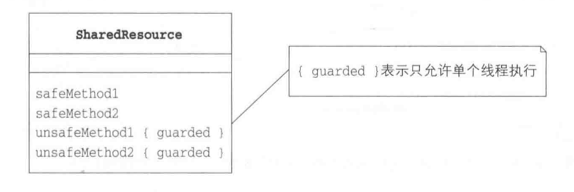
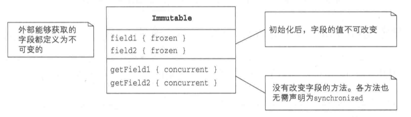
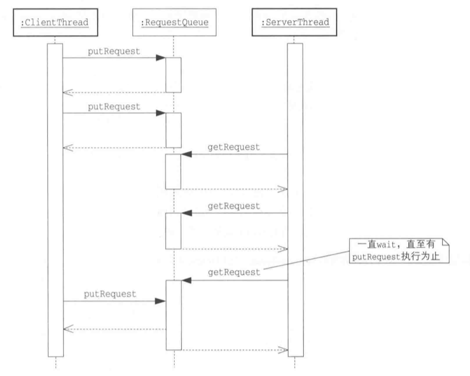
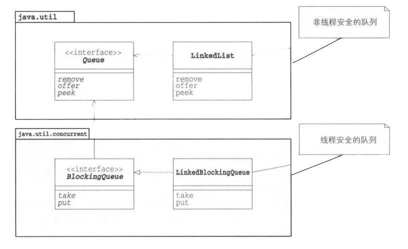
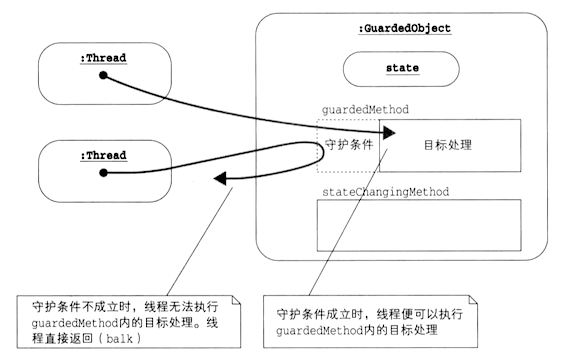
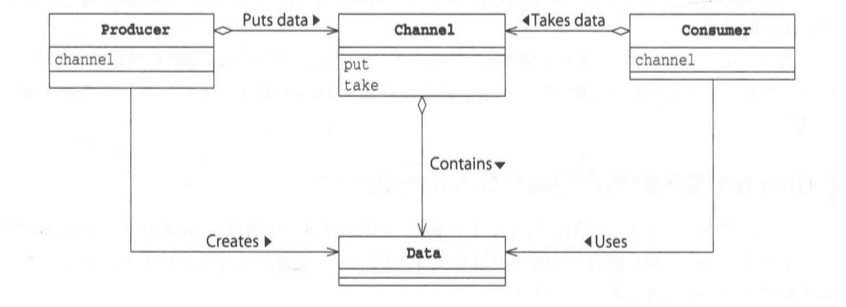
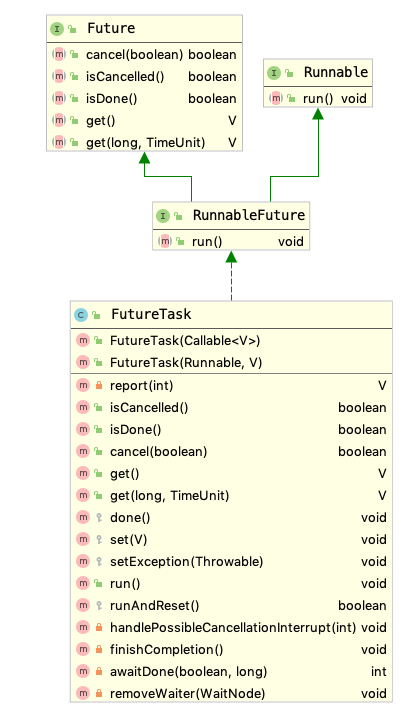
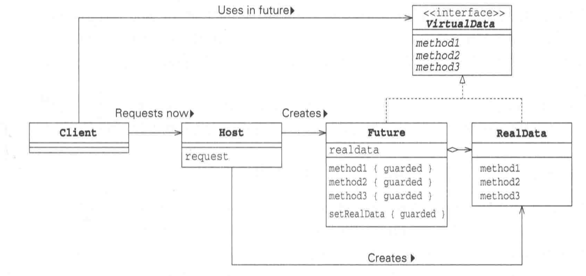

### 1 Single Threaded Execution模式

所谓Single Threaded Execution模式，就是**确保同一时间内只能让一个线程执行处理**。它通过让一部分代码不能并发执行，来阻止对数据或资源的并发访问。


#### Example: 通过门

首先，我们来看一下应该使用Single Threaded Execution模式却没有使用的程序，体会一下在多线程下无法正确执行的程序会引发什么现象。

该程序模拟的是三个人频繁地通过一个只允许一个人经过的门的情形。当人们通过门的时候，统计人数便会递增。另外，程序还会记录通行者的姓名与出生地。

| 名字 | 说明 |
| --- | --- |
| Main | 创建门，并让三个人不断地通过的类 |
| Gate |	 表示门的类。它会在人通过时记录其姓名和出生地 |
| UserThread | 表示人的类。人们将不断地通过门 |


```Java tab="Main"
// 创建一个门，并让三个人不断地通过.
// 为了便于一一对应，每个人的名字与出生地的首字母都设置成了相同的。
public class Main {
    public static void main(String[] args) {
        Gate gate = new Gate();
        new UserThread(gate, "Steve Nash", "San Francisco").start();
        new UserThread(gate, "Michael Jordan", "Miami").start();
        new UserThread(gate, "Ronaldo", "Rome").start();
    }
}
```

```Java tab="Gate"
public class Gate {
    protected int counter = 0;
    protected String name = "Nobody";
    protected String address = "Nowhere";
 
    // 非安全线程： 通过门
    public void pass(String name, String address) {
        this.counter++; // 到目前为止已经通过这道门的人数
        this.name = name; // 最后一个通行者的姓名
        this.address = address; // 最后一个通行者的出生地
        check();
    }
 
    // toString返回门当前状态的字符串
    public String toString() {
        return "No." + conuter + ": " + name + "," + address;
    }
 
    // 检查name和adress的首字母是否项目，不相同则为异常数据
    private void check(){
        if(name.charAt(0) != address.charAt(0)
            System.out.println("******* BROKEN ********:"+toString());
    }
}
```

```Java tab="UserThread"
public class UserThread extends Thread {
    private final Gate gate;// 要通过的门
    private final String myname; // 姓名
    private final String myaddress;// 出生地
 
    public UserThread(Gate gate, String myname, 
                        String myaddress) {
        super();
        this.gate = gate; 
        this.myname = myname;
        this.myaddress = myaddress;
    }
    // 线程首先显示通行者姓名与BEGIN字样，随后反复调用pass，
    // 表示这个人在门里不断地穿梭通过
    public void run() {
        System.out.println(myname + " BEGIN:");
        while (true) gate.pass(myname, myaddress);
    }
}
```

下面是程序的运行结果：


<small>
```
Steve Nash BEGIN:
Ronaldo BEGIN:
Michael Jordan BEGIN:
******* BROKEN ********:No.193689: Michael Jordan,Miami
******* BROKEN ********:No.194489: Michael Jordan,Miami
******* BROKEN ********:No.194959: Michael Jordan,Miami
...
```
</small>

`Gate`类的实例被多个线程使用时，运行结果会与预期不一致，即`Gate`类是线程不安全的。另外，仔细看一下`counter`的值，最开始显示BROKEN的时候，`counter`的值已经变为了193689，也就是说，在检查出第一个错误的时候，三人已经穿梭100万次以上了。但是如果只测试几次，即使几万次，也找不到错误。

这是多线程程序设计的难点。如果检查出错误，那么说明程序线程不安全。但是，**就算没检查出错误，也不能说程序就一定是线程安全的**。测试次数不够、时间点不对，都有可能检查不出错误。一般来说，操作测试并不足以证明程序的安全性。测试只不过提高了“程序也许安全”的概率而已。


加下来，将`Gate`类修改为线程安全的类。其中有两处修改，即分别在`pass`方法和`toString`方法前面加上了`synchronized`关键字.

```Java hl_lines="7 15"
public class Gate {
    protected int counter = 0;
    protected String name = "Nobody";
    protected String address = "Nowhere";
 
    // 非安全线程： 通过门
    public synchronized void pass(String name, String address) {
        this.counter++; // 到目前为止已经通过这道门的人数
        this.name = name; // 最后一个通行者的姓名
        this.address = address; // 最后一个通行者的出生地
        check();
    }
 
    // toString返回门当前状态的字符串
    public synchronized String toString() {
        return "No." + conuter + ": " + name + "," + address;
    }
 
    // 检查name和adress的首字母是否项目，不相同则为异常数据
    private void check(){
        if(name.charAt(0) != address.charAt(0)
            System.out.println("******* BROKEN ********:"+toString());
    }
}
```
#### Summary

加下来归纳一下Single Threaded Execution模式:

`Gate`类扮演SharedResource(共享资源)模式，它是可被多个线程访问的类，包含很多方法，主要分为如下两类：

* safeMethod: 多个线程同时调用也不会发生问题的方法.
* unsafeMethod: 多个线程同时调用时，实例状态有可能发生改变。可以通过将unsafeMethod声明为`synchronized`方法来进行保护。





临界区的大小和性能：一般情况下，Single Threaded Execution模式会降低程序性能，

* 获取锁花费时间：进入`synchronized`方法时，线程需要获取对象的锁，该处理会花费时间
* 线程冲突引起的等待：当线程在临界区内，其他想要进入临界区的线程会阻塞，这种状况称为线程冲突(conflict)。发生冲突时，程序的整体性能会随着线程等待时间的增加而下降。如果尽可能地缩小临界区的范围，降低线程冲突的概率，那么就能一直性能的下降。


##### 计数信号量

Single Threaded Execution模式用于确保某个区域“只能由一个线程”执行。使用计数信号量可以确保某个区域"至多由$N$个线程"执行。


```Java tab="BoundedResource"
// 资源个数有限
class BoundedResource {
    private final Semaphore semaphore;
    private final int permits;
    private final static Random random = new Random(314159);

    // 构造函数(permits为资源个数)
    public BoundedResource(int permits) {
        this.semaphore = new Semaphore(permits);
        this.permits = permits;
    }

    // 使用资源
    public void use() throws InterruptedException {
        semaphore.acquire();
        try {
            doUse();
        } finally {
            semaphore.release();
        }
    }

    // 实际使用资源(此处仅使用Thread.sleep)
    protected void doUse() throws InterruptedException {
        Log.println("BEGIN: used = " 
                    + (permits - semaphore.availablePermits()));
        Thread.sleep(random.nextInt(500));
        Log.println("END:   used = " 
                    + (permits - semaphore.availablePermits()));
    }
}
```

```java tab="UserThread"
// 使用资源的线程
class UserThread extends Thread {
    private final static Random random = new Random(26535);
    private final BoundedResource resource;

    public UserThread(BoundedResource resource) {
        this.resource = resource;
    }

    public void run() {
        try {
            while (true) {
                resource.use();
                Thread.sleep(random.nextInt(3000));
            }
        } catch (InterruptedException e) {
        }
    }
}
```

```Java tab="UsingSemaphore"
public class UsingSemaphore {
    public static void main(String[] args) {
        // 设置3个资源
        BoundedResource resource = new BoundedResource(3);

        // 10个线程使用资源
        for (int i = 0; i < 10; i++) {
            new UserThread(resource).start();
        }
    }
}
```

### 2 Immutable模式

`String`类表示字符串，类中并没有修改字符串内容的方法。由于`String`内部状态不会发生变化，所以无论`String`实例被多少个线程访问，也无需线程的互斥处理。

Immutable模式中存在着确保实例状态不发生改变的类。在访问这些实例时并不需要执行耗时的互斥处理。

#### 示例程序

| 名字 | 说明 |
| --- | --- |
| Person | 表示人的类 |
| Main |	 测试程序行为的类 |
| PrintPersonThread | 显示Person实例的线程的类 |

```Java tab="Person"
public final class Person {
    private final String name;
    private final String address;
    public Person(String name, String address) {
        this.name = name;
        this.address = address;
    }
    public String getName() {
        return name;
    }
    public String getAddress() {
        return address;
    }
    public String toString() {
        return "[ Person: name = " + name + ",
             address = " + address + " ]";
    }
}
```

```Java tab="Main"
public class Main {
    public static void main(String[] args) {
        // 创建一个Person类的实例，并启动三个线程访问该实例
        Person alice = new Person("Alice", "Alaska");
        new PrintPersonThread(alice).start();
        new PrintPersonThread(alice).start();
        new PrintPersonThread(alice).start();
    }
}
```


```Java tab="PrintPersonThread"
public class PrintPersonThread extends Thread {
    private Person person;
    public PrintPersonThread(Person person) {
        this.person = person;
    }
    public void run() {
        while (true)
            System.out.println(Thread.currentThread().getName()
                     + " prints " + person);
    }
}
```


* Person类的变量仅可通过构造函数来设置，类中没有修改字段值的`set`方法，只有获取字段值的`get`方法。
* Person类声明了final类型，无法创建Person类的子类，防止子类修改字段值。
* Person类的变量的可见性都是`private`，只能内部访问，防止被修改，并且都声明为了`final`，一旦被赋值就不会发生改变。





#### 扩展

##### 何时使用

Immutable类中的字段的值不可以修改，也不存在修改字段内容的方法。Immutable类的实例被创建后，状态降不再发生变化。不需要使用`synchronized`进行保护。能够在不失去安全性和生存性的前提下提高性能。在以下情况下使用：

* 实例创建后，状态不再发生变化
* 实例是共享的，且被频繁访问


##### 考虑成对的mutable/immutable类

如果程序可以分为修改类和不修改类的情况，那么可以将这个类拆分称为mutable类和immutable类。并设计成可以根据mutable实例创建immutable实例，也可以根据immutable实例创建mutable实例。

Java的标准库中就有成对的mutable类和immutable类。例如String类和StringBuffer类。StringBuffer类是字符串的mutable类，能够改写，是线程安全的。String类是字符串的immutable类，不可以改写的。StringBuffer类中有一个以String为参数的构造函数，而String类中有一个以StringBuffer为参数的构造函数。

##### 标准类库中用到的Immutable模式

* 表示字符串的`String`类
* 表示大数字的`BigInteger`、`BigDecimal`类
* 基本类型的包装类(`Integer`, `Short`, `Double`)
* 表示颜色的`Color`类


### 3 Guarded Suspension模式

Guarded Suspension模式让一个方法一直等待到条件满足时才去执行。


#### 示例程序

一个队列(`RequestQueue`)用来放来存储客户线程(`ClientThread`)的请求。只有当队列中包含请求时，服务线程(`ServerThread`)才可以从队列中取出请求去执行。

| 名字 | 说明 |
| --- | --- |
| Request | 表示一个请求的类 |
| RequestQueue |	 依次存放请求的类 |
| ClientThread | 发送请求的类 |
| ServerThread | 接收请求的类 |
| Main | 测试程序行为的类 |




```Java tab="Request"
public class Request {
    private final String name;
    public Request(String name) {
        this.name = name;
    }
    public String getName() {
        return name;
    }
    public String toString() {
        return "[ Request " + name + " ]";
    }
}
```

```Java tab="RequestQueue"
public class RequestQueue {
    private final Queue<Request> queue = new LinkedList<Request>();
    public synchronized Request getRequest() {
        while (queue.peek() == null) { # 守护条件不成立
            try { wait();}   # 尝试继续等待
            catch (InterruptedException e) {}
        }
        return queue.remove();  # 守护条件成立
    }
    public synchronized void putRequest(Request request) {
        queue.offer(request);
        notifyAll();
    }
}
```

```Java tab="ServerThread"
public class ServerThread extends Thread {
    private final Random random;
    private final RequestQueue requestQueue;
    public ServerThread(RequestQueue requestQueue, 
                        String name, long seed) {
        super(name);
        this.requestQueue = requestQueue;
        this.random = new Random(seed);
    }
    public void run() {
        for (int i = 0; i < 10000; i++) {
            Request request = requestQueue.getRequest();
            System.out.println(Thread.currentThread().getName() 
                                + " handles  " + request);
            try { Thread.sleep(random.nextInt(1000));
            } catch (InterruptedException e) {}
        }
    }
}
```

```Java tab="ClientThread"
import java.util.Random;

public class ClientThread extends Thread {
    private final Random random;
    private final RequestQueue requestQueue;
    public ClientThread(RequestQueue requestQueue, 
                            String name, long seed) {
        super(name);
        this.requestQueue = requestQueue;
        this.random = new Random(seed);
    }
    public void run() {
        for (int i = 0; i < 10000; i++) {
            Request request = new Request("No." + i);
            System.out.println(Thread.currentThread().getName() 
                                        + " requests " + request);
            requestQueue.putRequest(request);
            try { Thread.sleep(random.nextInt(1000));
            } catch (InterruptedException e) {}
        }
    }
}
```

* `Request`类用于表示请求
* `RequestQueue`类用于依次存放请求。
    * `getRequest`方法会取出最先存放在`RequestQueue`中的一个请求，作为返回值，如果一个请求都没有，那就一直等待，知道其他线程执行`putRequest`
    * `putRequest`方法用于添加一个请求。
    * `getRequest`和`putRequest`都是`synchronized`方法 
* `ClientThread`类用于表示发送请求的线程，持有`RequestQueue`实例，并连续调用该实例的`putRequest`，放入亲故。
* `ServerThread`类用于表示接收请求的线程，也持有`RequestQueue`实例，用`getRequest`方法接收请求。


在执行`getRequest`方法时，必须满足Guarded Suspension模式的**守护条件**(guard condition): `:::Java queue.peek() != null`。当守护条件不成立`:::Java queue.peek() == null`时，绝对不会继续执行getRequest方法中的while之后的语句。

那什么时候守护条件成立呢？当`putRequest`中的`notifyAll`被调用时。

#### 拓展思路的要点

在Single Threaded Execution模式中，只要有一个线程进入临界区，其他线程就无法进入，只能等待。而在Guarded Suspension模式中，线程是否等待取决于守护条件。

正在wait的线程每次被`notify`/`notifyAll`时都会检查守护条件。不管`notify`/`notifyAll`多少次，如果守护条件不成立，线程都会随着while再次`wait`。


#### 使用LinkedBlockingQueue

`LinkedBlockingQueue`与`RequestQueue`功能类似。由于其`take`方法和`put`方法已经考虑了互斥处理，所以getRequest方法和putRequest方法也就无需声明为synchronized方法。

```Java
public class RequestQueue {
    private final BlockingQueue<Request> queue = 
                new LinkedBlockingQueue<Request>();
    public Request getRequest() {
        Request req = null;
        try { req = queue.take();
        } catch (InterruptedException e) { }
        return req;
    }
    public void putRequest(Request request) {
        try { queue.put(request);
        } catch (InterruptedException e) { }
    }
}
```




### 4 Balking模式

如果现在不适合执行这个操作，或者没必要执行这个操作，就停止处理，直接返回，这就是Balking模式。所谓Balk就是“停止并返回”的意思。

!!! note "Balking v.s. Guarded suspension"

    Balking模式中，当守护条件不成立时，线程会直接停止并返回。而Guarded Suspension模式中，当守护条件不成立时，线程会一直等待到条件成立为止。

    

#### 示例程序

示例程序试图实现文本工具的自动保存功能，定期将当前数据内容写入文件中。当数据内容被写入时，会完全覆盖上次写入的内容，只有最新的内容才会被保存。另外，当保存内容未发生改变时，就不再执行写入操作。也就是说，该程序以"数据内容存在不同"为守护条件，如果数据内容相同，则不执行写入操作，直接返回。

| 名字 | 说明 |
| --- | --- |
| Data | 表示可以修改并保存的数据的类 |
| SaverThread |	 定期保存数据内容的类 |
| ChangerThread | 修改并保存数据内容的类 |
| Main | 测试程序行为的类 |


```Java tab="Data"
public class Data {
    private final String filename;  // 保存的文件名称
    private String content;         // 数据内容
    private boolean changed;        // 修改后的内容若未保存，则为true

    public Data(String filename, String content) {
        this.filename = filename;
        this.content = content;
        this.changed = true;
    }

    // 修改数据内容
    public synchronized void change(String newContent) {
        content = newContent;
        changed = true;
    }

    // 若数据内容修改过，则保存到文件中
    public synchronized void save() throws IOException {
        if (!changed) return;
        doSave();
        changed = false;
    }

    // 将数据内容实际保存到文件中
    private void doSave() throws IOException {
        System.out.println(Thread.currentThread().getName() 
            + " calls doSave, content = " + content);
        Writer writer = new FileWriter(filename);
        writer.write(content);
        writer.close();
    }
}
```

```java tab="SaverThread"
// 实现定期保存
public class SaverThread implements Runnable {
    private final Data data;
    private final String name;

    public SaverThread(String name, Data data) {
        this.name = name;
        this.data = data;
    }

    public void run() {
        try {
            while (true) {
                data.save();         // 定期保存数据
                Thread.sleep(1000);  // 休眠约1秒钟
            }
        } catch (Exception e) {
            e.printStackTrace();
        }

    }
}
```

```java tab="ChangerThread"
// 用户修改数据内容，并执行保存处理
public class ChangerThread implements Runnable {
    private final Data data;
    private final String name;
    private final Random random = new Random();
    public ChangerThread(Data data, String name) {
        this.data = data;
        this.name = name;
    }

    public void run() {
        try {
            for (int i = 0; true; i++) {
                data.change("No." + i); // 修改数据
                Thread.sleep(random.nextInt(1000)); // 执行其他操作
                data.save();        // 显式地保存
            }
        } catch (Exception e) {
            e.printStackTrace();
        }
    }
}
```


#### 延伸阅读：超时

介于"直接balk并返回"和"等待到守护条件成立为止"这两种阶段的处理方法之间，还有一种处理方法，那就是"在守护条件成立之前等待一段时间"。这种处理称为guarded timed或timeout。

```java
public class Host {
    private final long timeout; //超时时间
    private boolean ready = false; // 方法正常执行时值为true
    public Host(long timeout) {
        this.timeout = timeout;
    }
    // 修改状态
    public synchronized  void setExecutable(boolean on) {
        ready = on;
        notifyAll();
    }

    // 检查状态之后再执行
    public synchronized void execute()
            throws InterruptedException, TimeoutException {
        long start = System.currentTimeMillis(); // 开始时间
        while (!ready) {
            long now = System.currentTimeMillis(); // 当前时间
            long rest = timeout - (now - start); // 剩余的等待时间
            if (rest <= 0) throw new TimeoutException();
            wait(rest);
        }
        doExecute();
    }

    // 实际的处理
    private void doExecute() {
        System.out.println(Thread.currentThread().getName() 
            + "calls do Execute");
    }
}
```

### 5 Producer-Consumer模式

生产者消费者模式：生产者安全地将数据交给消费者。

#### 示例程序

在示例程序中，有3位糕点师制作蛋糕并将其放到桌子上，然后有3位客人来吃这些蛋糕。

* 糕点师(`MakerThread`)制作蛋糕(`String`)，并将其放置到桌子(`Table`)上
* 桌子上最多可放置3个蛋糕
* 如果桌子上已经放满3个蛋糕时糕点师还要再放置蛋糕，必须等到桌子上空出位置
* 客人(`EaterThread`)取桌子上的蛋糕吃


```Java tab="MakerThread"
public class MakerThread extends Thread {
    private final Random random;
    private final Table table;
    private static int id = 0; // 蛋糕的流水号(所有糕点师共用)
    public MakerThread(String name, Table table, long seed) {
        super(name);
        this.table = table;
        this.random = new Random(seed);
    }
    public void run() {
        try {
            while (true) {
                Thread.sleep(random.nextInt(1000));
                String cake = "[ Cake No." + nextId() + 
                    " by " + getName() + " ]";
                table.put(cake);
            }
        } catch (InterruptedException e) {
        }
    }
    private static synchronized int nextId() {
        return id++;
    }
}
```

```Java tab="Table"
public class Table {
    private final String[] buffer;
    private int tail;  // 下次put的位置
    private int head;  // 下次take的位置
    private int count; // buffer中的蛋糕个数
    public Table(int count) {
        this.buffer = new String[count];
        this.head = 0;
        this.tail = 0;
        this.count = 0;
    }
    // 放置蛋糕
    public synchronized void put(String cake) 
                        throws InterruptedException {
        System.out.println(Thread.currentThread().getName() 
                        + " puts " + cake);
        while (count >= buffer.length) {
            wait();
        }
        buffer[tail] = cake;
        tail = (tail + 1) % buffer.length;
        count++;
        notifyAll();
    }
    // 取蛋糕
    public synchronized String take() 
                        throws InterruptedException {
        while (count <= 0) {
            wait();
        }
        String cake = buffer[head];
        head = (head + 1) % buffer.length;
        count--;
        notifyAll();
        System.out.println(Thread.currentThread().getName() 
                            + " takes " + cake);
        return cake;
    }
}
```

```Java tab="EaterThread"
public class EaterThread extends Thread {
    private final Random random;
    private final Table table;
    public EaterThread(String name, Table table, long seed) {
        super(name);
        this.table = table;
        this.random = new Random(seed);
    }
    public void run() {
        try {
            while (true) {
                String cake = table.take();
                Thread.sleep(random.nextInt(1000));
            }
        } catch (InterruptedException e) {
        }
    }
}
```

```Java tab="Main"
public class Main {
    public static void main(String[] args) {
        Table table = new Table(3);     // 创建一个能放置3个蛋糕的桌子
        new MakerThread("MakerThread-1", table, 31415).start();
        new MakerThread("MakerThread-2", table, 92653).start();
        new MakerThread("MakerThread-3", table, 58979).start();
        new EaterThread("EaterThread-1", table, 32384).start();
        new EaterThread("EaterThread-2", table, 62643).start();
        new EaterThread("EaterThread-3", table, 38327).start();
    }
}
```




#### ReentrantLock

生产者-消费者模式也可以用ReentrantLock实现，参见[操作系统概念](../../OS/操作系统概念/7 Synchronization Examples.md/#condition-variables).

#### BlockingQueue

`BlockingQueue`的实现类相当于生产者-消费者模式中的Channel角色。`BlockingQueue`接口表示的是在达到合适的状态之前线程一直阻塞(wait)的队列。


下面使用`ArrayBlockingQueue`来实现示例程序。

```Java
public class Table extends ArrayBlockingQueue<String> {
    public Table(int count) {
        super(count);
    }
    public void put(String cake) throws InterruptedException {
        System.out.println(Thread.currentThread().getName() 
                                            + " puts " + cake);
        super.put(cake);
    }
    public String take() throws InterruptedException {
        String cake = super.take();
        System.out.println(Thread.currentThread().getName() 
                                        + " takes " + cake);
        return cake;
    }
}
```

#### Exchanger

Exchanger类用于让两个线程安全地交换对象。`ProducerThread`向缓冲区充填字符，`Consumer`向缓冲区取出字符。

```Java hl_lines="18" tab="ConsumerThread" 
public class ConsumerThread extends Thread {
    private final Exchanger<char[]> exchanger;
    private char[] buffer = null;
    private final Random random;

    public ConsumerThread(Exchanger<char[]> exchanger, 
                                        char[] buffer, long seed) {
        super("ConsumerThread");
        this.exchanger = exchanger;
        this.buffer = buffer;
        this.random = new Random(seed);
    }

    public void run() {
        try {
            while (true) {
                // 交换缓冲区
                buffer = exchanger.exchange(buffer);
                // 从缓冲区中取出字符
                for (int i = 0; i < buffer.length; i++) 
                    Thread.sleep(random.nextInt(1000));
            }
        } catch (InterruptedException e) {
            e.printStackTrace();
        }
    }
}
```

```Java hl_lines="22" tab="ProducerThread"
public class ProducerThread extends Thread {
    private final Exchanger<char[]> exchanger;
    private char[] buffer = null;
    private char index = 0;
    private final Random random;

    public ProducerThread(Exchanger<char[]> exchanger, 
                                char[] buffer, long seed) {
        super("ProducerThread");
        this.exchanger = exchanger;
        this.buffer = buffer;
        this.random  = new Random(seed);
    }

    public void run() {
        try {
            while (true) {
                // 向缓冲区填充字符
                for (int i = 0; i < buffer.length; i++)
                    buffer[i] = nextChar();
                // 交换缓冲区
                buffer = exchanger.exchange(buffer);
            }
        } catch (InterruptedException e) {}
    }

    // 生成字符
    private char nextChar() throws InterruptedException {
        char c = (char)('A' + index % 26);
        index++;
        Thread.sleep(random.nextInt(1000));
        return c;
    }
}
```


### 6 Read-Write Lock模式

在Read-Write Lock模式中，当线程执行读取操作时，多个线程可以同时读取，但不可以写入；当线程写入时，其他线程不可以读取和写入。

一般来说，执行互斥处理会降低程序性能。但如果把针对写入的互斥处理和针对读取的互斥处理分别来考虑，则可以提高程序性能。

#### 示例程序


```Java
public class Data {
    private final char[] buffer;
    private final ReadWriteLock lock = 
                new ReentrantReadWriteLock(true); /* fair */
    private final Lock readLock = lock.readLock();
    private final Lock writeLock = lock.writeLock();

    public Data(int size) {
        this.buffer = new char[size];
        Arrays.fill(buffer, '*');
    }
    
    public char[] read() throws InterruptedException {
        readLock.lock();
        try {
            return doRead();
        } finally {
            readLock.unlock();
        }
    }
    
    public void write(char c) throws InterruptedException {
        writeLock.lock();
        try {
            doWrite(c);
        } finally {
            writeLock.unlock();
        }
    }
    
    private char[] doRead() {
        char[] newbuf = new char[buffer.length];
        System.arraycopy(buffer, 0, newbuf, 0, buffer.length);
        return newbuf;
    }
    
    private void doWrite(char c) {
        Arrays.fill(buffer, c);
    }
}
```

### 7 Future模式

假设有一个方法需要花费很长时间才能获取运行结果。那么，与其一直等待结果，不如先拿一张“提货单”。这里的“提货单”就称为Future角色。

获取Future角色的线程会在稍后使用Future角色来获取运行结果。再Future模式中，程序一旦发出请求，就会立即获取返回值。

#### FutureTask

`java.util.concurrent`包提供了用于支持Future模式的类和接口。


`java.util.concurrent.FutureTask`类实现了`Future`接口，声明了用于获取值的`get`方法、用于中断运行的`cancel`方法、用于设置值的set方法，以及用于设置异常的`setException`方法。




传递`Callable`对象给`FutureTask`的构造函数。之后调用`FutureTask`的`run`方法，`Callable`对象的`call`方法会被执行。最后根据需要调用`FutureTask`的`get`方法获取执行结果。

#### 示例程序

| 名字 | 说明 |
| --- | --- |
| Client | 向Host发出请求并获取数据的类 |
| Data |	 表示访问数据的方法的接口 |
| VirutalData | 表示RealData的“提货单”的类 |
| RealData | 表示实际数据的类 |





```java tab="Client"
public class Client {
    public static void main(String[] args) throws Exception {
        System.out.println("Main Begin");
        Host host = new Host();
        Data data1 = host.request(10, 'A');
        Data data2 = host.request(20, 'B');
        Data data3 = host.request(30, 'C');

        System.out.println("Main otherJOB BEGIN");
        Thread.sleep(2000);
        System.out.println("Main otherJOB END");

        System.out.println("data1 = " + data1.getContent());
        System.out.println("data2 = " + data2.getContent());
        System.out.println("data3 = " + data3.getContent());
        System.out.println("MAIN END");
    }
}
```


```java tab="Host"
public class Host {

    public VirtualData request(final int count, final char c) {
        System.out.println("    request(" + count + ", " + c + ") BEGIN");
        
        // VirtualData
        VirtualData virtualData = new VirtualData(
                new Callable<RealData>() {
                    @Override
                    public RealData call() throws Exception {
                        return new RealData(count, c);
                    }
                }
        );

        // 启动一个新线程，用于创建RealData实例
        new Thread(virtualData).start();
        System.out.println("    request(" + count + ", " + c + ") END");

        // 返回VirtualData实例
        return virtualData;
    }
}
```

```Java tab="VirtualData"
public class VirtualData extends FutureTask<RealData> implements Data  {
    public VirtualData(Callable<RealData> callable) {
        super(callable);
    }

    @Override
    public String getContent() {
        String content = null;
        try {
            content = get().getContent();
        } catch (Exception e) {
            e.printStackTrace();
        }
        return content;
    }

}
```

```java tab="RealData"
public class RealData implements Data {
    private int count;
    private char c;
    private String data;

    RealData(int count, char c) {
        this.count = count;
        this.c = c;
        constructData();
    }

    private void constructData() {
        System.out.printf("Thread %d Making REALDATA(%d, %s) Begin\n", 
            Thread.currentThread().getId(), count, c);
        StringBuilder s = new StringBuilder();
        for (int i = 0; i < count; i++)
            s.append(c);
        data = s.toString();
        System.out.printf("Thread %d Making REALDATA(%d, %s) END\n", 
            Thread.currentThread().getId(), count, c);
    }

    @Override
    public String getContent() {
        return data;
    }
}
```

```java tab="Data"
public interface Data {
    public abstract String getContent();
}
```

```java tab="OUTPUT"
Main Begin
    request(10, A) BEGIN
    request(10, A) END
    request(20, B) BEGIN
    request(20, B) END
    request(30, C) BEGIN
    request(30, C) END
Main otherJOB BEGIN
Thread 20 Making REALDATA(20, B) Begin
Thread 21 Making REALDATA(30, C) Begin
Thread 19 Making REALDATA(10, A) Begin
Thread 21 Making REALDATA(30, C) END
Thread 20 Making REALDATA(20, B) END
Thread 19 Making REALDATA(10, A) END
Main otherJOB END
data1 = AAAAAAAAAA
data2 = BBBBBBBBBBBBBBBBBBBB
data3 = CCCCCCCCCCCCCCCCCCCCCCCCCCCCCC
MAIN END
```


### 参考资料

1. 图解Java多线程设计模式, 结城浩
2. Java多线程设计编程指南，黄文海
3. Design Patterns, Sergio Antoy, [slides](https://web.cecs.pdx.edu/~antoy/Courses/Patterns/slides/)