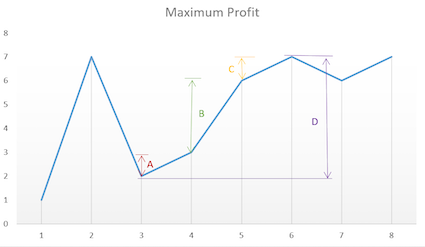

Say you have an array for which the $i^{th}$ element is the price of a given stock on day $i$.

Design an algorithm to find the maximum profit. You may complete as many transactions as you like (i.e., buy one and sell one share of the stock multiple times).

Note: You may not engage in multiple transactions at the same time (i.e., you must sell the stock before you buy again).

Example 1:

```
Input: [7,1,5,3,6,4]
Output: 7
Explanation: Buy on day 2 (price = 1) and sell on day 3 (price = 5), 
             profit = 5-1 = 4.
             Then buy on day 4 (price = 3) and sell on day 5 (price = 6),
             profit = 6-3 = 3.
```

Example 2:

```
Input: [1,2,3,4,5]
Output: 4
Explanation: Buy on day 1 (price = 1) and sell on day 5 (price = 5), 
             profit = 5-1 = 4.
             Note that you cannot buy on day 1, buy on day 2 and sell them later, 
             as you are engaging multiple transactions at the same time. 
             You must sell before buying again.
```

Example 3:

```
Input: [7,6,4,3,1]
Output: 0
Explanation: In this case, no transaction is done, i.e. max profit = 0.
```

#### 分析

这道题目是[121. Best Time to Buy and Sell Stock](121. Best Time to Buy and Sell Stock.md)的升级版，但是个人感觉难度反而降低了。因为很明显最大利润即是每段时间的股票升值之和。





```java
public int maxProfit(int[] prices) {
    int profit = 0;
    for (int i = 1; i < prices.length; i++)
        if (prices[i] > prices[i - 1]) 
            profit += prices[i]  - prices[i - 1];
    return profit;
}
```

