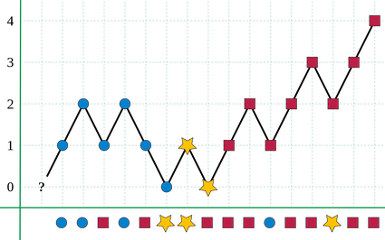

Given an array of size $n$, find the majority element. The majority element is the element that appears *more than* $⌊ n/2 ⌋$ times.

You may assume that the array is non-empty and the majority element always exist in the array.

Example 1:

```
Input: [3,2,3]
Output: 3
Example 2:

Input: [2,2,1,1,1,2,2]
Output: 2
```


#### Java

最直接的方法是使用哈希表存储每个元素出现的次数。当某一元素出现的次数超过数组长度的一半时，即该元素是寻找的元素。

```Java
public int majorityElement(int[] nums) {
    if (nums == null || nums.length == 0) return 0;
    HashMap<Integer, Integer> map = new HashMap<>();
    int half = nums.length / 2;
    for (int num : nums)
        map.put(num, map.getOrDefault(num, 0) + 1);
    for (int n : map.keySet())
        if (map.get(n) > half) return n;
    return 0;
}
```

最巧妙的算法是Moore Algorithm:



```Java
public int majorityElement(int[] nums) {
    int major = nums[0], count = 1;
    for(int i = 1; i < nums.length; i++)
        if (count == 0) {
            count++;
            major = num[i];
        } else if (major == num[i]) count++;
        } else count--;
    return major;
}
```

