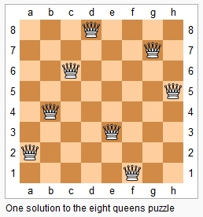

#### 题目

The $n$-queens puzzle is the problem of placing $n$ queens on an $n\times n$ chessboard such that no two queens attack each other.

Given an integer $n$, return all distinct solutions to the $n$-queens puzzle.





Each solution contains a distinct board configuration of the n-queens' placement, where `'Q'` and `'.'` both indicate a queen and an empty space respectively.

Example:

```
Input: 4
Output: [
 [".Q..",  // Solution 1
  "...Q",
  "Q...",
  "..Q."],

 ["..Q.",  // Solution 2
  "Q...",
  "...Q",
  ".Q.."]
]
```

Explanation: There exist two distinct solutions to the 4-queens puzzle as shown above.


#### 分析

N皇后问题。一个皇后$q(x,y)$能被满足以下条件的皇后$q(row,col)$吃掉

*  $x = row$ (纵向)
*  $y = col$（横向）
*  $col + row = y + x$（反对角线）
*  $col - row = y - x$（对角线）


方法是使用回溯法，具体思路可见[这里](../Algorithm/Backtracking.md)。类似于走迷宫，由于每一行都只能有一个皇后，所以可以先在第一行放一个皇后，然后在第二行....第$N$行放皇后，每次放置后确认是否有效，如果无效，则回退，在该行的下一列放置。


```Java tab="Java"
public List<List<String>> solveNQueens(int n) {
    List<List<String>> list = new ArrayList<>();
    if (n <= 0) return list;
    char[][] board = new char[n][n];
    for (int i = 0; i < n; i++)
        for (int j = 0; j < n; j++)
            board[i][j] = '.';
    solveNQueens(list, board, 0);
    return list;
}
    
private void solveNQueens(List<List<String>> list, char[][] board, int col){
    int n = board.length;
    // base case
    if (col == n) {
        List<String> strList = new ArrayList<>();
        for (int i = 0; i < n; i++)
            strList.add(new String(board[i]));
        list.add(strList);
    } else {
        for (int i = 0; i < n; i++) {
            if (isSafe(board, i, col)) {
                board[i][col] = 'Q';
                solveNQueens(list, board, col + 1);
                board[i][col] = '.';
            } // end if
        } // end for
    } // end case
}
    
    
private boolean isSafe(char[][] board, int row, int col) {
    // 每一行只有一个
    int n = board.length;
    for (int j = 0; j < col; j++)
        if (board[row][j] == 'Q') return false;
    // 每一列只有一个
    for (int i = 0; i < n; i++)
        if (i != row && board[i][col] == 'Q') return false;
    // 反对角线上只有一个: i + j = row + col
    int s = row + col;
    for (int i = 0; i < n; i++) {
        int j = s - i;
        if (j >= 0 && j < n && j != col && board[i][j] == 'Q') return false;
    }
    
    // 对角线上只有一个: i - j = row - col
    s = row - col;
    for (int i = 0; i < n; i++) {
        int j =  i - s;
        if (j >= 0 && j < n && j != col && board[i][j] == 'Q') return false;
    }
    return true;
}
```

```cpp tab="cpp"
vector<vector<string>> solveNQueens(int n) {
    vector<string> board(n, string(n, '.'));
    vector<vector<string>> res;
    solveNQueensHelper(n, 0, board, res);
    return res;
}
    
void solveNQueensHelper(int n, int column, vector<string>& board, vector<vector<string>>& res){
    if (column == n){// 容易错写成 column == n-1
        // base case
        res.push_back(board);
    } else {
        for (int row = 0; row < n; row++){
            if (valid_queens(board, column, row)){
                // choose
                board[row][column] = 'Q';
                // explore
                solveNQueensHelper(n, column + 1, board, res);
                // unchoose
                board[row][column] = '.';
            }
        }
    }
}
    
    
//确定棋盘上皇后位置是不是有效的
bool valid_queens(vector<string>& board, int column, int row){
    int n = board.size();
    //1）x = row (横向)
    for(int i = 0; i < n; i++)
        if (board[row][i]=='Q') return false;

    //2) y = col（纵向）：默认true

    //3）col + row = y + x;（反对角线）
    int s = column + row;
    for( int i = column - 1; i >= 0 && s - i < n; i--)
        if (board[s-i][i]=='Q') return false;

    //4) col - row = y - x;（对角线）
    s = column - row;
    for (int i = column - 1; i >= 0 && i - s >= 0; i--)
        if (board[i-s][i] == 'Q') return false;
    return true;
}
```


