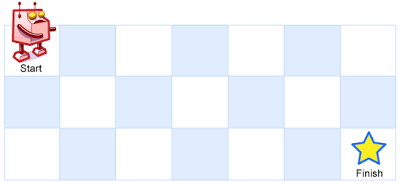

A robot is located at the top-left corner of a $m \times n$ grid (marked 'Start' in the diagram below).

The robot can only move either down or right at any point in time. The robot is trying to reach the bottom-right corner of the grid (marked 'Finish' in the diagram below).

How many possible unique paths are there?



<small>Above is a 7 x 3 grid. How many possible unique paths are there?</small>

**Note**: $m$ and $n$ will be at most 100.

Example 1:

```
Input: m = 3, n = 2
Output: 3
Explanation:
From the top-left corner, there are a total of 3 ways 
    to reach the bottom-right corner:
1. Right -> Right -> Down
2. Right -> Down -> Right
3. Down -> Right -> Right
```

Example 2:

```
Input: m = 7, n = 3
Output: 28
```

#### 分析

这道题目要求路径的数量，又是二维棋盘，一看就是典型的动态规划题目。设想机器人站在终点坐标($m-1, n-1$)上，那么它的上一步来自哪里呢？有且仅有两种可能，来自($m-2, n-1$)和来自($m-1, n-2$)。那么答案非常明显了。这种自顶向下的方法形成的代码如下：

```Java
public int uniquePaths(int m, int n) {
    if (m == 0 || n == 0) return 0;
    int[][] numPaths = new int[m + 1][n + 1];
    numPaths[1][1] = 1;
    for (int i = 1; i < m + 1; i++)
        for (int j = 1; j < n + 1; j++) {
            if (i == 1 && j == 1) continue;
            numPaths[i][j] = numPaths[i][j - 1] + numPaths[i - 1][j];
        }
    return numPaths[m][n];
}
```


