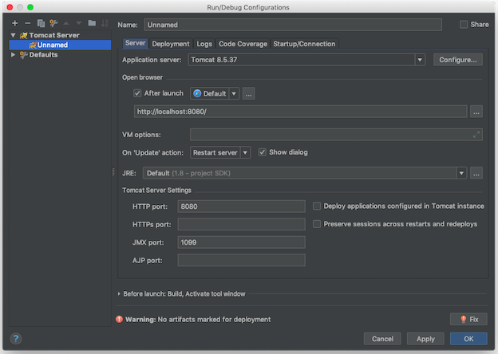

### 1 使用技巧

参见[IntelliJ IDEA神器使用技巧](https://www.imooc.com/learn/924)。

#### 跳转
待续。。
#### live template

在Editor-Live Templates里可以设置和查看

* `psvm`: `public static void main()`方法
* `sout`: `System.out.println()`方法

#### 重构
。。。待续

Command + N 自动生成方法getter, setter, constructor

### 2 Web开发
#### 开发环境准备

* IntelliJ IDEA
* JDK 1.8
* Apache-tomcat-8.0.35

下面简单描述下安装Apache Tomcat的过程：

* 官网下载地址：http://tomcat.apache.org/download-80.cgi
* 环境变量：设置`CATALINA_HOME`环境变量为Tomcat包的根目录。
* 启动tomcat: `./startup.sh`
* 登入首页：输入http://localhost:8080/即可！

选择IntelliJ IDEA的`Preference | Application Servers`, 选择右侧➕，添加Tomcat根目录


#### 创建Web应用

在配置完IDEA以后，就可以开始创建Web应用了。 可以参考[IntelliJ IDEA官方文档](http://www.jetbrains.com/help/idea/enabling-web-application-support.html)


当创建项目时，选择Java Enterprise, 然后在Additional Libraries and Frameworks下勾选Web Application。


另外，在`File | Project Structure | Modules`右侧dependencies选项卡中添加Tomcat依赖。

选择`Run | Edit Configures`, 在左侧点击加号➕，添加Tomcat Server配置，选择Local，



在右侧Deployment选项卡中，点击加号➕，添加war部署。


!!! note "war包"
    
    war包是一个web归档(**W**eb **AR**chieve)，是Web应用的一个快照，里面包含web应用所需要的所有内容，其中包括web.xml的配置文件，前端的页面文件，以及依赖的jar。jar包就是java的类进行编译生成的class文件打包的压缩包。
    
       * war模式：将web工程以war包的形式上传到服务器 
       * war exploed模式：将web工程以当前文件夹的位置关系上传到服务器，开发时使用

接下来就可以运行了，选择`Run | index.jsp`，完成以后，浏览器会自动打开。

#### Web工程发布目录结构

```text
|-- web  
-------
                         # 站点根目录
    |-- META-INF                   # META-INF 目录
    |   `-- MANIFEST.MF            # 配置清单文件
    |-- WEB-INF                    # WEB-INF 目录
    |   |-- classes                # class文件目录
    |   |   |-- *.class            # 程序需要的 class 文件
    |   |   `-- *.xml              # 程序需要的 xml 文件
    |   |-- lib                    # 库文件夹
    |   |   `-- *.jar              # 程序需要的 jar 包
    |   `-- web.xml                # Web应用程序的部署描述文件
    |-- <userdir>                  # 自定义的目录
    |-- <userfiles>                # 自定义的资源文件
```

* `web`：工程发布文件夹。其实每个war包都可以视为webapp的压缩包。
* `META-INF`：META-INF目录用于存放工程自身相关的一些信息，元文件信息，通常由开发工具，环境自动生成。
* `WEB-INF`：Java web应用的安全目录。所谓安全就是客户端无法访问，只有服务端可以访问的目录。
* `/WEB-INF/classes`：存放程序所需要的所有Java class文件。
* `/WEB-INF/lib`：存放程序所需要的所有jar文件。
* `/WEB-INF/web.xml`：web应用的部署配置文件。它是工程中最重要的配置文件，它描述了servlet和组成应用的其它组件，以及应用初始化参数、安全管理约束等。

