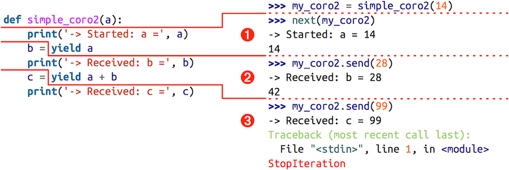

#### Generators as Coroutines

#### How Coroutines Evolved from Generators
Coroutines(协程) via Enhanced Generators was implemented in Python 2.5, and add `.send` method to generator objects.

Using `.send()`, the caller of the generator can post data that then becomes the value of the `yield` expression inside the generator function. This allows a generator to be used as a coroutine: a procedure that collaborates with the caller, yielding and receving values from the caller.
A coroutine can be in one of four states. You can determine the current state using the `inspect.getgeneratorstate(..)` function, which returns one of these strings:

* `GEN_CREATED`: waiting to start execution.
* `GEN_RUNNING`: currently being executed by the interpreter
* `GEN_SUSPENDED`: currently suspended at a `yield` expression
* `GEN_CLOSED`: execution has completed.

```python
GEN_CREATED
-> Started: a= 10
10
GEN_SUSPENDED
-> Received: b= 28
38
-> Received: c= 99
StopIteration
GEN_CLOSED
```

Execution of the `simple_coro2` coroutine can be split in three phases:



1. next(my_coro2) prints first message and runs to yield a, yielding number 14.
2. my_coro2.send(28) assigns 28 to b, prints second message, and runs to yield a + b, yielding number 42.
3. my_coro2.send(99) assigns 99 to c, prints third message, and the coroutine terminates.
The Example below uses coroutine to compute a running average.
#### Coroutine Termination and Exception Handling