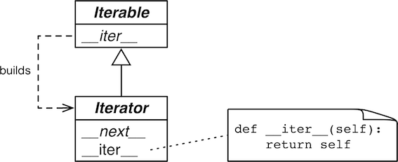

Fluent Python Chapter 14读书笔记

#### 可迭代对象

> An **iterable** is an object that has an `__iter__` method which returns an iterator, or which defines a `__getitem__` method that can take sequential indexes starting from zero. So an iterable is an object that you can get an iterator from.

Python中的对象，只要它定义了可以返回一个迭代器的`__iter__`方法，或者定义了可以支持下标索引的`__getitem__`方法，那么它就是一个可迭代对象(Iterable)。简单说，可迭代对象就是能提供迭代器的任意对象。

It’s important to be clear about the relationship between iterables and iterators: Python obtains iterators from iterables.

The most accurate way to check whether an object $x$ is iterable is to call `iter(x)` and handle a `TypeError` exception if it isn’t.
```python
Is Sentence(hello) iterable? True.
```

The `iter` built-in function:

1. Checks whether the object implements `__iter__`, and calls that to obtain an iterator.
2. If `__iter__` is not implemented, but `__getitem__` is implemented, Python creates an iterator
    that attemps to fetch items in order, starting from index 0 (zero).
3. If that fails, Python raises `TypeError`, usually saying "C object is not iterable", where C is 
    the class if the target object.
#### 迭代器

> An iterator is an object with a `__next__` and `__iter__` method.
> 迭代器是定义了`__next__` 和`__iter__`方法的对象。

The standard interface for an iterator has two methods:

* `__next__`: Returns the next available item, raising `StopIteration` when there are no more items.
* `__iter__`: Returns `self`; this allows iterators to be used where an iterable is expected, for example, in a `for` loop.



Since iterators also implement the` __iter__` method, they are iterable as well.
```python
The
time
has
come
```

The best way to check if an object `x` is an iterator is to call `isinstance(x, abc.Iterator)`.
```python
True
```

!!! note
    可迭代对象不能把自己作为迭代器。也就是说，可迭代对象有实现`__next__`方法。这遵循了[迭代器设计模式](../../Java/Head First设计模式/9 Iterator and Composite Pattern.md)：如果可迭代对象实现了`__next__`，它不能满足多次迭代的需要。正确的做法是将可迭代对象和迭代器分离。
#### 生成器

And Python function that has the `yield` keyword in its body is a **generator function**(生成器函数): a function which called, return a **generator**(生成器) object.
The `__iter__` method below is a generator function which, when called, builds a generator object that implements the iterator interface, So the `SentenceIterator` class is no longer needed.
A **generator expression**(生成器表达式) can be understood as a lazy version of a list comprehension: It does not eagerly build a list, but returns a generator that will lazily produce the items on demand.
```python
<generator object <genexpr> at 0x107a4bb10>
```

```python
hello
world
```
