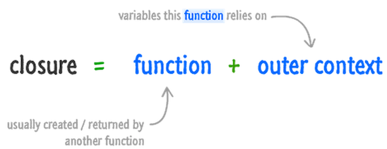
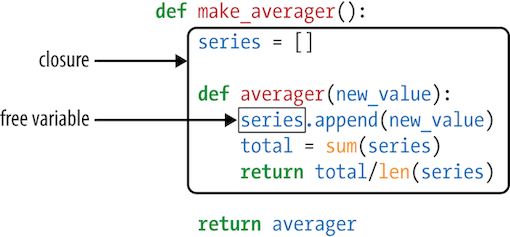

### Decorators 101

A decorator is a callable that takes another function as argument(the decorated function).

In other words, assuming an existing decorator named `decorate` and returns it or replaces it with another function or callable object.

```python
@decorate
def target():
    print('running target()')
```
Has the same effect as writing this:

```python
def target():
    print('running target()')
target = decorate(target)
```

A decorator usually replaces a function with a different one:
```python
running inner()
<function deco.<locals>.inner at 0x105cf09d8>
```

Decorators are just syntatic sugar(语法糖). The crucial fact about decorators:

* They have power to replace the decorated function with a different one.
* They are executed immediately when a module is loaded.
### When Python Executes Decorators

A key feature of decorators is that they run right after the decorated function is defined. This is usually at *import time*.
```python
running register(<function f1 at 0x105cf0bf8>)
running register(<function f2 at 0x105cf0d90>)
running main()
registry -> [<function f1 at 0x105cf0bf8>, <function f2 at 0x105cf0d90>]
running f1()
running f2()
running f3()
```

### Variable Scope Rules

In the example below, varibable $b$ is local, because it is assigned a value in the body of the function:
But the fact is, when Python compiles the body of the function, it decides that $b$ is a local variable because it is assigned within the function. The generated bytecode reflects this decision and will try to fetch $b$ from the local environment. Later, when the call `f2(3)` is made, the body of `f2` fetches and prints the value of the local variable $a$, but when trying to fetch the value of local variable $b$ it discovers that $b$ is unbound.
Module `dis` is disassamber(反汇编程序) of python byte code into mnemonics.
```python
  3           0 LOAD_GLOBAL              0 (print)
              2 LOAD_FAST                0 (a)
              4 CALL_FUNCTION            1
              6 POP_TOP

  4           8 LOAD_GLOBAL              0 (print)
             10 LOAD_FAST                1 (b)
             12 CALL_FUNCTION            1
             14 POP_TOP

  5          16 LOAD_CONST               1 (9)
             18 STORE_FAST               1 (b)
             20 LOAD_CONST               0 (None)
             22 RETURN_VALUE
```

`10 LOAD_FAST                1 (b)`: load *local* name $b$. This shows that the compiler considers $b$ a local variable, even if the assignment to $b$ occurs later.
If we want the interpreter to treat `b` as a global variable in spite of the assignment within the fuction, we use the `global` declaration:
```python
3
6
```

### Closures
> A **closure**(闭包) is a function that retains the bindings of the free variables that exist when the function is defined, so that they can be used later when the function is invoked and the defining scope is no longer available.



用比较容易懂的人话说，就是当某个函数被当成对象返回时，夹带了自由变量，就形成了一个闭包。
Consider an `avg` function is compute the mean of an ever-increasing series of values; for example, the average closing price of a commodity over its entire history. Every day a new price is added, the average is computed taking into account all prices so far.
The example below is a functional implementation, using the higher-order fucntion `make_averager`:

When invoked, `make_averager` returns an `averager` function object. Each time an `averager` is called, it appends the passed argument to the series, and computes the current average:
```python
10.5
```

It’s obvious where the `avg` of the `Averager` class keeps the history: the `self.series `instance attribute. But where does the `avg` function in the second example find the series?

Note that `series` is a local variable of `make_averager` because the initialization `series = []` happens in the body of that function. But when `avg(10)` is called, `make_averager` has already returned, and its local scope is long gone.
Within `averager`, `series` is a **free variable**(<small>自由变量</small>): a variable that is not bound in the local scope.

The closure for `averager` extends the scope of that function to include the binding for the free variable `series`.



Inspecting the function created by `make_averager`, variables in the `__code__` attribute represents the compiled body of the function.

```python
('new_value', 'total')
('series',)
(<cell at 0x105ce5a38: list object at 0x105cee948>,)
[10, 11]
```

### The nonlocal Declaration
Our previous implementation of `make_averager` was not efficient. A better implemtation would just store the total and the number of items so far, and compute the mean from these two numbers.
The problem is that the statement `count += 1` actually means the same as `count = count + 1` and makes it a local variable.
We did not have this problem in the previous example, because lists are mutable, and we only called `series.append`.

To work around this, the **`nonlocal`** declaration was introduced in Python 3. It lets you flag a variable as a free variable even when it is assigned a new value within the function. If a new value is assigneed to a `nonlocal` variable, the binding stored in the closure is changed.
```python
10.0
```

### Implementing a Simple Decorator


The example below is a decorator that clocks every invocation of the decorated function and prints the elapsed time, the arguments passed, and the result of the call.
Using the clock decorator
```python
**************************************** Calling snooze(.123)
[0.12306164s] snooze(0.123) -> None
**************************************** Calling factorial(6)
[0.00000059s] factorial(1) -> 1
[0.00006956s] factorial(2) -> 2
[0.00011655s] factorial(3) -> 6
[0.00015603s] factorial(4) -> 24
[0.00022499s] factorial(5) -> 120
[0.00027834s] factorial(6) -> 720
6! =  720
```

In the  example, `clock` gets the `factorial` function as its `func` argument. It then creates and returns the `clocked` function, which the Python interpreter assigns to `factorial` behind the scenes. In fact, if you check the `__name__` of `factorial`, this is what you get:
```python
'clocked'
```

So `factorial` now actually holds a reference to the `clocked` function.

This is the typical behavior of a decorator: **it replaces the decorated function with a new function that accepts the same arguments and (usually) returns whatever the decorated function was supposed to return, while also doing some extra processing.**

The example uses the `functools.wraps` decorator to copy the relevant attributes from `func` to `clocked`. Also, keyword arugments are correctly handled.
### Decorators in the Standard Library

Two of the most interesting decorators in the standard library are `lru_cache` and the brand-new `singledispatch`. Both are defined in the `functools` module.
#### Memoization with functools.lru_cache

`functools.lru_cache` implements memoization: an optimization technique that works by saving the results of previous invocations of an expensive function, avoiding repeat computations on previoysly used arguments.

A good demonstration is to apply `lru_cache` to the painfully slow recursive function to generate the $n$th number in the Fibonacci sequence.
```python
[0.00126672s] fibonacci(0) -> 0
[0.00000119s] fibonacci(1) -> 1
[0.00161910s] fibonacci(2) -> 1
[0.00000095s] fibonacci(1) -> 1
[0.00000095s] fibonacci(0) -> 0
[0.00000000s] fibonacci(1) -> 1
[0.00008488s] fibonacci(2) -> 1
[0.00016570s] fibonacci(3) -> 2
[0.00186491s] fibonacci(4) -> 3
[0.00000000s] fibonacci(1) -> 1
[0.00000119s] fibonacci(0) -> 0
[0.00000000s] fibonacci(1) -> 1
[0.00005317s] fibonacci(2) -> 1
[0.00010490s] fibonacci(3) -> 2
[0.00000095s] fibonacci(0) -> 0
[0.00000000s] fibonacci(1) -> 1
[0.00005078s] fibonacci(2) -> 1
[0.00000000s] fibonacci(1) -> 1
[0.00000119s] fibonacci(0) -> 0
[0.00000000s] fibonacci(1) -> 1
[0.00005412s] fibonacci(2) -> 1
[0.00010490s] fibonacci(3) -> 2
[0.00020719s] fibonacci(4) -> 3
[0.00036478s] fibonacci(5) -> 5
[0.00505400s] fibonacci(6) -> 8
```

The waste is obvious: `fibonacci(1)` is called eight times, `fibonacci(2)` five times, etc. But if we just add two lines to use `lru_cache`, performance is much improved.
```python
[0.00000095s] fibonacci(0) -> 0
[0.00000215s] fibonacci(1) -> 1
[0.00030684s] fibonacci(2) -> 1
[0.00000215s] fibonacci(3) -> 2
[0.00038600s] fibonacci(4) -> 3
[0.00000215s] fibonacci(5) -> 5
[0.00046492s] fibonacci(6) -> 8
```
