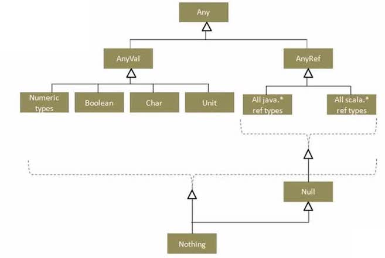
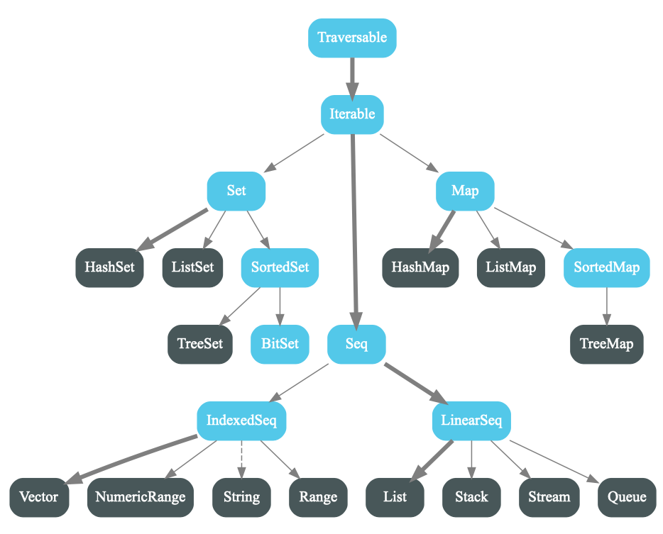
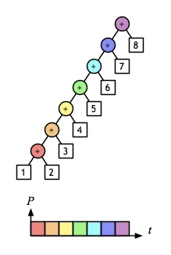

### 1 函数式编程思想

> In computer science, functional programming is a programming paradigm –– a style of building the structure and elements of computer programs –– that **treats computation as the evaluation of mathematical functions** and **avoids changing-state and mutable data**.<small>[Wiki](https://en.wikipedia.org/wiki/Functional_programming)</small>


* 函数式编程(functional programming) 或称函数程序设计，又称泛函编程，是一种编程范型。
* 它将电脑运算视为数学上的函数计算，并且避免使用程序状态以及可变对象。
* 函数编程语言最重要的基础是λ演算（lambda calculus), 而且λ演算的函数可以接受函数当作输入（引数）和输出（传出值）。
* 函数式编程强调程序执行的结果而非执行的过程，倡导利用若干简单的执行单元让计算结果不断渐进，逐层推导复杂的运算，而不是设计一个复杂的执行过程。
**纯函数**

尽量使用纯函数(pure function)编程, 纯函数是没有副作用的函数，相同的输入，永远会得到相同的输出。
**副作用**

所谓"副作用"（side effect），指的是函数内部与外部互动（最典型的情况，就是修改全局变量的值），产生运算以外的其他结果。

函数式编程强调没有"副作用"，意味着函数要保持独立，所有功能就是返回一个新的值，没有其他行为，尤其是不得修改外部变量的值。

```scala
var x = 1
def XplusY_v1(y: Int) = x + y // 纯函数
def XplusY_v2(y: Int) = {x = x + y; x}
```

这里 XplusY_v2对 x 就有副作用, 函数执行之后 x 的状态会发生变化
而 XplusY_v1 执行之后不会改变 x 的值, XplusY_v1是纯函数
**引用透明性**

引用透明性(referential transparency)

* 定义: 如果$f(x)$的参数和函数体都是引用透明的, 那么函数$f$是纯函数
* 特点: 对于相同的输入, 总是得到相同的输出.就是说，表达式的值不依赖于值可以改变的全局状态。

```scala
var x = new StringBuild("Hello")
var y = x.append("world")
var z = x.append("world")
```

上面形同的表达式`x.append("world")`得到的结果不同, 由于$x$是一个值可以改变的变量

**不变性**

不变性(Immutablity)

为了获得透明性, 任何值都不能改变。

**函数是一等公民**

(First-class Function)
函数与其他数据类型一样，处于平等地位，可以赋值给其他变量，也可以作为参数，传入另一个函数，或者作为别的函数的返回值。

**表达式求值策略**

* 严格求值 Call By Value
* 非严格求值 Call By Name
* 惰性求值 Lazy Evaluation

**递归函数**

* 递归实现循环: 尾递归(Tail Recursion)
**函数式编程的优势**

* 生产效率高: 同样功能的程序，代码短
* 易于推理：
* 并行计算：具有引用透明性

Martin Odersky的演讲

* PPT：http://www.slideshare.net/Odersky/oscon-keynote-working-hard-to-keep-it-simple
* video： https://www.youtube.com/watch?v=3jg1AheF4n0
 
**函数式编程的崛起**
 
 摩尔定律失效，函数式编程适合于并行计算。
### 2 Scala开发环境


略

### 3 Scala的语言基础

####  变量

三种变量修饰符

*   `val`定义immutable variable
*   `var`定义mutable variable
*   `lay val`定义惰性变量，实现延迟加载(懒加载)

可以不显式指定变量的类型，因为Scala会自动进行类型推导。
####  数据类型

Scala的数据类型层级关系：



* `AnyVal`是所有值类型的基础类型
* `AnyRef`是所有引用类型的基础类型
* `Unit`空类型，相当于Java中的Void
* `Noting`，一切类型的子类型，通常表示程序异常中止
```scala
u: Unit = ()
p: Unit = ()
foo: ()Nothing
```

Scala的String构建于Java的String之上，新增了字符串插值(interpolation)的特性。
```scala
myname: String = zhenhua
res: String = My name is zhenhua
```

#### 函数与代码块

代码块的两个写法

```scala
{exp1; exp2}

{
exp1
exp2
}
```

Scala的代码块也是一个表达式, 其最终求得的值是最后一个表达式的值。

函数的格式：
```scala
def functionName(param: ParamType): ReturnTye = {
    // function body: expressions
}
```
#### if与for

scala里，`if`是表达式：`if (logical_exp) val_A else valB`
```scala
a: Int = 1
res2: Any = ()
```

for comprehension是scala的一种语法糖。
```scala
l: List[String] = List(alice, bob, cathy, "")
result1: List[String] = List(alice, cathy)
result2: List[String] = List(ALICE, BOB, CATHY)
```

#### try表达式

try表达式格式

```scala
try{}
catch{}
finally{}
```

看一个例子：
```scala
always be printed
```

#### match表达式

match表达式格式

```scala
exp match {
    case p1 => val1
    case p2 => val2
    ...
    case _ => valn
}
```
```scala
code: Int = 1
result: String = one
```

### 4 求值策略

Scala有两种求值策略:

* Call By Value 传值调用，对函数实参求值，且只求一次，如果作为参数值需要对表达式先进行求值
* Call By Name 传名调用，对函数实参每次在函数体内被调用时都会求值

通常使用Call By Value，如果函数形参以 => 开头，那么会使用Call By Name。

```scala
def foo(x: Int) = x // call by value
def foo(x: => Int) = x //call by name
```

看下面两个例子

```scala
def test1(x: Int, y: Int): Int = x * x
def test2(x: => Int, y: => Int): Int = x * x
```

计算过程:

```
test1(3+4, 8)   test2(3+4, 8)   test1(7, 2 *4)  test2(7, 2 *4)
 test1(7, 8)     (3+4)*(3+4)     test1(7, 8)         7*7          
   7*7             7*(3+4)         7*7                49           
   49               7*7             49                            
                     49 
```

传名调用使用=>表示，跟传值调用的区别就在于，

* 传名调用是把函数名字传递过去，使用时才真正执行函数
* 传值调用是首先计算函数值，然后把值传过去

```scala
def bar1(x: Int, y: =>Int) = 1
def bar2(x: => Int, y: =>Int) = 1
def loop(): Int = loop
```

* `bar1(loop, 1)`: 死循环, 先要计算loop从而陷入死循环
* `bar2(loop, 1)`: 表达式值为1 
### 5 高阶函数
#### Scala函数与匿名函数

在Scala中，函数是第一等公民。

Scala语言支持：

1. 把函数作为实参传递给另外一个函数
2. 把函数作为返回值
3. 把函数赋值给变量
4. 把函数存储在数据结构里

在Scala中，函数就像普通变量一样，同样也具有函数的类型。


**函数类型**

函数类型的格式为A=>B, 表示一个接收类型A的参数，并返回类型B的函数。

例子：`Int=> String`是把整型映射为字符串的函数类型

**高阶函数**

用函数作为形参或返回值的函数，称为高阶函数。
```scala
operate: (f: (Int, Int) => Int)Int
greeting: ()String => String
```

**匿名函数**

匿名函数(Anonymous Function)，就是函数常量，也称为函数文字量(Function Literal)。

在Scala里，匿名函数的定义格式为

(形参列表) => {函数体}
#### 柯里化

科里化的概念很简单：只传递给函数一部分参数来调用它，让它返回一个函数去处理剩下的参数。


**柯里化函数**(curried Function)把具有多个参数的函数转换成一条函数链, 每个节点上是单一参数。

下面两个例子的函数定义是等价的:

```scala
def add(x: Int, y: Int) = x + y
def add(x: Int)(y: Int) = x + y //scala里柯里化的语法
```
```scala
curriedAdd: (x: Int)(y: Int)Int
addOne: Int => Int = <function1>
res1: Int = 4
```

#### Recursive Function(递归函数)

当编译器检测到一个函数是尾递归的时候,会覆盖当前的活动记录而不是在栈中去创建一个新的
### 6 Scala Immutable Collection

`scala.collection.immutable`的层次关系。

#### List[T]

下面讲解如何创建List。
```scala
a: List[Int] = List(1, 2, 3, 4)
b: List[Int] = List(0, 1, 2, 3, 4)
c: List[String] = List(x, y, z)
d: List[Any] = List(1, 2, 3, 4, x, y, z)
```

接下来讲解如何访问List里面的元素。
```scala
1
List(2, 3, 4)
true
```

下面讲解如何遍历列表
```scala
1,2,3,4,
```

#### Scala List的高级使用

高级函数`filter`, `map`, `takeWhile`

```scala
List(1, 3, 5)
List(9, 9)
List(9, 9,  , R, e, d,  )
```

#### Scala list-map
`list.map`将列表中的每个元素进行函数映射
```scala
res1: List[Char] = List(X, Y, Z)
res2: List[Char] = List(X, Y, Z)
res3: List[Int] = List(11, 13)
q: List[List[Int]] = List(List(1, 2, 3), List(4, 5, 6))
res4: List[List[Int]] = List(List(2), List(4, 6))
res5: List[List[Int]] = List(List(2), List(4, 6))
res6: List[Int] = List(2, 4, 6)
res7: Int = 10
```

#### Scala reduceLeft与foldLeft 

集合的规约操作

```scala
def reduceLeft [B >: A] (f: (B, A) => B): B
```

为了说明reduceLeft的原理，假设函数(T, T) => T执行的是一个求和操作。



```scala
def foldLeft [B] (z: B)(f: (B, A) => B): B
```

区别：

* `reduceLeft`是`foldLeft`的一个特例，相当于`list.tail.foldLeft(list.head)(_)`
#### range和stream

Range：

* `a to b by c`: a到b，步长为c，包括b
* `a until b by c`: a到b，步长为c，不包括b

Stream是一个惰性列表。也就是说只有在用到时，才会求值
```scala
res7: scala.collection.immutable.Range = Range(1, 3, 5, 7, 9)
res8: List[Int] = List(1, 3, 5, 7, 9)
res9: List[Int] = List(1, 3, 5, 7, 9)
stream: scala.collection.immutable.Stream[Int] = Stream(1, 2, ?)
res10: scala.collection.immutable.Stream[Int] = Stream(2, ?)
res11: Int = 1
```

#### tuple与 map
tuple元组，它的定义和元素访问方式如下
```scala
res1: (Int, Int) = (1,2)
res2: (Int, Int) = (1,2)
res3: (Int, String, Double) = (1,Alice,95.5)
res4: Int = 1
```

```scala
a: List[Int] = List(1, 4, 1)
sumSq: (in: List[Int])(Int, Int, Int)
res5: (Int, Int, Int) = (3,6,18)
```

Map[K, V]: 键值对
#### 快速排序
```scala
quickSort: (a: List[Int])List[Int]
res4: List[Int] = List(1, 1, 2, 3, 3, 5)
```
