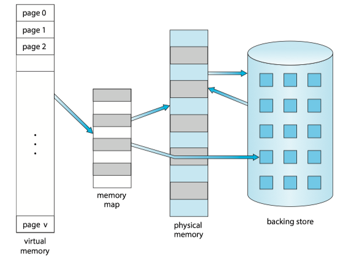
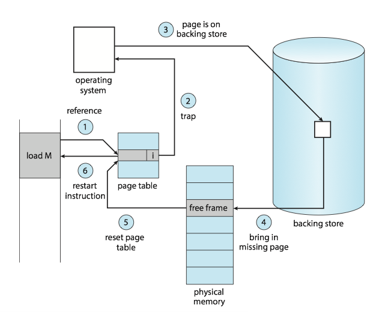
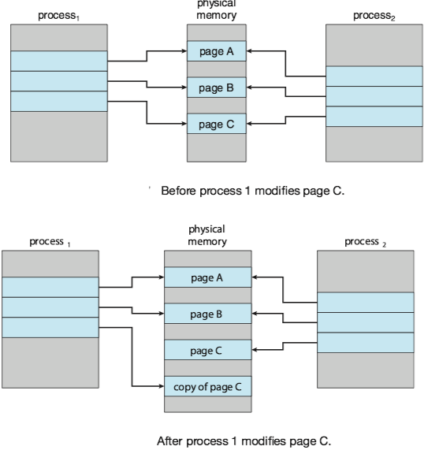
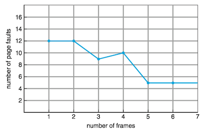
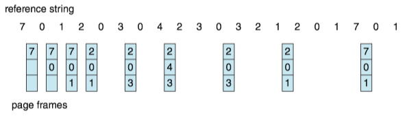
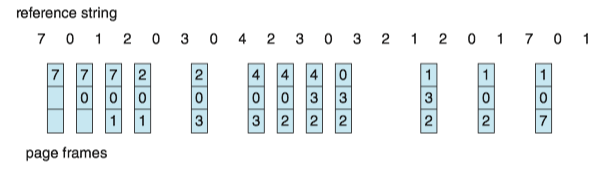
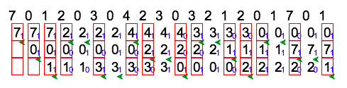
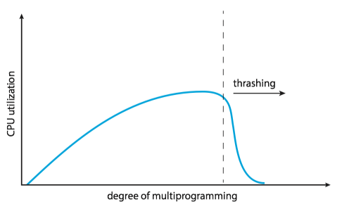
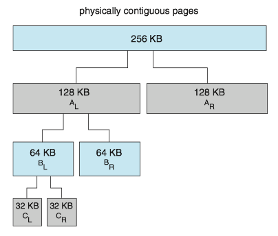

### 1 Background

Various memory-management strategies discussed in [Chapter 9](ch9.md) have the same goal to keep many processes in memory  simultaneously to allow multiprogramming.

PROBLEM: However, they tend to require that an entire process be in memory before it can execute.  In many cases, the entire program is not needed:

* Programs often have code to handle unusual error conditions. This code is almost never executed.
* Arrays, lists, and tables are often allocated more memory than they actually needed.
* Certain options and features of a program may be used rarely.

SOLUTION: Virtual memory allows the execution of processes that are not completely in memory.

ADVANTAGE:

* Programs can be larger than physical memory.
* Virtual memory abstracts main memory as viewed by the programmer from physical memory. It frees programmers from the concerns of memory-storage limitations.
* Virtual memory allows processes to share files and memory through [page sharing](ch9/#shared-pages).

### 2 Demand Paging

QUESTION: How an executable program might be loaded from secondary storage into memory?

OPTION: One option is to load the *entire* program in physical memory at program execution time.

PROBLEM: We may not initially ***need*** the entire program in memory. (e.g. a program starts with a list of available options from which the user is to select).

SOLUTION: **Demand paging**(按需调页) loads pages in memory only when they are needed.

!!! NOTE
    A demand-paging system is similar to a paging system with [swapping](ch9/#swapping-with-paging) where processes reside in secondary memory.

#### Basic Concepts

Since demand paging loads pages in memory only when they are needed, some pages will be in memory and some will be in secondary storage. 
Thus, we need some form of hardware support to distinguish between the two.

The valid bit is set to ensure that the page is in the logical address space of the process and is currently in secondary storage. Access to a page marked invalid causes a **page fault**(缺页).

The procedure for handling this page fault is straightforward:

1. We check page tables (usually kept with the process control block) for this process to determine whether the reference was a valid or an invalid memory access.
2. If the reference was invalid, we terminate the process. If it was valid but we have not yet brought in that page, we now page it in.
3. We find a free frame (by taking one from the free-frame list, for example).
4. We schedule a secondary storage operation to read the desired page into the newly allocated frame.
5. When the storage read is complete, we modify the internal table kept with the process and the page table to indicate that the page is now in memory.
6. We restart the instruction that was interrupted by the trap. The process can now access the page as though it had always been in memory.

In the extreme case, we can start executing a process with *no* pages in memory. This scheme is **pure demand paging**: _never bring a page into memory until it is required_ .

#### Free-Frame List

Most operating system maintain a **free-frame list**, a pool of free frames for satisfying requests, that bring the desired pages from secondary storage into main memory.

Operating system typically allocate free frames using a technique known as **zero-fill-on-demand**, which "zero-out" frames before it is allocated (i.e. *erasing* previous contents). 

#### Performance of Demand Paging

Let $p(0\le p \le 1)$ be **page-fault rage**(缺页率), the probability of a page fault. We would expect $p$ to be close to zero. The effective access time, is 

$$\text{effective access time} = (1-p)\times ma + p\times \text{page fault time}$$

where $ma$ denotes the memory-access time.

With an average page-fault service time of 8 milliseconds and a memory access time of 200 nanoseconds, the effective access time in nanoseconds is $200+7,999,800\times p$. The effective access time is *directly proportional* to the page-fault rate $p$, so it is important to keep the page-fault rate *low* in a demand-paging system.

An additional aspect of demand paging is the handling and overall use of swap space. 

* I/O to swap space is generally faster than that to the file system, because swap space is allocated in much larger blocks, and file lookups an indirect allocation methods are not used ([see details in Chapter 11](ch11/6-swap-space-management)).
* One OPTION: copying an entire file image into the swap space at process startup and then performing demand paging from the swap space.
* Second OPTION: practiced by several operating system, including Linux and Windows ——— to demand-page from the file system initially but to write the pages to swap space as they are replaced.

Mobile operating system typically do not support swapping [[Chapter 9](ch9/#swapping-on-mobile-systems)]. Instead, these systems demand-page from the file system and reclaim read-only pages (such as code) from applications if memory becomes constrained.

### 3 Copy-on-Write

**Copy-on-write**(写时复制) works by allowing the parent and child processes initially to share the same pages, and if either process writes to a shared page, a copy of the shared page is created.

### 4 Page Replacement

When we increase degree of multiprogramming, over-allocating of memory results in page faults. The operating system determines where the desired page is residing on secondary storage but to find that there are *no* free frames on the free-frame list (i.e. all memory is in use).

Most operating systems now combine swapping pages with **page replacement**(页面置换).

#### Basic Page Replacement

If no frame is free, we find one that is not currently being used and free it. When we select a page for replacement, We examine its **modify bit** (or **dirty bit**, see [Example of Core i7](../csapp/ch9/#core-i7_1)).

* The modify bit for a page is set by the hardware whenever any byte in the page is written into, indicating that the page has been modified.
* If the bit is set, we must write the page to storage. Otherwise, we need not write the memory page to storage: it is already there.

We must solve two major problems to implement demand paging:

* **frame-allocation algorithm**: decide how many frames allocate to each process
* **page-replacement algorithm**: select the frames that are to be replaced. In general, we want the one with the lowest page-fault rate.

#### FIFO Page Replacement

The simplest page-replacement algorithm is a first-in, first-out(FIFO) algorithm. 

* We can create a FIFO queue to hold all pages in memory. 
* We replace the page at the head of the queue. 
* When a page is brought into memory, we insert it at the tail of the queue.

DISADVANTAGE: Its performance is not *always* good.

**Belady’s anomaly**: for some page-replacement algorithms, the page-fault rate may increase as the number of allocated frames increases.

Figure below shows the curve of page faults for the reference string `1,2,3,4,1,2,5,1,2,3,4,5` versus the number of available frames, with a FIFO page-replacement algorithm.

#### Optimal Page Replacement, OPT

**Optimal page-replacement**(OPT, 最佳页面置换) algorithm replaces the page that **will not be used for the longest period of time**.

* It has the **lowest** page-fault rate of all algorithms.
* It will never suffer from Belady's anomaly.
* It is different to implement, because it requires future knowledge of the reference string.
* It is used mainly for comparison studies.

#### LRU Page Replacement, LRU

**Least recently used**(LRU, 最近最少使用) algorithm chooses the page that has not been used for the longest period of time.

* We can think of this strategy as the optimal page-replacement algorithm looking backward in time. ( If we let $S^R$ be the reverse of a reference string $S$, then the page-fault rate for the OPT algorithm on $S$ is the same as the page-fault rate of OPT algorithm on $S^R$). 
* The LRU policy is *often* used as a page-replacement algorithm and is considered to be good.
* Best way to implement LRU replacement with a stack of page numbers is using a doubly linked list with a head pointer and a tail pointer.

!!! Note
    Implementation of LRU would be not conceivable without hardware assistance beyond the standard TLB registers. The updating of stack must be done for every memory reference.
    
     If we were to use an interrupt for every reference to allow software to update such data structures, it would slow every memory reference by a factor of at least ten, hence slowing every process by a factor of ten. Few systems could tolerate that level of overhead for memory management.

#### LRU-Approximation Page Replacement

In fact, some systems provide no hardware support, using the form of a reference bit instead. The **reference bit** for a page is set by the hardware whenever that page is referenced(either a *read* or a *write* to any byte in the page).

**Additional-Reference-Bits Algorithm**

We can gain additional ordering information by recording the reference bits at regular intervals. 

* We can keep an 8-bit byte for each page in a table in memory. 
* At regular intervals (say, every 100 milliseconds), a timer interrupt transfers control to the operating system. 
* The operating system shifts the reference bit for each page into the high-order bit of its 8-bit byte, shifting the other bits right by 1 bit and discarding the low-order bit.
* These 8-bit shift registers contain the history of page use for the last eight time periods.
* If we interpret these 8-bit bytes as unsigned integers, the page with the lowest number is the LRU page, and it can be replaced.

**Second-Chance Algorithm**

The number of bits of history included in the shift register can be varied, the number can be reduced to zero, leaving only the reference bit itself.

* When a page has been selected, we inspect its reference bit. 
* If the value is 0, we proceed to replace this page; but if the reference bit is set to 1, we give the page a second chance and move on to select the next FIFO page.
* When a page gets a second chance, its reference bit is cleared, and its arrival time is reset to the current time. 
* Thus, a page that is given a second chance will not be replaced until all other pages have been replaced (or given second chances). I
* n addition, if a page is used often enough to keep its reference bit set, it will never be replaced.

One way to implement the second-chance algorithm (sometimes referred to as the clock algorithm) is as a circular queue.

* A pointer (that is, a hand on the clock) indicates which page is to be replaced next. 
* When a frame is needed, the pointer advances until it finds a page with a 0 reference bit. 
* As it advances, it clears the reference bits. 
* Once a victim page is found, the page is replaced, and the new page is inserted in the circular queue in that position.

A simple example is illustrated by the figure below, in which small blue digits denotes the reference bit and green arrow denotes the pointer.

### 5 Allocation of Frames

#### Minimum Number of Frames

We must allocate at least a minimum  number of frames.

* One reason is performance. Obviously, as the number of frames allocated to each process decreases, the page-fault rate increases.
* Another reason is that when a page fault occurs before an executing instruction complete, the instruction must be restarted. So we must have enough frames to hold all the different pages that any single instruction can reference.

The minimum number of frames is defined by the computer architecture.

#### Allocation Algorithms

**Equal Allocation**

The easiest way to split $m$ frames among $n$ processes is to give everyone an equal share, $m/n$ frames (ignoring frames needed by the operating system for the moment).

**Proportional Allocation**

In proportional allocation, we allocate available memory to each process according to its size. Let the size of the virtual memory for process $p_i$ be $s_i$ , and define $S=\sum s_i$. Then, if the total number of available frames is $m$, we allocate $a_i$ frames to process $p_i$ , where $a_i$ is approximately $a_i=s_i/S\times m$.

#### Global versus Local Allocation

**Global replacement** allows a process to select a replacement frame from the set of *all* frames, even if that frame is currently allocated to some other process; that is, one process can take a frame from another. 

**Local replacement** requires that each process select from only *its own* set of allocated frames.

Local replacement might *hinder* a process, however, by not making available to it other, less used pages of memory. Thus, global replacement generally results in *greater* system throughput. It is therefore the more commonly used method.

**Global Page-Replacement Policy**

Rather than waiting for the free-frame list to drop to zero before we begin selecting pages for replacement, we trigger page replacement when the list *falls below a certain threshold*.

* It attempts to ensure there is *always sufficient free* memory to satisfy new requests.
* When the amount of free memory drops below minimum threshold, a kernel routine (**reapers**) is triggered that begins reclaiming pages from all processes in the system.
* When the amount of free memory reaches the maximum threshold, the reaper routine is suspended.
* The kernel reaper routine typically uses some form of LRU approximation.

### 6 Thrashing

#### Cause of Thrashing

Thrashing may be caused by programs or workloads that present insufficient **locality of reference**(also principle of locality, 访问局部性): if the **working set**(工作集) of a program or a workload cannot be effectively held within physical memory, then constant data swapping, i.e., thrashing, may occur.

Consider the following scenario, which is based on the actual behavior of early paging systems.

* The operating system monitors CPU utilization. 
* If CPU utilizition is too low, we increase the degree of multiprogramming by introducing a new process to the system. 
* A global page-replacement algorithm is used; it replaces pages without regard to the process to which they belong. 
* Now suppose that a process enters a new phase in its execution and needs more frames. It starts faulting and taking frames away from other processes. 
* These processes need those pages, however, and so they also fault, taking frames from other processes. 
* These faulting processes must use the paging device to swap pages in and out. As they queue up for the paging device, the ready queue empties. As processes wait for the paging device, CPU utilization decreases.
* The CPU scheduler sees the decreasing CPU utilization and increases the degree of multiprogramming as a result. 
* The new process tries to get started by taking frames from running processes, causing more page faults and a longer queue for the paging device. 
* As a result, CPU utilization drops even further, and the CPU scheduler tries to increase the degree of multiprogramming even more. Thrashing has occurred, and system throughput plunges. 

QUESTION: To prevent thrashing, we must provide a process with as many frames as it needs. But how do we know how many frames it "needs"? 

The **locality model** of process execution, states that, as a process executes, it moves from locality to locality.

* A **locality** is a set of pages that are actively used together.
* A running program is generally composed of several different localities, which may overlap.
* If we do not allocate enough frames to accommodate the size of the current locality, the process will thrash, since it cannot keep in memory all the pages that it is actively using.

!!! Example
    
    Figure below illustrates the concept of locality and how a process’s locality changes over time. At time (a), the locality is the set of pages {18, 19, 20, 21, 22, 23, 24, 29, 30, 33}. At time (b), the locality changes to {18, 19, 20, 24, 25, 26, 27, 28, 29, 31, 32, 33}. Notice the overlap, as some pages (for example, 18, 19, and 20) are part of both localities.
    
    

#### Working-Set Model

The group of physical memory pages currently dedicated to a specific process is known as the **Working set**(WS, 工作集) for that process. 

!!! Example

    For example, the working set at time $t_1$ is {1, 2, 5, 6, 7}. By time $t_2$ , the working set has changed to {3, 4}.
    
    

If we compute the working-set size $WSS_i$ for each process in the system, the total demand for frames $D$ is $D=\sum WSS_i$.

If the total demand $D$ is greater than the total number of available frames ($D\gt m$), thrashing will occur, because some processes will not have enough frames.

WORKING SET SOLUTION TO THRASHING: 

* The operating system monitors the working set of each process and allocates to that working set enough frames to provide it with its working-set size. 
* If there are enough extra frames, another process can be initiated.
* If the sum of the working-set sizes increases, exceeding the total number of available frames, the operating system selects a process to suspend. 
* The process’s pages are written out (swapped), and its frames are reallocated to other processes. The suspended process can be restarted later.

#### Page-Fault Frequency

The working-set model is successful but seems a clumsy way to control thrashing.

A strategy that uses the **page-fault frequency**(PFF) takes a more direct approach:

* Thrashing has a high page-fault rate. Thus, we control the page-fault rate.
    * When the page fault rate is too high, we know that the process needs more frames.
    * Conversely, if it too low, then the process may have too many frames. 
* We can establish upper and lower bounds on the desired page-fault rate.
    * If the actual page-fault rate exceeds the upper limit, we allocate the process. another frame. 
    * If the page-fault rate falls below the lower limit, we remove a frame from the process.

### 7 Memory Compression

When the number of free frames falls below a certain threshold that would triggers page replacement, rather than paging out modified frames to swap space, we *compress* several frames into a single frame (**memory compression**, 内存压缩), enabling the system to reduce memory usage without resorting to swapping pages.

!!! Example
    For example, the free-frame list contains six frames: `7,2,9,21,27,16`, and the modified frame list contains four frames: `15, 3, 35, 26`.
    In Figure below, frame 7 is removed from the free-frame list. Frames 15, 3, and 35 are compressed and stored in frame 7, which is then stored in the list of compressed frames. The frames 15, 3, and 35 can now be moved to the free-frame list. If one of the three compressed frames is later referenced, a page fault occurs, and the compressed frame is decompressed, restoring the three pages 15, 3, and 35 in memory.
    

### 8 Allocating Kernel Memory

Kernel memory is often allocated from a free-memory pool different from the list used to satisfy ordinary user-mode processes discussed before. There are two primary reasons for this:

* The kernel requests memory for data structures of varying sizes, some of which are less than a page in size. As a result, the kernel must use memory *conservatively* and attempt to *minimize waste* due to fragmentation.
* Certain hardware devices interact directly with physical memory —— without the benefit of a virtual memory interface —— and consequently may require memory residing in physically *contiguous* pages.

#### Buddy System

The buddy system allocates memory from a fixed-size segment consisting of physically contiguous pages.

* Memory is allocated from this segment using a power-of-2 allocator, which satisfies requests in units sized as a power of 2 (4 KB, 8 KB, 16 KB, and so forth).
* A request in units not appropriately sized is rounded up to the next highest power of 2.

Pro and Cons:

* An advantage of the buddy system is how quickly adjacent buddies can be combined to form larger segments using a technique known as **coalescing**(illustrated below in the Example section).
* Rounding up to the next highest power of 2 is very likely to cause internal fragmentation.

!!! Example
    Assume the size of a memory segment is initially 256 KB and the kernel requests 21 KB of memory. The segment is initially divided into two buddies—which we will call $A_L$ and $A_R$ —— each 128 KB in size. One of these buddies is further divided into two 64-KB buddies— $B_L$ and $B_R$ . However, the next-highest power of 2 from 21 KB is 32 KB so either $B_L$ or $B_R$ is again divided into two 32-KB buddies, $C_L$ and $C_R$ . One of these buddies is used to satisfy the 21-KB request. This scheme is illustrated in Figure below, where $C_L$ is the segment allocated to the 21-KB request.

    

    when the kernel releases the $C_L$ unit it was allocated, the system can coalesce $C_L$ and $C_R$ into a 64-KB segment. This segment, $B_L$ , can in turn be coalesced with its buddy $B_R$ to form a 128-KB segment. Ultimately, we can end up with the original 256-KB segment.

#### Slab Allocations

A second strategy for allocating kernel memory is known as **slab allocation**.

* A **slab** is made up of one or more physically contiguous pages. 
* A **cache** consists of one or more slabs.
* Each of caches stores a different type of object. There is one cache per object type.(e.g.  a separate cache for the data structure representing process descriptors, a separate cache for file objects).
* Each **cache** is populated with objects that are instantiations of the kernel data structure the cache represents.(e.g. the cache representing semaphores stores instances of semaphore objects).

!!! Example
    Linux kernel adopted the slab allocator after Version 2.2. Each slab contains some number of objects, which are the data structures being cached. 
    
    Each slab is in one of three states: **full**, **partial**, or **empty**.
    
    * A full slab has no free objects. (All objects in the slab are allocated.) 
    * An empty slab has no allocated objects. (All objects in the slab are free.) 
    * A partial slab has some allocated objects and some free objects.
    
    When some part of the kernel requests a new object, the request is satisfied from a partial slab, if one exists. Otherwise, the request is satisfied from an empty slab.
    
    

The slab allocator provides two main benefits:

* *No* memory is *wasted* due to fragmentation. Each unique kernel data structure has an associated cache, and each cache is made up of one or more slabs that are divided into chunks the size of the objects being represented.
* Memory requests can be satisfied *quickly*. Objects are created in advance and thus can be quickly allocated from the cache. When the kernel has finished with an object and releases it, it is marked as free and returned to its cache, thus making it immediately available for subsequent requests from the kernel.

