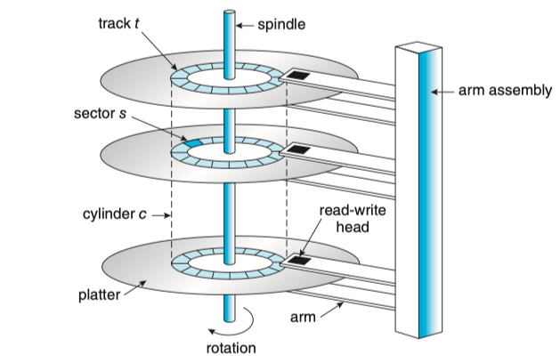
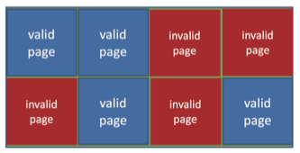
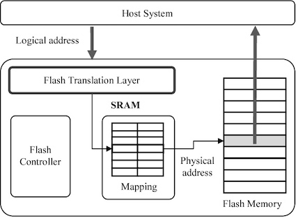

### 1 Overview of Mass-Storage Structure

The bulk of secondary storage for modern computers is provided by **hard disk drives**(**HDD**) and **nonvolatile memory**(**NVM**) devices.

#### Hard Disk Drives

#### Nonvolatile Memory Devices

Most commonly, NVM is composed of a controller and flash NAND die semiconductor chips, which are used to store data.

* more reliable: no moving parts;
* faster: no seek time or rotational latency;
* consume less power

For NVM devices, data cannot be overwritten -- rather, the NAND cells have to be erased first. The erasure, which occurs in a "block" increment that is several pages in size, takes much more time than a read (the fastest operation) or a write ( slower than read, but much faster than erase).

**Drive Writes Per Day**(DWPD, 每日全盘写入次数) measure how much times the drive capacity can be written per day before the drive fails.

Because for NVM, data can't be written before pages are erased, data are commonly written to other free blocks instead of original blocks containing original data. The mechanism decreases the latency of data written. Thus, a NAND block containing valid pages (contains new data) and invalid pages (contains old and deprecated data). 

To track which logical blocks contain valid data, the controller maintains a **flash translation layer**(FTL，闪存转换层)。This table maps which physical pages contain currently valid logical blocks. It also tracks physical block state -- which blocks contain only invalid pages and therefore can be erased.

If there are no free blocks, **garbage collection** could occur -- good data could be copied to other locations, freeing up blocks that could be erased and could then receive the writes. The NVM devices uses **overprovisioning** to store good data from garbage collection -- set asides a number of pages(frequently 20 percentage of the total).

### 2 HDD Scheduling

### 3 NVM Scheduling

NVM devices do not contain moving disk heads and commonly uses an FCFS policy but modifies it to merge adjacent requests. The observed behavior of NVM devices indicates that the time required to service reads is uniform but that, because of the properties of flash memory, write service time is not uniform. Some SSD schedulers have exploited this property and merge only adjacent write requests, servicing all read request in FCFS order.

One way to improve the lifespan and performance of NVM devices over time is to have the file system inform the device when files are deleted, so that the device can erase those files were stored on.

Assume that all blocks have been written to, but there is free space available. Garbage collection must occur to reclaim space taken by invalid data. That means that a write might cause a read of one or more pages, a write of the good data in those pages to overprovisioning space, an erase of the all-invalid-data block, and the placement of that block into overprovisioning space. In summary, one write request eventually causes a page write, one or more page reads (by garbage collection) and one or more page writes ( of good data from the garbage-collected blocks). The creation of I/O requests not by applications but by the NVM device doing garbage collection and space management is called **write amplification*** and can greatly impact the write performance of the device.

### 8 RAID Structure