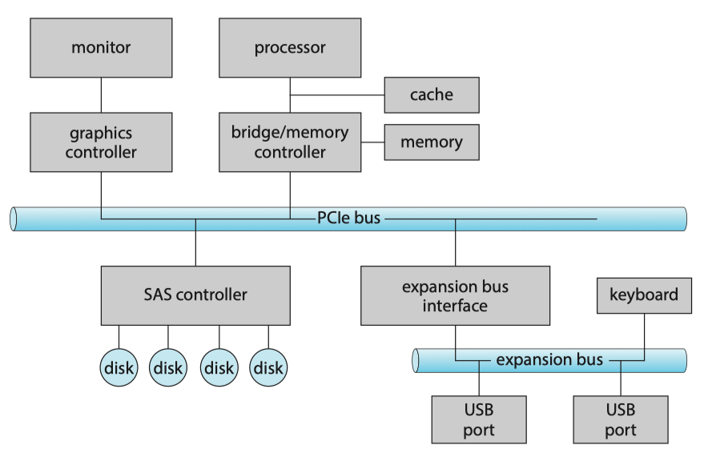
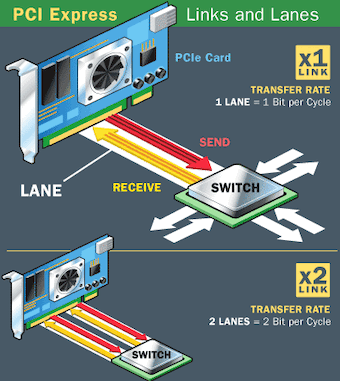
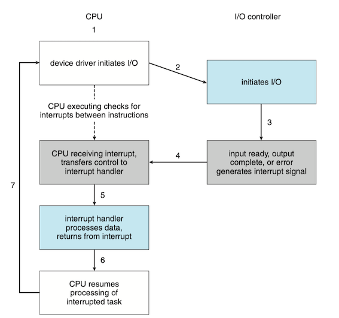
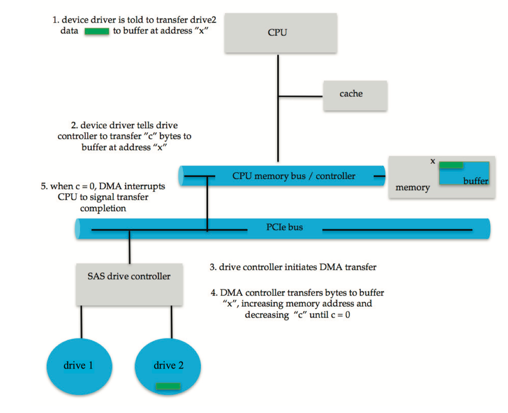
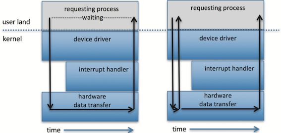
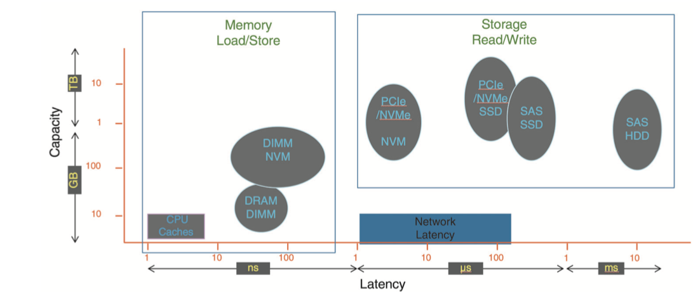

### 1 Overview

### 2 I/O Hardware

The device communicates with the machine via a connection point, or **port**(端口), for example, a serial port（串行端口). If devices share a common set of wires, the connection is called a **bus**(总线). A bus, like the PCI bus, is a set of wires and a rigidly defined protocol that specifies a set of messages that can be sent on the wires.

A typical PC bus structures appears in Figure below: 

* A **PCIe bus**(PCIe总线，通常是系统总线) connects the process-memory subsystem to fast devices;
* An **expansion bus**(扩展总线) connects relatively slow devices, such as the keyboard and serial and USB ports;
* A **serial-attached SCSI**(SAS) bus connects disks.

PCIe is a flexible bus that sends data over one or more lanes. A lane is composed of two signaling pairs, one pair for receiving data and the other for transmitting. Each lane is therefore composed of four wires, and each lane is used as a full-duplex byte system, transporting data packets in an eight-bit byte format simultaneously in both directions.

Each lane of a PCI Express connection contains two pairs of wires -- one to send and one to receive. Packets of data move across the lane at a rate of one bit per cycle. A x1 connection, the smallest PCIe connection, has one lane made up of four wires. It carries one bit per cycle in each direction. A x2 link contains eight wires and transmits two bits at once, a x4 link transmits four bits, and so on. Other configurations are x12, x16 and x32.

#### Memory-Mapped I/O

The controller has one or more registers for data and control signal to accomplish an I/O transfer. The processor communicates with the controller by reading and writing bit patterns in these registers:

* **I/O Instructions**(I/O指令): specify the transfer of a byte or a word to an I/O port address. The I/O instruction triggers bus lines to select the proper device and to move bits into or out of a device register.
* **memory-mapped I/O**(内存映射I/O): the device-control registers are mapped into the address space of the processor. The CPU executes I/O requests using the standard data-transfer instructions to read and write the device-control registers at their mapped locations in physical memory.

I/O device control typically consists of four registers:

* data-in register: read by the host to get input
* data-out register: written by the host to send output
* status register: indicate states, such as whether the current command has completed, whether a byte is available to be read from the data-in register
* control register: written by the host to start a command or change the mode of a device

Polling becomes inefficient when it is attempted repeatedly yet rarely finds a device ready for service, while other useful CPU processing remains undone

#### Polling

The complete protocol for interaction between the host and a controller can be intricate, but the basic *handshaking* notion is simple.

1. The host repeatedly reads the `busy` bit until that bit becomes clear.
2. The host sets the `write` bit in the `command` register and writes a byte into the `data-out` register.
3. The host sets the `command-ready` bit.
4. When the controller notices that the `command-ready` bit is set, it sets the `busy` bit.
5. The controller reads the `command` register and sees the `write` command.It reads the `data-out` register to get the byte and does the I/O to the device.
6. The controller clears the `command-ready` bit, clears the `error` bit in the `status` register to indicate that the device I/O succeeded, and clears the `busy` bit to indicate that it is finished.

In step 1, the host is **busy-waiting** or **polling**: it is in a loop, reading the status register over and over util the `busy` bit becomes clear. In such instances, it may be more efficient to arrange for the hardware controller to notify the CPU when the device becomes ready for service, rather than to require the CPU to poll repeatedly for an I/O completion. The hardware mechanism that enables a device to notify the CPU is called an interrupt.

#### Interrupts

The CPU hardware has a wire called the **interrupt-request line** that the CPU senses after executing every instruction:

* When the CPU detects that a controller has asserted a signal on the interrupt-request line, the CPU performs a state save and jumps to the **interrupt-handler routine** at a fixed address in memory. 
* The interrupt handler determines the cause of the interrupt, performs the necessary processing, performs a state restore, and executes a `return from interrupt` instruction to return the CPU to the execution state prior to the interrupt.

The interrupt mechanism accepts an address—a number that selects a specific interrupt-handling routine from a small set. In most architectures, this address is an offset in a table called the **interrupt vector**(中断向量). This vector contains the memory addresses of specialized interrupt handlers.

!!! example "Interrupt Vector for the Intel Pentium Processor"

    The vector number from 0 to 31, which are nonmaskable, are used to signal various error conditions (which cause system crashes), page faults (needing immediate action), and debugging requests (stopping normal operation and jumping to a debugger application). The vector number from 32 to 255, which are maskable, are used for purposes such as device-generated interrupts.
    
    
The interrupt mechanism also implements a system of **interrupt priority levels**. These levels enable the CPU to defer the handling of low-priority interrupts without masking all interrupts and make it possible for a high-priority interrupt to preempt the execution of a low-priority interrupt.

#### DMA

For a device that does large transfers, such as a disk drive, it seems wasteful to use an expensive general-purpose processor to watch status bits and to feed data into a controller register one byte at a time—a process termed programmed I/O (PIO). Computers avoid burdening the main CPU with PIO by offloading some of this work to a special-purpose processor called a **directmemory-access** (DMA, 直接内存访问) controller.

In summary, DMA is used to avoid programmed I/O for large data movement and it bypasses CPU to transfer data directly between I/O device and memory.

**Scatter-gather** is an I/O method in which multiple sources or destinations of I/O are specified in one command structure. In this method, the DMA controllers store the starting addresses of all the memory segments. After the move operation starts, the DMA controller automatically feeds the DMA controller the start address of the next segment after the previous segment of memory is completed.

### 3 Application I/O Interface
#### Block and Character Devices
#### Network Devices

Most operating system provide the network **socket** interface. To support the implementation of network servers, the socket interface also provides a function called `select()` that manages a set of sockets. A call to `select()` returns information about which sockets have a packet waiting to be received and which sockets have room to accept a packet to be sent. The use of `select()` eliminates the polling and busy waiting that would otherwise be necessary for network I/O.

#### Nonblocking and Asynchronous I/O

**Blocking v.s. Nonblocking**

* blocking: halt the execution of the thread, waiting for I/O
* nonblocking: does not halt the execution of the thread for an extended time. Instead, it returns quickly.

**Synchronous v.s. Asynchronous**

* asynchronous: returns immedia tely, without waiting for the I/O to complete; the completion of the I/O at some future time is communicated to the thread.
* synchronous: returns until the I/O completed

**Nonblocking v.s Asynchronous**

* nonblocking: returns immediately with whatever data are available—the full number of bytes requested, fewer, or none at all.
* asynchronous: requests a transfer that will be performed in its entirety but will complete at some future time.
    

### 4 Kernel I/O Subsystem

#### Buffering

A **buffer**(缓冲), is a memory area that stores data being transferred between two devices or between a device and an application. Buffering is done for 3 reasons:

* cope with a speed mismatch between the producer and consumer of a data stream
    * the speed of receiving file via Internet is much slower than SSD.
* provide adaptations for devices that have different data transfer sizes
    * Such disparities are especially common in computer networking, where buffers are used widely for fragmentation and reassembly of messages. 
* support copy semantics for application I/O
    * With copy semantics, the version of the data written to disk is guaranteed to be the version at the time of the application system call, independent of any subsequent changes in the application’s buffer. 
    * A simple way in which the operating system can guarantee copy semantics is for the `write()` system call to copy the application data into a kernel buffer before returning control to the application.
#### Caching

A **cache**(缓存) is a region of fast memory that holds copies of data. 

!!! note "cache v.s. buffer"

    The difference between a buffer and a cache:
    
    * a buffer may hold the only existing copy of a data item, whereas a cache, by definition, holds a copy on faster storage of an item that resides elsewhere.
    * a buffer is used for data transfer, while a cache is used for faster data transfer.

#### Kernel Data Structures

#### Power Management
Modern general-purpose computers use another set of firmware code, advanced configuration and power interface (**ACPI**), to manage these aspects of hardware.

### 5 Transforming I/O Requests to Hardware Operations

The typical life cycle of a blocking read request, as depicted in figure below. The figure suggests that an I/O operation requires a great many steps that together consume a tremendous number of CPU cycles.

1. A process issues a blocking `read()` system call to a file descriptor of a file that has been opened previously.
2. The system-call code in the kernel checks the parameters for correctness. In the case of input, if the data are already available in the buffer cache, the data are returned to the process, and the I/O request is completed.
3. Otherwise, a physical I/O must be performed. The process is removed from the run queue and is placed on the wait queue for the device, and the I/O request is scheduled. Eventually, the I/O subsystem sends the request to the device driver. Depending on the operating system, the request is sent via a subroutine call or an in-kernel message.
4. The device driver allocates kernel buffer space to receive the data and schedules the I/O. Eventually, the driver sends commands to the device controller by writing into the device-control registers.
5. The device controller operates the device hardware to perform the data transfer.
6. The driver may poll for status and data, or it may have set up a DMA transfer into kernel memory. We assume that the transfer is managed by a DMA controller, which generates an interrupt when the transfer completes.
7. The correct interrupt handler receives the interrupt via the interrupt-vector table, stores any necessary data, signals the device driver, and returns from the interrupt.
8. The device driver receives the signal, determines which I/O request has completed, determines the request’s status, and signals the kernel I/O subsystem that the request has been completed.
9. The kernel transfers data or return codes to the address space of the requesting process and moves the process from the wait queue back to the ready queue.
10. Moving the process to the ready queue unblocks the process. When the scheduler assigns the process to the CPU, the process resumes execution at the completion of the system call.

### 6 Streams
### 7 Performance

