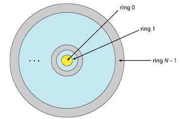
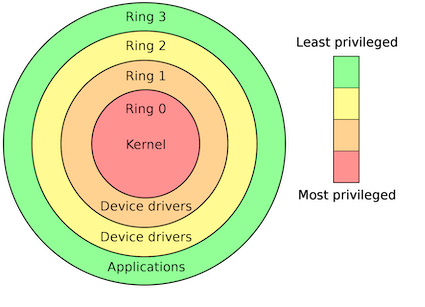

### 1 Goals of Protection

Protection was originally conceived as an adjunct to multiprogramming operating system,

* to allow untrustworthy users to safely share a common logical name space, such as a directory files, or a common physical name space, such as memory.

Modern protection,

* to increase the reliability of any complex system that makes use of shared resources and is connected to insecure communications platforms such as Internet.

Protection are needed for several reasons.

* Preventing the mischievous, intentional violation of an access restriction by a user is needed.
* Protection can improve reliability by detecting latent errors at the interfaces between component subsystems.
* provide a mechanism for the enforcement of the policies governing resource use

### 3 Protection Rings

To carry out *privilege separation*, hardware support is required. A popular model of privilege separation is that of **protection rings**(保护环) or **hierarchical protection domains**(分级保护域). In this model, execution is defined as a set of concentric rings, with ring $i$ providing a subset of the functionality of ring $j$ for any $j < i$. The innermost ring, ring $0$, thus provides the full set of privileges.

!!! example "X86 CPU ring"
    
    The x86-processors have four different modes divided into four different rings. 
    
    * Ring 0: kernels and drivers
    * Ring 1: device drives, also used for [virtualization](18 Virtual Machines.md) 
    * Ring 2: device drives
    * Ring 3: application programs
    
    It is implemented by two bits in the special EFLAGS register. Access to this register is not allowed in ring 3 — thus preventing a malicious process from escalating privileges.
    
    

    
    