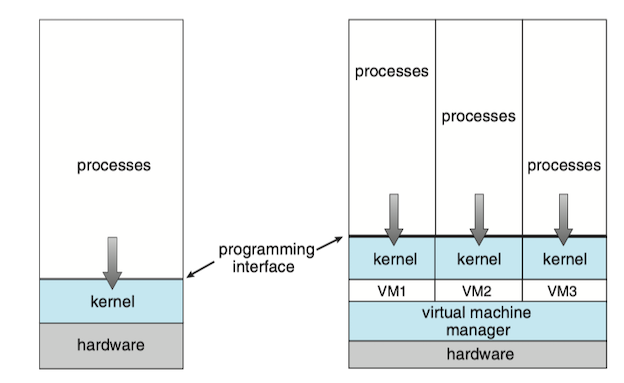
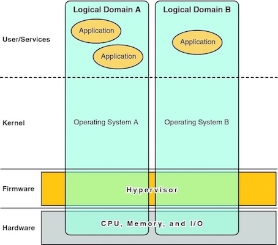
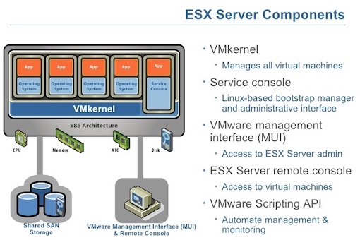
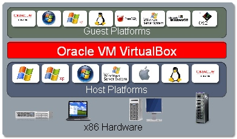
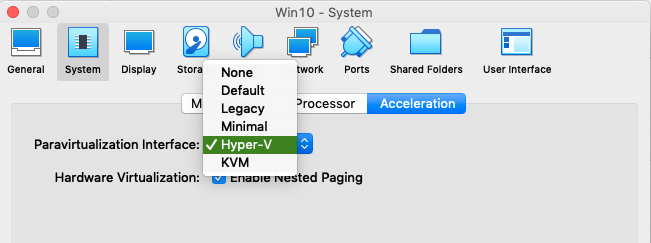

### 1 Overview

Virtual machine implementations involve several components. 

* **Host**: the underlying hardware system that runs the virtual machines
* **Virtual machine manager**(VMM, or **hypervisor): creates and runs virtual machines by providing an interface that is *identical* to the host
* **Guest**: an operating system.

Figure: <small>System models. (a) Nonvirtual machine. (b) Virtual machine.</small>

The implementation of VMMs varies greatly. Options include the following:

#### Type 0

Type 0 hypervisors: hardware-based solutions, provides support for virtual machine creation and management via *firmware*. It is commonly used in mainframe and large to midsized servers.

_The VMM itself is encoded in the firmware_ and loaded at boot time. In turn, it loads the guest images to run in each partition.

A type 0 hypervisor can run multiple guest operating systems (one in each hardware partition). All of those guests, because they are running on raw hardware, can in turn be VMMs. Because of that, each can have its own guest operating systems.

!!! example "Oracle SPARC"
    
    The [Oracle SPARC](https://docs.oracle.com/cd/E38405_01/html/E38406/hypervisorandldoms.html) hypervisor is a small firmware layer that provides a stable virtualized machine architecture to which an operating system can be written.

    

#### Type 1 

Type 1 hypervisors: operating-system-like software built to provide virtualization. It is commonly found in company data centers. They are special-purpose operating system that run natively on the hardware, but rather than providing system calls and other interfaces for running programs, they create, run, and manage guest operating systems.

Type 1 hypervisors run in kernel mode, taking advantage of hardware protection. Because they are operating systems, they must also provide CPU scheduling, memory management, I/O management, protect and so on.

!!! example "VMware ESX"
    
    

#### Type 2

Type 2 hypervisors: applications that run on standard operating systems but provide VMM features to guest operating systems.

Type 2 hypervisors run on a variety of general-purpose operating systems, and running them requires no changes to the host operating system.

!!! example "VirtualBox"

    To run a Type 2 hypervisor, you need an operating system that will run underneath the hypervisor. For Oracle VM VirtualBox, this means an already running host operating system on an x86-based desktop, laptop, or server. You install Oracle VM VirtualBox on top of that, as shown in figure below. Then you can simultaneously run multiple guest operating systems inside Oracle VM VirtualBox using multiple virtual machines (VMs).

    

#### Paravirtualization

Paravirtualization is a technique in which the guest operating system is modified to work in cooperation with the VMM to optimize performance.

Rather than try to trick a guest operating system into believing it has a system to itself, paravirtualization presents the guest with a system that is similar but not identical to the guest’s preferred system. The guest must be modified to run on the paravirtualized virtual hardware. The gain for this extra work is more efficient use of resources and a smaller virtualization layer.

!!! example "VirtualBox Paravirtualization Interface"

    VirtualBox enables the exposure of a paravirtualization interface for more accurate and efficient execution of software within a VM. Three paravirtualization interfaces are provided:
    
    * **Minimal**: Announces the presence of a virtualized environment. Additionally, reports the TSC and APIC frequency to the guest operating system. This provider is mandatory for running any Mac OS X guests.
    * **KVM**: Presents a Linux KVM hypervisor interface which is recognized by Linux kernels starting with version 2.6.25. VirtualBox's implementation currently supports paravirtualized clocks and SMP spinlocks. This provider is recommended for Linux guests.
    * **Hyper-V**: Presents a Microsoft Hyper-V hypervisor interface which is recognized by Windows 7 and newer operating systems. VirtualBox's implementation currently supports paravirtualized clocks, APIC frequency reporting, guest debugging, guest crash reporting and relaxed timer checks. This provider is recommended for Windows guests.

    

### 7 Examples

#### VMware Workstation

VMware Workstation is a popular commercial application that abstracts Intel x86 and compatible hardware into isolated virtual machines.At the heart of VMware is the virtualization layer, which abstracts the physical hardware into isolated virtual machines running as guest operating systems. Each virtual machine has its own virtual CPU, memory, disk drives, network interfaces, and so forth.

