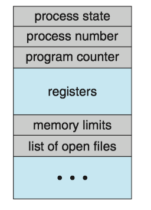
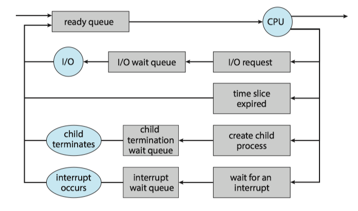
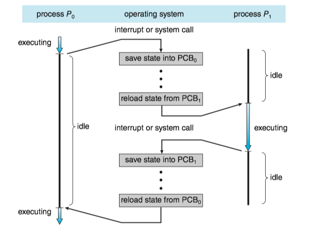
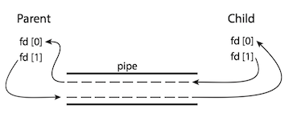

### 1 Process concept

#### The process

**Process** (进程) is a program in execution.

* Process is the unit of work in a modern computing system.

The status of the **current** activity of a process is represented by the value of the **program counter** and the contents of the processor's **registers**.

A program by itself is not a process.

* A program is a **passive** entity, such as a file containing a list of instructions stored on disk.
* A process is an **active** entity, with a program counter specifying the next instruction to execute.

#### Process state

A process may be in one of the following states:

* **New**(新建). The process is being created. 进程正在被创建
* **Running**(运行). Instructions are being executed. 指令正在被执行
* **Waiting**(等待). The process is waiting for some event to occur(such as an I/O completion or reception of a signal). 进程等待某些事件发生
* **Ready**(就绪). The process is waiting to be assigned to a processor.进程等待分配处理器
* **Terminated**(终止). The process has finished execution. 进程执行完毕

Diagram of process state:


#### Process control block

Each process is represented by a **process control block**(PCB, 进程控制块), it contains

* **Process state**(进程状态)
* **Program counter**(程序计数器)
* **CPU registers**(CPU寄存器)
* **CPU-scheduling information**(CPU调度信息): a process priority, pointers to scheduling queues, and any other scheduling parameters.
* **Memory-management information**(内存管理信息)
* **Accounting information**(记账信息): the amount of CPU and real time used, time limits, account numbers, process numbers and so on.
* **I/O status information**(I/O状态信息): the list of I/O devices allocated to the process, a list of open files.


Process Control Block:





The process control block in Linux is represented by the C structure `task_struct`(`include/linux/sched.h`)， ([CODE LINK](https://elixir.bootlin.com/linux/latest/source/include/linux/sched.h#L592))

* Within the Linux kernel, all active processes are represented using a **doubly linked list** of task struct.

`Task_strut`:


### 2 Process scheduling

The **process scheduler**(进程调度程序) selects an available process for program execution on a core.

* Each CPU core can run one process at a time.
* The number of processes currently in memory is known as the **degree of multiprogramming**.

#### Scheduling Queues

**Ready queue**(就绪队列): the status of processes are ready.

* generally stored as a linked list, its header contains pointers to the first PCB in the list, each PCB includes a pointer field that points to next PCB in the ready queue.

**Wait Queue**(等待队列): the status of processes are waiting.

Queueing-diagram representation of process scheduling: 





#### Context Switch

Here the ***context*** of a process is represented in the PCB of the process, including the value of the CPU registers, the process state, and memory-management information.

An operating system performs a **context switch**（上下文切换) when it switches from running one process to running another.

* The kernel **saves** the context of the old process into its PCB and **restore** the saved context of the new process scheduled to run.
* Context-switch time is overhead; the system does no useful work while switching. 
    * A typical speed is a several microseconds. 
* Context-switch times are **highly** dependent on hardware support.

Context switch from an old process to a new process:




### 3 Operating on Processes

#### Process creation

A process may **create** several new processes.

* the creating process is called a **parent process**.
* the new process is called a **child process** .


#### Process termination

A process **terminates** when it finishes executing its final statement and asks the operating system to delete it by using the `exit()` system call.

* **cascading termination**(级联终止):  if a process terminates (either normally or abnormally), then all its children must also be terminated. 
* A process that has terminated, but whose parent has not yet called `wait()`, is known as a **zombie process**(僵尸进程).
* if a parent did not invoke `wait()` and instead terminated, then leaving its child processes as **orphan processes**(孤儿进程).
    * Unix system may assign the `init` process as the new parent to orphan processes, and the `init` process periodically invokes `wait()`.

!!! Example
    A problem with a single process for a web browser is that if a web application in any tab crashes, the entire process —— including all other tabs —— crashes as well. Chrome web browser uses a multiprocess architecture —— identifies three different types of processes: browser, renderers, plugins. see [here](https://blog.chromium.org/2008/09/multi-process-architecture.html) in detail.
    
### 4 Interprocess communication

Processes may be either **independent processes**(独立进程) or **cooperating processes**(协同进程).

* A process is ***independent*** if it does not share data with any other processes executing in the system.
* A process is ***cooperating*** if it can affect or be affected by the other processes executing in the system.

Advantages of  process cooperation:

* Information sharing 
* Computation speedup 
* Modularity 

Cooperating process require an **interprocess communication** (IPC，进程间通信) mechanism that will allow them to **exchange** data. There are two fundamental models of IPC:

* **shared memory**(共享内存): a region of memory is shared by cooperating process. Process can exchange information by reading and writing data to the shared region.
    * Shared memory can be **faster** than message passing.
* **message passing**(消息传递)： communication takes place by means of messages exchanged between the cooperating processes.
    * Message passing is useful for exchanging **smaller** amounts of data, because no conflicts need be avoided.
    * Message passing is easier to implement in a distributed system than shared memory.


### 5 IPC in shared-memory system

Let's consider the producer-consumer problem, which is a common paradigm for cooperating processes. A *producer* process produces information that is *consumed* by a consumer process.  One solution to the producer-consumer problem uses shared memory.

We generally think of a server as a producer and a client as a consumer. For example, a web server produces web content such as HTML files and images, which are consumed by the client web browser requesting the resource.

Two types of buffers can be used.

* **unbounded buffer**(无界缓冲): places no practical limit on the size of the buffer.
* **bounded buffer**(有界缓冲): assumes a fixed buffer size


### 6 IPC in message-passing system

A message-passing facility provides at least two operations:

* send(message)
* receive(message)

If P and Q wish to communicate, they need to

* establish a **communication link**(通信连接) between them
* exchange messages via send/receive 

Here are several methods for logically implementing a *communication link* between processes:

* Direct or indirect communication 直接/间接通信
* Synchronous or asynchronous communication 同步/异步同步
* Automatic or explicit buffering 自动/显式缓冲

#### Direct/Indirect communication

<font color="green"><big>Direct Communication</big></font>

Under **direct communication**, each process that wants to communicate must explicitly name the recipient or sender of the communication.

* send(P, message) - send a message to process P.
* receive(Q, message) - receive a message from process Q

A communication link in this scheme has the following properties:

* A link is established **automatically** between every pair of processes that want to communicate.
* A link is associated with **exactly two** processes.
* Between each pair of processes, there exists exactly one link.

Cons:

* limited modularity of the resulting process definitions. Changing the identifier of a process may necessitate examining all other process definitions.
* any such hard-coding techniques, are less desirable.

<font color="green"><big>Indirect Communication</big></font>

With **indirect communication**, the message are sent to and receive from **mailboxes**, or **ports**.

* send(A, message) - send a message to mailbox A
* receive(A, message) - receive a message from mailbox A

A mailbox can be viewed abstractly as an object into which messages can be placed by processes and from which messages can be removed.

* Each mailbox has an **unique** identification.
* Two processes can communicate only if they have a shared mailbox.

In this scheme, a communication link has the following properties:

* A link is established between a pair of processes only if both members of the pair have a shared mailbox.
* A link may be associated with more than two processes.
* Between each pair of communicating processes, a number of different links may exist, with each link corresponding to one mailbox.

A mailbox may be owned either by a process or by the operating system.

If the mailbox is owned by a process
* We distinguish between the **owner** (which can only receive messages through his mailbox) and the **user** (which can only send messages to the mailbox)
* Each mailbox has a unique owner.
* When a process that owns a mailbox terminates, the mailbox disappears.
* The process that creates a new mailbox is that mailbox's owner by default.

#### Synchronization

Message passing may be either **blocking** or **nonblocking** - also known as **synchronous** and **asynchronous**.

#### Buffering

Messages exchanged by communicating processes reside in a temporary queue, whether communication is direct or indirect. Basically, it can be implemented in three ways:

* Zero capacity（零容量）-- no buffering
    * The link cannot have any messages waiting in it.
    * The sender must block until the recipient receives the message. 
* Bounded capacity（有界容量）-- automatic buffering
    * The queue has finite length n, at most n message can reside in it.   
    * The sender must block until space is available in the queue if the link is full.    
* Unbounded capacity （无界容量） -- automatic buffering
    * Any number of messages can wait in it.
    * The sender never blocks. 

### 7 Examples of IPC Systems

#### POSIX Shared Memory

Here, we explore the POSIX API for shared memory. POSIX shared memory is organized using **memory-mapped files** (内存映射文件), which associate the region of shared memory with a file. A process must first create a shared-memory object using the `shm_open()` system call.

```c
fd = shm_open(name, O_CREAT | O_RDWR, 0666);
ftruncate(fd, 4096);
mmap(0, SIZE, PROT_READ | PROT_WRITE, MAP_SHARED, fd, 0);
```

* A successful call to `shm_open()` returns an integer file descriptor for the shared-memory object.
* Once the object is established, the `ftruncate()` function is used to configure the size of the object in bytes.
* Finally, the `mmap()` function establishes a memory-mapped file containing the shared-memory object. It returns a pointer to the shared

```c
#include <stdio.h>
#include <stdlib.h>
#include <unistd.h>
#include <fcntl.h>
#include <sys/shm.h>
#include <sys/stat.h>
#include <sys/mman.h>

int main()
{
	const char *name = "OS";
	const int SIZE = 4096;

	int shm_fd;
	void *ptr;
	int i;

	/* open the shared memory segment */
	shm_fd = shm_open(name, O_RDONLY, 0666);
	if (shm_fd == -1) {
		printf("shared memory failed\n");
		exit(-1);
	}

	/* now map the shared memory segment 
	 in the address space of the process */
	ptr = mmap(0,SIZE, PROT_READ, MAP_SHARED, shm_fd, 0);
	if (ptr == MAP_FAILED) {
		printf("Map failed\n");
		exit(-1);
	}

	/* now read from the shared memory region */
	printf("%s",(char *)ptr);

	/* remove the shared memory segment */
	if (shm_unlink(name) == -1) {
		printf("Error removing %s\n",name);
		exit(-1);
	}

	return 0;
}
```


#### Mach Message Passing

Mach was especially designed for distributed systems. Its kernel supports the creation and destruction of multiple **tasks**, which are similar to processes but have multiple threads of control and fewer associated resources.  

Messages are sent to, and received from, mailboxes, which are called **ports** in Mach. 

* Ports are **finite in size** and **unidirectional**.
* For two-way communication, a message is sent to one port, and a response is sent to a separate **reply** port.
* Associated with each port is a collection of **port rights**, which  identify the capabilities necessary for a task to interact with the port.

Functions:

* `mach_port_allocate()` creates a new port and allocates space for its queue of messages.
* `mach_msg()` is the standard API for both sending and receiving messages.

```c
#include <mach/mach.h>

struct message {
    mach_msg_header_t header;
    int data;
};

mach_port_t client;
mach_port_t server;

/* Client Code */

struct message message;

// construct the header
message.header.msgh_size = sizeof(message);
message.header.msgh_remote_port = server;
message.header.msgh_local_port = client;

// send the message
mach msg(&message.header, // message header
         MACH_SEND_MSG, // sending a message
         sizeof(message), // size of message sent
         0, // maximum size of received message - unnecessary
         MACH_PORT_NULL, // name of receive port - unnecessary
         // no time outs MACH PORT NULL // no notify port
         MACH_MSG_TIMEOUT_NONE, 
);

/* Server Code */

struct message message;

// receive the message
mach_msg(&message.header, // message header
  MACH_RCV_MSG, // sending a message  0, // size of message sent
  sizeof(message), // maximum size of received message
  server, // name of receive port
  MACH_MSG_TIMEOUT_NONE, // no time outs
  MACH_PORT_NULL // no notify port
);
```

#### Pipes

A **pipe** acts as a conduit allowing two processes to communicate. Pipes were one of the first IPC mechanisms in early UNIX systems. There are two common types of pipes used on both UNIX and Windows systems: **ordinary pipes** and **named pipes**.

#### Ordinary pipes

**Ordinary pipes** allow two processes to communicate in standard producer-consumer fashion: the producer writes to one end of the pipe (the **write end**) and the consumer reads from the other end (the **read end**).

* Ordinary pipes are **unidirectional**, allowing only one-way communication.
* Function `pipe(int fd[])` constructs an ordinary pipe, where `fd` is a file descriptor.
* UNIX treats a pipe as *a special type of file*. Pipes can be accessed using ordinary `read()` and `write()` system calls.
* Ordinary pipes **exit only** while the processes are communicating with each other.




> <C>int pipe(int pipefd[2])</C> creates a pipe, a unidirectional data channel that can be used for interprocess communication. The array <C>pipefd</C> is used to return two file descriptors referring to the ends of the pipe. <C>pipefd[0]</C> refers to the read end of the pipe. <C>pipefd[1]</C> refers to the write end of the pipe. Data written to the write end of the pipe is buffered by the kernel until it is read from the read end of the pipe.  [[Man Page - PIPE](https://kapeli.com/dash_share?docset_file=Linux&docset_name=Linux%20Man%20Pages&path=man2/pipe.2.html&platform=usercontribLinux_Man_Pages&repo=User%20Contributed)]


```c
#include <sys/types.h>
#include <stdio.h>
#include <string.h>
#include <unistd.h>

#define BUFFER_SIZE 25
#define READ_END 0
#define WRITE_END 1

int main(void)
{
        char write_msg[BUFFER_SIZE] = "Greetings";
        char read_msg[BUFFER_SIZE];
        int pipefd[2];
        pid_t pid;

        /* create the pipe */
        if (pipe(pipefd) == -1){
                fprintf(stderr, "Pipe failed");
                return 1;
        }

        /* fork a child process */
        pid = fork();

        if (pid>0){ /* parent process */
                close(pipefd[READ_END]);/* close the unused end of the pipe */
                write(pipefd[WRITE_END], write_msg, strlen(write_msg)+1); /* write to the pipe */
                close(pipefd[WRITE_END]);  /* close the write end of the pipe */
        }
        else if (pid==0){ /* child process */
                close(pipefd[WRITE_END]); /* close the unused end of the pipe */
                read(pipefd[READ_END], read_msg, BUFFER_SIZE); /* read from the pipe */
                printf("read: %s\n", read_msg);
                close(pipefd[READ_END]); /* close the read end of the pipe */
        }
        return 0;

}
```

#### Named pipes

**Named pipes**(命名管道) can be **bidirectional**, and no parent-child relationship is required.

* Named pipes are referred to as **FIFOs** in UNIX system.
* Once created, they appear as typical files in the file system.
* The communicating processes for named pipes must reside on the same machine.

A FIFO is created with the `mkfifo()` system call and manipulated with the ordinary `open()`, `read()`, `write()`, and `close` system calls.：

```c
int mkfifo(const char *pathname, mode_t mode);
```

> <C>mkfifo()</C> makes a FIFO special file with name <C>pathname</C>. <C>mode</C> specifies the FIFO's permissions. It is modified by the process's umask in the usual way: the permissions of the created file are (<C>mode & ~umask</C>). [[Man Page - mkfifo](https://kapeli.com/dash_share?docset_file=Linux&docset_name=Linux%20Man%20Pages&path=man3/mkfifo.3.html&platform=usercontribLinux_Man_Pages&repo=User%20Contributed)]


The program `fifowrite.c` is as follows.

```c
#include<sys/types.h>
#include<stdlib.h>
#include<stdio.h>
#include<fcntl.h>
#include<limits.h>
int main()
{
    const char *fifo_name = "/tmp/my_fifo";
    int pipe_fd = -1;
    int data_fd = -1;
    int res = 0;
    const int open_mode = O_WRONLY;
    char buffer[PIPE_BUF+1];
    if(access(fifo_name, F_OK)==-1)
    {
        res = mkfifo(fifo_name,0777);
        if(res!=0)
        {
            fprintf(stderr,"could not create fifo\n");
            exit(EXIT_FAILURE);
        }
    }
    printf("process %d opening fifo O_WRONLY\n", getpid());
    pipe_fd = open(fifo_name, open_mode);
    data_fd = open("data.txt", O_RDONLY);
    printf("process %d result %d\n", getpid(), pipe_fd);
    if (pipe_fd!=-1)
    {
        int bytes_read = 0;
        bytes_read = read(data_fd,buffer,PIPE_BUF);
        while (bytes_read>0)
        {
            res = write(pipe_fd,buffer,bytes_read);
            if (res==-1)
            {
                fprintf(stderr,"write error\n");
                exit(EXIT_FAILURE);
            }
            bytes_read = read(data_fd,buffer,PIPE_BUF);
            buffer[bytes_read]='\0';
        }
        close(pipe_fd);
        close(data_fd);
    }
    else {
        exit(EXIT_FAILURE);
    }
    printf("process %d finished.\n",getpid());
    exit(EXIT_SUCCESS);
}
```

the program `fiforead.c` is as follows.

```c
#include<stdlib.h>
#include<stdio.h>
#include<sys/types.h>
#include<fcntl.h>
#include<limits.h>
int main()
{
    const char *fifo_name = "/tmp/my_fifo";
    int pipe_fd = -1;
    int data_fd = -1;
    int res = 0;
    int open_mode = O_RDONLY;
    char buffer[PIPE_BUF+1];
    int bytes_read = 0;
    int bytes_write = 0;
    memset(buffer,'\0', sizeof(buffer));

    printf("process %d opening FIFO O_RDONLY\n", getpid());
    pipe_fd = open(fifo_name, open_mode);
    data_fd = open("dataformfifo.txt", O_WRONLY|O_CREAT,0644);
    printf("process %d result %d\n", getpid(), pipe_fd);
    if (pipe_fd!=-1)
    {
        do{
            res = read(pipe_fd, buffer, PIPE_BUF);
            bytes_write = write(data_fd, buffer, res);
            bytes_read +=res;
        } while(res>0);
        close(pipe_fd);
        close(data_fd);
    }
    else {
        exit(EXIT_FAILURE);
    }
    printf("process %d finished,%d bytes read\n", getpid(), bytes_read);
    exit(EXIT_SUCCESS);
}
```

### 8 Communication in Client-Server system

In this section, we explore two other strategies for communication in client-server system: **sockets** and **remote procedure calls**(RPCs)

#### Sockets

A **socket**(套接字) is defined as an *endpoint* for communication. A socket is identified by an *IP address concatenated with a port number*.

Communication using sockets：


Servers implementing specific services (such as SSH, FTP, and HTTP) listen to well-known ports. Once a request is received, the server accepts a connection from the client socket to complete the connection.

Java provides three different types of sockets. Connection-oriented(TCP) sockets are implemented with the `Socket` class. 
    
The example describes a data server that uses connection-oriented TCP sockets. 
    
```Java
import java.net.*;
import java.io.*;
    
public class DateClient
{
	public static void main(String[] args)  {
		try {
			// this could be changed to an IP name or address other than the localhost.
			// The IP address 127.0.0.1 is a special IP address known as the loopback. 
			// When a computer refers to IP address 127.0.0.1, it is referring to itself.
			// This mechanism allows a client and server on the same host to communicate using the TCP/IP protocol.
			Socket sock = new Socket("127.0.0.1",6013);
			InputStream in = sock.getInputStream();
			BufferedReader bin = new BufferedReader(new InputStreamReader(in));
    
			String line;
			while( (line = bin.readLine()) != null)
				System.out.println(line);
				
			sock.close();
		}
		catch (IOException ioe) {
				System.err.println(ioe);
		}
	}
}
    
public class DateServer
{
	public static void main(String[] args)  {
		try {
			ServerSocket sock = new ServerSocket(6013);
    
			// now listen for connections
			while (true) {
				Socket client = sock.accept();
				// we have a connection
				
				PrintWriter pout = new PrintWriter(client.getOutputStream(), true);
				// write the Date to the socket
				pout.println(new java.util.Date().toString());
    
				// close the socket and resume listening for more connections
				client.close();
			}
		}
		catch (IOException ioe) {
				System.err.println(ioe);
		}
	}
}
```
    
Communication using sockets—although *common* and *efficient* —— is considered a *low-level* form of communication between distributed processes. 

* One reason is that sockets allow only an *unstructured* stream of bytes to be exchanged between the communicating threads. It is the responsibility of the client or server application to impose a structure on the data.


#### Remote procedure calls

**Remote Procedure Call**(远程过程调用), One of the *most common* forms of remote service, allows programs on different machines to interact using simple procedure call/return semantics, just as if the two programs were in the same computer.


The messages exchanged in RPC communication are well structured and are thus no longer just packets of data. Each message is addressed to an RPC daemon listening to a port on the remote system, and each contains an identifier specifying the function to execute and the parameters to pass to that function.


The RPC system hides the details that allow communication to take place by providing a **stub**(存根) on each side. Typically, a separate stub exists for each separate remote procedure. 

* When the client invokes a remote procedure, the RPC system calls the appropriate stub, passing it the parameters provided to the remote procedure. 
* This stub locates the port on the server and **marshals**(编组) the parameters. The stub then transmits a message to the server using message passing.
* A similar stub on the server side receives this message and invokes the procedure on the server.
* If necessary, return values are passed back to the client using the same technique.


RPC hides all the network code into the stub procedures. This prevents the application programs, the client and the server, from having to worry about details such as sockets, network byte order, and the like.


