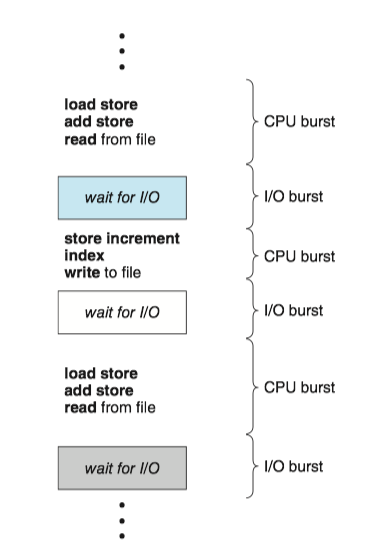
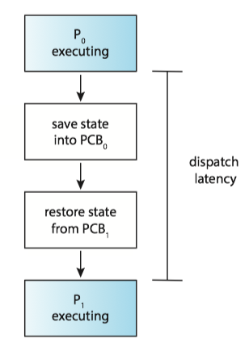
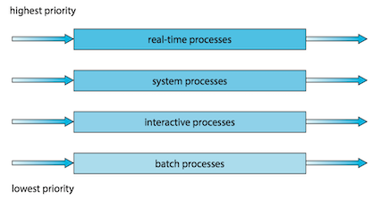
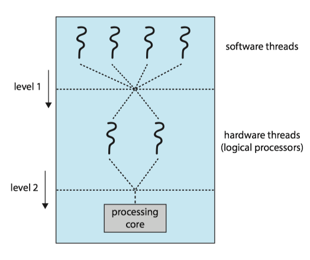
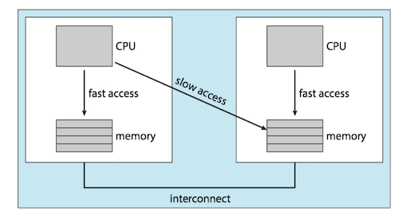
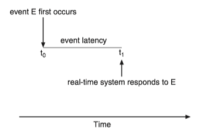
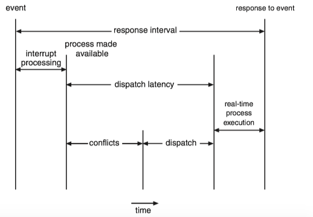
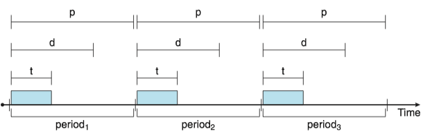
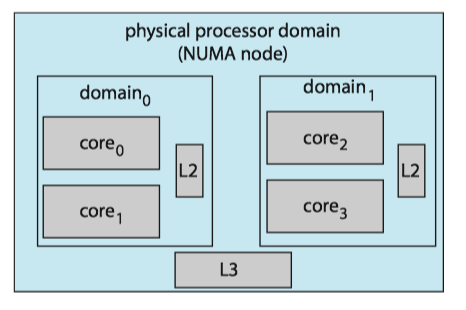

On modern operating systems it is **kernel-level threads** —not processes—that are in fact being scheduled by the operating system. 

* User-level threads are managed by a thread library, and the kernel is *unaware* of them.
* To run on a CPU, user-level threads must ultimately be mapped to an associated kernel-level thread, although this mapping may be indirect and may use a lightweight process (LWP).

### 1 Basic Concepts
####   CPU-I/O Burst Cycle

Process execution consists of a **cycle** of CPU execution and I/O wait. 进程执行由CPU执行周期和I/O等待周期组成。

* Processes alternate between these two states. 进程在这两个状态之间切换。
* Process execution begins with a **CPU burst**, which is followed by an **I/O burst** and so on. 进程执行从CPU区间开始，在这之后是I/O区间。

进程在CPU区间和I/O区间之间切换：



The durations of CPU bursts tend to have a frequency curve similar to the figure below. 

* The curve is generally characterized as **exponential** or hyperexpoential(超指数).
* A large number of short CPU bursts and a small number of long CPU burst.
* An I/O-bounded program typically has many short CPU bursts. I/O密集程序通常具有很多短CPU区间。
* A CPU-bound program might have a few long CPU bursts.CPU密集程序可能有少量的长CPU区间。
* The distribution can be important when implementing a CPU-scheduling algorithm. 分布有助于选择合适的CPU调度算法。


####   CPU Scheduler

Whenever the CPU becomes idle, the operating system must select one of the processes in the **ready queue**(就绪队列) to be executed. 每当CPU空闲时，操作系统就必须从就绪队列中选择一个进程来执行。

* The selection process is carried out by the **CPU scheduler**(CPU调度程序).  进程选择由CPU调度程序执行。
* CPU scheduler selects a process from the processes in memory that are ready to execute and allocates the CPU to that process. 调度程序从内存中选择一个能够执行的进程，并为之分配CPU。
* A ready queue can be implemented as a FIFO queue, a priority queue, a tree, or simply an unordered linked list. 就绪队列可以是FIFO队列，优先队列、树或无序链表。

####   Preemptive and Nonpreemptive Scheduling

CPU-scheduling decisions may take place under the following four circumstances: 

1. When a process switches from the running state to the waiting state (for example, as the result of an I/O request or an invocation of `wait()` for the termination of a child process) 当一个进程从运行状态切换到等待状态（如：I/O请求，或者调用wait等待一个子进程的终止） 
2. When a process switches from the running state to the ready state (for example, when an interrupt occurs) 当一个进程从运行状态切换到就绪状态（如：出现中断） 
3. When a process switches from the waiting state to the ready state (for example, at completion of I/O) 当一个进程从等待状态切换到就绪状态（如：I/O完成） 
4. When a process terminates 当一个进程终止时

When scheduling takes place only under circumstances 1 and 4, the scheduling scheme is **nonpreemptive**(非抢占的) or **cooperative**(协作的). Otherwise, it is **preemptive**(抢占的).

* Under nonpreemptive scheduling, once the CPU has been allocated to a process, the process keeps the CPU until it releases it either by terminating or by switching to the waiting state.
* Virtually all modern Operating systems use preemptive scheduling algorithms. 

#### Dispatcher

The **dispatcher**(分派程序) is the module that gives control of the CPU's core to the process selected by the CPU scheduler. This function involves the following:

* Switching context from one process to another
* Switching to user mode
* Jumping to the proper location in the user program to resume that program

**Dispatch latency** (分派延迟) is the time it takes for the dispatcher to stop one process and start another running.





### 2 Scheduling Criteria 

Scheduling criteria（调度准则) include the following:

* **CPU utilization**(CPU利用率)
* **Throughput**(吞吐量): the number of processes that are completed per time unit.
* **Turnaround time**(周转时间): the interval from the time of submission of a process to the time of completion.
* **Waiting time**(等待时间): the sum of time spent waiting in the ready queue.
* **Response time**(响应时间): the time from the submission of a request until the first response is produced.

### 3 Scheduling Algorithms

#### First-Come,First-Serve scheduling, FCFS

By far the simplest CPU-scheduling algorithm is the **first-come first serve scheduling** (先到先服务调度, FCFS) algorithm.

* The implementation of FCFS policy is easily managed with a **FIFO queue**.
* The average **waiting time** under the FCFS policy is often quite **long**.
* **Convoy effect**(护航效果) occurs when all the other processes wait for the one big process to get off the CPU. 所有其他进程都等待一个大进程释放CPU，这称之为护航效果。
* The FCFS scheduling algorithm is **nonpreemptive**. FCFS调度算法是非抢占的。

#### Shortest-job-first scheduling, SJF

The **shortest-job-first scheduling** (最短作业优先调度, SJF) algorithm associates with each process the length of the process's next CPU burst.

* When the CPU is available, it is assigned to the process that has the smallest **next** CPU burst.
* It gives the **minimum** average waiting time for a given set of processes.
* The SJF algorithm can be either preemptive or nonpreemptive.
    * Preempt the currently executing process: when a new process arrives at the ready queue while a previous process is still executing. The next CPU burst of the newly arrived process may be shorter than what is left of the currently executing process. 

The next CPU burst is generally predicted as an **exponential average** of the measured lengths of previous CPU bursts. Let \(t_n\) be the length of the \(n\)th CPU burst, and let \(\tau_{n+1}\) be predicted value for the next CPU burst:

$$\tau_{n+1}= \alpha t_n + (1-\alpha) \tau_n$$

where \(0\le\alpha \le 1\), commonly \(\alpha = 1/2\).

#### Round-Robin scheduling, RR

The **round-robin scheduling**(轮转调度) algorithm is similar to FCFS scheduling, but switch occurs after 1 **time quantum** (时间片).

* Time quantum is a small unit of time, generally from 10 to 100 milliseconds in length.
* The ready queue is treated as a circular queue.
* If the process have a CPU burst of less than 1 time quantum, the  process itself will release the CPU voluntarily.
* otherwise, a context switch will be executed, and the process will be put at the tail of the ready queue.

The performance of the RR algorithm depends heavily on the size of the time quantum.

* If extremely large, the RR policy is the same as the FCFS policy.
* If extremely small, it'll result in a large number of context switches.


#### Priority scheduling algorithm

The **priority-scheduling**(优先级调度) algorithm associate each process a priority, and the CPU allocated to the process with the highest priority.

* FCFS: equal-priority
* SJF: the priority is the inverse of the next CPU burst.


ISSUE: <important>Indefinite blocking</important>(无限阻塞), or <important>starvation</important>(饥饿) <big><u><I>occurs when some low-priority processes waiting indefinitely</I></u></big>.

SOLUTION: <important>Aging</important>(老化) involves gradually increasing the priority of processes that wait in the system for a long time.

#### Multilevel Queue Scheduling

For **multilevel queue scheduling**(多级队列调度), there are separate queues for each distinct priority, and priority scheduling simply schedules the process in the highest-priority queue.

A multilevel queue scheduling algorithm can be used to partition processes into several separate queues based on the process type:



In addition, there must be scheduling _*among the queues*_ :

* **Fixed-priority preemptive scheduling**(固定优先级抢占调度): Each queue has absolute priority over lower-priority queues
    * eg. no process in the batch queue, could run unless the queues for real-time processes, system processes, and interactive processes were all empty. 
* **Time-slice among queues**(队列之间划分时间片): each queue gets a certain portion of the CPU time.
    * eg. the foreground queue can be given 80 percent of the CPU time for RR scheduling among its processes, while the background queue receives 20 percent of the CPU to give to its processes on an FCFS basis.


#### Multilevel Feedback-Queue Scheduling
The **multilevel feedback queue scheduling**(多级反馈队列调度) algorithm allows a process to move between queues.

* If a process uses too much CPU time, it will be moved to a lower-priority queue.
    * It leaves I/O-bound and interactive processes—which are typically characterized by short CPU bursts —in the higher-priority queues. 
* A process that waits too long in a lower-priority queue may be moved to a higher-priority queue.
    * This form of aging prevent starvation.

In general, a multilevel feedback queue scheduler is defined by the following parameters:

* The number of queues
* The scheduling algorithm for each queue
* The method used to determine when to upgrade a process to a higher priority queue
* The method used to determine when to demote a process to a lower priority queue
* The method used to determine which queue a process will enter when that process needs service
 
### 4 Thread Scheduling

#### Contention Scope

**Process contention scope**(PCS，进程竞争范围), specifies that competition for the CPU takes place among threads belonging to the same process.

* the thread library schedules user-level threads to run on an available LWP, on systems implementing the many-to-one and many-to-many models.

To decide which kernel-level thread to schedule onto a CPU, the kernel uses **system-contention scope**(SCS, 系统竞争范围).

* Systems using the one-to-one model, such as Windows and Linux schedule threads using only SCS.

#### Pthread Scheduling

**Pthreads** identifies the following contention scope values:

* `PTHREAD_SCOPE_PROCESS` schedules threads using PCS scheduling.
* `PTHREAD_SCOPE_SYSTEM` schedules threads using SCS scheduling.

The Pthread IPC (Interprocess Communication) provides two functions for setting—and getting—the contention scope policy:

* `pthread_attr_setscope(pthread_attr_t *attr, int scope)`
* `pthread_attr_getscope(pthread_attr_t *attr, int *scope)`

``` c
#include <pthread.h>
#include <stdio.h>
#define NUM_THREADS 5

/* the thread runs in this function */
void *runner(void *param); 

int main(int argc, char *argv[])
{
	int i, scope;
	pthread_t tid[NUM_THREADS]; 	/* the thread identifier */
	pthread_attr_t attr; 		/* set of attributes for the thread */

	/* get the default attributes */
	pthread_attr_init(&attr);

	/* first inquire on the current scope */
	if (pthread_attr_getscope(&attr,&scope) != 0)
		fprintf(stderr, "Unable to get scheduling scope.\n");
	else {
		if (scope == PTHREAD_SCOPE_PROCESS)
			printf("PTHREAD_SCOPE_PROCESS\n");
		else if (scope == PTHREAD_SCOPE_SYSTEM)
			printf("PTHREAD_SCOPE_SYSTEM\n");
		else 
			fprintf(stderr,"Illegal scope value.\n");
	}
	
	/* set the scheduling algorithm to PCS or SCS */
	if (pthread_attr_setscope(&attr, PTHREAD_SCOPE_SYSTEM) != 0)
		printf("unable to set scheduling policy.\n");

	/* create the threads */
	for (i = 0; i < NUM_THREADS; i++) 
		pthread_create(&tid[i],&attr,runner,NULL); 

	/**
	 * Now join on each thread
	 */
	for (i = 0; i < NUM_THREADS; i++) 
		pthread_join(tid[i], NULL);
}

/**
 * The thread will begin control in this function.
 */
void *runner(void *param) 
{
	/* do some work ... */

	pthread_exit(0);
}
```

### 5 Multi-Processor Scheduling
#### Approaches to Multiple-Processor Scheduling

**Asymmetric multiprocessing** (AMP，非对称多处理)

* All scheduling decisions, I/O processing, and other system activities handled by a single processor -- the master server; the other processors execute only user code.
* It is simple because only one core accesses the system data structures, reducing the need for data sharing.
* The master server becomes a potential bottleneck where overall system performance may be reduced.

**Symmetric multiprocessing** (SMP， 对称多处理)

* Each processor is self-scheduling.
* It provides two possible strategies for organizing the threads eligible to be scheduled:
    * All threads may be in a _common ready queue_.
        * Use some form of locking to protect the common ready queue from race condition
        * All accesses to the queue would require lock ownership, it would be a performance bottleneck.
    * Each processor may have its own _private queue_ of threads.
        * Most common approach on systems supporting SMP
        * More efficient use of cache memory.


#### Multicore Processors

_Issue_ : memory stalls occurs when a processor accesses memory, it spends a significant amount of time waiting for the data to become available.

* Occurs primarily because modern processors operate at much faster speeds than memory
* Occur because of a cache miss as well


_Solution_ : many recent hardware designs have implemented multithreaded processing cores in which two (or more) **hardware threads**(硬件线程) are assigned to each core.

* If one hardware thread stalls while waiting for memory, the core can switch to another thread.
* From an operating system perspective, each hardware thread maintains its architectural state, such as instruction pointer and register set, and thus appears as a logical CPU that is available to run a software thread. This technique is known as **chip multithreading** (CMT, 芯片多线程). Intel use the term **hyper-threading**(超线程).
* **NOTE**: The resources of the physical core (such as caches and pipelines) are shared among its hardware threads, and a processing core can only execute **one** hardware thread at a time.


Two levels of scheduling needed:

* It chooses which software thread to run on each hardware thread.
    * It may choose any scheduling algorithm. 
* It chooses which hardware thread to run on CPU.
    * Use a simple round-robin algorithm
    * assigned to each hardware thread a dynamic urgency value ranging from 0 to 7, with 0 representing the lowest urgency and 7 the highest. 




#### Load Balancing

**Load balancing**(负载均衡) attempts to keep the workload evenly distributed across all processors in an SMP system.

Two general approaches to load balancing:

* **Push migration**: a specific task periodically checks the load on each processor and -- if it finds an imbalance -- evenly distributes the load by moving (or pushing) threads from overloaded to idle or less-busy processors.
* **Pull migration**: an idle processor pulls a waiting task from a busy processor.
* They are not mutually exclusive and are, in fact, often implemented in parallel on load-balancing systems.

#### Processor Affinity

Because of the high cost of invalidating and repopulating caches, most operating systems with SMP support try to _avoid migrating_ a thread from one processor to another and instead attempt to keep a thread running on the same processor and take advantage of a warm cache. This is known as **processor affinity**(处理器亲和性)。

Common ready queue and per-processor ready queue(section 5.1):

* If we adopt the approach of a common ready queue, a thread may be selected for execution by any processor. Thus, if a thread is scheduled on a new processor, that processor’s cache must be repopulated.
* With private, per-processor ready queues, a thread is always scheduled on the same processor and can therefore benefit from the contents of a warm cache.

The main-memory architecture of a system can affect processor affinity issues as well. **Non-uniform memory access**(NUMA, 非一致性内存访问) where there are two physical processor chips each with their own CPU and local memory. A CPU has faster access to its local memory than to memory local to another CPU.



Interestingly, load balancing often **counteracts** the benefits of processor affinity.

### 6 Real-Time CPU Scheduling

Two kinds of real-time systems exist:

* **Soft real-time systems**(软实时系统) provide no guarantee as to when a critical real-time process will be scheduled.
* **Hard real-time system**(硬实时系统) have stricter requirements, A task must be serviced by its deadline; service after the deadline has expired is the same as no service at all.

#### Minimizing latency

When an event occurs, the system must respond to and service it as quickly as possible. 

**Event latency** is the amount of time that elapses from when an event occurs to when it is serviced.





Two types of latencies affect the performance of real-time systems:

* **Interrupt latency**: the period of time from the arrival of an interrupt at the CPU to the start of the routine that services the interrupt
    * Fist, complete the instruction it is executing and determine the type of interrupt that occurred.
    * Second, save the state of the current process before servicing the interrupt using the specific interrupt service routine
    * One important factor contributing to interrupt latency is the amount of time interrupts may be disabled while kernel data structures are being updated. Real-time operating systems require that interrupts be disabled for only very short periods of time.
* **Dispatch latency**: the time required for the dispatcher to stop one process and start another is known as dispatch latency.



#### Rate-Monotonic Scheduling

The **rate-monotonic scheduling**(单调速率调度) algorithm schedules periodic tasks using a static priority policy with preemption. 

* Upon entering the system, each periodic task is assigned a *_priority inversely based on its period_* . The shorter the period, the higher the priority; the longer the period, the lower the priority.
* It assumes that the processing time of a periodic process is the same for each CPU burst. That is, every time a process acquires the CPU, the duration of its CPU burst is the same.

Before we proceed with the details, we must define certain characteristics of the processes that are to be scheduled.

* The processes are considered **periodic**.
* Once a periodic process has acquired the CPU, it has a fixed processing **time** \(t\), a **deadline** \(d\) by which it must be serviced by the CPU, and a **period** \(p\).
* The **rate** of a periodic task is \(1/p\).



Let's consider an example. We have two processes, \(P_1\) and \(P_2\). 

* The periods: - \(P_1=50\) and \(P_2=100\) 
* The processing time: \(t_1=20\) and \(t_2=35\) 
* The deadline requires that it complete its CPU burst by the start of its next period.


Now suppose we use rate-monotonic scheduling:

* We assign \(P_1\) a higher priority than \(P_2\) because the period of \(P_1\) is shorter than that of \(P_2\). 
* \(P_1\) starts first and completes its CPU burst at time 20, thereby meeting its first deadline. 
* \(P_2\) starts running at this point and runs until time 50. At this time, it is preempted by \(P_1\) , although it still has 5 milliseconds remaining in its CPU burst. 
* \(P_1\) completes its CPU burst at time 70, at which point the scheduler resumes \(P_2\) . 
* \(P_2\) completes its CPU burst at time 75, also meeting its first deadline. 
* The system is idle until time 100, when \(P_1\) is scheduled again.

### 7 Linux Scheduling

####  Completely Fair Scheduler

The ***Completely Fair Scheduler***(CFS，完全公平调度算法) is the default Linux scheduling algorithm after release 2.6.23 of the kernel.

* Each task has a **virtual runtime**(虚拟运行时) value, which is its actual runtime normalized to the number of ready tasks.
* Task priority is incorporated as a **decay factor** into this formula. 
    * Lower-priority tasks have higher rates of decay than higher-priority tasks.
* The CPU is allocated to the task with the _smallest_ virtual runtime value.

Standard Linux kernels implement two **scheduling classes**(调度类): 

* a default scheduling class using the CFS scheduling algorithm 
* a real-time scheduling class.


Each runnable task is placed in a **red-black tree** - a balanced binary search tree whose key is based on the value of virtual runtime `vruntime`.

* discover the leftmost node will require $O(\log N)$ operations.
* Linux scheduler caches the leftmost node in the variable `rb_leftmost`, and requires only retrieving the cached value.


#### Load Balancing on NUMA systems

Problem: On NUMA systems, migrating a thread may result in a memory access penalty due to either having to invalidate cache contents or, incurring longer memory access times.

SOLUTION: Linux identifies a hierarchical system of **scheduling domains**(调度域) ——  a set of CPU cores that can be balanced against one another.




The cores in each scheduling domain are grouped according to how they share the resources of the system.

* Pairs of cores share a level 2 (L2) cache and are thus organized into separate domain 0 and domain 1 .
* These two domains may share a level 3 (L3) cache, and are therefore organized into a processor-level domain (also known as a NUMA node).


The general strategy behind CFS is *to balance loads within domains, beginning at the lowest level of the hierarchy*.