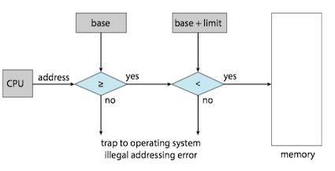
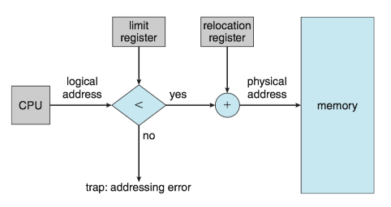
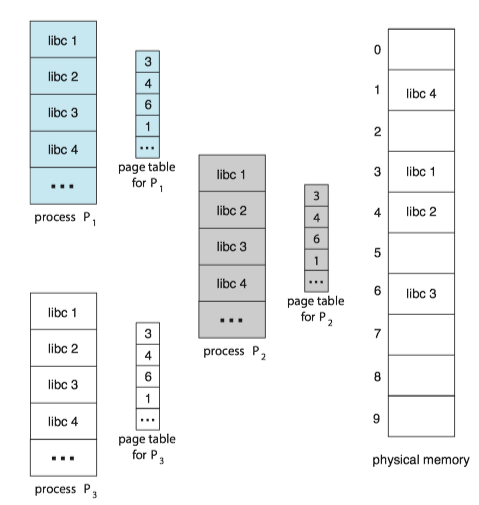
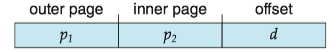
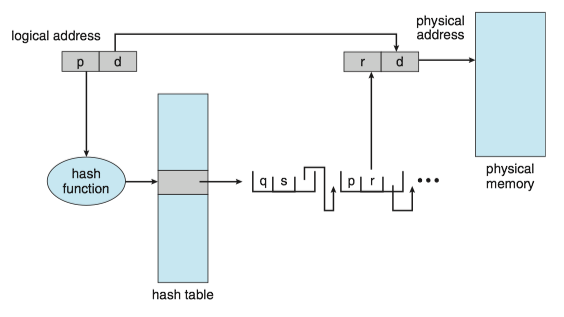

### **Operating System Concepts 9 - Main Memory**

### 1 Background
#### Basic Hardware
Main memory and the registers built into each processing core are the only general-purpose storage that the CPU can access directly.

Registers that are built into each CPU core are generally accessible within one cycle of the CPU clock. Completing a memory access may take hundreds cycles of the CPU clock. In such cases, the processor normally needs to stall. The remedy is to add cache between the CPU and main memory for fast access.

<center><big><b>Table. Approximate timing for various operations on a typical PC</b></big></center>

| operations | approximate timing |
| --- | --- |
| execute typical instruction | 1/1,000,000,000 sec = 1 nanosec | 
| fetch from L1 cache memory	 | 0.5 nanosec | 
| branch misprediction	 | 5 nanosec | 
| fetch from L2 cache memory	 | 7 nanosec | 
| Mutex lock/unlock	 | 25 nanosec | 
| fetch from main memory	 | 100 nanosec | 
| send 2K bytes over 1Gbps network | 20,000 nanosec | 
| read 1MB sequentially from memory | 250,000 nanosec | 
| fetch from new disk location (seek) | 8,000,000 nanosec | 
| read 1MB sequentially from disk | 20,000,000 nanosec | 
| send packet US to Europe and back | 150 milliseconds = 150,000,000 nanosec | 


We also must protect the operating system from access by user processes, as well as protect user processes from one another.

* This protection must be provided by the hardware, because the operating system doesn't usually intervene between the CPU and its memory access.
* Hardware implements this production in several different ways.


We first need to make sure that each process have a separate memory space.

* Separate per-process memory space protects the processes from each other and is fundamental to having multiple processes loading in memory for concurrent execution.
* To separate memory spaces, we need the ability to determine the range of legal addresses that the process may access and to ensure that the process can access only these legal addresses.
* We can provide this protection by using two registers, usually a base and a limit. The **base register** holds the smallest legal physical memory address; the **limit register** specifies the size of the range.
* The base and limit registers can be loaded only by the operating system, which uses a special privileged instruction.


Any attempt by a program executing in user mode to access operating-system memory or other users’ memory results in a trap to the operating system, which treats the attempt as a fatal error.



#### Address Binding

In most cases, a user program goes through several steps. Addresses may be represented in different ways during these steps.

* Addresses in the source program are generally symbolic(符号).
* A compiler typically *binds* these symbolic addresses to relocatable addresses(可重定位地址).
* The linker or loader *binds* the relocatable addresses to absolute addresses(绝对地址)。


#### Logical Versus Physical Address Space

An address generated by the CPU is commonly referred to as a **logical address**(逻辑地址), whereas an address loaded into *memory-address register* (MAR) of the memory is commonly referred to as a **physical address**(物理地址).

* We usually refer to the logical address as a **virtual address**(虚拟地址).
* The run-time mapping from virtual to physical addresses is done by a hardware device called the **memory-management unit** (MMU，内存管理单元).

!!! note
    *Program counter* points to the next instruction to be fetched/executed , whereas *memory address register* points to the memory location that contains data required (not an instruction).[[ref](https://stackoverflow.com/questions/10876372/difference-between-memory-address-registermar-and-program-counterpc)]

#### Dynamic Loading

With **dynamic loading**(动态加载), a routine is not loaded until it is called.

* All routines are kept on disk in a relocatable load format. 
* The main program is loaded into memory and is executed. When a routine needs to call another routine, the calling routine first checks to see whether the other routine has been loaded. If it has not, the relocatable linking loader is called to load the desired routine into memory and to update the program’s address tables to reflect this change. Then control is passed to the newly loaded routine.

* The advantage of dynamic loading is that a routine is loaded only when it is needed.
* This method is particularly useful when *large* amounts of code are needed to handle *infrequently* occurring cases, such as error routines.

A simple example:

```Cpp
void *hndl = dlopen("libnewshapes.so", RTLD_NOW);
if(hndl == NULL){
   cerr << dlerror() << endl;
   exit(-1);
}
void *mkr = dlsym(hndl, "maker");
```


#### Dynamic Linking and Shared Libraries

**Dynamically linked libraries**(DLLs，动态链接库) are system libraries that are linked to user programs when the programs are run

[Detailed information in CSAPP](../csapp/ch7/#10)

### 2 Contiguous Memory Allocation

In order to accommodate both the operating system and the various user processes, allocating main memory are needed to be in the most efficient way. In **Contiguous memory allocation**(连续内存分配), _one *early* method, each process is contained in a single section of memory that is contiguous to the section containing the next process_ .

The memory is usually divided into two partitions: one for the operating system and one for the user processes. 

* We can place the operating system in either low memory addresses or high memory addresses.
* Many operating system(including Linux and windows) place the operating system in high memory.


#### Memory Protection

Relocation register (重定位寄存器) and limit register (界限地址寄存器) are used to prevent a process from accessing memory that it does not own.

* The relocation register contains the value of the smallest physical address.
* The limit register contains the range of logical addresses.
* Each logical address must fall within the range specified by the limit register.
* The MMU maps the logical address dynamically by adding the value in the relocation register.




#### Memory Allocation

One of the simplest methods of allocating memory is to assign processes to variably sized partitions in memory, where each partition may contain *exactly one* process.

* The operating system keeps a table indicating which parts of memory are available and which are occupied.
* A block of available memory is a **hole**(孔).
* When a process arrives and needs memory, the system searches for a hole that is large enough for this process.


**Placement policy**(放置策略)：Several Ways to satisfy a request of size $n$ from a list of free holes.

* **First fit**(首次适配). Allocate the first hole that is big enough.
* **Best fit**(最佳适配). Allocate the smallest hole that is big enough.
* **Worst fit**(最差适配). Allocate the largest hole.

Both first fit and best fit are better than worst fit in terms of decreasing time and storage utilization. Neither first fit nor best fit is clearly better than the other in terms of storage utilization, but first fit is generally faster.

#### Fragmentation

**External fragmentation**(外部碎片) exists when there is enough total memory space to satisfy a request but the available spaces are not contiguous: storage is fragmented into a large number of small holes.

* One solution is **compaction**，which shuffles the memory contents so as to place all free memory together in one large block.
* Another solution is to permit the logical address space of processes to be noncontiguous, thus allowing a process to be allocated physical memory wherever such memory is available.( **paging**, 分页, the most common memory-management technique for computer systems).

**Internal fragmentation**(内部碎片) occurs when unused memory is internal to a partition, because of allocating memory in units based on block size.

* The memory must be partitioned into variable sized blocks and assign the best fit block to the process.	

### 3 Paging

**Paging**(分页), is a memory management scheme that permits a process's physical address space to be non-contiguous. Paging avoids external fragmentation and the associated need for compaction.

#### Basic Method

The basic method for implementing paging involves breaking physical memory info fixed-sized blocks called **frames**(帧, also physical page), and breaking logical memory into blocks of the same size called **pages**(页, also virtual page).

* The backing store is divided into fixed-sized blocks that are the same size as the memory frames or clusters of multiple frames.

Every address generated by the CPU is divided into two parts: a **page number**(p, 页号) and a **page offset**(d, 页偏移)。

* The page number is used as an index into a per-process **page table**.
* **Page table** contains the base address of each frame in physical memory and the offset is the location in the frame being referenced.
* The base address of the frame is combined with the page offset to define the physical memory address.


The MMU translates a logical address generated by the CPU to a physical address by:

1. Extract the page number $p$ and use it as an index into the page table.
2. Extract the corresponding frame number $f$ from the page table.
3. Replace the page number $p$ in the logical address with the frame number $f$.

The page size is defined by the hardware, typically a power of 2. If the size of logical address space is $2^m $, and a page size is $2^n  $ bytes, then the high-order $m-n$ bits of a logical address designate the page number, and the $n$ low-order bits designate the page offset.

Internal fragmentation still exists：

* If process size is independent of page size, we expect internal fragmentation to average one-half page per process.
* This consideration suggests that small page sizes are desirable.
* However, overhead is involved in each page table entry, and this overhead is reduced as the size of the pages increases.
* Also, disk I/O is more efficient when the amount of data being transferred is larger

#### Hardware Suport

The hardware implementation of the page table can be done in several ways.

* In the simplest case, the page table is implemented as a set of dedicated high-speed hardware registers.
    * It makes the page-address translation very efficient.
    * It increases context-switch time, as each one of these registers must be exchanged during a context switch.
    * The use of registers for the page table is satisfactory if the page table is reasonably small (for example, 256 entries).
    * It is not feasible for most contemporary CPUs, since much larger page tables needed.
* For a much large page table, the page table is kept in main memory, and a **page-table base register** (PTBR, 页表基址寄存器) points to the page table.

ISSUE: Although storing the page table in main memory can yield faster context switches, it may also result in slower memory access times. Because using page-table to find a physical address need one memory access, since the page-table is kept in main memory.

SOLUTION: To use a special, small, fast-lookup hardware *cache* called a **translation look-aside buffer**(TLB, 转译后备缓冲器).

* Each entry in the TLB consists of two parts: a key(tag) and a value.
* When the associative memory is presented with an item, the item is compared with all keys *simultaneously*. If the item is found, the corresponding value field is returned.
* TLB is kept small, typically between 32 and 1,024 entries in size.


CPUs today may provide *multiple* levels of TLBs. We take the Intel Core i7 as an example [[see detail here](../csapp/ch9/#4-core-i7)]:

* The Intel Core i7 CPU has a 128-entry L1 instruction TLB and a 64-entry L1 data TLB. 
* In the case of a miss at L1, it takes the CPU six cycles to check for the entry in the L2 512-entry TLB. 
* A miss in L2 means that the CPU must either walk through the page-table entries in memory to find the associated frame address, which can take hundreds of cycles, or interrupt to the operating system to have it do the work.

#### Protection
Memory protection in a paged environment is accomplished by **protection bits** associated with each frame. Normally, these bits are kept in the page table.

* One bit can define a page to be read–write or read-only.
* One additional bit is generally attached to each entry in the page table: a valid–invalid bit. (When the bit is set to invalid, the page is not in the process’s logical address space).

#### Shared Pages

An advantage of paging is the possibility of ***sharing*** common code. 

Reentrant code is non-self-modifying code: it never changes during execution. If the code is reentrant code, it can be shared.

* Two or more processes can execute the same code at the same time. 
* Each process has its *own* copy of registers and data storage to hold the data for the process’s execution.
* The shared libraries are typically implemented with shared pages.
* Some operating systems implement [shared memory](ch3/#5-ipc-in-shared-memory-system) using shared pages.

Example: Sharing of standard C library in a paging environment.




### 4 Structure of the Page Table
#### Hierarchical Paging


Problem: Most modern computer systems support a large logical address space $2^{32}-2^{64}$. In such an environment, the page table itself becomes excessively large.

SOLUTION: **Hierarchical Paging**(层次化分页) uses *multi-level* tables which break up the virtual address into multiple parts.

The simplest way is to use a *two-level paging* algorithm, in which the page table itself is also paged.




For a system with a 64-bit logical address space, a two-level paging scheme is no longer appropriate. 

* So we can page the outer page table, giving us a *three-level paging* scheme. 
* But the outer page table is still large in size. 
* The next step would be a *four-level paging* scheme, where the second-level outer page table itself is also paged, and so forth.
* For 64-bit architectures, hierarchical page tables are generally considered inappropriate.

#### Hashed Page Tables

One approach for handling address spaces larger than 32 bits is to use a **hashed page table**(哈希页表), with the hash value being the virtual page number.

Each entry in the hash table contains a linked list of elements that hash to the same location (to handle collisions). Each element consists of three fields: 

* the virtual page number
* the value of the mapped page frame
* a pointer to the next element in the linked list.

The algorithm works as follows:

* The virtual page number in the virtual address is hashed into the hash table. 
* The virtual page number is compared with field 1 in the first element in the linked list. 
* If there is a match, the corresponding page frame (field 2) is used to form the desired physical address. 
* If there is no match, subsequent entries in the linked list are searched for a matching virtual page number.



**Clustered page tables**, which are similar to hashed page tables except that each entry in the hash table refers to several pages (such as 16) rather than a single page. It is particularly useful for sparse address spaces, where memory references are noncontiguous and scattered throughout the address space.


#### Inverted Page Tables

Problem: One of the drawbacks of methods above is that each page table may consist of millions of entries. These tables may consume large amounts of physical memory just to keep track of how other physical memory is being used.

SOLUTION: An **inverted page table**(反向页表) has one entry for each real page (or frame) of memory.

* Each entry consists of the virtual address of the page stored in that real memory location, with information about the process that owns the page.
* Only one page table is in the system, and it has only one entry for each page of physical memory.


DISADVANTAGE: It increases the amount of time needed to search the table when a page reference occurs.


### 5 Swapping

A process, or a portion of a process, can be swapped temporarily out of memory to a backing store and then brought back into memory for continued execution. (The backing store is commonly fast secondary storage.)

Swapping makes it possible for the total physical address space of all processes to *exceed* the real physical memory of the system, thus increasing the degree of multiprogramming in a system.

#### Standard Swapping

Standard swapping involves moving *_entire_* processes between main memory and a backing store.

* For a multithreaded process, all per-thread data structures must be swapped as well.
* The advantage of standard swapping is that it allows physical memory to be *oversubscribed*, so that the system can accommodate more processes than there is actual physical memory to store them.
* Idle or mostly idle processes are good candidates for swapping.


#### Swapping with paging

ISSUE: For standard swapping, the amount of time required to move entire processes between memory and the backing store is prohibitive. It was used in traditional UNIX systems, but it is generally no longer used in contemporary operating systems.

SOLUTION: Most systems, including Linux and Windows, use a variation of swapping in which *_pages_* of a process—rather than an _*entire process*_ —can be swapped.

* A **page out** operation moves a page from memory to the backing store; the reverse process is known as a **page in**.


#### Swapping on Mobile Systems

ISSUE: In contrast, mobile systems typically do _*not*_ support swapping in any form.

* Space constraint: Mobile devices generally use flash memory rather than more spacious hard disks for nonvolatile storage.
* Other reasons include the limited number of writes that flash memory can tolerate before it becomes unreliable and the poor throughput between main memory and flash memory in these devices.


SOLUTION: Instead of using swapping, when free memory falls below a certain threshold, Apple’s iOS asks applications to voluntarily *relinquish* allocated memory. Any applications that fail to free up sufficient memory may be terminated by the operating system.


### 6 Example: Intel 64-bit Architectures

[Core i7 Memory System](../csapp/ch9/#4-core-i7)
