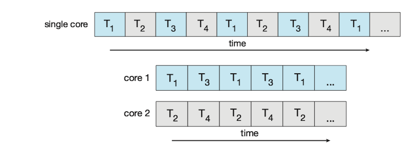
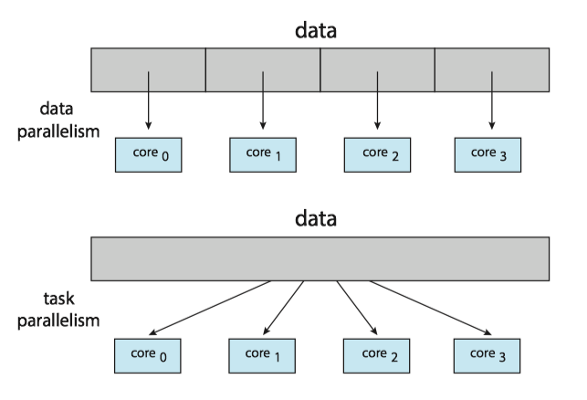
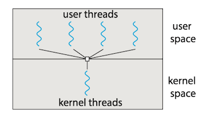
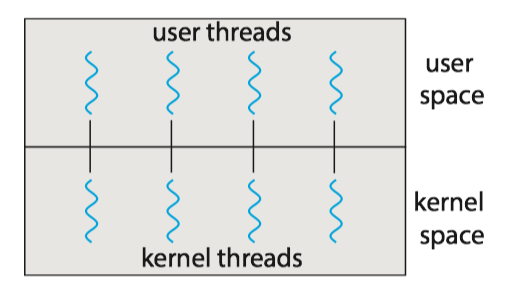
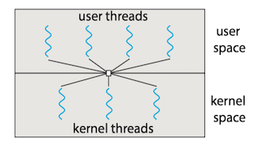
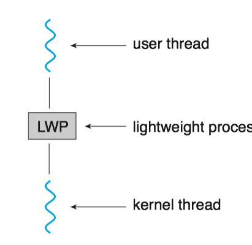
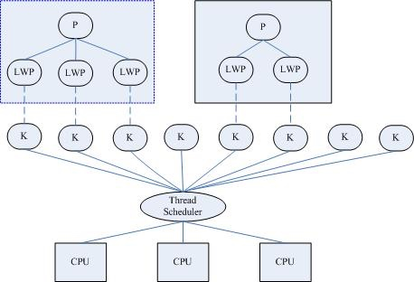

### 1 Overview

A **thread** is a basic unit of CPU utilization; it comprises a thread ID, a program counter, a register set, and a stack.

线程是一个CPU利用的基本单元，它由线程ID，程序计数器、寄存器集合和栈组成。

A traditional process has a single thread of control. If a process has **multiple threads of control**, it can perform more than one task at a time. 
一个传统的进程只有单个控制线程，如果进程有多个控制线程，那么它能一次处理多个任务。

The figure below illustrates the difference between a traditional **single-threaded** process and a **multithreaded** process.


#### Motivation

Process creation is **time consuming** and **resource intensive**. It is generally more efficient to use one process that contains multiple threads.

#### Benefits

The benefits of  multithreaded programming can be broken down into four major categories:

1. **Responsiveness**
    * It allows a program to continue running even if part of it is blocked or is performing a lengthy operation, thereby increasing responsiveness to the user.
    * 响应度高：即使程序部分阻塞或执行较冗长操作，该程序仍能继续执行，从而增加了对用户的相应程度。
2. **Resource sharing**
    * Processes can share resources only through techniques such as shared memory and message. Such techniques must be explicitly arranged by the programmer.
    * Threads share the memory and the resources of the process to which they belong by default.
    * 资源共享：线程默认共享它们所属进程的内存和资源。代码和数据共享的优点是它允许一个应用程序在同一地址空间有多个不同的活动线程。
3. **Economy**
    * Allocating memory and resources for process creation is costly. Because threads share the resources of the process to which they belong, it is more economical to create and context-switch threads.
    * 经济：进程创建所需要的内存和资源的分配比较昂贵。由于线程能共享它们所属进程的资源，所以创建和切换线程会更为经济。
4. **Scalability**
    * The benefits of multithreading can be even greater in a multiprocessor architecture, where threads may be running in parallel on different processing cores.
    * 可扩展性: 多线程的优点之一是能充分使用多处理器体系结构。以便每个进程能并行运行在不同的处理器上。

### 2 Multicore Programming 

On a system with a **single** computing core, concurrency merely means that the execution of the threads will be **interleaved** over time, because the processing core is capable of executing only one thread at a time.

On a system with **multiple** cores, however, concurrency means that some threads can run in **parallel**, because the system can assign a separate thread to each core.




!!! note
    ***Concurrency*** v.s. ***Parallelism***
    
    * Concurrency: supports more than one task by allowing all the tasks to make progress.
    * Parallelism: perform more than one task simultaneously.

#### Programming Challenges

1. **Identifying tasks**. This involves examining applications to find areas that can be divided into separate, concurrent tasks.
2. **Balance**. Programmer must ensure that the tasks perform equal work of equal value.
3. **Data splitting**. The data accessed and manipulated by the tasks must be divided to run on separate cores.
4. **Data dependency**. The data accessed by the tasks must be examined for dependencies between two or more tasks.
5. **Testing and debugging**. Testing and debugging such concurrent programs is inherently more difficult than testing and debugging single-threaded applications.

#### Types of Parallelism

In general, there are two types of parallelism: data parallelism and task parallelism.

* **Data parallelism** focuses on distributing subsets of the same data across multiple computing cores and performing the same operation on each core. 
* **Task parallelism** involves distributing not data but tasks (threads) across multiple computing cores.
* However, data and task parallelism are not mutually exclusive, and an application may in fact use a hybrid of these two strategies.





### 3 Multithreading Models

Support for threads may be provided either at the user level, for ***user threads***, or by the kernel, for ***kernel threads***. 

* User threads are supported above the kernel and are managed without kernel support.
* Kernel threads are supported and managed directly by the operating system.

有两种不同的方法来提供线程支持：用户层的用户级线程和内核层的内核级线程。用户级线程受内核支持，而无需内核管理；而内核级线程由操作系统直接支持和管理。事实上所有当代操作系统都支持内核级线程。

Ultimately, a relationship must exist between user threads and kernel threads. There are three common ways of establishing such a relationship: the many-to-one model, the one-to-one model, and the many-to-many model.
在用户级线程和内核级线程之间必然存在一种关系。有三种普遍建立这种关系的方法：多对一模型、一对一模型、多对多模型。

#### Many-to-One Model

The **_many-to-one model_**(多对一模型) maps many user-level threads to one kernel thread. 多对一模型将许多用户级线程映射到一个内核线程。

* Thread management is done by the thread library in user space, so it is efficient. 线程管理由线程库在用户空间进行的，因而效率比较高。
* Also, because only one thread can access the kernel at a time, multiple threads are unable to run in parallel on multicore systems. 因为任意时刻只能有一个线程能够访问内核，多个线程不能并行运行在多处理器上。



#### One-to-One Model

The **one-to-one model**(一对一模型) maps each user thread to a kernel thread. 一对一模型每个用户线程映射到一个内核线程。

* It provides more concurrency by allowing another thread to run when a thread makes a blocking system call. 该模型在一个线程执行阻塞系统调用时，能允许另一个线程继续执行，提供了更高的并发性。
* It also allows multiple threads to run in parallel on multiprocessors. 它也允许多个线程能并行运行在多处理器系统上。
* The only drawback to this model is that creating a user thread requires creating the corresponding kernel thread, and a large number of kernel threads may ***burden the performance of a system***. 这种模型的唯一缺点是每创建一个用户线程就会创建一个相应的内核线程, 大量内核线程会影响系统性能。




#### Many-to-Many Model

The **many-to-many model**(多对多模型) multiplexes many user-level threads to a smaller or equal number of kernel threads. 多对多模型多路复用了许多用户线程到同样数量或更小数量的内核线程上。


* Developers can create as many user threads as necessary. 开发人员可创建任意多的用户线程。
* The corresponding kernel threads can run in parallel on a multiprocessor. 相应内核线程能在多处理器系统上并发执行。
* Also, when a thread performs a blocking system call, the kernel can schedule another thread for execution. 而且当一个线程执行阻塞系统调用时，内核能调度另一个线程来执行。
* In practice it is ***difficult to implement***. 实际上难以实施。





!!! note
    **Most operating systems now use the one-to-one model.**

#### User/Kernel-Level threads

[ref: Scheduler Activations](https://cs.nyu.edu/rgrimm/teaching/sp07-os/activations.pdf)

(1) **User-Level Threads**(用户级线程)

Advantages:

* Common operations can be implemented **efficiently** 
* Interface can be tailored to application needs

Issues:

* A blocking system call blocks all user-level threads. 阻塞系统调用能够阻塞所有用户级线程。
* Asynchronous system calls can provide partial work-around. 非同步系统调用能提供部分work-around. [view the definition of work-around here](https://en.wikipedia.org/wiki/Workaround)
* A page fault blocks all user-level threads. 缺页异常阻塞所有用户级线程。
* Matching threads to CPUs in a multiprocessor is hard：
    * No knowledge about the numbers of CPUs available to address space 
    * No knowledge when a thread blocks

(2) **Kernel-Level Threads** (内核级线程)

Primary advantage
* Blocking system calls and page faults handled correctly

Issues
* Cost of performing thread operations
* Create, exit, lock, signal, wait all require user/kernel crossings

**NOTE**: The term **_virtual processor_** is often used instead of kernel thread.

### 4 Thread Libraries

A **thread library**(线程库) provides the programmer with an API for creating and managing threads.

#### Pthreads

**Pthreads**, the threads extension of the POSIX standard, may be provided as either a user-level or a kernel-level library. Pthread作为POSIX标准扩展，可以提供用户级或内核级的库。

This is a *specification* for thread behavior, not an *implementation*. Operating-system designers may implement the specification in any way they wish.

* `pthread_t tid`: declares the identifier for the thread
* `pthread attr_t attr`: declares the attributes for the thread
* `pthread_attr_init(&attr)`: initialize thread attributes object
* `pthread_create()`: create a new thread
* `pthread_join()`:  join with a terminated thread  
* `pthread_exit()`:  terminate calling thread  

Note: Compile and link with `-pthread`.

`pthread`详细用法和实例, 见[POSIX thread (pthread) libraries](https://www.cs.cmu.edu/afs/cs/academic/class/15492-f07/www/pthreads.html)

#### Java Threads

The Java thread API allows threads to be created and managed directly in Java programs. However, because in most instances the JVM is running on top of a host operating system, the Java thread API is generally implemented using a thread library available on the host system. This means that on Windows systems, Java threads are typically implemented using the Windows API; UNIX, Linux, and macOS systems typically use Pthreads.

One approach of creating thread is to define a class that implements the <C>Runnable</C> interface. The code in the <C>run()</C> method of a class that implements <C>Runnable</C> is what executes in a separate thread.


```Java
class Job implements Runnable
{
    public void run() { 
        System.out.println("I am a thread.");
}
```

Thread creation in Java involves creating a <C>Thread</C> object and passing it an instance of a class that implements <C>Runnable</C>, followed by invoking the <C>start()</C> method on the <C>Thread</C> object.

```Java
Thread worker = new Thread(new Job()); 
worker.start();
```

#### Java Executor Framework

However, beginning with Version 1.5 and its API, Java introduced several new concurrency features that provide developers with much greater control over thread creation and communication.

> Executor is an object that executes submitted Runnable tasks. This interface provides a way of decoupling task submission from the mechanics of how each task will be run, including details of thread use, scheduling, etc. An Executor is normally used instead of explicitly creating threads. [[Java Doc](http://docs.oracle.com/javase/9/docs/api/java/util/concurrent/Executor.html)]

Rather than explicitly creating <C>Thread</C> objects, thread creation is instead organized around the <C>Executor</C> interface:

```Java
public interface Executor { 
    void execute(Runnable command); 
}
```

Classes implementing this interface must define the <C>execute()</C> method, which is passed a <C>Runnable</C> object.

```Java
Executor service = new Executor; 
service.execute(new Job());
```

The advantage of this approach is that it not only divides thread creation from execution but also provides a mechanism for communication between concurrent tasks.

### 5 Implicit threading

**Implicit threading**(隐式线程): Transfers the creation and management of threading from application developers to compilers and run-time libraries.

* One way to address difficulties and better support the design of concurrent and parallel applications.
* The advantage of this approach is that developers ***_only need to identify parallel tasks_***, and the libraries determine the specific details of thread creation and management.

In this section, we explore four alternative approaches to designing applications that can take advantage of multicore processors through implicit threading:

* Thread Pools
* Fork Join
* OpemMP
* Grand Central Dispatch

#### Thread Pools

Two main issues exist:

* The thread will be **discarded** once it has completed its work. 线程在完成工作之后就要被丢弃
* **Unlimited** threads could exhaust system resources. 无限制的线程会耗尽系统资源

Solution -> **thread pool**(线程池)

* It creates a number of threads at start-up, and places them into a pool, where they sit and wait for work.
* When a server receives a request, it submits the request to the thread pool and resumes waiting for additional requests.
* If there is an available thread in the pool, it is awakened, and the request is serviced immediately. 
* If the pool contains no available thread, the task is queued until one becomes free. 

线程池的思想是在进程开始时创建一定数量的线程，并放入到池中以等待工作。当服务器收到请求时，它会唤醒线程池中的一个线程，并将要处理的请求传递给它，一旦线程完成了服务，它会返回到池中在等待工作。如果池中没有可用的线程，那么服务器会一直等待直到有空线程为止。

Thread pools offer these benefits:

1. Servicing a request with an existing thread is often **faster** than waiting to create a thread. 通常用现有线程处理请求要比等待创建新的线程要快.
2. A thread pool **limits** the number of threads that exist at any one point.  线程池限制了在任何时候可用线程的数量.
3. Separating the task to be performed from the mechanics of creating the task allows us to use different strategies for running the task.

<big><font color="green">Java Thread Pool</font></big>

The <C>java.util.concurrent</C> package includes an API for several varieties of thread-pool architectures. Here, we focus on the following three models:

1. Single thread executor — <C>newSingleThreadExecutor()</C> — creates a pool of size 1.
2. Fixed thread executor — <C>newFixedThreadPool(int size)<C> — creates a thread pool with a specified number of threads.
3. Cached thread executor — <C>newCachedThreadPool()</C> — creates an unbounded thread pool, reusing threads in many instances.

Each of these factory methods creates and returns an object instance that implements the <C>ExecutorService</C> interface. <C>ExecutorService</C> extends the <C>Executor</C> interface, allowing us to invoke the <C>execute()</C> method on this object.

```java
//It creates a cached thread pool and submits tasks to be executed by a thread in the pool using the execute() method. 
// When the shutdown() method is invoked, the thread pool rejects additional tasks and shuts down once all existing tasks have completed execution.
import java.util.concurrent.*; 
public class ThreadPoolExample 
{ 
    public static void main(String[] args) {
        int numTasks = Integer.parseInt(args[0].trim()); 
        
        /* Create the thread pool */ 
        ExecutorService pool = Executors.newCachedThreadPool(); 
        /* Run each task using a thread in the pool */ 
        for (int i = 0; i < numTasks; i++) 
            pool.execute(new Task()); 
        
         /* Shut down the pool once all threads have completed */            
        pool.shutdown();
}
```

#### Grand Central Dispatch 

**Grand Central Dispatch** (GCD) is a technology for Apple's Mac OS X and iOS operating systems. It is a combination of extensions to the C languages, an API, and a run-time library that allows application developers identify sections of code to run in parallel.

* GCD identifies two types of dispatch queues: serial and concurrent.

### 6 Threading Issues
#### Light Weight Process

Many systems implementing either the many-to-many or the two-level model place an *intermediate* data structure between the user and kernel threads. This data structure—typically known as a **_*lightweight process*_**（轻量级进程）, or **LWP**.

* To the user-thread library, the LWP appears to be a **virtual** processor on which the application can schedule a user thread to run.
* Each LWP is attached to a kernel thread.
* If a kernel thread blocks, the LWP blocks as well. Up the chain, the user-level thread attached to the LWP also blocks.





where K denotes kernel threads and  P denotes Process.

下面是一个测试LINUX中LWP的C程序

```c
/* filename: test_LWP.c */
#include <stdlib.h>
#include <pthread.h>
#include <stdio.h>
#include <unistd.h>

int* thread(void* arg)
{
    pthread_t tid; // the ID of a thread
    tid = pthread_self();//get the current thread's id
 
    printf("The ID of new thread is =%lu\n", tid);
    sleep(500); //sleep for 500 seconds
    return NULL; 
}
  
int main()
{
	pthread_t tid;
	printf("The ID of main thread is %lu\n", pthread_self()); //get the main thread's id
  if (pthread_create(&tid, NULL, (void *) thread, NULL) !=0) 
	{
	   printf("Thread creation failed\n");
		exit(1);
	}
	  
	printf("my Id is %lu, new thread ID is %lu\n", pthread_self(), tid);
	sleep(1000);
	return 0;
}
```

运行`ps -efL` 可以看到, `test_LWP`进程(PID=1953)有两个LWP，即NLWP(number of light weight process)=2。

```
UID        PID  PPID   LWP  C NLWP STIME TTY          TIME CMD
vagrant   1953  1644  1953  0    2 04:16 pts/0    00:00:00 ./test_LWP
vagrant   1953  1644  1954  0    2 04:16 pts/0    00:00:00 ./test_LWP
vagrant   2028  1839  2028  0    1 04:18 pts/1    00:00:00 ps -efL
```


#### Scheduler activation

**Problems**:
内核线程在各方面都比较灵活，但是性能不高，经常会出现请求在用户空间和内核空间的传递。那么如何在拥有内核空间线程的灵活性的同时又提高性能呢?

**Solution**:

**Scheduler activation**（调度器激活）are a threading mechanism that, when implemented in an operating system's process scheduler, provide *_kernel-level_* thread functionality with _*user-level*_ thread flexibility and performance [[ref](https://en.wikipedia.org/wiki/Scheduler_activations)]. 

It works as follows: 

* The kernel provides an application with a set of virtual processors (LWPs), and the application can **schedule** user threads onto an available virtual processor. 
* Furthermore, the kernel must inform an application about certain events. This procedure is known as an **upcall**(向上调用). 
* Upcalls are handled by the thread library with an upcall handler, and upcall handlers must run on a virtual processor.
* While the user threading library will schedule user threads, the kernel will schedule the underlying LWPs.


**Example** [[ref](http://www.it.uu.se/education/course/homepage/os/vt18/module-4/implementing-threads/)]: 

Let’s study an example of how scheduler activations can be used. The kernel has allocated one kernel thread (1) to a process with three user-level threads (2). The three user level threads take turn executing on the single kernel-level thread.


* (3) The executing thread makes a **blocking system call**.
* (4) And the the kernel blocks the calling user-level thread and the kernel-level thread used to execute the user-level thread .
* (5) Scheduler activation: the kernel decides to allocate a new kernel-level thread to the process . 
* (6) Upcall: the kernel notifies the user-level thread manager which user-level thread that is now blocked and that a new kernel-level thread is available. 
* (7) The user-level thread manager move the other threads to the new kernel thread and resumes one of the ready threads.


