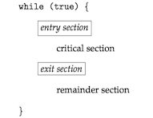
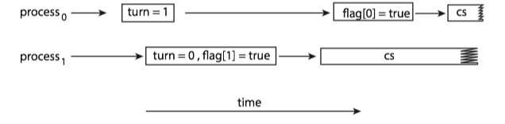
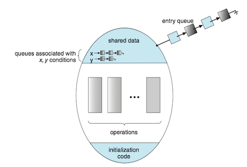
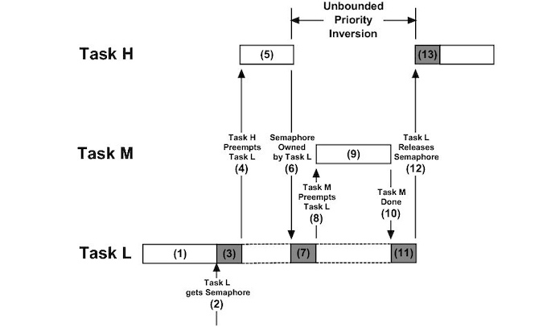

### 1 Background

A <b>{==race condition==}</b>(竞争条件) occurs when several processes access and **manipulate the same data concurrently** and the outcome of the execution **depends on the particular order** in which the access takes place.

多个进程并发访问和操作同一数据，且执行结果与访问发生的特定顺序有关，称之为竞争条件。


### 2 The Critical-Section problem

A **critical section**(临界区) is a section of code, in which the process may be accessing and updating data that is shared with at least one other process.

* When one process is executing in its critical section, no other process is allowed to execute in its critical section.

The **critical-section problem**(临界区问题) is to design a protocol that the processes can use to synchronize their activity so as to cooperatively share data.

* Each process must request permission to enter its critical section.
* The section of code implementing this request is the **entry section**(进入区)
* The critical section may be followed by an **exit section**(退出区)。
* The remaining code is the **remainder section**(剩余区)。





A solution to the critical-section problem must satisfy the following three requirements:

1. **Mutual exclusion** (互斥): If process \(P_i\) is executing in its critical section, then no other processes can be executing in their critical sections. 如果进程\(P_i\)在其临界区内执行，那么其他进程都不能在其临界区内执行；
2. **Progress** (前进): If no process is executing in its critical section and some processes wish to enter their critical sections, then only those processes that are not executing in their remainder sections can participate in deciding which will enter its critical section next, and this selection cannot be postponed indefinitely. 如果没有进程在其临界区内执行且有进程需进入临界区，那么只有那么不在剩余区内执行的进程可参加选择，以确定谁能下一个进入临界区，且这种选择不能无限推迟；
3. **Bounded waiting** (有限等待): There exists a bound, or limit, on the number of times that other processes are allowed to enter their critical sections after a process has made a request to enter its critical section and before that request is granted. 从一个进程做出进入临界区的请求，直到该请求允许为止，其他进程允许进入其临界区内的次数有上限。

Two general approaches are used to handle critical sections in operating systems: **preemptive kernels**（抢占内核） and **nonpreemptive kernels**（非抢占内核）.

* A preemptive kernel allows a process to be preempted while it is running in kernel mode. 抢占内核允许处于内核模式的进程被抢占。
* A nonpreemptive kernel does not allow a process running in kernel mode to be preempted.A kernel-model process will run until it exists kernel mode, blocks, or voluntarily yields control of the CPU.非抢占内核不允许内核模式的进程被抢占。
* A nonpreemptive kernel is essentially free from race conditions on kernel data structures, as only on process is active in the kernel at at time. 非抢占内核的内核从根本上不会导致竞争条件，因为在内核中一次只有一个进程是活跃的。
* Preemptive kernels must be carefully designed to ensure that shared kernel data are free from race conditions. 对于抢占内核需要认真设计以确保共享内和数据免于竞争条件。
* A preemptive kernel may be more responsive, since there is less risk that a kernel-model process will run for an arbitrarily long period before relinquishing the processor to waiting process. 抢占内核的响应更快，因为处于内核模式的进程在释放CPU之前不会运行过久。
* A preemptive kernel is more suitable for real-time programming, as it will allow a real-time process to preemptive a process currently running in the kernel. 抢占内核更适合实时编程，因为它能允许实时进程抢占处于内核模式运行的其他进程。

### 3 Peterson's Solution

**Peterson’s solution**(Peterson 算法) is restricted to two processes that alternate execution between their critical sections and remainder sections. The processes are numbered \(P_0\) and \(P_1\). For convenience, when presenting \(P_i\), we use \(P_j\) to denote the other process; that is \(j\) equals \(1-i\).

Peterson's solution requires the two processes to share two data items:

```c
int turn;
boolean flag[2];
```

The structure of process \(P_i\) in Peterson's solution.

```c
while (true) {
    flag[i] = true; 
    turn = j; 
    while (flag[j] && turn == j) 
        ;
    /* critical section */
    flag[i] = false;
    /*remainder section */
}
```

* The variable `turn` indicates whose turn it is to enter its critical section.
* The `flag` array is used to indicate if a process is ready to enter its critical section.


!!! note
    Peterson’s solution is **not guaranteed** to work on modern computer architectures for the primary reason that, to improve system performance, **processors and/or compilers may reorder read and write operations that have no dependencies**.


If the assignments of the first two statements that appear in the entry section of Peterson's solution are reordered. It is possible that both threads may be active in their critical sections at the same time.




### 4 Hardware support for Synchronization

Hardware support for the critical-section problem includes:

* Memory barriers
* Hardware instructions
* Atomic variables

#### Memory barriers

How a computer architecture determines what memory guarantees it will provide to an application program is known as its **memory model**(内存模型). In general, a memory model falls into one of two categories:

1. **Strongly ordered**, where a memory modification on one processor is immediately visible to all other processors.
2. **Weakly ordered**, where modifications to memory on one processor may not be immediately visible to other processors.

Computer architectures provide instructions that can *force* any changes in memory to be propagated to all other processors, thereby ensuring that memory modifications are visible to threads running on other processors. Such instruction are known as **memory barriers**(内存屏障).

* When a memory barrier instruction is performed, the system ensures that all loads and stores are completed before any subsequent load or store operations are performed.

#### Hardware instructions

Many modern computer systems provide special hardware instructions that allow either to test and modify the content of a word or to swap the contents of two words atomically - that is, one uninterruptible unit.

The definition of the atomic `test_and_set()` instruction:

```c
boolean test_and_set(boolean *target) { 
    boolean rv = *target; 
    *target = true;
    return rv;
}
```

Mutual-exclusion implementation with `test_and_set()`:

```c
do {
    while (test_and_set(&lock)) 
        ; /* do nothing */
    /* critical section */
    lock = false;
    /* remainder section */ } 
while (true);
```

The definition of the atomic `compare_and_swap()`（CAS， 比较并交换）instruction:

```c
int compare_and_swap(int *value, int expected, int new value) { 
    int temp = *value;
    if (*value == expected) 
        *value = new value;
    return temp;
}
```

Mutual exclusion with the `compare_and_swap()` instruction:

```c
while (true) {
    while (compare_and_swap(&lock, 0, 1) != 0) 
        ; /* do nothing */
    /* critical section */
    lock = 0;
    /* remainder section */
}
```

#### Atomic variables

**Atomic variables**(原子变量) provides atomic operations on basic data types such as integers and booleans. Their use is often **limited to single updates of shared data such as counters and sequence generators**.

!!! important
    It is important to note that although atomic variables provide atomic updates, they do not entirely solve race conditions in all circumstances.


```c
increment(&sequence);
void increment(atomic int *v) { 
    int temp;   
    do { 
        temp = *v; 
    } 
    while (temp != compare_and_swap(v, temp, temp+1)); }
```


### 5 Mutex locks

ISSUE: The hardware-based solutions are complicated as well as generally inaccessible to application programmers.

SOLUTION: Operating-system designers build higher-level software tools. The simplest of these tools is the **mutex lock**(互斥锁)。

* A process must **acquire** the lock before entering a critical section; 
* A process **releases** the lock when it exists the critical section.
* A mutex lock has a boolean variable **available**, whose value indicates if the lock is available or not.
* Calls to either `acquire()` or `release()` must be performed atomically. Thus mutex locks can be implemented using the CAS operation.


Solution to the critical-section problem using mutex locks:

```C
while (true) {
    /* acquire lock */
    
    /* critical section */
    
    /* release lock */
    
    /* remainder section */
}
```


The definition of `acquire()` is as follows:

```c
acquire() { 
    while (!available) ;
        /* busy wait */ 
    available = false; 
}
```

The definition of `release()` is as follows:

```c
release(){
    available = true;
}
```

The main disadvantage of the implementation is that it requires **busy waiting**(忙等待).

* While  a process is in its critical section, any other process that tries enter its critical section must loop continuously in the call to `acquire()`.
* It wastes CPU cycles.

Because the process "spins" while waiting for the lock to become available, this type of mutex lock is also called a `spinlock`（自旋锁）。

* Advantage: no context switch is required

Spinlocks are not appropriate for single-processor systems yet are often used in multiprocessor systems.

[POSIX API for Spinlocks](ch7/#posix-spinlocks)

### 6 Semaphores

A **semaphore**(信号量) S is an integer variable that, apart from initialization, is accessed only through two standard atomic operations: <C>wait()</C> and <C>signal()</C>. 信号量S是个整数变量，除了初始化外，它只能通过两个标准原子操作：<C>wait()</C>和<C>signal()</C>来访问。

The definition of <C>wait()</C> is as follows:

```c
wait(S){
    while (S <= 0)
        ;// busy wait
    S--;
{
```

The definition of <C>signal()</C> is as follows:

```c
signal(S){
    S++;
}
```

All modifications to the integer value of the semaphore in the <C>wait()</C> and <C>signal()</C> operations must be executed atomically.  在<C>wait()</C>和<C>signal()</C>操作中，对信号量整型值的修改必须不可分地执行。


Operating systems often distinguish between counting and binary semaphores.通常操作系统区分计数信号量和二进制信号量。

* The value of a **counting semaphore**(计数信号量) can range over an unrestricted domain.计数信号量的值域不受限制。
* The value of a **binary semaphore**(二进制信号量) can range only between 0 and 1. 二进制信号量的值只能为0或1。

Counting semaphores can be used to control access to  a given resource consisting of a finite number of instances.

* The semaphore is initialized to the number of resources available. 
* Each process that wishes to use a resource performs a `wait() `operation on the semaphore (thereby decrementing the count). 
* When a process releases a resource, it performs a <C>signal()</C> operation (incrementing the count). 
* When the count for the semaphore goes to 0, all resources are being used. After that, processes that wish to use a resource will block until the count becomes greater than 0.

[POSIX API for Semaphores](ch7/#posix-semaphores)
[Java API for Semaphores](ch7/#semaphores)

### 7 Monitors

#### Monitor Usage

Issues: various types of errors can be generated easily when programmers use semaphores or mutex locks incorrectly to solve the critical-section problem.

* interchanges the order of <C>wait()</C> and <C>signal()</C>
* replaces <C>signal()</C> with <C>wait()</C>
* omits <C>wait()</C> or <C>signal()</C>

Solution: An abstract data type, **monitor**(管程), includes a set of programmer-defined operation related to mutual exclusion within the monitor. The monitor construct ensures that only one process at a time is active within the monitor.

Pseudocode syntax of a monitor:

```c
monitor monitor name { /* shared variable declarations */
    function P1 ( . . . ) { . . .}
    function P2 ( . . . ) { . . .}
        .
        .
    function Pn ( . . . ) { . . .}
    initialization code ( . . . ) { . . .}
}
```

A monitor uses **condition variables** that allow processes to wait for certain conditions to become true and to signal one another when conditions have been set to true:

$$\text{condition x, y;}$$

The only operations that can be invoked on a condition variable are <C>wait()</C> and <C>signal()</C>.



#### Implementing a Monitor Using Semaphores

* binary semaphore `next`: the signaling processes use it to suspend themselves.
* integer variable `next_count`: to count the number of processes suspended on `next`.
* condition `x`, binary semaphore `x_sem`, and integer variable `x_count` 

```C
monitor ResourceAllocator {

    boolean busy; 
    condition x;
    
    void acquire(int time) { 
        if (busy) 
            x.wait(time); 
        busy = true; 
    }
    
    void release() { 
        busy = false; 
        x.signal(); 
    }
    
    initialization code() { 
        busy = false; 
    }

    signal() {
        if (x_count > 0) { 
            next_count++; 
            signal(x_sem); 
            wait(next); 
            next_count--; 
        }
    }
    
    wait() { 
        x_count++; 
        if (next_count > 0)
            signal(next); 
        else
            signal(mutex); 
        wait(x_sem); 
        x count--;
    }
}

```


[Monitor in Java](ch7/#java-monitors)

### 8 Liveness

#### Deadlock

Consider two threads A and B that both need **simultaneous** access to resources 1 and 2:

1. **Thread A** runs, grabs the lock for **Resource 1**.
2. → CONTEXT SWITCH ←
3. **Thread B** runs, grabs the lock for **Resource 2**.
4. → CONTEXT SWITCH ←
5. **Thread A** runs, tries to acquire the lock for **Resource 2**.
6. → THREAD A SLEEPS ←
7. **Thread B** runs, tries to acquire the lock for **Resource 1**.
8. → THREAD B SLEEPS ←

**Deadlocked**(死锁): *_two or more processes are waiting indefinitely for an event_*.

A set of processes is in a deadlocked state when every process in the set is waiting for an event that can be caused only by another process in the set.


#### Priority Inversion

A scheduling challenge arises when a higher-priority process needs to read or modify kernel data that are currently being accessed by a lower-priority process—or a chain of lower-priority processes. 

* Since kernel data are typically protected with a lock, the higher-priority process will have to wait for a lower-priority one to finish with the resource. 
* The situation becomes more complicated if the lower-priority process is preempted in favor of another process with a higher priority.

As an example, assume we have three processes—\(L\), \(M\), and \(H\)—whose priorities follow the order \(L < M < H\). 

* Assume that process \(H\) requires a semaphore \(S\), which is currently being accessed by process \(L\). 
* Ordinarily, process \(H\) would wait for \(L\) to finish using resource S. 
* However, now suppose that process \(M\) becomes runnable, thereby preempting process \(L\). 
* Indirectly, a process with a lower priority—process \(M\)—has affected how long process \(H\) must wait for \(L\) to relinquish resource \(S\).




This liveness problem is known as **priority inversion**(优先级反转), and it can occur only in systems with more than two priorities. 

Solution：**priority-inheritance protocol**(优先级继承协议)：

* All processes that are accessing resources needed by a higher-priority process inherit the higher priority until they are finished with the resources. 
* When they are finished, priorities revert to original values.

### 9 Evaluation

Performance differences between CAS-based synchronization and traditional synchronization (such as mutex locks and semaphores) under varying contention loads:

* **Uncontended**：Although both options are generally fast, CAS protection will be somewhat faster than traditional synchronization.
* **Moderate contention**：CAS protection will be faster—possibly much faster —than traditional synchronization.
* **High contention**：Under very highly contended loads, traditional synchronization will ultimately be faster than CAS-based synchronization.

Higher-level tools such as monitors and condition variables may have significant overhead, and may be less likely to scale in highly contended situations.
