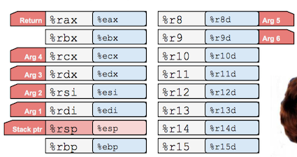
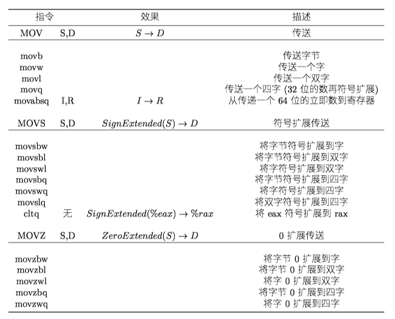
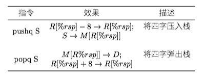
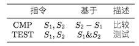
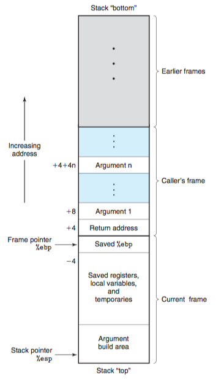

### 1 历史观点

Intel处理器系列俗称x86，经历了一个长期的、不断进化的发展过程。

* 8086(1978年，29K个晶体管)。第一代单芯片、16位微处理器之一。
* i386(1985年， 275K个晶体管)。将体系结构扩展到32位。
* Core i7(2008年，781M个晶体管)。支持超线程、多核。

Intel处理器系列有好几个名字，包括IA32，也就是“Intel 32位体系结构”(Intel Architecture 32-bit)，以及最新的Intel64，即IA32的64位扩展，也称为x86-64。

### 2 程序编码

对于机器编程来说，其中两种抽象尤为重要。

* 指令集体系结构(Instruction Set Architecture, ISA)，定义了机器级程序的格式和行为，它定义了处理器状态、指令的格式以及每条指令对状态的影响。大多数ISA，将程序的行为描述成好像每条指令都是按顺序执行的。常见的ISA有x86、ARM v8、MIPS。
* 虚拟地址，提供的内存模型看上去是一个非常大的字节数组。

### 3 数据格式

Intel用术语"字(word)"表示16位数据类型，32位数称为"双字(double words)"，64位数称为"四字(quad words)"。

!!! note "汇编代码格式"

    现在主要存在`ATT`和`Intel`两种汇编代码格式。`ATT`格式是`GCC`、 `OBJDUMP`常用工具的默认格式。其他的诸如Microsoft的工具和来自Intel的文档都是`Intel`格式的。本文使用`ATT`格式。
    
    `ATT`汇编格式的注释格式有两种
    
    ```
    # this is a comment
    /* this is a comment */
    ```

### 4 访问信息

一个x86-64的CPU包含一组16个存储64位值的**通用目的寄存器**，用来存储整数数据和指针。




#### 4.1 操作数指示符

大多数指令有一个或多个操作数(operand)，指示出执行一个操作中要使用的源数据值，以及放置结果的目的位置。x86-64支持多种操作数格式：

* 立即数(immediate)，用来表示常数值。书写方式是$后面跟一个整数
* 寄存器(register)，表示某个寄存器的内容。用符号\(r_a\)来表示任意寄存器\(a\)，用引用\(R[r_a]\)表示寄存器的值
* 内存引用。根据计算出来的地址(通常称为有效地址)访问某个内存位置。因为将内存看成一个很大的字节数组，用符号\(M_b[Addr]\)表示对存储在内存中从地址\(Adrr\)开始的\(b\)字节值的引用。


#### 4.2 数据传送指令

数据传送指令--MOV类--把数据从原位置复制到目的位置。MOV类由四条指令组成：movb、movw、movl、movq。这些指令都执行同样的操作，主要区别是它们操作的数据大小不同：分别是1、2、4和8字节。


数据传送指令的两个操作数不能都指向内存位置。将一个值从内存位置复制到另一个内存位置需要两条指令 - 第一条指令将源值加载到寄存器中，第二条指令将该寄存器值写入目的位置。




MOVZ类中的指令把目的中剩余的字节填充为0；而MOVS类中的指令通过符号扩展来填充，即把源操作数的最高位进行复制。

#### 4.3 压入和弹出栈数据

pushq指令把数据压入到栈上，而popq指令弹出数据。




### 5 算数和逻辑操作

操作被分为四组：加载有效地址、一元操作、二元操作和移位。


**加载有效地址**(load effective address)指令leaq实际上是movq指令的变形，将有效地址写入到目的操作数。

另外一个leaq的作⽤就是⽤来作为算术运算。例如，如果寄存器`%rdx`的值为x，那么指令`leaq 7(%rdx, %rdx, 4), %rax`将设置寄存器`%rax`的值为5x+7。

一元操作只有一个操作数，即是源又是目的。这个操作数可以是一个寄存器，也可以是一个内存位置。比如说，指令`incq(%rsp)`会使栈顶的8字节元素加1。


### 6 控制
#### 6.1 条件码

**条件码**(condition code)寄存器，描述了最近的算数和逻辑操作的属性。可以检测条件码寄存器来执行条件分支指令。最常用的条件码有：

* CF：进位标志。最近的操作使最高位产生了进位。可以用来检查无符号操作的溢出。
* ZF：零标志。最近的操作得出的结果为0.
* SF：符号标志。最近的操作得到的结果为负数。
* OF：溢出标志。最近的操作导致一个补码溢出 -- 正溢出或负溢出。

除了第6小节所提及的指令会设置条件码之外，还有两类指令只设置条件码而不改变任何其他寄存器的值，这两类指令都支持四种长度变种后缀(b, w, l, q)




### 7 过程
**过程**(procedure)是软件中一种很重要的抽象。它提供了一种封装代码的方式，用一组制定的参数和一个可选的返回值实现了某这功能。然后，可以在程序中不同的地方调用这个函数。不同编程语言中，过程的形式多样：函数(function)、方法(method)、子例程(subroutine)、处理函数(handler)等等。

假设过程P调用过程Q，Q执行后返回到P，包含下面一个或多个机制：

* 传递控制。在进入过程Q的时候，程序计数器必须被设置为Q的代码的起始地址，然后在返回时，要把程序计数器设置为P中调用Q后面那条指令的地址。
* 传递数据。P必须能够向Q提供一个或多个参数，Q必须能够向P返回一个值。
* 分配和释放内存。在开始时，Q可能需要为局部变量分配空间，而在返回前，又必须释放这些存储空间。


#### 7.1 运行时栈

在函数调用时，往往使用了栈(`Stack`)这一数据结构。当x86-64过程需要的存储空间超出寄存器能够存放的大小时(意味着其实很多函数根本不需要帧栈)，就会在栈上分配空间，称为**帧栈**(stack frame)。

Current Stack Frame (“Top” to Bottom) contains:

* Argument build(参数构造区):
    * Parameters for function about to call
    * 可以通过寄存器最多传递6个整形参数，超出6个部分就要通过栈来传递
* Local variables(局部变量):
    * 寄存器不足够存放所有的本地数据
    * 使用地址运算符&，必须能够产生一个地址
* Saved register context(被保存的寄存器)
    * 保存寄存器的值到栈中
* Old frame pointer (optional)




#### 7.2 转移控制

!!!note "ret, call指令"

    在x86-64上，`ret`指令，相当于从栈中弹出地址A，然后把PC设置为A。`pop %rip`
    而`call`指令，刚好相反，把%rip压入栈中，然后跳到函数对应的地址。

#### rip 寄存器与PC相对寻址

%rip 的名称来自于(instruction pointer register，指令指针寄存器)。%rip其实就是**程序计数器**(Program Counter, PC), _*存放着下一条指令的地址*_ 。不可以直接修改%rip。

-> `instruction pointer = program counter = %rip`

%rip的其他很重要的一个用法就是RIP/**PC相对寻址**(RIP/PC relative addressing)。即`%rip + displacement`的用法。

例如，

```assembly
mov    0x202a62(%rip),%rdi        # 6044d0 <infile>  rdi = infile
```

表示传输%rip+0x202a62的地址对应的内存上的内容到%rdi。

下面说说它是怎么进行PC相对寻址的。

* 源文件经过预处理器、编译器、汇编器处理，输出**可重定位目标文件**
* 再经过**符号解析**(Symbol resolution)把代码中的每个符号引用和一个符号定义关联起来之后，要完成**重定位**(Relocation)任务，最终输出**可执行目标文件**。
    * 在**重定位**阶段，ELF(可重定位目标文件在LINUX系统上的一种格式)文件中的`R_X86_64_PC32`重定位类型重定位了一个使用32位PC相对地址的引用。
    * 当CPU执行一条使用PC相对寻址的指令时，它就将在指令中编码的32位值加上PC的当前运行时值，得到**有效地址**。
