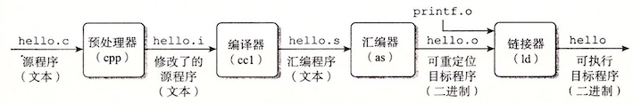
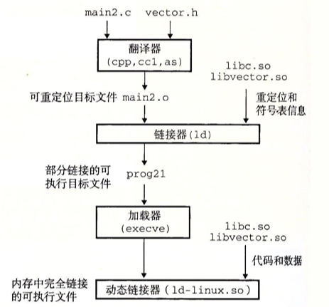

**链接**(Linking)是将各种**代码**和**数据片段**收集并组合成为一个单一文件的过程。链接可以在编译、加载、运行时执行。在现代系统中，链接由**链接器**(Linker)自动执行。

链接器使得**分离编译**(separate compilation)成为可能：

* 可以将源文件分解为更小、更好管理的模块，可以独立地修改和编译这些模块
* 修改一个模块后，只需重新编译它，并重新链接，不必编译其他文件

### 1 编译器驱动程序

**编译器驱动程序**(`compiler driver`)，代表用户在需要时调用预处理器(cpp)、编译器(ccl)、汇编器(as)和链接器(ld)。典型的编译器驱动程序，包括GNU GCC, Clang。

例如，一个简单打印hello的`hello.c`程序，经过下面四个阶段，生成可执行目标文件：

```C
//file: hello.c
#include <stdio.h>

int main()
{
    int i;
    printf("Hello World");
}
```

```bash
linux > cpp [other arguments] hello.c hello.i // C预处理器cpp，将源程序翻译成一个ASCII码的中间文件
linux > cc1 hello.i -Og [other arguments]  -o hello.s //C编译器cc1, 翻译成一个ASCII汇编语言文件
linux > as [other arguments]  -o hello.o hello.s //汇编器as, 翻译成可重定位目标文件
linux > ld -o hello [system object files and args] hello.o //链接器ld，创建一个可执行文件
* linux > ./hello //调用加载器
```




### 2 静态链接 

静态链接器有两个主要任务：

* **符号解析**(symbol resolution): 将每个符号 _引用_ 正好和一个符号 _定义_ 关联起来。
* **重定位**(relocation): 把每个符号定义与一个内存位置关联起来，并修改所有对这些符号的引用，使得它们指向这个内存位置。


### 3 目标文件

目标文件有三种格式：**可重定位目标文件**(`.o`)，**可执行目标文件**(`.out`)，**共享目标文件**(`.so`)

* **可重定位目标文件**(.o文件)。包含二进制代码和数据，其形式可以在编译时与其他可重定位目标文件合并起来，创建一个可执行目标文件。
* **可执行目标文件**(a.out文件)。包含二进制代码和数据，其形式可以被直接复制到内存并执行。
* **共享目标文件**(.so文件)。在加载或者运行时被动态地加载进内存并链接

各个系统的目标文件格式不同，Windows使用**可移植可执行**(Portable Executable, `PE`)格式。现代x86-64系统使用**可执行可链接格式**(Executable and Linkable Format, `ELF`)。

### 4 可重定位目标文件

以可执行可链接(ELF)格式为例，一个典型的可重定位目标文件包括以下几个节：

* ELF头和节头部表
* `.text` 已编译程序的机器代码
* `.rodata` 只读数据
* `.data`  已初始化的全局和静态C变量
* `.bss`  未初始化的全局和静态C变量
* `.symtab` 一个符号表
* `.rel.text` 一个.text节中位置的列表
* `.rel.data` 重定位信息
* `.debug` 调试符号表
* `.line`  原始程序行号和机器指令之间的映射
* `.strtab`  字符串表


利用`READELF`程序可以显示程序`hello.c`生成的可执行可链接文件的信息：

```bash
gcc hello.c -c
readelf -a hello.o ### UNIX/LINUX
greadelf -a hello.o ### MAC, after brew install binutils
```

<small>
```text
ELF Header:
  Magic:   7f 45 4c 46 02 01 01 00 00 00 00 00 00 00 00 00
  Class:                             ELF64
  Data:                              2's complement, little endian
  Version:                           1 (current)
  OS/ABI:                            UNIX - System V
  ABI Version:                       0
  Type:                              REL (Relocatable file)
  Machine:                           Advanced Micro Devices X86-64
  Version:                           0x1
  Entry point address:               0x0
  Start of program headers:          0 (bytes into file)
  Start of section headers:          304 (bytes into file)
  Flags:                             0x0
  Size of this header:               64 (bytes)
  Size of program headers:           0 (bytes)
  Number of program headers:         0
  Size of section headers:           64 (bytes)
  Number of section headers:         13
  Section header string table index: 10

Section Headers:
  [Nr] Name              Type             Address           Offset
       Size              EntSize          Flags  Link  Info  Align
  [ 0]                   NULL             0000000000000000  00000000
       0000000000000000  0000000000000000           0     0     0
  [ 1] .text             PROGBITS         0000000000000000  00000040
       0000000000000015  0000000000000000  AX       0     0     1
  [ 2] .rela.text        RELA             0000000000000000  00000590
       0000000000000030  0000000000000018          11     1     8
  [ 3] .data             PROGBITS         0000000000000000  00000055
       0000000000000000  0000000000000000  WA       0     0     1
  [ 4] .bss              NOBITS           0000000000000000  00000055
       0000000000000000  0000000000000000  WA       0     0     1
  [ 5] .rodata           PROGBITS         0000000000000000  00000055
       000000000000000c  0000000000000000   A       0     0     1
  [ 6] .comment          PROGBITS         0000000000000000  00000061
       000000000000002c  0000000000000001  MS       0     0     1
  [ 7] .note.GNU-stack   PROGBITS         0000000000000000  0000008d
       0000000000000000  0000000000000000           0     0     1
  [ 8] .eh_frame         PROGBITS         0000000000000000  00000090
       0000000000000038  0000000000000000   A       0     0     8
  [ 9] .rela.eh_frame    RELA             0000000000000000  000005c0
       0000000000000018  0000000000000018          11     8     8
  [10] .shstrtab         STRTAB           0000000000000000  000000c8
       0000000000000061  0000000000000000           0     0     1
  [11] .symtab           SYMTAB           0000000000000000  00000470
       0000000000000108  0000000000000018          12     9     8
  [12] .strtab           STRTAB           0000000000000000  00000578
       0000000000000015  0000000000000000           0     0     1
Key to Flags:
  W (write), A (alloc), X (execute), M (merge), S (strings), l (large)
  I (info), L (link order), G (group), T (TLS), E (exclude), x (unknown)
  O (extra OS processing required) o (OS specific), p (processor specific)

There are no section groups in this file.

There are no program headers in this file.

Relocation section '.rela.text' at offset 0x590 contains 2 entries:
  Offset          Info           Type           Sym. Value    Sym. Name + Addend
000000000005  00050000000a R_X86_64_32       0000000000000000 .rodata + 0
00000000000f  000a00000002 R_X86_64_PC32     0000000000000000 printf - 4

Relocation section '.rela.eh_frame' at offset 0x5c0 contains 1 entries:
  Offset          Info           Type           Sym. Value    Sym. Name + Addend
000000000020  000200000002 R_X86_64_PC32     0000000000000000 .text + 0

The decoding of unwind sections for machine type Advanced Micro Devices X86-64 is not currently supported.

Symbol table '.symtab' contains 11 entries:
   Num:    Value          Size Type    Bind   Vis      Ndx Name
     0: 0000000000000000     0 NOTYPE  LOCAL  DEFAULT  UND
     1: 0000000000000000     0 FILE    LOCAL  DEFAULT  ABS hello.c
     2: 0000000000000000     0 SECTION LOCAL  DEFAULT    1
     3: 0000000000000000     0 SECTION LOCAL  DEFAULT    3
     4: 0000000000000000     0 SECTION LOCAL  DEFAULT    4
     5: 0000000000000000     0 SECTION LOCAL  DEFAULT    5
     6: 0000000000000000     0 SECTION LOCAL  DEFAULT    7
     7: 0000000000000000     0 SECTION LOCAL  DEFAULT    8
     8: 0000000000000000     0 SECTION LOCAL  DEFAULT    6
     9: 0000000000000000    21 FUNC    GLOBAL DEFAULT    1 main
    10: 0000000000000000     0 NOTYPE  GLOBAL DEFAULT  UND printf

No version information found in this file.
```
</small>


### 5 符号和符号表

`.symtab`中的**符号表**，有三种不同的符号(不包括本地非静态变量)：

* 由模块$m$定义并能被其他模块引用的**全局符号**。
    * 非静态C函数和全局变量
* 由其他模块定义并被模块$m$引用的全局符号。
    * 对应于其他模块中定义的非静态C函数和全局变量
* 只被模块$m$定义和引用的局部符号。
    * 静态C函数和全局变量 

### 6 符号解析

**符号解析**是将每个**符号引用**和可重定位目标文件中的**符号定义**关联起来。链接器的输入是一组可重定位目标文件(模块)，有些是局部的( _局部符号_ ，只对定义该符号的模块可见)，有些是全局的( _全局符号_ ，对其他模块可见)。

* **局部符号**：每个模块中每个局部符号有一个定义
* **全局符号**：可重定位目标文件的符号表里的全局符号是区分**强**和**弱**的，链接器根据以下规则来处理多重定义的符号名：
    
    * 规则1: 不允许有多个同名的强符号
    * 规则2: 如果有一个强符号和多个弱符号同名，那么选择强符号
    * 规则3：如果有多个弱符号同名，那么任选一个 


### 7 重定位

重定位合并输入模块，并为每个符号分配运行时地址：

* 重定位节和符号定义：将所有相同类型的节合并为同一类型的新的聚合节，并将运行时内存地址赋给新的聚合节和每个符号定义。
    * 例如，来自所有输入模块的`.data`节被全部合并成输出的可执行目标文件的`.data`节   
* 重定位节中的符号引用：将运行时地址付给每个符号引用
     
### 8 可执行目标文件

下图概括了一个典型的ELF可执行文件的给类信息。


### 9 加载可执行目标文件

当在shell中执行目标文件时，首先通过调用**加载器**(`loader`)的操作系统代码来运行它，加载器将可执行目标文件的代码和数据复制到主存，跳转到程序的第一条指令(入口点，`_start_`函数的地址)运行该程序。

在Unix系统中，加载器是系统调用(system call)`execve()`的回调(call back)，其任务包括：

* 确认(权限，内存要求等)
* 复制程序到主存
* 复制命令行参数到栈
* 初始化寄存器(例如栈针)
* 跳到入口点(`_start_`)

### 10 动态链接共享库

静态库有2大缺陷：

* 静态库更新时，需要显示地将程序与更新了的库重新链接
* 浪费内存资源：几乎每个C程序都使用标准I/O函数，这些函数代码会被复制到每个运行进程的文本段中

共享库(shared library)是致力于解决静态库缺陷的产物。

**动态链接**(dynamic linking)：共享库在运行或加载时，可以加载到任意的内存地址，并和一个在内存中的程序链接起来。
* 由**动态链接器**(dynamic linker)执行；
* 在linux系统中常用`.so`后缀表示。




### 14 处理目标文件的工具

Unix系统提供了一系列命令帮助理解和处理目标文件。这些工具包括：

* `ar` ：创建静态库，插入、删除、列出和提取成员；
* `STRINGS` ：列出目标文件中所有可以打印的字符串；
* `STRIP` ：从目标文件中删除符号表信息；
* `NM` ：列出目标文件符号表中定义的符号；
* `SIZE` ：列出目标文件中节的名字和大小；
* `READELF` ：显示一个目标文件的完整结构，包括ELF 头中编码的所有信息。
* `OBJDUMP` ：显示目标文件的所有信息，最有用的功能是反汇编.text节中的二进制指令。
* `LDD` ：列出可执行文件在运行时需要的共享库。

