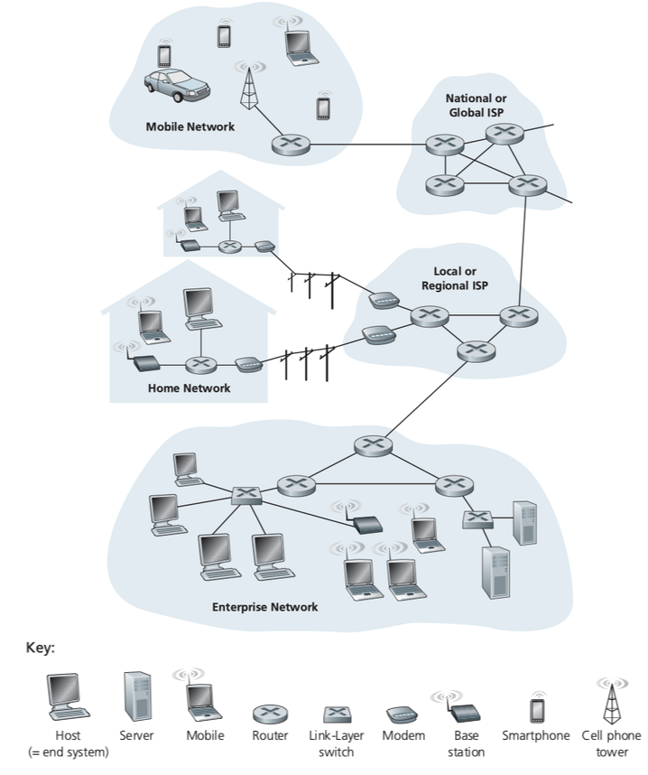
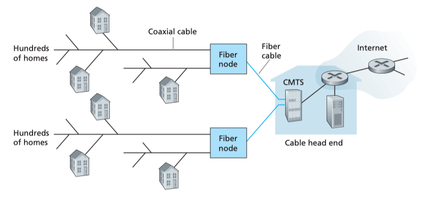
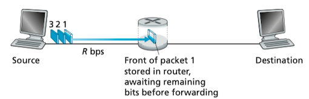
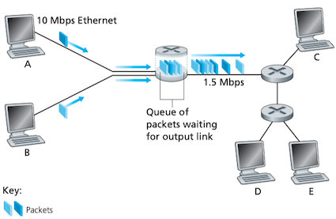
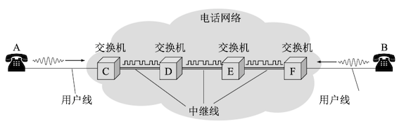
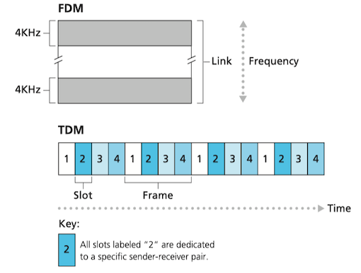
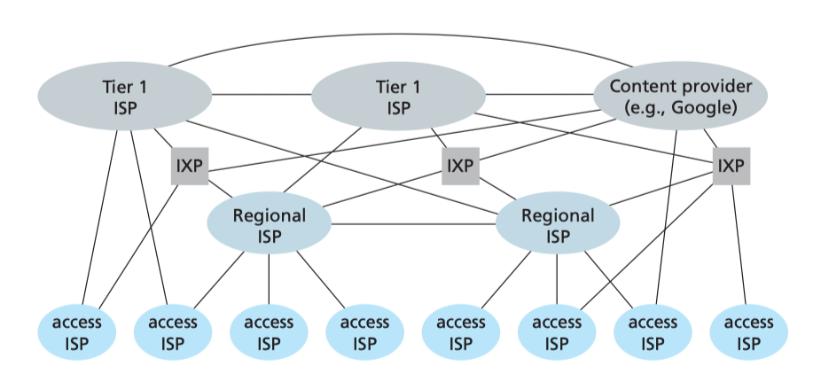
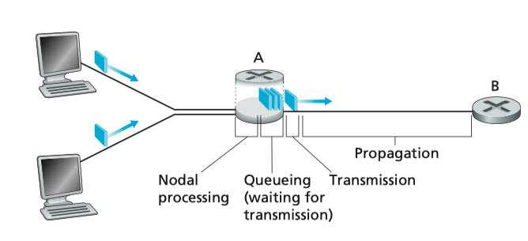
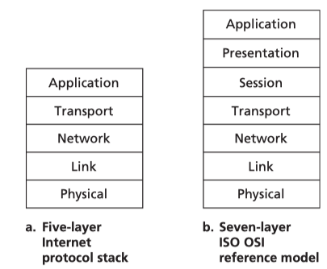

### 1 因特网

#### 什么是因特网

因特网非常复杂，并且在不断变化，所以下面分别尝试通过因特网的具体构成，和为分布式应用提供服务的网络基础设施，来描述因特网。

移动计算机、蜂窝电话等被称为**主机**(host)或**端系统**(end system)。端系统通过**通信链路**(communication link)和**分组交换机**(packet switch)连接到一起。分组交换机从它的一条通信链路接收**分组**(packet)，转发到另一条通信链路。分组交换机有多种，其中最主要的两种分别是**路由器**(router)和**链路层交换机**(link-layer switch)。

端系统通过因特网服务提供商(**ISP**, Internet Service Providers)接入因特网。端系统、分组交换机和其他因特网部件，都要运行控制发送和接收信息的**协议**(protocol)。TCP和IP是因特网中两个最重要的协议。因特网主要的协议统称为TCP/IP。

从服务角度，可以从为网络应用提供通信服务的通信基础设施(Web, VoIP, email, 网络游戏, 电子商务, 社交网络)和为网络应用提供应用编程接口API来描述。具体的内容将在后续章节中解释。

#### 什么是协议

> A **protocol** defines the format and the order of messages exchanged between two or more communicating entities, as well as the actions taken on the transmission and/or receipt of a message or other event.
> 协议定义了在两个或者多个通信实体之间交换的报文的格式和次序，以及在报文传输和/或接收以及其他事件方面采取的动作。

### 2 网络边缘

手机、桌面计算机、便携计算机、服务器等设备通常被称为**端系统**(end system)，因为它们位于网络边缘(Network Edge)。端系统也称为**主机**(host)，因为它们运行诸如Web浏览器程序或服务器程序、Email阅读程序或服务器程序。主机有时近一步被划分为**客户端**(client)和**服务器**(server)。

宽带家庭接入的两种最主要方式是**数字用户线路**(DSL)和**电缆**(cable)。DSL接入一般由电话公司提供，类似于拨号调制解调器，是一种新型调制解调器技术。DSL传输速率通常不对称，从ISP路由器到家庭的速率比家庭到ISP路由器要高。

DSL在家庭和ISP之间将通信线路划分为3个不重叠的频段：高速下行信道，中速上行信道，普通的双向电话信道。所以使得单根DSL线路看起来就像有3条单独的线路：电话呼叫和因特网可以同时共享DSL。

家庭也可以通过**电缆因特网接入**(cable Internet access)，往往由有线电视公司提供。光纤(fiber optics cable)将电缆头端(cable head end)连接到地区枢纽(neighborhood-level junctions，大约支持500～5000户), 然后适用传统的同轴电缆(coaxial cable)到达各家各户。电缆接入需要特殊的电缆调制解调器(cable modem)，下行信道通常分配了更大的带宽。光纤和同轴电缆一起被称为HFC(hybird fiber coax)。

电缆接入的一个重要特征是共享广播媒体。每个电缆头端发送的分组会通过每一条链路达到每户家庭。所以说，如果多个用户同时下载视频，每个用户接收的实际速率会远低于电缆下行速度。但上网冲浪时网页往往能以全部速率接收，因为很少在完全相同时刻请求网页。

DSL与电缆接入比较：

1. DSL带宽专用，电缆接入共享
2. DSL带宽小，电缆接入带宽大

还有一种更高速率的新兴技术，即**光纤到户**(Fiber To The Home, FTTH)，从本地中心局直接到家庭提供了一条光纤路径。

### 3 网络核心
网络核心(Internet Core)是由互联网端系统的分组交换机和链路构成的网状网络 通过网络链路和交换机移动数据有两种基本方法：**电路交换**(circuit switching)和**分组交换**(packet switching)。

#### 分组交换

在各种网络应用中，端系统彼此交换**报文**(message)。报文可以执行一种控制功能，也可以包含数据。为了从源端系统向目的端系统发送一个报文，源端系统将报文划分为较小的数据块，称之为**分组**(packet)。

多数分组交换机在链路的输入端使用**存储转发传输**(store-and-forward transmission)机制。存储转发传输机制是指在交换机能够开始向输出链路传输该分组的第一个比特之前，必须接收到整个分组。因此，存储转发式分组交换机沿着该分组的路径在每条链路的输入端引入了**存储转发时延**(store-and-forward delays).

假定在主机之间有$Q$条链路，每条链路的速率为$R$bps。从主机A发出的一个$L$bit分组必须首先传输到第一段链路上，需要$L/R$秒。然后它要在余下的$Q-1$段链路上传输，每次都有$L/R$s的存储转发时延，因此总时延为$QL/R$。

每个分组交换机有多条链路与分组交换机相连。对于每条相连的链路，分组交换机具有一个**输出缓存**(output buffer, 或输出队列)，它用于存储路由器准备发往那条链路的分组。如果到达的分组需要跨越链路传输，但发现该链路正忙于传输其他分组，该到达分组必须在输出缓存中等待，产生**排队时延**(queuing delay)。因为缓存空间大小有限，当输出缓存满时，到达的分组或者已经排队的分组将被丢弃，即**分组丢失**或丢包(packet lost)。

路由器将接收到的分组转发到一条通信链路，但是路由器是怎样确定它应当向哪条链路进行转发呢？

在因特网中，每个通过该网络传输的分组在它的首部包含了其目的地址。每条路由器具有一个**转发表**(forwarding table)，用于将目的地址(或目的地址的一部分)映射到输出链路。当分组到达网络中的一台路由器时，该路由器检查分组的目的地址，并用目的地址搜索转发表，找到合适的输出链路，然后将该分组导出输出链路。转发表可以人工逐台配置，也可以根据路由选择协议(routing protocol)，自动设置转发表。

#### 电路交换
在电路交换网络中，在端系统间通信会话期间，预留了端系统间通信沿路径所需要的资源。而在分组交换网络中，这些资源则不是预留的。

传统的电话网络是电路交换网络的例子。在发送方能够发送信息之前，该网络必须在发送方和接收方之间建立一条连接，在该网络链路上预留了恒定的传输速率，发送方能够以确保的恒定速率向接收方传送数据。

**多路复用**

链路中的电路要么通过**频分多路复用**(frequency-division multiplexing)，那么通过**时分多路复用**(time-division multiplexing)实现。

对于频分多路复用，链路的频率域被分割为多个频段(frequency band)。在连接期间链路为每条连接专用一个频段。

时分多路复用将时间划分为等长的帧(frame)，每个帧划分为固定数量的时隙(time slots)。每个用户在每个帧中占用固定序号的时隙。

**分组交换与电路交换对比**

分组交换因其端到端时延是变动的和不可预测的，故不适合实时服务。但是分组交换提供了比电路交换更好的带宽共享，并且比电路交换更简单、更高效，实现成本更低。

电路交换不考虑要求而预先分配传输链路的使用，这使得已分配但不需要的链路时间未被利用。另一方面，分组交换使用按需的方式分配链路。

#### 网络之网络

端系统(电脑、手机、网络服务器、邮件服务器)通过接入ISPs(access ISPs, Internet service provider, 因特网服务提供商)连接到因特网。但是将端用户和内容提供商(content providers)连入接入ISP仅仅是解决了因特网中连接几十亿终端系统的一小部分。所以接入ISP本身也需要相互连接。这就是网络之网络。

在网络中心是少数互联的大型网络，

网络结构：

* 一级ISP(Tier 1 ISP)： 例如网通、电信、AT&T，提供国家或国际网络范围的覆盖。
* 内容提供商网络(Content provider network): 例如谷歌，私有网络，连接其数据中心与因特网，通常绕过一级ISP和区域ISPs。

互联网交换中心(IXP, Internet Exchange Point)将多个一级ISP连接起来，一般由第三方中立运营。

### 4 分组交换网中的时延、丢包和吞吐量

分组的时延主要有:

* 节点处理时延$d_{\text{nodal}}$(nodal processing delay): 用于检测分组头部和确定输出链路，通常是微秒($\small 10^{-6}$s)级别
* 排队时延(queuing delay)$d_{\text{proc}}$：等待被传输到链路的时间，取决于先期到达的、正在排队等待向链路传输的分组的数量
* 传输时延(transmission delays)$d_{\text{trans}}$：将整个分组传输到链路层所用时间，通常是微秒到毫秒($\small 10^{-3}$s)级别。
* 传播时延(propagation delay)$d_{\text{prop}}$: 从链路起点到终点传播需要的时间。通常是毫秒级别。

节点总时延(total nodal delay)是以上时延的总和。

### 5 协议层次及其服务模型

网络设计者以分层(layer)的方式组织协议以及实现这些协议的网络硬件和软件。每层通过在该层中执行某些动作或使用直接下层的服务来提供服务。

分层提供了一种结构化方式来讨论系统组件，模块化使更新系统组件更为容易。各层的所有协议统称为**协议栈**(protocol stack)。

* 应用层: 支持各种网络应用
    * FTP, SMTP, HTTP, DNS
    * message(报文)
* 传输层: 进程-进程的数据传输
    * TCP, UDP
    * segment(报文段)
* 网络层: 源主机到目的主机的数据分组路由与转发
    * IP协议、路由协议等
    * datagram(数据报)
* 链路层: 相邻网络元素(主机、交换机、路由器等)的数据传输
    * 以太网(Ethernet)、802.11(WiFi)、 PPP
    * Frames(帧)
* 物理层：将帧中的一个一个比特从一个节点移动到下一个节点

#### 封装

