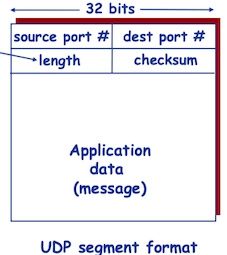

运输层协议为运行在不同主机上的*进程*之间提供了**逻辑通信**(logic communication)功能。从应用程序的角度看，通过逻辑通信，运行不同进程的主机好像直接相连一样。

在发送端，运输层将发送应用程序进程接收到的报文转换成运输层分组(**报文段**, segment)，然后将这些报文段传递给网络层。

在因特网中，运输层有两种协议：TCP和UDP协议。UDP(用户数据报协议)是一种不可靠、无连接的服务。TCP(传输控制协议)是可靠的、面向连接的服务。


#### 多路复用和多路分解

### 2 UDP

UDP即用户数据报协议(User Datagram Protocol)。使用UDP的原因有

* 无需建立连接(减少延迟)
* 实现简单：无需维护连接状态
* 头部开销少
* 没有拥塞控制: 应用可更好地控制发送时间和速率



UDP校验和:将报文段看成16位二进制，进行反码求和运算。

```C
typedef unsigned short u16;
typedef unsigned long u32;

u16 word16;
u32 sum = 0;
u16 i;
          
// make 16 bit words out of every two adjacent 8 bit words
// and add them up
for (i = 0; i < len_ip_header; i = i + 2) {
    word16 =((buff[i]<<8)&0xFF00)+(buff[i+1]&0xFF);
    sum = sum + (u32) word16;
 }

// take only 16 bits out of the 32 bit sum 
// and add up the carries
while (sum>>16) sum = (sum & 0xFFFF) + (sum >> 16);

// one's complement the result
sum = ~sum;
return ((u16) sum);
```