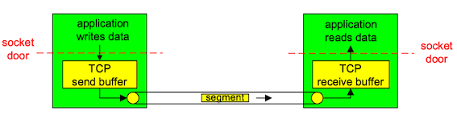
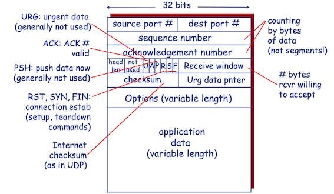
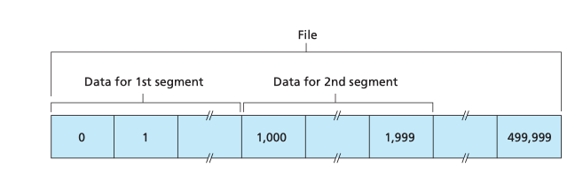
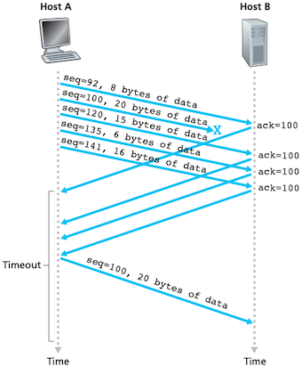
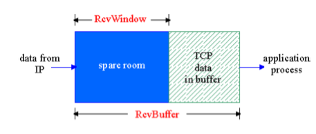
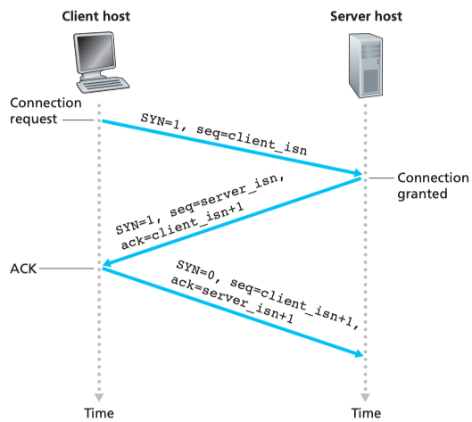
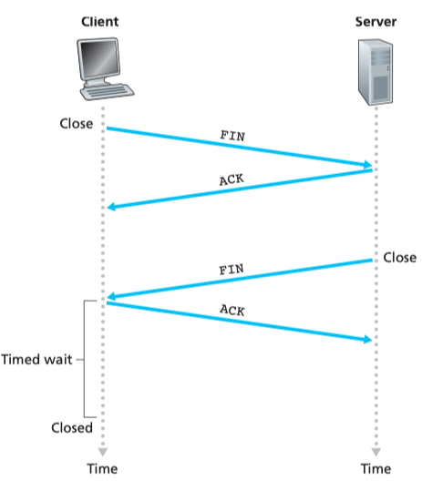
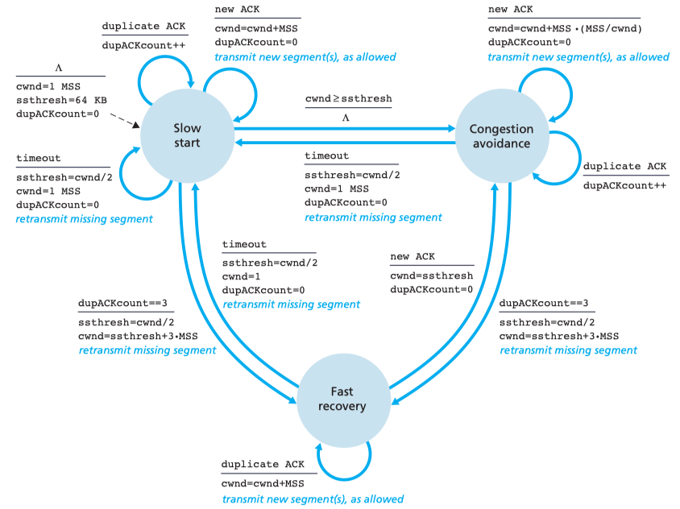
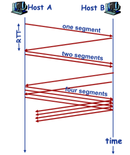
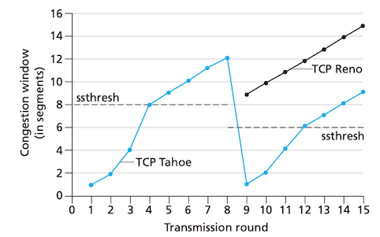

运输层协议为运行在不同主机上的*进程*之间提供了**逻辑通信**(logic communication)功能。从应用程序的角度看，通过逻辑通信，运行不同进程的主机好像直接相连一样。

在发送端，运输层将发送应用程序进程接收到的报文转换成运输层分组(**报文段**, segment)，然后将这些报文段传递给网络层。

在因特网中，运输层有两种协议：TCP和UDP协议。UDP(用户数据报协议)是一种不可靠、无连接的服务。TCP(传输控制协议)是可靠的、面向连接的服务。


### 2 多路复用和多路分解

### 3 无连接传输 UDP

UDP即用户数据报协议(User Datagram Protocol)。使用UDP的原因有

* 无需建立连接(减少延迟)
* 实现简单：无需维护连接状态
* 头部开销少
* 没有拥塞控制: 应用可更好地控制发送时间和速率


UDP校验和提供了差错检测功能:将报文段看成16位二进制，进行反码求和运算。虽然UDP提供差错检测，但它对差错恢复无能为力，指示丢弃受损的报文段，或者将受损的报文段交给应用程序并给出警告。


### 4 面向连接的传输：TCP

TCP是在不可靠的端到端网络层(IP)之上实现的可靠数据传输协议。

#### TCP连接

TCP连接的组成包括发送/接收缓存、变量和与进程连接的套接字。

TCP经过三次握手以后建立连接。客户进程通过套接字传递数据流，数据一旦通过该门，它就由TCP控制了。TCP将数据引导到该连接的**发送缓存**(send buffer)里。接下来TCP就会不时地从发送缓存里取出一块数据。TCP可从缓存中取出并放入报文段中的数据受限于**最大报文段长度**(maximum segment size, MSS)。MSS通常根据最初确定的由本地发送主机发送的最大传输单元(即最大链路层帧长度)来设置。设置该MSS要保证一个TCP报文段加上TCP/IP首部长度(通常40字节)将适合单个链路层帧。注意到MSS是指报文段里应用层数据的最大长度，而不是指包括TCP首部的TCP报文段的最大长度。

TCP为每块数据配上一个TCP首部，从而形成多个TCP报文段。这些报文段被下传给网络层，网络层将其分装在网络层IP数据报中。



#### TCP报文段结构




除了和UDP首部一样的源端口号和目的端口号、校验和之外，TCP报文段首部还包括以下字段

* **序号字段**(sequence number)和**确认号字段**(acknowledgement number)：用于实现可靠数据传输.
* **接收窗口字段**(recieve window)：用于流量控制，见下文
* **首部长度字段**(head len): TCP首部长度
* **选项字段**(options): 用于发送发和接收方协商最大报文段长度(MSS)时，或在高速网络环境下用作窗口调节因子时使用
* **标志字段**(flag): ACK用于确认已成功接收报文，RST、SYN、FIN用于连接建立和拆除([详见TCP连接管理](#tcp_2))，PSH用于指示接收方应立即将数据交给上层，URG用于指示存在紧急数据。

    | 字段 |	含义 |
    | --- | --- |
    | URG |	 紧急指针是否有效，表示某一位需要被优先处理 |
    | ACK |	 确认已成功接收报文 |
    | PSH |	 提示接收端应用程序立即从TCP缓冲区把数据读走。 |
    | RST |	 对方要求重新建立连接，复位。|
    | SYN |	 请求建立连接，并在其序列号的字段进行序列号的初始值设定。|
    | FIN |  希望断开连接。 |

* **序号**(sequence number)是指报文段首字节的字节流编号。例如数据流由一个包含500 000字节的文件组成，其MSS为1000字节，数据流的首字节编号为0。TCP将该数据流构建500个报文段，给第一个报文段分配序号0，第二个报文段分配序号1000，以此类推。




* **确认号**(acknowledge number)是指主机期望收到的下一字节的序号。假设主机A已收到了来自主机B的编号为0～535的所有字节，同时假设它打算发送一个报文段给主机B。主机A等待主机B的数据流中的字节536及之后的所有字节。所以主机A就会在它发往主机B的报文段的确认号字段中填536。


#### 往返时间的估计和超时

TCP采用超时/重传机制来处理报文段的丢失问题。那么怎么设置超时时间间隔呢？显然超时时间间隔必须大于连接的往返时间RTT。

报文段的样本RTT(SampleRTT)是从某报文段被发出到对该报文段的确认被收到之间的时间量。大多数TCP的实现仅在某个时刻做一个测量，但由于路由器的拥塞和端系统负载的变化，SampleRTT值会产生波动。所以TCP维持一个SampleRTT均值(EstimatedRTT)，一旦获得一个新的SampleRTT，就以指数加权移动平均的方式更新EstimatedRTT：

$$\small\text{EstimatedRTT} = (1- \alpha)*\text{EstimatedRTT} + \alpha*\text{SampleRTT},  \quad (\text{typically}, \alpha = 0.125)$$

除了估算RTT外，测量RTT的变化也是有价值的，同样的方法：

$$\small\text{DevRTT} = (1- \beta)*\text{DevRTT} + \beta *|\text{SampleRTT}-\text{EstimatedRTT}| \quad (\text{typically}, \beta = 0.25)$$

超时时间间隔设置为EstimatedRTT加上一些余量：

$$\small \text{TimeoutInterval} = \text{EstimatedRTT} + 4 \cdot \text{DevRTT} $$

当超时出现后，超时时间间隔将加倍，以免即将被确认的后续报文段过早出现超时，一旦报文段被收到后，超时时间间隔就又使用以上公式计算了。


#### 可靠数据传输

下面伪代码给出了一个TCP发送方高度简化的描述。在TCP发送方有3个与发送和重传有关的主要时间：从应用层接收数据；定时器超时和收到ACK。

```C
NextSeqNum = InitialSeqNum
SendBase = InitialSeqNum
loop (forever) { 
    switch(event)
    
    event: data received from application above
        create TCP segment with sequence number NextSeqNum 
        if (timer currently not running) 
            start timer 
        pass segment to IP 
        NextSeqNum = NextSeqNum + length(data)
    event: timer timeout
        retransmit not-yet-acknowledged segment with 
            smallest sequence number 
        start timer
    event: ACK received, with ACK field value of y
        if (y > SendBase) { 
            SendBase = y 
            if (there are currently not-yet-acknowledged segments) 
                start timer 
        } else { /* a duplicate ACK for already ACKed segment */
            increment number of duplicate ACKs received for y
            if (number of duplicate ACKs received for y == 3)
                /* TCP fast retransmit */
                resend segment with sequence number y    
        }
        break;
} /* end of loop forever */
```

**快速重传**(fast retransmit)机制：因为发送方经常一个接一个地发送大量报文段，如果一个报文段丢失，就很可能引起许多一个接一个的冗余ACK(duplicate ACK)。如果TCP发送方接收到对相同数据的3个冗余ACK，很可能报文段已经丢失。*一旦收到3个冗余ACK，TCP就执行快速重传*，即在该报文段的定时器过期之前重传丢失的报文段。



TCP确认是累积式的，正确接收但失序的报文段是不会被接收方逐个确认的。因此，TCP发送方仅需维持已发送过但未被确认的字节的最小序号(SendBase)和下一个要发送的字节的序号(NextSeqNum)。TCP会将正确接收，将失序的报文段缓存起来。


#### 流量控制


如果某应用程序读取数据相对缓慢，而发送方发送得太多、太快，发送的数据很容易使接收缓存溢出。所以TCP提供了**流量控制**(flow-control)以消除发送方使接收方缓存溢出的可能性。


TCP通过让发送方维护一个**接收窗口**（receive window，见TCP报文段首部的图示)来提供流量控制————该接收方还有多少可用的缓存空间。因为TCP是全双工通信，在连接两端都各自维护一个接收窗口。




#### TCP连接管理

三次握手(three-way handshake)：

1. 客户端发送SYN报文段：报文段首部的SYN标志位设置为1。另外，客户端随机选择一个初始序号(client_isn)，放置于序号字段中;
2. 服务器接收SYN报文段，为该TCP连接分配缓存和变量，并发送SYNACK报文段：SYN标志位设置为1，确认号为client_isn+1, 并将初始序号(server_isn)放置到序号字段;
3. 客户端收到SYNACK报文段：为该TCP连接分配缓存和变量，并发送对服务器允许连接的报文段进行确认：确认号server_isn+1, SYN比特为0，可以携带数据。



4次挥手：

1. 客户端向服务器发送FIN报文段
2. 服务器收到FIN, 回复ACK. 关闭连接, 发送close
3. 客户端收到FIN, 回复ACK. 进入等待：如果收到FIN，会重新发送ACK 
4. 服务器收到ACK. 连接关闭.





!!! Question "什么连接的时候是三次握手，关闭的时候却是四次握手？"

    因为当Server端收到Client端的SYN连接请求报文后，可以直接发送SYN+ACK报文。其中ACK报文是用来应答的，SYN报文是用来同步的。但是关闭连接时，当Server端收到FIN报文时，很可能并不会立即关闭SOCKET，所以只能先回复一个ACK报文，告诉Client端，"你发的FIN报文我收到了"。只有等到Server端所有的报文都发送完了，才能发送FIN报文，因此不能一起发送。故需要四次挥手。


### 5 TCP拥塞控制

拥塞是指当太多发送主机发送了太多数据而使网络无法处理的情况。

当网络变得拥塞时，路由器可能会缓存溢出而引起丢包。因此分组重传往往是网络拥塞的前兆。

!!! note "拥塞控制vs流量控制"
    
    拥塞控制的任务是确保网络能够承载所到达的流量。这是一个全局性问题，涉及到各方面的行为，包括所有的主机、所有的路由器、路由器内部的存储转发处理过程，以及所有可能会削弱子网承载容量的其它因素。
    
    与此相反，流量控制只与特定的发送方和特定的接收方之间的点到点流量有关。它的任务是，<font color="red">确保一个快速的发送方不会持续地以超过接收方吸收能力的速率传输数据</font>。流量控制通常涉及到的做法是，接收方向发送方提供某种直接的反馈，以便告诉发送方别人一端的情形到底怎么样。


运行在发送方的TCP拥塞控制机制会跟踪一个额外变量，即**拥塞窗口**(cwnd, congestion window): 一个TCP发送方能向网络中发送流量的速率限制。

TCP拥塞控制算法(TCP congestion control algorithm)主要包括3个部分：慢启动(slow-start)、拥塞避免(congestion avoidance)、快速恢复(fast recovery)。




**慢启动**<small>slow-start</small>

当TCP连接开始时，拥塞窗口的值通常以一个*最大报文长度*(maximum message size, mms)开始，并且每当传输的报文段被确认就增加一个MSS：指数增长。



```python
initialize: Congwin = 1 
for (each segment ACKed)
    Congwin++ 
until (loss event OR CongWin > threshold)
```

何时结束：

* 当出现一个由超时指示的丢包事件，TCP发送方将拥塞窗口(cwnd)设置为1并重新开始慢启动，还将*慢启动阈值*(ssthresh)设置为拥塞窗口的一半。
* 当拥塞窗口等于慢启动阈值时，进入拥塞避免模式(下文)。
* 检测到3个冗余ACK，TCP执行快速重传，并进入快速恢复(下文Reno)。

**拥塞避免**<small>congestion-avoidance</small>


拥塞窗口大约是上次遇到拥塞时值的一半时，进入拥塞避免的状态。由于距离拥塞可能并不遥远，TCP采用较为保守的方法，每个RTT只将拥塞窗口的值增加一个MSS，而不是翻倍。

**快速恢复**<small>fast-recovery</small>


TCP的早期版本Tahoe，不管发生超时指示的丢包，还是发生3个冗余ACK指示的丢包事件，都无条件地将拥塞窗口减小至1个MSS，并进入慢启动阶段。

TCP的较新版本Reno拥塞窗口设置为慢启动阈值(ssthresh)。


下图演示了Reno版和Tahoe版TCP的拥塞控制窗口的演化情况。慢启动阈值(ssthresh)的初始值等于8个MSS。拥塞窗口在慢启动阶段以指数速度快速爬升，在第4轮传输时到达了阈值。然后拥塞窗口以线性速度爬升，直到在第8轮传输后出现3个冗余ACK。注意到该丢包事件发生时，拥塞窗口值为12MSS。于是慢启动阈值设置为拥塞窗口值的一半，即6MSS。在TCP Reno下，拥塞窗口被设置为9MSS，然后线性增长。在TCP Tahoe下，拥塞窗口被设置为1个MSS，然后指数增长，知道到达慢启动阈值，然后开始线性增长。


